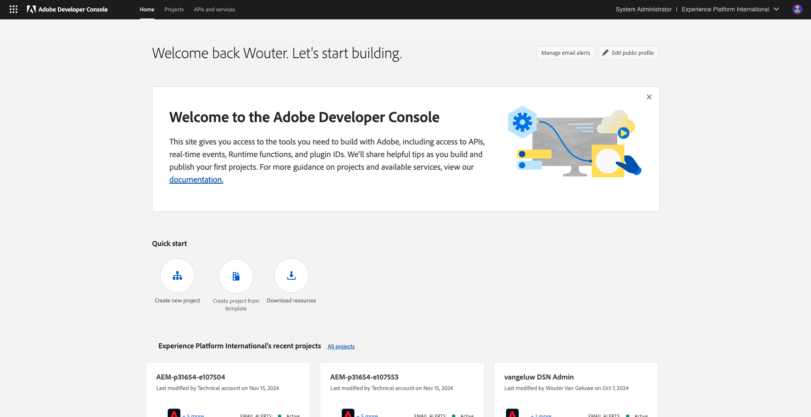
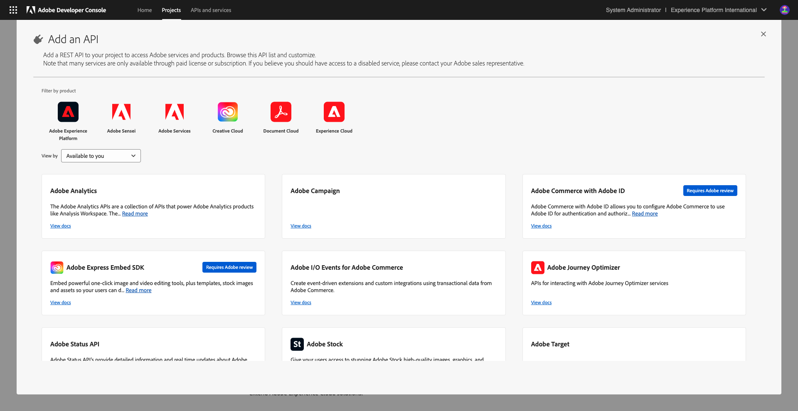
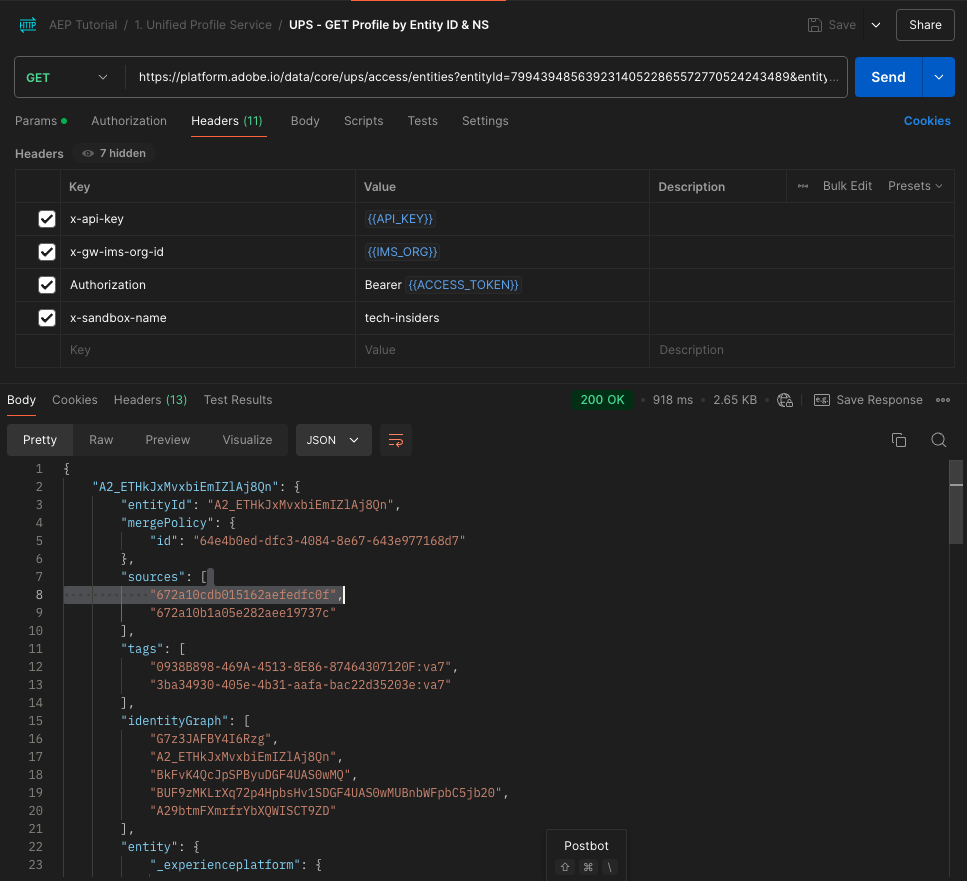

# 2.1.3 Visualiseer uw eigen real-time klantprofiel - API

In deze oefening, zult u Postman en Adobe I/O gebruiken om Adobe Experience Platform APIs te vragen om uw eigen real-time klantenprofiel te bekijken.

## Artikel

In het profiel van de Klant in real time, worden alle profielgegevens getoond naast gebeurtenisgegevens, evenals bestaande segmentlidmaatschap. De getoonde gegevens kunnen van overal, van de toepassingen van de Adobe en externe oplossingen komen. Dit is de krachtigste weergave in Adobe Experience Platform, het ervaringssysteem.

Het profiel van de Klant in real time kan door alle toepassingen van de Adobe, maar ook door externe oplossingen zoals de Centers van de Vraag of in-store clienteling apps worden verbruikt. De manier om dit te doen is die externe oplossingen met Adobe Experience Platform APIs te verbinden.

## 2.1.3.1 Uw id&#39;s

In het deelvenster Profielviewer op de website kunt u meerdere identiteiten vinden. Elke identiteit is gekoppeld aan een naamruimte.


Op het röntgenpaneel, kunnen wij vier verschillende combinaties identiteitskaart en Namespaces zien:

| Identiteit | Naamruimte |
|:-------------:| :---------------:|
| Experience Cloud-id (ECID) | 12507560687324495704459439363261812234 |
| E-mailid | woutervangeluwe+06022022-01@gmail.com |
| Mobiel nummer-id | +32473622044+06022022-01 |

Onthoud deze id&#39;s voor de volgende stap.

Ga met deze id&#39;s naar Postman.

## 2.1.3.2 Uw Adobe I/O-project instellen

In deze oefening zult u Adobe I/O vrij intensief aan vraag tegen Platform APIs gebruiken. Volg de onderstaande stappen om Adobe I/O in te stellen.

Ga naar [ https://developer.adobe.com/console/home](https://developer.adobe.com/console/home)



Selecteer de juiste Adobe Experience Platform-instantie in de rechterbovenhoek van het scherm. Uw instantie is `--envName--` .


Klik **creëren nieuw project**.

 of


Selecteer **+ toevoegen aan Project** en selecteren **API**.


U zult dan dit zien:



Klik het **pictogram van Adobe Experience Platform**.
/images/api2.png)

Klik **Experience Platform API**.


Klik **daarna**.


U kunt er nu voor kiezen om Adobe I/O uw beveiligingssleutel te laten genereren of een bestaand sleutelpaar te laten uploaden.

Kies **Optie 1 - produceer een zeer belangrijk paar**.


Klik **produceren sleutelpaar**.


Je ziet een spinner voor ongeveer 30 seconden.


U zult dan dit zien, en uw geproduceerde keypair zal als zip dossier worden gedownload: **config.zip**.

Pak het dossier **config.zip** op uw Desktop uit, zult u het 2 dossiers zien bevat:


- **certificate_pub.crt** is uw Openbaar zeer belangrijke certificaat. Vanuit een veiligheidsperspectief, is dit het certificaat dat vrij aan opstellingsintegratie met online toepassingen wordt gebruikt.
- **private.key** is uw Persoonlijke sleutel. Dit mag nooit met iemand worden gedeeld. De persoonlijke sleutel is wat u gebruikt voor verificatie voor uw API-implementatie en moet een geheim zijn. Als u uw Privé Sleutel met iedereen deelt, kunnen zij tot uw implementatie toegang hebben en API misbruiken om kwaadwillige gegevens in Platform in te voeren en alle gegevens te halen die in Platform zitten.


Zorg ervoor om het {**dossier 0} config.zip in een veilige plaats te bewaren, aangezien u dit voor de volgende stappen en voor toekomstige toegang tot Adobe I/O en Adobe Experience Platform APIs zult nodig hebben.**

Klik **daarna**.


U moet nu de **Profiel(en) van het Product** voor uw integratie selecteren.

Selecteer de vereiste productprofielen.

**FYI**: in uw instantie van Adobe Experience Platform, zullen de Profielen van het Product een verschillende noemende hebben. U moet ten minste één productprofiel selecteren met de juiste toegangsrechten, die zijn ingesteld in de Adobe Admin Console.


Klik **sparen Vormde API**.


Je ziet een spinner voor een paar seconden.


En daarna zie je je integratie.


Klik de **Download voor Postman** knoop en klik dan **Rekening van de Dienst (JWT)** om een milieu van Postman te downloaden (wacht tot het milieu wordt gedownload, kan dit een paar seconden) nemen.


De rol neer tot u **Rekening van de Dienst (JWT)** ziet, die is waar u al uw integratiedetails kunt vinden die worden gebruikt om de integratie met Adobe Experience Platform te vormen.


Uw IO-project heeft momenteel een algemene naam. Je moet je integratie een vriendelijke naam geven. Klik op **Project 1** (of gelijkaardige naam) zoals vermeld


Klik **uitgeven Project**.


Voer een naam en beschrijving in voor uw integratie. We gebruiken `AEP API --demoProfileLdap--` als naamgevingsconventie. Vervang ldap door uw ldap.
Als uw LDAP bijvoorbeeld vangeluw is, worden de naam en beschrijving van uw integratie gewijzigd in AEP API vangeluw.

Ga `AEP API --demoProfileLdap--` als **Titel van het Project** in. Klik **sparen**.


Uw Adobe I/O-integratie is nu voltooid.


## 2.1.3.3 Postman-verificatie naar Adobe I/O

Ga naar [ https://www.getpostman.com/ ](https://www.getpostman.com/).

Klik op **krijgen Begonnen**.


Download en installeer vervolgens Postman.


Start de toepassing nadat u Postman hebt geïnstalleerd.

In Postman zijn er twee concepten: omgevingen en verzamelingen.

- Het milieu bevat al uw milieuvariabelen die min of meer samenhangend zijn. In het milieu, zult u dingen zoals IMSOrg van ons milieu van het Platform, naast veiligheidsgeloofsbrieven zoals uw Privé Sleutel en anderen vinden. Het milieudossier is die u tijdens de opstelling van de Adobe I/O in de vorige oefening hebt gedownload, is het naam als dit: **service.postman_environment.json**.

- De verzameling bevat een aantal API-aanvragen die u kunt gebruiken. We gebruiken twee verzamelingen
   - 1 Verzameling voor verificatie naar Adobe I/0
   - 1 Verzameling voor de oefeningen in deze module
   - 1 inzameling voor de oefeningen in de module van Real-Time CDP, voor de Authoring van de Bestemming

Gelieve te downloaden het dossier [ postman.zip ](./../../../assets/postman/postman_profile.zip) aan uw lokale Desktop.

In dit {**dossier 0} postman.zip, zult u de volgende dossiers vinden:**

- `_Adobe I-O - Token.postman_collection.json`
- `_Adobe Experience Platform Enablement.postman_collection.json`
- `Destination_Authoring_API.json`

Pak het {**dossier 0} postman.zip uit en sla deze 3 dossiers in een omslag op uw Desktop, samen met het gedownloade milieu van Postman van Adobe I/O op. U hebt deze 4 bestanden nodig in die map:**


Ga terug naar Postman. Klik **Invoer**.


Klik **uploadt Dossiers**.


Navigeer naar de map op uw bureaublad waarin u de vier gedownloade bestanden hebt uitgepakt. Selecteer deze 4 dossiers tezelfdertijd en klik **Open**.


Na het klikken **Open**, zal Postman u een overzicht van het Milieu en de Inzamelingen tonen u op het punt staat in te voeren. Klik **Invoer**.


U hebt nu alles wat u nodig hebt in Postman om te gaan communiceren met Adobe Experience Platform via de API&#39;s.

Het eerste wat je moet doen, is ervoor zorgen dat je op de juiste manier geverifieerd bent. Om voor authentiek te worden verklaard, moet u om een toegangstoken verzoeken.

Zorg ervoor dat u het juiste Milieu hebt geselecteerd alvorens om het even welk verzoek uit te voeren. U kunt de momenteel geselecteerde omgeving controleren door de vervolgkeuzelijst Omgeving in de rechterbovenhoek te controleren.

De geselecteerde omgeving moet een naam hebben die vergelijkbaar is met deze:


Klik het **oog** pictogram en klik dan **uitgeven** om de Privé Sleutel in het milieudossier bij te werken.


Dan zie je dit. Alle gebieden zijn pre-bevolkt, behalve het gebied **PRIVATE_KEY**.


De persoonlijke sleutel is gegenereerd toen u uw Adobe I/O-project hebt gemaakt. Het werd gedownload als zip dossier, genoemd **config.zip**. Pak dat ZIP-bestand uit op uw bureaublad.


Open de omslag **config** en open het dossier **private.key** met uw tekstredacteur van keus.


Vervolgens ziet u iets dat hierop lijkt, en kopieert u alle tekst naar het klembord.


Ga terug naar Postman en kleef de privé sleutel op de gebieden naast veranderlijke **PRIVATE_KEY**, voor zowel de kolommen **OORSPRONKELIJKE WAARDE** en **HUIDIGE WAARDE**. Klik **sparen**.


Uw Postman-omgeving en -verzamelingen zijn nu geconfigureerd en werken. U kunt nu verifiëren van Postman naar Adobe I/O.

Hiervoor moet u een externe bibliotheek laden die zorgt voor de codering en ontsleuteling van communicatie. Om deze bibliotheek te laden, moet u het verzoek met de naam **INIT uitvoeren: De Bibliotheek van Crypto van de Lading voor RS256**. Selecteer dit verzoek in de **_Adobe I/O - Symbolische inzameling** en u zult het in het midden van uw scherm zien.


Klik de blauwe **verzenden** knoop. Na een paar seconden, zou u een reactie moeten zien die in de **1} sectie van het Lichaam {van Postman wordt getoond:**


Met de cryptobibliotheek nu geladen, kunnen wij aan Adobe I/O voor authentiek verklaren.

In **\_Adobe I/O - de Symbolische inzameling**, selecteer het verzoek met de naam **IMS: JWT produceert + Auth**. Opnieuw, zult u de verzoekdetails zien in het midden van het scherm worden getoond.


Klik de blauwe **verzenden** knoop. Na een paar seconden, zou u een reactie moeten zien die in de **1} sectie van het Lichaam {van Postman wordt getoond:**


Als uw configuratie succesvol was, zou u een gelijkaardige reactie moeten zien die de volgende informatie bevat:

| Sleutel | Waarde |
|:-------------:| :---------------:| 
| token_type | **drager** |
| access_token | **eyJ4NXUiOiJpbXNfbmEx...QT7mqZkumN1tdsPEioOEl4087Dg** |
| verloopt_in | **8639997** |

Adobe I/O heeft u a **drager** - teken, met een specifieke waarde (dit zeer lange access_token) en een vervalvenster gegeven.

De token die we hebben ontvangen, is nu 24 uur geldig. Dit betekent dat na 24 uur, als u Postman wilt gebruiken om aan Adobe I/O voor authentiek te verklaren, u een nieuw teken zult moeten produceren door dit verzoek opnieuw in werking te stellen.

## 2.1.3.4 Real-time Customer Profile API, Schema: Profile

Nu kunt u doorgaan en uw eerste aanvraag naar de realtime-API&#39;s van het klantprofiel van Platform verzenden.

Zoek in Postman de verzameling **_Adobe Experience Platform Enablement** .


In **1. De verenigde Dienst van het Profiel**, selecteer het eerste verzoek met de naam **UPS - het Profiel van de GET door identiteitskaart van de Entiteit &amp; NS**.


Voor dit verzoek zijn er drie vereiste variabelen:

| Sleutel | Waarde | Definitie |
|:-------------:| :---------------:| :---------------:| 
| entiteitId | **identiteitskaart** | de specifieke klant-id |
| entiteitIdNS | **namespace** | de specifieke naamruimte die van toepassing is op de id |
| schema.name | **_xdm.context.profile** | het specifieke schema waarvoor u informatie wilt ontvangen |

Dus als u Adobe Experience Platform API&#39;s wilt vragen om u alle profielgegevens voor uw eigen ECID terug te geven, moet u de aanvraag als volgt configureren:

| Sleutel | Waarde |
|:-------------:| :---------------:| 
| entiteitId | **yourECID** |
| entiteitIdNS | **ecid** |
| schema.name | **_xdm.context.profile** |


U zou ook de **Kopbal** - gebieden van uw verzoek moeten verifiëren. Ga naar **Kopballen**. U zult dan dit zien:


| Sleutel | Waarde |
| ----------- | ----------- |
| x-sandbox-name | `--aepSandboxId--` |

>[!NOTE]
>
>U moet de naam opgeven van de Adobe Experience Platform-sandbox die u gebruikt. De naam van de x-sandbox moet `--aepSandboxId--` zijn.

Klik **verzenden** om uw verzoek naar Platform te verzenden.

U zou een directe reactie van Platform moeten krijgen, die u iets als dit toont:



Dit is de volledige reactie van Platform:

```javascript
{
    "A28iM3aJBJRbEQpOnUh5HOM9": {
        "entityId": "A28iM3aJBJRbEQpOnUh5HOM9",
        "mergePolicy": {
            "id": "e632ccb8-882a-4b5e-8375-96a1ba3df1aa"
        },
        "sources": [
            "61fe23c5be4b5f19485dc379",
            "profile-streaming-segment",
            "61fe23cfa07c1219489b3ba4"
        ],
        "tags": [
            "1644130566774:1542:232:va7",
            "0a1e9dd4-940a-46ec-9114-7e371cf5c4d0",
            "aep_ups_partitioned_profile_cdc_low_lag_sla_0:106:1090888313",
            "a6fed09e-2c56-403e-8692-4e99e4779dfa:IRL1",
            "1644419616318:2989:31:va7",
            "aep_ups_profile_change_event_prod_va7:71:7946633524-8361f22c-c09e-4364-b24b-b57435c4d14f"
        ],
        "identityGraph": [
            "BUF9zMKLrXq72p4HpbsHv1SSBnr0LTAxQGdtYWlsLmNvbQ",
            "GkicrkFjgmCjUg",
            "GtCbrkFjgkSOFg",
            "A2-AP9zOsakzNTe9Rqwf7Wse",
            "BkFuK4QcJpSPByuSBnr0LTAx",
            "A28jSB484ziuECF3fEoXmFlF",
            "A28iM3aJBJRbEQpOnUh5HOM9"
        ],
        "entity": {
            "_experienceplatform": {
                "individualCharacteristics": {},
                "loyaltyDetails": {
                    "level": "Basic",
                    "points": 0
                },
                "identification": {
                    "core": {
                        "phoneNumber": "+32473622044+06022022-01",
                        "email": "woutervangeluwe+06022022-01@gmail.com",
                        "loyaltyId": "5415776",
                        "ecid": "12019606991718502754997192487345616673",
                        "crmId": "1478212"
                    }
                }
            },
            "personalEmail": {
                "address": "woutervangeluwe+06022022-01@gmail.com"
            },
            "_repo": {
                "createDate": "2022-02-06T06:56:06.424Z"
            },
            "testProfile": true,
            "homeAddress": {
                "postalCode": "1831",
                "city": "Diegem",
                "street1": "Culliganlaan 2F"
            },
            "mobilePhone": {
                "number": "+32473622044+06022022-01"
            },
            "segmentMembership": {
                "ups": {
                    "bc999ded-b6d7-40d4-87a7-d3a280b950e3": {
                        "lastQualificationTime": "2022-02-09T20:38:33Z",
                        "status": "exited"
                    },
                    "23b1cd4e-d62f-44bd-8392-3095a33109c4": {
                        "lastQualificationTime": "2022-02-09T20:38:33Z",
                        "status": "exited"
                    },
                    "f0807704-a1c8-4ac4-85dd-60db2fbf18f1": {
                        "lastQualificationTime": "2022-02-09T20:38:33Z",
                        "status": "existing"
                    }
                }
            },
            "person": {
                "name": {
                    "lastName": "Van Geluwe",
                    "firstName": "Wouter"
                },
                "gender": "female",
                "birthDate": "1982-07-08"
            },
            "userActivityRegions": {
                "IRL1": {
                    "captureTimestamp": "2022-02-09T15:21:11Z"
                }
            },
            "identityMap": {
                "email": [
                    {
                        "id": "woutervangeluwe+06022022-01@gmail.com"
                    }
                ],
                "crmid": [
                    {
                        "id": "1478212"
                    }
                ],
                "ecid": [
                    {
                        "id": "12507560687324495704459439363261812234"
                    },
                    {
                        "id": "12019606991718502754997192487345616673"
                    },
                    {
                        "id": "38335942889672702722192106363935964471"
                    }
                ],
                "phone": [
                    {
                        "id": "+32473622044+06022022-01"
                    }
                ],
                "loyaltyid": [
                    {
                        "id": "5415776"
                    }
                ]
            }
        },
        "lastModifiedAt": "2022-02-09T20:38:36Z"
    }
}
```

Dit zijn momenteel alle beschikbare profielgegevens in Platform voor deze ECID.

U hoeft de ECID niet te gebruiken om profielgegevens aan te vragen via het realtime klantprofiel van het platform. U kunt elke id in een naamruimte gebruiken om deze gegevens aan te vragen.

Laten wij terug naar Postman gaan en doen alsof wij het vraagcentrum zijn, en een verzoek verzenden naar Platform die namespace van **Telefoon** en uw mobiel aantal specificeren.

Dus als u aan de API&#39;s van het Platform wilt vragen om u alle profielinformatie voor een specifieke Telefoon terug te geven, zult u het verzoek als volgt moeten vormen:

| Sleutel | Waarde |
|:-------------:| :---------------:| 
| entiteitId | **uw telefoonaantal** |
| entiteitIdNS | **telefoon** (vervang ecid door telefoon) |
| schema.name | **_xdm.context.profile** |

Als uw telefoonaantal speciale symbolen zoals **+** bevat, moet u uw volledig telefoonaantal selecteren, met de rechtermuisknop klikken en **EncodeURIComponent** klikken.


Dan heb je het volgende:


U zou ook de **Kopbal** - gebieden van uw verzoek moeten verifiëren. Ga naar **Kopballen**. U zult dan dit zien:


| Sleutel | Waarde |
| ----------- | ----------- |
| x-sandbox-name | `--aepSandboxId--` |

>[!NOTE]
>
>U moet de naam opgeven van de Adobe Experience Platform-sandbox die u gebruikt. De naam van de x-sandbox moet `--aepSandboxId--` zijn.

Klik de blauwe **verzenden** knoop en verifieer de reactie.


Laten wij het zelfde ding voor uw e-mailadres doen door namespace van **e-mail** en uw e-mailadres te specificeren.

Dus als u aan de API&#39;s van Platform wilt vragen om u alle profielgegevens voor een specifiek e-mailadres terug te geven, moet u de aanvraag als volgt configureren:

| Sleutel | Waarde |
|:-------------:| :---------------:| 
| entiteitId | **u remail** |
| entiteitIdNS | **e-mail** (vervang Telefoon met e-mail) |
| schema.name | **_xdm.context.profile** |

Als uw e-mailadres speciale symbolen zoals **+** bevat, moet u uw volledig e-mailadres selecteren, met de rechtermuisknop klikken en **EncodeURIComponent** klikken.


Dan heb je het volgende:


U zou ook de **Kopbal** - gebieden van uw verzoek moeten verifiëren. Ga naar **Kopballen**. U zult dan dit zien:


| Sleutel | Waarde |
| ----------- | ----------- |
| x-sandbox-name | `--aepSandboxId--` |

>[!NOTE]
>
>U moet de naam opgeven van de Adobe Experience Platform-sandbox die u gebruikt. De naam van de x-sandbox moet `--aepSandboxId--` zijn.

Klik de blauwe **verzenden** knoop en verifieer de reactie.


Dit is een zeer belangrijke vorm van flexibiliteit die aan merken wordt aangeboden. Dit betekent dat elke omgeving een aanvraag naar Platform kan verzenden met behulp van een eigen id en naamruimte, zonder dat de complexiteit van meerdere naamruimten en id&#39;s wordt begrepen.

Als voorbeeld:

- Het Centrum van de Vraag zal gegevens van Platform verzoeken gebruikend de namespace **telefoon**
- Het Systeem van de Loyaliteit zal om gegevens van Platform verzoeken gebruikend namespace **e-mail**
- online toepassingen zouden namespace **kunnen gebruiken ecid**

Het Centrum van de Vraag weet niet noodzakelijk welk soort herkenningsteken in het Systeem van de Loyalty wordt gebruikt en het Systeem van de Loyalty weet niet noodzakelijk welk soort herkenningsteken door online toepassingen wordt gebruikt. Elk afzonderlijk systeem kan de informatie gebruiken die ze hebben en begrijpen om de informatie te krijgen die ze nodig hebben, wanneer ze die nodig hebben.

## 2.1.3.5 Real-time Customer Profile API, Schema: Profile and ExperienceEvent

Nadat de API&#39;s van het platform zijn gecontroleerd op profielgegevens, kunnen we nu hetzelfde doen met ExperienceEvent-gegevens.

Zoek in Postman de verzameling **_Adobe Experience Platform Enablement** .


In **1. De verenigde Dienst van het Profiel**, selecteer het tweede verzoek met de naam **UPS - het Profiel van de GET &amp; EE door identiteitskaart van de Entiteit &amp; NS**.


Voor dit verzoek zijn vier vereiste variabelen:

| Sleutel | Waarde | Definitie |
|:-------------:| :---------------:|  :---------------:| 
| schema.name | **_xdm.context.experienceEvent** | het specifieke schema waarvoor u informatie wilt ontvangen. In dit geval, zoeken wij gegevens die tegen het schema ExperienceEvent in kaart worden gebracht. |
| relatedSchema.name | **_xdm.context.profile** | Terwijl wij gegevens zoeken die tegen het schema ExperienceEvent in kaart worden gebracht, moeten wij een identiteit specificeren waarvoor wij die gegevens willen ontvangen. Het schema dat toegang tot identiteit heeft is het profiel-schema, zodat is relatedSchema hier het profiel-schema. |
| relatedEntiteitId | **identiteitskaart** | de specifieke klant-I D |
| relatedEntiteitIdNS | **namespace** | de specifieke naamruimte die van toepassing is op de id |

Dus als u aan de API&#39;s van Platform wilt vragen om u alle profielgegevens voor uw eigen ecid terug te geven, moet u de aanvraag als volgt configureren:

| Sleutel | Waarde |
|:-------------:| :---------------:| 
| schema.name | **_xdm.context.experienceEvent** |
| relatedSchema.name | **_xdm.context.profile** |
| relatedEntiteitId | **yourECID** |
| relatedEntiteitIdNS | **ecid** |


U zou ook de **Kopbal** - gebieden van uw verzoek moeten verifiëren. Ga naar **Kopballen**. U zult dan dit zien:


| Sleutel | Waarde |
| ----------- | ----------- |
| x-sandbox-name | `--aepSandboxId--` |

>[!NOTE]
>
>U moet de naam opgeven van de Adobe Experience Platform-sandbox die u gebruikt. De naam van de x-sandbox moet `--aepSandboxId--` zijn.

Klik **verzenden** om uw verzoek naar Platform te verzenden.

U zou een directe reactie van Platform moeten krijgen, die u iets als dit toont:


Hieronder volgt de volledige reactie van Platform. In dit voorbeeld zijn er acht ExperienceEvents gekoppeld aan de ECID van deze klant. Bekijk hieronder de verschillende variabelen op het verzoek, aangezien wat u hieronder ziet het directe gevolg van uw configuratie in Lancering in vorige oefeningen is.

Wanneer het röntgendeelvenster de ExperienceEvent-informatie weergeeft, gebruikt het de onderstaande payload om de informatie te parseren en op te halen, zoals de productnaam (zoek naar productName in de onderstaande payload) en de productafbeelding URL (zoek naar productImageUrl in de onderstaande payload).

```javascript
{
    "_page": {
        "orderby": "timestamp",
        "start": "d686ab8a-2d0c-4722-9ff5-bfc1020b0b55-0",
        "count": 31,
        "next": ""
    },
    "children": [
        {
            "relatedEntityId": "A28iM3aJBJRbEQpOnUh5HOM9",
            "entityId": "d686ab8a-2d0c-4722-9ff5-bfc1020b0b55-0",
            "timestamp": 1644127126596,
            "entity": {
                "environment": {
                    "ipV4": "213.118.129.117",
                    "type": "browser",
                    "browserDetails": {
                        "viewportHeight": 969,
                        "viewportWidth": 1920,
                        "userAgent": "Mozilla/5.0 (Macintosh; Intel Mac OS X 10_15_7) AppleWebKit/537.36 (KHTML, like Gecko) Chrome/98.0.4758.80 Safari/537.36"
                    }
                },
                "web": {
                    "webPageDetails": {
                        "pageViews": {
                            "value": 1
                        },
                        "name": "vangeluw-OCUC",
                        "URL": "https://builder.adobedemo.com/run/vangeluw-OCUC"
                    },
                    "webReferrer": {
                        "URL": "https://adobe.okta.com/"
                    }
                },
                "_experienceplatform": {
                    "interactionDetails": {
                        "core": {
                            "channel": "web"
                        }
                    },
                    "demoEnvironment": {
                        "brandName": "vangeluw-OCUC"
                    },
                    "identification": {
                        "core": {
                            "ecid": "12507560687324495704459439363261812234"
                        }
                    }
                },
                "implementationDetails": {
                    "name": "https://ns.adobe.com/experience/alloy/reactor",
                    "version": "2.8.0+2.9.0",
                    "environment": "browser"
                },
                "identityMap": {
                    "ECID": [
                        {
                            "id": "12507560687324495704459439363261812234",
                            "authenticatedState": "ambiguous",
                            "primary": true
                        }
                    ]
                },
                "eventType": "web.webpagedetails.pageViews",
                "_id": "d686ab8a-2d0c-4722-9ff5-bfc1020b0b55-0",
                "placeContext": {
                    "localTime": "2022-02-06T06:58:46.596+01:00",
                    "localTimezoneOffset": -60
                },
                "device": {
                    "screenOrientation": "landscape",
                    "screenWidth": 1920,
                    "screenHeight": 1080
                },
                "timestamp": "2022-02-06T05:58:46.596Z"
            },
            "lastModifiedAt": "2022-02-06T05:59:48Z"
        },
        {
            "relatedEntityId": "A28iM3aJBJRbEQpOnUh5HOM9",
            "entityId": "919a46bf-a591-4c32-9201-b72250d5f5d9-0",
            "timestamp": 1644127129876,
            "entity": {
                "environment": {
                    "ipV4": "213.118.129.117",
                    "type": "browser",
                    "browserDetails": {
                        "viewportHeight": 969,
                        "viewportWidth": 1920,
                        "userAgent": "Mozilla/5.0 (Macintosh; Intel Mac OS X 10_15_7) AppleWebKit/537.36 (KHTML, like Gecko) Chrome/98.0.4758.80 Safari/537.36"
                    }
                },
                "web": {
                    "webPageDetails": {
                        "pageViews": {
                            "value": 1
                        },
                        "name": "vangeluw-OCUC#",
                        "URL": "https://builder.adobedemo.com/run/vangeluw-OCUC#"
                    },
                    "webReferrer": {
                        "URL": "https://adobe.okta.com/"
                    }
                },
                "_experienceplatform": {
                    "interactionDetails": {
                        "core": {
                            "channel": "web"
                        }
                    },
                    "demoEnvironment": {
                        "brandName": "vangeluw-OCUC"
                    },
                    "identification": {
                        "core": {
                            "ecid": "12507560687324495704459439363261812234"
                        }
                    }
                },
                "implementationDetails": {
                    "name": "https://ns.adobe.com/experience/alloy/reactor",
                    "version": "2.8.0+2.9.0",
                    "environment": "browser"
                },
                "identityMap": {
                    "ECID": [
                        {
                            "id": "12507560687324495704459439363261812234",
                            "authenticatedState": "ambiguous",
                            "primary": true
                        }
                    ]
                },
                "eventType": "web.webpagedetails.pageViews",
                "_id": "919a46bf-a591-4c32-9201-b72250d5f5d9-0",
                "placeContext": {
                    "localTime": "2022-02-06T06:58:49.876+01:00",
                    "localTimezoneOffset": -60
                },
                "device": {
                    "screenOrientation": "landscape",
                    "screenWidth": 1920,
                    "screenHeight": 1080
                },
                "timestamp": "2022-02-06T05:58:49.876Z"
            },
            "lastModifiedAt": "2022-02-06T05:59:48Z"
        },
        {
            "relatedEntityId": "A28iM3aJBJRbEQpOnUh5HOM9",
            "entityId": "41a80489-00d4-446c-b456-8cb19c3f309a-0",
            "timestamp": 1644130597134,
            "entity": {
                "environment": {
                    "ipV4": "213.118.129.117",
                    "type": "browser",
                    "browserDetails": {
                        "viewportHeight": 1001,
                        "viewportWidth": 1920,
                        "userAgent": "Mozilla/5.0 (Macintosh; Intel Mac OS X 10_15_7) AppleWebKit/537.36 (KHTML, like Gecko) Chrome/98.0.4758.80 Safari/537.36"
                    }
                },
                "web": {
                    "webPageDetails": {
                        "pageViews": {
                            "value": 1
                        },
                        "name": "login",
                        "URL": "https://builder.adobedemo.com/run/vangeluw-OCUC/login"
                    },
                    "webReferrer": {
                        "URL": "https://builder.adobedemo.com/run/vangeluw-OCUC/login"
                    }
                },
                "_experienceplatform": {
                    "interactionDetails": {
                        "core": {
                            "channel": "web"
                        }
                    },
                    "demoEnvironment": {
                        "brandName": "vangeluw-OCUC"
                    },
                    "identification": {
                        "core": {
                            "ecid": "12507560687324495704459439363261812234"
                        }
                    }
                },
                "implementationDetails": {
                    "name": "https://ns.adobe.com/experience/alloy/reactor",
                    "version": "2.8.0+2.9.0",
                    "environment": "browser"
                },
                "identityMap": {
                    "ECID": [
                        {
                            "id": "12507560687324495704459439363261812234",
                            "authenticatedState": "ambiguous",
                            "primary": true
                        }
                    ]
                },
                "eventType": "web.webpagedetails.pageViews",
                "_id": "41a80489-00d4-446c-b456-8cb19c3f309a-0",
                "placeContext": {
                    "localTime": "2022-02-06T07:56:37.134+01:00",
                    "localTimezoneOffset": -60
                },
                "device": {
                    "screenOrientation": "landscape",
                    "screenWidth": 1920,
                    "screenHeight": 1080
                },
                "timestamp": "2022-02-06T06:56:37.134Z"
            },
            "lastModifiedAt": "2022-02-06T06:56:38Z"
        },
        {
            "relatedEntityId": "A28jSB484ziuECF3fEoXmFlF",
            "entityId": "8ACC7B6C-2320-4865-B414-3B0CFA01F628",
            "timestamp": 1644419615000,
            "entity": {
                "environment": {
                    "ipV4": "213.118.129.117",
                    "browserDetails": {
                        "userAgent": "Mozilla/5.0 (iPhone; CPU OS 15_3 like Mac OS X; en_BE)"
                    }
                },
                "eventType": "application.login",
                "_id": "8ACC7B6C-2320-4865-B414-3B0CFA01F628",
                "_experienceplatform": {
                    "interactionDetails": {
                        "core": {
                            "channel": "mobile"
                        }
                    },
                    "demoEnvironment": {
                        "brandName": "vangeluw-2L6V"
                    },
                    "identification": {
                        "core": {
                            "ecid": "12019606991718502754997192487345616673",
                            "email": "woutervangeluwe+06022022-01@gmail.com"
                        }
                    }
                },
                "timestamp": "2022-02-09T15:13:35Z",
                "identityMap": {
                    "ECID": [
                        {
                            "id": "12019606991718502754997192487345616673",
                            "authenticatedState": "ambiguous",
                            "primary": true
                        }
                    ]
                }
            },
            "lastModifiedAt": "2022-02-09T15:13:38Z"
        },
        {
            "relatedEntityId": "A28jSB484ziuECF3fEoXmFlF",
            "entityId": "54F68CE5-E9E1-4AD0-91B1-7B607A9285C4",
            "timestamp": 1644419658000,
            "entity": {
                "environment": {
                    "ipV4": "213.118.129.117",
                    "browserDetails": {
                        "userAgent": "Mozilla/5.0 (iPhone; CPU OS 15_3 like Mac OS X; en_BE)"
                    }
                },
                "_experienceplatform": {
                    "interactionDetails": {
                        "core": {
                            "channel": "mobile"
                        }
                    },
                    "demoEnvironment": {
                        "brandName": "vangeluw-2L6V"
                    },
                    "identification": {
                        "core": {
                            "ecid": "12019606991718502754997192487345616673"
                        }
                    }
                },
                "identityMap": {
                    "ECID": [
                        {
                            "id": "12019606991718502754997192487345616673",
                            "authenticatedState": "ambiguous",
                            "primary": true
                        }
                    ]
                },
                "eventType": "commerce.productViews",
                "_id": "54F68CE5-E9E1-4AD0-91B1-7B607A9285C4",
                "commerce": {
                    "productViews": {
                        "value": 1
                    }
                },
                "productListItems": [
                    {
                        "quantity": 1,
                        "productAddMethod": "Mobile",
                        "_experienceplatform": {
                            "core": {
                                "mainCategory": "Women",
                                "productURL": "product1",
                                "imageURL": "https://contentviewer.s3.amazonaws.com/helium/wh08-white_main.jpg"
                            }
                        },
                        "priceTotal": 42,
                        "name": "Cassia Funnel Sweatshirt",
                        "SKU": "product1",
                        "currencyCode": "USD"
                    }
                ],
                "timestamp": "2022-02-09T15:14:18Z"
            },
            "lastModifiedAt": "2022-02-09T15:14:21Z"
        },
        {
            "relatedEntityId": "A2-AP9zOsakzNTe9Rqwf7Wse",
            "entityId": "bfe26684-bc3b-40c5-9fe5-5aba854c3227-0",
            "timestamp": 1644420036035,
            "entity": {
                "environment": {
                    "ipV4": "193.105.139.131",
                    "type": "browser",
                    "browserDetails": {
                        "viewportHeight": 969,
                        "viewportWidth": 1920,
                        "userAgent": "Mozilla/5.0 (Macintosh; Intel Mac OS X 10_15_7) AppleWebKit/537.36 (KHTML, like Gecko) Chrome/98.0.4758.80 Safari/537.36"
                    }
                },
                "web": {
                    "webPageDetails": {
                        "pageViews": {
                            "value": 1
                        },
                        "name": "vangeluw-OCUC",
                        "URL": "https://builder.adobedemo.com/run/vangeluw-OCUC"
                    },
                    "webReferrer": {
                        "URL": "https://adobe.okta.com/"
                    }
                },
                "_experienceplatform": {
                    "interactionDetails": {
                        "core": {
                            "channel": "web"
                        }
                    },
                    "demoEnvironment": {
                        "brandName": "vangeluw-OCUC"
                    },
                    "identification": {
                        "core": {
                            "ecid": "38335942889672702722192106363935964471"
                        }
                    }
                },
                "implementationDetails": {
                    "name": "https://ns.adobe.com/experience/alloy/reactor",
                    "version": "2.8.0+2.9.0",
                    "environment": "browser"
                },
                "identityMap": {
                    "ECID": [
                        {
                            "id": "38335942889672702722192106363935964471",
                            "authenticatedState": "ambiguous",
                            "primary": true
                        }
                    ]
                },
                "eventType": "web.webpagedetails.pageViews",
                "_id": "bfe26684-bc3b-40c5-9fe5-5aba854c3227-0",
                "placeContext": {
                    "localTime": "2022-02-09T16:20:36.035+01:00",
                    "localTimezoneOffset": -60
                },
                "device": {
                    "screenOrientation": "landscape",
                    "screenWidth": 1920,
                    "screenHeight": 1080
                },
                "timestamp": "2022-02-09T15:20:36.035Z"
            },
            "lastModifiedAt": "2022-02-09T15:20:39Z"
        },
        {
            "relatedEntityId": "A2-AP9zOsakzNTe9Rqwf7Wse",
            "entityId": "0480c434-8fcd-4a80-b298-c561276ac989-0",
            "timestamp": 1644420037078,
            "entity": {
                "environment": {
                    "ipV4": "193.105.139.131",
                    "type": "browser",
                    "browserDetails": {
                        "viewportHeight": 969,
                        "viewportWidth": 1920,
                        "userAgent": "Mozilla/5.0 (Macintosh; Intel Mac OS X 10_15_7) AppleWebKit/537.36 (KHTML, like Gecko) Chrome/98.0.4758.80 Safari/537.36"
                    }
                },
                "web": {
                    "webPageDetails": {
                        "pageViews": {
                            "value": 1
                        },
                        "name": "vangeluw-OCUC#",
                        "URL": "https://builder.adobedemo.com/run/vangeluw-OCUC#"
                    },
                    "webReferrer": {
                        "URL": "https://adobe.okta.com/"
                    }
                },
                "_experienceplatform": {
                    "interactionDetails": {
                        "core": {
                            "channel": "web"
                        }
                    },
                    "demoEnvironment": {
                        "brandName": "vangeluw-OCUC"
                    },
                    "identification": {
                        "core": {
                            "ecid": "38335942889672702722192106363935964471"
                        }
                    }
                },
                "implementationDetails": {
                    "name": "https://ns.adobe.com/experience/alloy/reactor",
                    "version": "2.8.0+2.9.0",
                    "environment": "browser"
                },
                "identityMap": {
                    "ECID": [
                        {
                            "id": "38335942889672702722192106363935964471",
                            "authenticatedState": "ambiguous",
                            "primary": true
                        }
                    ]
                },
                "eventType": "web.webpagedetails.pageViews",
                "_id": "0480c434-8fcd-4a80-b298-c561276ac989-0",
                "placeContext": {
                    "localTime": "2022-02-09T16:20:37.078+01:00",
                    "localTimezoneOffset": -60
                },
                "device": {
                    "screenOrientation": "landscape",
                    "screenWidth": 1920,
                    "screenHeight": 1080
                },
                "timestamp": "2022-02-09T15:20:37.078Z"
            },
            "lastModifiedAt": "2022-02-09T15:20:39Z"
        },
        {
            "relatedEntityId": "A2-AP9zOsakzNTe9Rqwf7Wse",
            "entityId": "6b1b3983-6966-4551-a711-6b6e410fd819-0",
            "timestamp": 1644420045993,
            "entity": {
                "environment": {
                    "ipV4": "193.105.139.131",
                    "type": "browser",
                    "browserDetails": {
                        "viewportHeight": 969,
                        "viewportWidth": 1920,
                        "userAgent": "Mozilla/5.0 (Macintosh; Intel Mac OS X 10_15_7) AppleWebKit/537.36 (KHTML, like Gecko) Chrome/98.0.4758.80 Safari/537.36"
                    }
                },
                "web": {
                    "webPageDetails": {
                        "pageViews": {
                            "value": 1
                        },
                        "name": "login",
                        "URL": "https://builder.adobedemo.com/run/vangeluw-OCUC/login"
                    },
                    "webReferrer": {
                        "URL": "https://adobe.okta.com/"
                    }
                },
                "_experienceplatform": {
                    "interactionDetails": {
                        "core": {
                            "channel": "web"
                        }
                    },
                    "demoEnvironment": {
                        "brandName": "vangeluw-OCUC"
                    },
                    "identification": {
                        "core": {
                            "ecid": "38335942889672702722192106363935964471"
                        }
                    }
                },
                "implementationDetails": {
                    "name": "https://ns.adobe.com/experience/alloy/reactor",
                    "version": "2.8.0+2.9.0",
                    "environment": "browser"
                },
                "identityMap": {
                    "ECID": [
                        {
                            "id": "38335942889672702722192106363935964471",
                            "authenticatedState": "ambiguous",
                            "primary": true
                        }
                    ]
                },
                "eventType": "web.webpagedetails.pageViews",
                "_id": "6b1b3983-6966-4551-a711-6b6e410fd819-0",
                "placeContext": {
                    "localTime": "2022-02-09T16:20:45.993+01:00",
                    "localTimezoneOffset": -60
                },
                "device": {
                    "screenOrientation": "landscape",
                    "screenWidth": 1920,
                    "screenHeight": 1080
                },
                "timestamp": "2022-02-09T15:20:45.993Z"
            },
            "lastModifiedAt": "2022-02-09T15:20:47Z"
        },
        {
            "relatedEntityId": "A2-AP9zOsakzNTe9Rqwf7Wse",
            "entityId": "ae0f3551-7753-4467-8547-8fdbb66c2214-0",
            "timestamp": 1644420058565,
            "entity": {
                "environment": {
                    "ipV4": "193.105.139.131",
                    "type": "browser",
                    "browserDetails": {
                        "viewportHeight": 969,
                        "viewportWidth": 1920,
                        "userAgent": "Mozilla/5.0 (Macintosh; Intel Mac OS X 10_15_7) AppleWebKit/537.36 (KHTML, like Gecko) Chrome/98.0.4758.80 Safari/537.36"
                    }
                },
                "web": {
                    "webPageDetails": {
                        "URL": "https://builder.adobedemo.com/run/vangeluw-OCUC/home"
                    },
                    "webReferrer": {
                        "URL": "https://adobe.okta.com/"
                    }
                },
                "_experienceplatform": {
                    "interactionDetails": {
                        "core": {
                            "channel": "web"
                        }
                    },
                    "demoEnvironment": {
                        "brandName": "vangeluw-OCUC"
                    },
                    "identification": {
                        "core": {
                            "ecid": "38335942889672702722192106363935964471",
                            "email": "woutervangeluwe+06022022-01@gmail.com"
                        }
                    }
                },
                "implementationDetails": {
                    "name": "https://ns.adobe.com/experience/alloy/reactor",
                    "version": "2.8.0+2.9.0",
                    "environment": "browser"
                },
                "identityMap": {
                    "ECID": [
                        {
                            "id": "38335942889672702722192106363935964471",
                            "authenticatedState": "ambiguous",
                            "primary": true
                        }
                    ]
                },
                "eventType": "web.login",
                "_id": "ae0f3551-7753-4467-8547-8fdbb66c2214-0",
                "placeContext": {
                    "localTime": "2022-02-09T16:20:58.565+01:00",
                    "localTimezoneOffset": -60
                },
                "device": {
                    "screenOrientation": "landscape",
                    "screenWidth": 1920,
                    "screenHeight": 1080
                },
                "timestamp": "2022-02-09T15:20:58.565Z"
            },
            "lastModifiedAt": "2022-02-09T15:20:59Z"
        },
        {
            "relatedEntityId": "A2-AP9zOsakzNTe9Rqwf7Wse",
            "entityId": "5e67a9c9-b201-4e21-bd3a-4d10475f6156-0",
            "timestamp": 1644420058653,
            "entity": {
                "environment": {
                    "ipV4": "193.105.139.131",
                    "type": "browser",
                    "browserDetails": {
                        "viewportHeight": 969,
                        "viewportWidth": 1920,
                        "userAgent": "Mozilla/5.0 (Macintosh; Intel Mac OS X 10_15_7) AppleWebKit/537.36 (KHTML, like Gecko) Chrome/98.0.4758.80 Safari/537.36"
                    }
                },
                "web": {
                    "webPageDetails": {
                        "pageViews": {
                            "value": 1
                        },
                        "name": "home",
                        "URL": "https://builder.adobedemo.com/run/vangeluw-OCUC/home"
                    },
                    "webReferrer": {
                        "URL": "https://adobe.okta.com/"
                    }
                },
                "_experienceplatform": {
                    "interactionDetails": {
                        "core": {
                            "channel": "web"
                        }
                    },
                    "demoEnvironment": {
                        "brandName": "vangeluw-OCUC"
                    },
                    "identification": {
                        "core": {
                            "ecid": "38335942889672702722192106363935964471"
                        }
                    }
                },
                "implementationDetails": {
                    "name": "https://ns.adobe.com/experience/alloy/reactor",
                    "version": "2.8.0+2.9.0",
                    "environment": "browser"
                },
                "identityMap": {
                    "ECID": [
                        {
                            "id": "38335942889672702722192106363935964471",
                            "authenticatedState": "ambiguous",
                            "primary": true
                        }
                    ]
                },
                "eventType": "web.webpagedetails.pageViews",
                "_id": "5e67a9c9-b201-4e21-bd3a-4d10475f6156-0",
                "placeContext": {
                    "localTime": "2022-02-09T16:20:58.653+01:00",
                    "localTimezoneOffset": -60
                },
                "device": {
                    "screenOrientation": "landscape",
                    "screenWidth": 1920,
                    "screenHeight": 1080
                },
                "timestamp": "2022-02-09T15:20:58.653Z"
            },
            "lastModifiedAt": "2022-02-09T15:21:00Z"
        },
        {
            "relatedEntityId": "A2-AP9zOsakzNTe9Rqwf7Wse",
            "entityId": "33253c5a-6a7e-4858-a7d2-4e6d4a1c7901-0",
            "timestamp": 1644420061804,
            "entity": {
                "environment": {
                    "ipV4": "193.105.139.131",
                    "type": "browser",
                    "browserDetails": {
                        "viewportHeight": 969,
                        "viewportWidth": 1920,
                        "userAgent": "Mozilla/5.0 (Macintosh; Intel Mac OS X 10_15_7) AppleWebKit/537.36 (KHTML, like Gecko) Chrome/98.0.4758.80 Safari/537.36"
                    }
                },
                "web": {
                    "webPageDetails": {
                        "pageViews": {
                            "value": 1
                        },
                        "name": "vangeluw-OCUC",
                        "URL": "https://builder.adobedemo.com/run/vangeluw-OCUC"
                    },
                    "webReferrer": {
                        "URL": "https://builder.adobedemo.com/run/vangeluw-OCUC/home"
                    }
                },
                "_experienceplatform": {
                    "interactionDetails": {
                        "core": {
                            "channel": "web"
                        }
                    },
                    "demoEnvironment": {
                        "brandName": "vangeluw-OCUC"
                    },
                    "identification": {
                        "core": {
                            "ecid": "38335942889672702722192106363935964471"
                        }
                    }
                },
                "implementationDetails": {
                    "name": "https://ns.adobe.com/experience/alloy/reactor",
                    "version": "2.8.0+2.9.0",
                    "environment": "browser"
                },
                "identityMap": {
                    "ECID": [
                        {
                            "id": "38335942889672702722192106363935964471",
                            "authenticatedState": "ambiguous",
                            "primary": true
                        }
                    ]
                },
                "eventType": "web.webpagedetails.pageViews",
                "_id": "33253c5a-6a7e-4858-a7d2-4e6d4a1c7901-0",
                "placeContext": {
                    "localTime": "2022-02-09T16:21:01.804+01:00",
                    "localTimezoneOffset": -60
                },
                "device": {
                    "screenOrientation": "landscape",
                    "screenWidth": 1920,
                    "screenHeight": 1080
                },
                "timestamp": "2022-02-09T15:21:01.804Z"
            },
            "lastModifiedAt": "2022-02-09T15:21:03Z"
        },
        {
            "relatedEntityId": "A2-AP9zOsakzNTe9Rqwf7Wse",
            "entityId": "d8e81fb7-6de9-44c1-b9c6-60d93b520209-0",
            "timestamp": 1644420071737,
            "entity": {
                "environment": {
                    "ipV4": "193.105.139.131",
                    "type": "browser",
                    "browserDetails": {
                        "viewportHeight": 969,
                        "viewportWidth": 1920,
                        "userAgent": "Mozilla/5.0 (Macintosh; Intel Mac OS X 10_15_7) AppleWebKit/537.36 (KHTML, like Gecko) Chrome/98.0.4758.80 Safari/537.36"
                    }
                },
                "web": {
                    "webPageDetails": {
                        "pageViews": {
                            "value": 1
                        },
                        "name": "vangeluw-OCUC",
                        "URL": "https://builder.adobedemo.com/run/vangeluw-OCUC"
                    },
                    "webReferrer": {
                        "URL": "https://builder.adobedemo.com/run/vangeluw-OCUC/home"
                    }
                },
                "_experienceplatform": {
                    "interactionDetails": {
                        "core": {
                            "channel": "web"
                        }
                    },
                    "demoEnvironment": {
                        "brandName": "vangeluw-OCUC"
                    },
                    "identification": {
                        "core": {
                            "ecid": "38335942889672702722192106363935964471"
                        }
                    }
                },
                "implementationDetails": {
                    "name": "https://ns.adobe.com/experience/alloy/reactor",
                    "version": "2.8.0+2.9.0",
                    "environment": "browser"
                },
                "identityMap": {
                    "ECID": [
                        {
                            "id": "38335942889672702722192106363935964471",
                            "authenticatedState": "ambiguous",
                            "primary": true
                        }
                    ]
                },
                "eventType": "web.webpagedetails.pageViews",
                "_id": "d8e81fb7-6de9-44c1-b9c6-60d93b520209-0",
                "placeContext": {
                    "localTime": "2022-02-09T16:21:11.737+01:00",
                    "localTimezoneOffset": -60
                },
                "device": {
                    "screenOrientation": "landscape",
                    "screenWidth": 1920,
                    "screenHeight": 1080
                },
                "timestamp": "2022-02-09T15:21:11.737Z"
            },
            "lastModifiedAt": "2022-02-09T15:21:14Z"
        }
    ],
    "_links": {
        "next": {
            "href": ""
        }
    }
}
```

Dit zijn momenteel alle beschikbare ExperienceEvent-gegevens in Platform voor deze ECID.

U hoeft de ECID niet te gebruiken om ExperienceEvent-gegevens aan te vragen vanuit Adobe Experience Platform in real-time profiel. U kunt elke id in een naamruimte gebruiken om deze gegevens aan te vragen.

Volgende Stap: [ 2.1.4 leidt tot een segment - UI ](./ex4.md)

[Terug naar module 2.1](./real-time-customer-profile.md)

[Terug naar alle modules](../../../overview.md)
