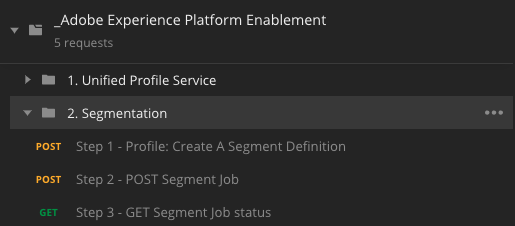
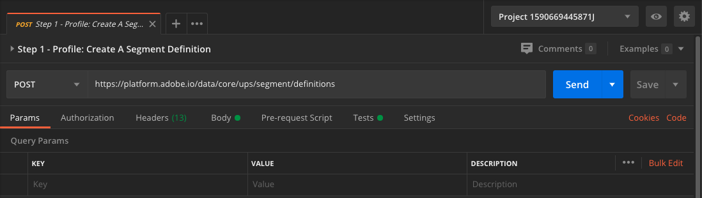

# 2.1.5 Een segment maken - API

In deze oefening, zult u Postman en Adobe I/O gebruiken om een segment tot stand te brengen en de resultaten van dat segment op te slaan als dataset, door Adobe Experience Platform APIs te gebruiken.

## Artikel

In het profiel van de Klant in real time, worden alle profielgegevens getoond naast gebeurtenisgegevens en bestaand segmentlidmaatschap. De gegevens die worden getoond kunnen van overal, van de toepassingen van de Adobe en externe oplossingen komen. Dit is de krachtigste weergave in Adobe Experience Platform, het ervaringssysteem.

## 2.1.5.1 - Een segment maken via de platform-API

Ga naar Postman.

Zoek de verzameling: **_Adobe Experience Platform Enablement** . In deze inzameling, zult u een omslag **zien. Segmentatie**. We zullen deze verzoeken in deze oefening gebruiken.



Hierna volgen alle vereiste stappen om een segment te maken via de API. Wij gaan een eenvoudig segment bouwen: &quot;**ldap** - Alle Vrouwelijke Klanten&quot;.

### Stap 1 - Een segmentdefinitie maken

Klik op het verzoek genoemd **Stap 1 - Profiel: creeer een Definitie van het Segment**.



Ga de **sectie van het Lichaam** van dit verzoek.


In het **Lichaam** van dit verzoek, zult u het volgende zien:


De taal die voor dit verzoek wordt gebruikt wordt genoemd Profile Query Language, of **PQL**.

U kunt meer info en documentatie over PQL [ hier ](https://experienceleague.adobe.com/docs/experience-platform/segmentation/pql/overview.html?lang=en) vinden.


Aandacht: te werk gelieve veranderlijke **naam** in het hieronder verzoek bij door **ldap** met uw specifieke **ldap** te vervangen.

```json
{
    "name" : "ldap - API - All Female Customer",
    "expression" : {"type":"PQL", "format":"pql/json", "value":"{\"nodeType\":\"fnApply\",\"fnName\":\"in\",\"params\":[{\"nodeType\":\"fieldLookup\",\"fieldName\":\"gender\",\"object\":{\"nodeType\":\"fieldLookup\",\"fieldName\":\"person\",\"object\":{\"nodeType\":\"literal\",\"literalType\":\"XDMObject\",\"value\":\"profile\"}}},{\"literalType\":\"List\",\"nodeType\":\"literal\",\"value\":[\"female\"]}]}"},
    "createdBy": "ldap",
    "schema" : { "name" : "_xdm.context.profile"},
    "ttlInDays" : 90
}
```

Na het toevoegen van uw specifieke **ldap**, zou het Lichaam aan dit gelijkaardig moeten kijken:

```json
{
    "name" : "vangeluw - API - All Female Customer",
    "expression" : {"type":"PQL", "format":"pql/json", "value":"{\"nodeType\":\"fnApply\",\"fnName\":\"in\",\"params\":[{\"nodeType\":\"fieldLookup\",\"fieldName\":\"gender\",\"object\":{\"nodeType\":\"fieldLookup\",\"fieldName\":\"person\",\"object\":{\"nodeType\":\"literal\",\"literalType\":\"XDMObject\",\"value\":\"profile\"}}},{\"literalType\":\"List\",\"nodeType\":\"literal\",\"value\":[\"female\"]}]}"},
    "createdBy": "vangeluw",
    "schema" : { "name" : "_xdm.context.profile"},
    "ttlInDays" : 90
}
```

U zou ook de **Kopbal** - gebieden van uw verzoek moeten verifiëren. Ga naar **Kopballen**. U zult dan dit zien:


| Sleutel | Waarde |
| -------------- | ------------------ |
| x-sandbox-name | `--aepSandboxName--` |

>[!NOTE]
>
>U moet de naam opgeven van de Adobe Experience Platform-sandbox die u gebruikt. De naam van de x-sandbox moet `--aepSandboxName--` zijn.

Nu, klik het blauwe **verzenden** knoop om het segment tot stand te brengen en de resultaten van dat te bekijken.


Na deze stap, kunt u uw segmentdefinitie in Platform UI bekijken. Om dit te controleren, login aan Adobe Experience Platform en ga naar **Segmenten**.


### Stap 2 - creeer een Baan van de POST van het Segment

In de vorige oefening, creeerde u a _het stromen_ segment. Een streaming segment evalueert voortdurend kwalificaties in real-time. Wat u hier doet, creeert a _partij_ segment. Het segment van de partij geeft u een voorproef van wat het segment als in termen van kwalificaties kon kijken, maar _dat niet betekent dat het segment eigenlijk_ in werking heeft gesteld. Momenteel, _kwalificeert niemand voor dit segment_. Om mensen in aanmerking te laten komen, moet het batchsegment lopen, wat precies is wat we hier gaan doen.

Laten we nu een segmenttaak POSTEN.

Ga naar Postman.


In uw inzameling van Postman, klik op het verzoek genoemd **Stap 2 - de Baan van het Segment van de POST** om het te openen.


U zou ook de **Kopbal** - gebieden van uw verzoek moeten verifiëren. Ga naar **Kopballen**. U zult dan dit zien:


| Sleutel | Waarde |
| -------------- | ------------------ |
| x-sandbox-name | `--aepSandboxName--` |

>[!NOTE]
>
>U moet de naam opgeven van de Adobe Experience Platform-sandbox die u gebruikt. De naam van de x-sandbox moet `--aepSandboxName--` zijn.

Klik op blauw **verzenden** knoop.

U ziet een vergelijkbaar resultaat:


Deze segmenttaak is nu actief en dit kan enige tijd in beslag nemen. In Stap 3, zult u de status van deze baan kunnen controleren.


### Stap 3 - Taakstatus van segment

Ga naar Postman.


In uw inzameling van Postman, klik op het verzoek genoemd **Stap 3 - de status van de Baan van het GET**.


U zou ook de **Kopbal** - gebieden van uw verzoek moeten verifiëren. Ga naar **Kopballen**. U zult dan dit zien:


| Sleutel | Waarde |
| -------------- | ------------------ |
| x-sandbox-name | `--aepSandboxName--` |

>[!NOTE]
>
>U moet de naam opgeven van de Adobe Experience Platform-sandbox die u gebruikt. De naam van de x-sandbox moet `--aepSandboxName--` zijn.

Klik op blauw **verzenden** knoop.

U ziet een vergelijkbaar resultaat:


In dit voorbeeld, wordt de **status** van de baan geplaatst aan **GEDAAN**.

Herhaal dit verzoek door de blauwe **te klikken verzend** knoop om de paar notulen tot de **status** aan **SUCCEEDED** wordt geplaatst.


Zodra de status **SUCCEEDED** is, heeft uw segmentbaan in werking gesteld en de klanten kwalificeren nu voor het segment.

Gefeliciteerd, u hebt met succes de oefening van de Segmentatie voltooid. Laten we nu eens kijken hoe het Real-Time Klantprofiel in de hele onderneming kan worden geactiveerd.

Volgende Stap: [ 2.1.6 zie u Real-time het Profiel van de Klant in actie in het Centrum van de Vraag ](./ex6.md)

[Terug naar module 2.1](./real-time-customer-profile.md)

[Terug naar alle modules](../../../overview.md)
