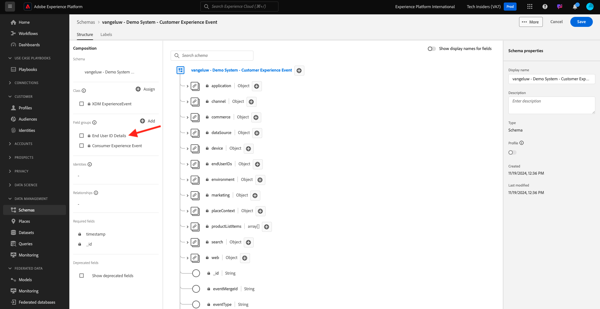
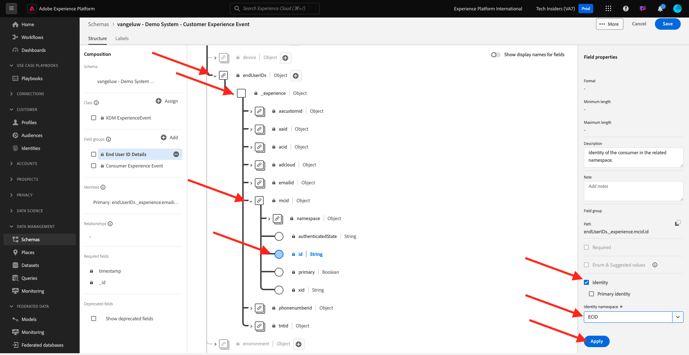
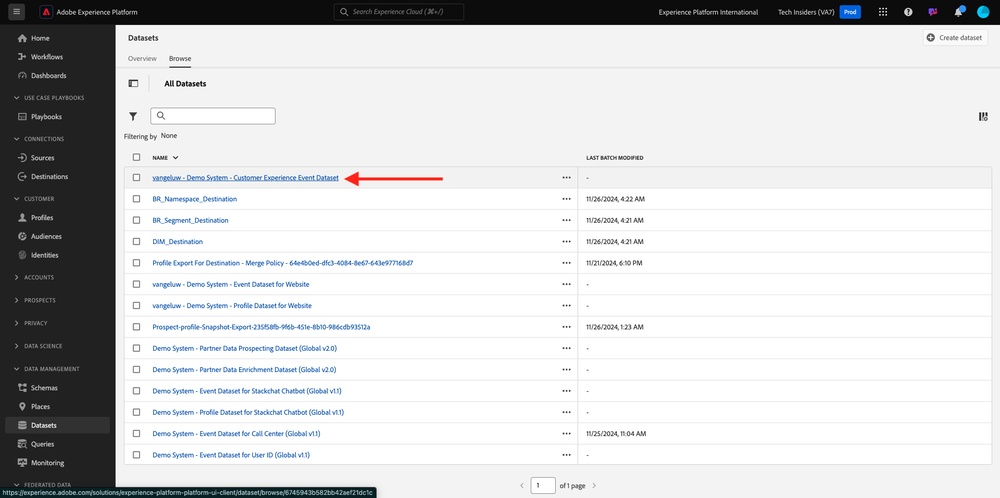

# 2.2.1 AI van klant - Gegevensvoorbereiding (overzicht)

Om de Intelligente Diensten inzichten van uw marketing gebeurtenisgegevens te ontdekken, moeten de gegevens semantisch worden verrijkt en in een standaardstructuur worden gehandhaafd. Intelligent Services gebruikt de schema&#39;s van het Model van de Gegevens van de Ervaring van de Adobe (XDM) om dit te bereiken.
Specifiek, moeten alle datasets die in de Intelligente Diensten worden gebruikt met het **schema van XDM van de Gebeurtenis van de Consumentenervaring** in overeenstemming zijn.

## Schema maken

In deze oefening, zult u een schema tot stand brengen dat de **mix van de Gebeurtenis van de Ervaring van de Consumenten** bevat, die door de **Intelligente Dienst van de Klant AI** wordt vereist.

Login aan Adobe Experience Platform door naar dit URL te gaan: [ https://experience.adobe.com/platform ](https://experience.adobe.com/platform).

Na het aanmelden landt je op de homepage van Adobe Experience Platform.

Alvorens u verdergaat, moet u a **zandbak** selecteren. De te selecteren sandbox krijgt de naam ``--aepSandboxName--`` . Na het selecteren van de aangewezen zandbak, zult u de het schermverandering zien en nu bent u in uw specifieke zandbak.

Van het linkermenu, klik **Schema&#39;s** en ga **doorbladeren**. Klik **creëren Schema**.

In popup, uitgezochte **Handboek** en klik **Uitgezocht**.

Daarna, uitgezochte **Gebeurtenis van de Ervaring** en klik **daarna**.

U moet nu een naam voor uw schema opgeven. Als naam voor ons schema, gebruik dit: `--aepUserLdap-- - Demo System - Customer Experience Event` en klik **Afwerking**.

Dan zie je dit. Klik op **+ Toevoegen** onder Veldgroepen.

Onderzoek en selecteer de volgende **Groepen van het Gebied** om aan dit Schema toe te voegen:

- Consumentenervaringsgebeurtenis
- Gegevens van eindgebruiker

Klik **toevoegen de Groepen van het Gebied**.

Dan zie je dit. Klik de Details van de Gebruiker van het Eind van de Groep van het Gebied ****.

Ga aan het gebied **endUserIDs._experience.emailid.id**.

In het juiste menu voor het gebied **endUserIDs._experience.emailid.id**, scrol neer en controleer checkbox voor **Identiteit**, controleer checkbox voor **Primaire Identiteit** en selecteer **Identiteit namespace** van **E-mail**. Klik **toepassen**.

Ga aan het gebied **endUserIDs._experience.mcid.id**. Controleer checkbox voor **Identiteit** en selecteer **Identiteit namespace** van **ECID**. Klik **toepassen**.

Dan heb je dit. Selecteer vervolgens de naam van het schema. U zou uw schema voor **Profiel** nu moeten toelaten, door de **knevel van het Profiel** te klikken.

Dan zie je dit. Klik **toelaten**.

Dat zou u nu moeten doen. Klik **sparen** om uw schema te bewaren.

## Gegevensset maken

Van het linkermenu, klik **Datasets** en ga **doorbladeren**. Klik **creëren dataset**.

Klik **creëren dataset van schema**.

In het volgende scherm, selecteer de dataset u in de vorige oefening creeerde, die **[!UICONTROL ldap - Demo System - Customer Experience Event]** wordt genoemd. Klik **daarna**.

Gebruik `--aepUserLdap-- - Demo System - Customer Experience Event Dataset` als naam voor uw gegevensset. Klik **Afwerking**.

Uw dataset wordt nu gecreeerd. Laat de **knevel van het Profiel** toe.

Klik **toelaten**.

U zou nu het volgende moeten hebben:

U bent nu klaar om gegevens van de Gebeurtenis van de Ervaring van de Consumenten te beginnen en de dienst van AI van de Klant te gebruiken.

## Testgegevens van Gebeurtenis downloaden

Zodra het **Schema** en **Dataset** worden gevormd, bent u nu klaar om de gegevens van de Gebeurtenis van de Ervaring in te voeren. Aangezien AI van de Klant gegevens over **2 kwartalen minstens** vereist, zult u extern voorbereide gegevens moeten opnemen.

De gegevens die voor de ervaringsgebeurtenissen worden voorbereid moeten aan de vereisten en het schema van de [ Mixin van de Gebeurtenis XDM van de Ervaring van de Consumenten ](https://github.com/adobe/xdm/blob/797cf4930d5a80799a095256302675b1362c9a15/docs/reference/context/experienceevent-consumer.schema.md) voldoen.

Gelieve te downloaden het dossier dat steekproefgegevens van deze plaats bevat: [ https://dashboard.adobedemo.com/data](https://dashboard.adobedemo.com/data). Klik de **knoop van de Download**.

Alternatief, als u tot de bovengenoemde verbinding niet kunt toegang hebben, kunt u het dossier ook van deze plaats downloaden: [ https://aepmodule10.s3-us-west-2.amazonaws.com/retail-v1-dec2020-xl.json.zip ](https://aepmodule10.s3-us-west-2.amazonaws.com/retail-v1-dec2020-xl.json.zip).

U hebt nu een dossier genoemd **retail-v1-dec2020-xl.json.zip** gedownload. Plaats het dossier op de Desktop van uw computer en unzip het, waarna zult u een dossier genoemd **retail-v1.json** zien. U hebt dit bestand nodig in de volgende oefening.

## Testgegevens van Ingest Experience Event

In Adobe Experience Platform, ga naar **Datasets** en open uw dataset, die **[!UICONTROL ldap - Demo System - Customer Experience Event Dataset]** wordt genoemd.

In uw dataset, kiest de klik **dossiers** om gegevens toe te voegen.

In popup, selecteer het dossier **retail-v1.json** en klik **Open**.

U zult dan de gegevens zien die worden ingevoerd, en een nieuwe partij wordt gecreeerd in de **Lading** staat. Navigeer niet van deze pagina weg tot het dossier wordt geupload.

Zodra het dossier is geupload, zult u de verandering van de partijstatus van **het Lading** aan **Verwerking** zien.

Het installeren en verwerken van de gegevens kan 10 tot 20 minuten duren.

Zodra gegevensopname succesvol is, zal de partijstatus in **Succes** veranderen.

Volgende Stap: [ 2.2.2 Klant AI - creeer een Nieuwe Instantie (vorm) ](./ex2.md)

[Terug naar module 2.2](./intelligent-services.md)

[Terug naar alle modules](./../../../overview.md)
