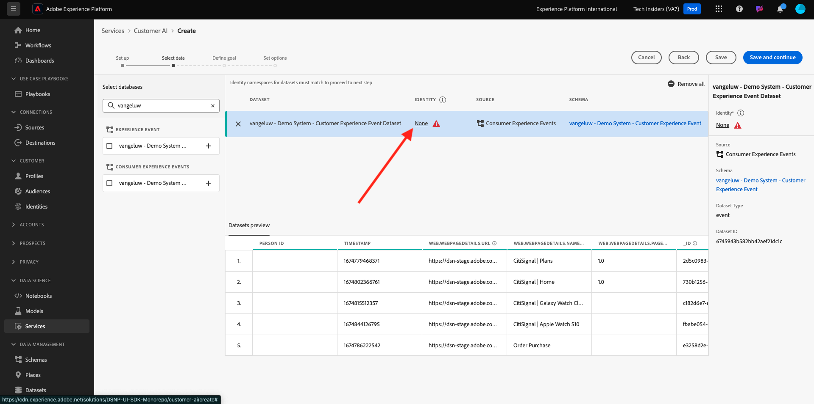

# 2.2.2 Klantenservice-AI - Een nieuw exemplaar maken (configureren)

De AI van de klant werkt door bestaande gegevens van de Gebeurtenis van de Consumentenervaring te analyseren om karn of de scores van de omzetneigheidswaarde te voorspellen. Door een nieuwe AI-instantie van de klant te maken, kunnen marketeers doelstellingen en maatregelen definiëren.

## Nieuwe Customer AI-instantie instellen

In Adobe Experience Platform, klik **Diensten** in het linkermenu. De **browser van de Diensten** verschijnt en toont alle beschikbare diensten bij uw beschikking. In de kaart voor Klant AI, klik **Open**.

Klik **creëren instantie**.

Dan zie je dit.

Voer de vereiste gegevens voor de AI-instantie van de Klant in:

- Naam: gebruik `--aepUserLdap-- Product Purchase Propensity`
- Beschrijving: gebruik: **voorspelt de waarschijnlijkheid voor klanten om een product** te kopen
- Type van Eigenschap: uitgezochte **Omzetting**

Klik **sparen en ga** verder.

Dan zie je dit. Selecteer de dataset u in de vorige oefening creeerde die `--aepUserLdap-- - Demo System - Customer Experience Event Dataset` wordt genoemd. Klik **toevoegen**.

Dan zie je dit. u moet het **gebied van de Identiteit** bepalen. Klik **niets**.

In popup, uitgezochte **Identiteitskaart (identityMap)** en selecteer dan het namespace **Systeem van de Demo - CRMID (crmId)**. Daarna, klik **sparen**.

Klik **sparen en ga** verder.

Selecteer **zal voorkomen** in uw specifieke dataset, en bepaalt het gebied **commerce.purchase.value** als doelvariabele.

Daarna, plaats uw programma om **wekelijks** in werking te stellen en de tijd zo dicht mogelijk aan uw huidige tijd te plaatsen. Zorg ervoor dat de knevel **scores voor Profiel** toelaat wordt toegelaten. Klik **sparen en ga** verder.

Nadat u het exemplaar vormt, kunt u het in de de dienstlijst van AI van de Klant zien en u kunt de samenvatting van de opstelling en uitvoeringsdetails ook voorproef door op de de instantielijst van de KlantAI te klikken. In het deelvenster Samenvatting worden ook foutgegevens weergegeven voor het geval er fouten zijn gevonden.

>[!NOTE]
>
>U kunt om het even welke definitie of attribuut wijzigen zolang de status van uw instantie van de Klant AI of **wachtende opleiding** of **Fout** is

Als je model eenmaal is uitgevoerd, zie je dit.

Volgende Stap: [ 2.2.3 Klant AI - het Scoren Dashboard en de Segmentatie (Voorkeur &amp; neem Actie) ](./ex3.md)

[Terug naar module 2.2](./intelligent-services.md)

[Terug naar alle modules](./../../../overview.md)
