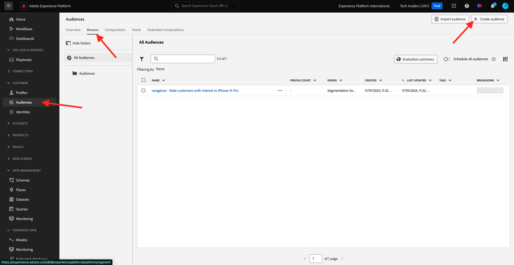

# 2.3.1 Een publiek maken

In deze oefening, zult u een publiek creëren door gebruik te maken van Adobe Experience Platform het publiek bouwer.

## Context

Reageren op de interesse van een klant moet realtime zijn. Één van de manieren om aan klantengedrag in real time te antwoorden is door een publiek te gebruiken, op voorwaarde dat het publiek in real time kwalificeert. In deze oefening, moet u een publiek opbouwen, rekening houdend met echte activiteit op de website die wij hebben gebruikt.

## Bepaal het gedrag waarop u wilt reageren

Ga naar [&#x200B; https://dsn.adobe.com &#x200B;](https://dsn.adobe.com). Nadat je je hebt aangemeld bij je Adobe ID, kun je dit zien. Klik de 3 punten **..** op uw websiteproject en klik dan **Looppas** om het te openen.

Vervolgens wordt uw demowebsite geopend. Selecteer de URL en kopieer deze naar het klembord.

Open een nieuw Incognito-browservenster.

Plak de URL van uw demowebsite, die u in de vorige stap hebt gekopieerd. Vervolgens wordt u gevraagd u aan te melden met uw Adobe ID.

Selecteer uw accounttype en voltooi het aanmeldingsproces.

Uw website wordt vervolgens geladen in een Incognito-browservenster. Voor elke oefening, zult u een vers, incognito browser venster moeten gebruiken om uw demowebsite URL te laden.

In dit voorbeeld wilt u reageren op een specifieke klant die een specifiek product weergeeft.
Van de **homepage van het Signaal 0&rbrace; Citi, ga** Telefoons &amp; apparaten **, en klik het product** Galaxy S24 **.**

Dus wanneer iemand de productpagina voor **Galaxy S24** bezoekt, wilt u actie kunnen nemen. Het eerste wat je moet doen om actie te ondernemen, is een publiek definiëren.

## Het publiek maken

Ga naar [&#x200B; Adobe Experience Platform &#x200B;](https://experience.adobe.com/platform). Na het aanmelden landt je op de homepage van Adobe Experience Platform.

Alvorens u verdergaat, moet u a **zandbak** selecteren. De te selecteren sandbox krijgt de naam ``--aepSandboxName--`` . Nadat u de juiste [!UICONTROL sandbox] hebt geselecteerd, ziet u de schermwijziging en nu bevindt u zich in uw toegewezen [!UICONTROL sandbox] .

In het menu op de linkerkant, ga naar **Soorten publiek** en ga dan naar **doorbladeren** waar u een overzicht van alle bestaande wijzen kunt zien. Klik op **creeer de knoop van het Publiek** beginnen een nieuw publiek te creëren.

Selecteer **bouwt Regel** en klik **creeer**.

Zoals hierboven vermeld, moet u een publiek uit alle klanten bouwen die het product **Galaxy S24** hebben bekeken.

U moet een gebeurtenis toevoegen om dit publiek op te bouwen. U kunt alle gebeurtenissen vinden door op het **pictogram van Gebeurtenissen** in de **publiek** menubar te klikken.

Daarna, zult u het hoogste niveau **XDM ExperienceEvent** knoop zien.

Om klanten te vinden die het **Galaxy S24** product hebben bezocht, klik op **XDM ExperienceEvent**.

De rol neer aan **Punten van de Lijst van het Product** en klikt het.

Selecteer **Naam** en sleep en laat vallen het **voorwerp van de Naam** van de linker **Punten van de Lijst van het Product** menu op het canvas van de publieksbouwer in de **sectie van Gebeurtenissen**.

De vergelijkingsparameter zou **gelijken** moeten zijn en op het inputgebied, ga `Galaxy S24` binnen.

Uw **Regels van de Gebeurtenis** zouden nu als dit moeten kijken. Telkens als u een element aan de publieksbouwer toevoegt, kunt u **klikken verfrist Schatting** knoop om een nieuwe schatting van de bevolking in uw publiek te krijgen.

Geef uw publiek een naam en plaats de **Methode van de Evaluatie** aan **Edge**.

Gebruik als naamgevingsconventie:

- `--aepUserLdap-- - Interest in Galaxy S24`

Daarna, klik de **knoop van Publish** om uw publiek te bewaren.

U gaat nu terug naar de overzichtspagina van het publiek.

Volgende Stap: [&#x200B; 2.3.2 Overzicht hoe te om Doel DV360 te vormen gebruikend Doelen &#x200B;](./ex2.md)

[Terug naar module 2.3](./real-time-cdp-build-a-segment-take-action.md)

[Terug naar alle modules](../../../overview.md)
