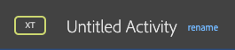
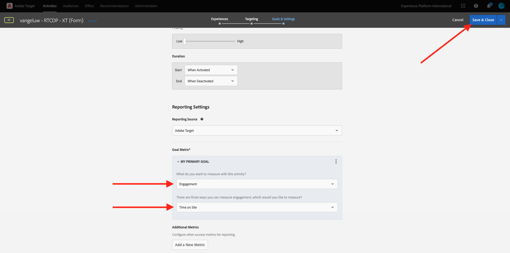

# 2.3.5 Actie nemen: stuur je segment naar Adobe Target

Ga naar [ Adobe Experience Platform ](https://experience.adobe.com/platform). Na het aanmelden landt je op de homepage van Adobe Experience Platform.


Alvorens u verdergaat, moet u a **zandbak** selecteren. De te selecteren sandbox krijgt de naam ``--aepSandboxId--`` . U kunt dit doen door op de tekst **[!UICONTROL Production Prod]** in de blauwe lijn boven op het scherm te klikken. Nadat u de juiste [!UICONTROL sandbox] hebt geselecteerd, ziet u de schermwijziging en nu bevindt u zich in uw toegewezen [!UICONTROL sandbox] .


## 2.3.5.1 Controleer uw gegevensstroom

De Adobe Target-bestemming in Real-Time CDP is verbonden met de gegevensstroom die wordt gebruikt om gegevens in te voeren in het Edge-netwerk van de Adobe. Als u uw Adobe Target-bestemming wilt instellen, moet u eerst controleren of uw gegevensstroom al is ingeschakeld voor Adobe Target. Uw datastram werd gevormd in [ Uitoefening 0.2 creeer uw Datasstream ](./../../../modules/gettingstarted/gettingstarted/ex2.md) en werd genoemd `--demoProfileLdap-- - Demo System Datastream`.

Ga naar [ https://experience.adobe.com/#/data-collection/ ](https://experience.adobe.com/#/data-collection/), dan klik **Datastreams** of **Datastreams (Beta)**.


Selecteer in de rechterbovenhoek van het scherm de naam van de sandbox, die `--aepSandboxId--` moet zijn.


Zoek in Datastreams naar de gegevensstroom met de naam `--demoProfileLdap-- - Demo System Datastream` . Klik op de gegevensstroom om deze te openen.


U zult dan dit zien, klik **..** naast **Adobe Experience Platform** en klik dan **uitgeven**.


Controleer checkboxes voor zowel **de Segmentatie van Edge** als **de Doelen van Personalization**. Klik **sparen**.


Vervolgens klikt u op **+ Service toevoegen** .


Selecteer de dienst **Adobe Target**. Klik **sparen**.


Uw gegevensstroom is nu geconfigureerd voor Adobe Target.


## 2.3.5.2 Uw Adobe Target-bestemming configureren

Adobe Target is beschikbaar als een bestemming vanuit Real-Time CDP. Om uw integratie van Adobe Target te plaatsen, ga **Doelen**, aan **Catalogus**.


Klik **Personalization** in het **menu van Categorieën**. U zult dan de **Adobe Target** bestemmingskaart zien. Klik **activeren Segmenten** (of **Opstelling** afhankelijk van uw milieu).


Afhankelijk van uw milieu, zou u **kunnen moeten klikken + nieuwe bestemming** vormen beginnen uw bestemming te creëren.


Dan zie je dit.


In **vorm nieuw bestemmings** scherm, moet u twee dingen vormen:

- Naam: gebruik de naam `--demoProfileLdap-- - Adobe Target (Web)`, die als dit zou moeten kijken: **vangeluw - Adobe Target (Web)**.
- Identiteitskaart van de gegevensstroom: u moet de gegevensstroom selecteren die u in [ Uitoefening 0.2 vormde creeer uw DataStream ](./../../../modules/gettingstarted/gettingstarted/ex2.md). De naam van de gegevensstroom moet zijn: `--demoProfileLdap-- - Demo System Datastream` .

Klik **daarna**.


In het volgende scherm, kunt u naar keuze een governancebeleid selecteren. Het is niet vereist om één te selecteren, in dit geval is er geen behoefte om één te selecteren, zodat klikt **creeert**.


Uw bestemming wordt nu gecreeerd en zal in de lijst worden getoond. Selecteer uw bestemming en klik **daarna** beginnen segmenten naar uw bestemming te verzenden.


In de lijst van beschikbare segmenten, selecteer het segment u in [ Uitoefening 6.1 creeerde een segment ](./ex1.md), dat `--demoProfileLdap-- - Interest in PROTEUS FITNESS JACKSHIRT` wordt genoemd. Dan, klik **daarna**.


Voor de volgende pagina, klik **daarna**.


Klik **Afwerking**.


Uw segment wordt nu geactiveerd naar Adobe Target.


>[!IMPORTANT]
>
>Als je net je Adobe Target-bestemming hebt gemaakt in Real-Time CDP, kan het tot een uur duren voordat de bestemming live is. Dit is eenmalig wachttijd, wegens de opstelling van de backendconfiguratie. Zodra de aanvankelijke 1 uur wachttijd en achtergrondconfiguratie wordt gedaan, zullen de onlangs toegevoegde randsegmenten die naar de bestemming van Adobe Target worden verzonden voor het richten in real time beschikbaar zijn.

## 2.3.5.3 Configureer uw Adobe Target-formuliergebaseerde activiteit

Nu uw Real-Time CDP-segment is geconfigureerd voor verzending naar Adobe Target, kunt u uw Experience Targeting-activiteit configureren in Adobe Target. In deze oefening zult u een op vorm-gebaseerde activiteit vormen.

Ga naar de homepage van Adobe Experience Cloud door [ https://experiencecloud.adobe.com/ ](https://experiencecloud.adobe.com/) te gaan. Klik **Doel** om het te openen.


Op **Adobe Target** homepage, zult u alle bestaande Activiteiten zien.


Klik op **+ Activiteit maken** om een nieuwe activiteit te maken.


Selecteer **Ervaring richtend**.


Selecteer **Vorm** en selecteer **Geen Beperkingen van het Bezit**. Klik **daarna**.


U bent nu in de op formulier gebaseerde composer voor activiteiten.


Voor het gebied **LOCATIE 1**, uitgezochte **doel-globaal-mbox**.


Het standaardpubliek is momenteel **Alle Bezoekers**. Klik op **3 dots** naast **Alle Bezoekers** en klik **Publiek van de Verandering**.


U ziet nu de lijst met beschikbare soorten publiek. Het Adobe Experience Platform-segment dat u eerder hebt gemaakt en naar Adobe Target hebt verzonden, maakt nu deel uit van deze lijst. Selecteer het segment dat u eerder in Adobe Experience Platform hebt gemaakt. Klik **toewijzen Publiek**.


Uw Adobe Experience Platform-segment maakt nu deel uit van deze Experience Targeting Activity.


Laten we nu de hoofdafbeelding wijzigen op de homepage van de website. Klik om de dropdown lijst naast **StandaardInhoud** te openen en **te klikken creeer Aanbieding van de HTML**.


Plak de volgende code. Dan, klik **daarna**.

```javascript
<script>document.querySelector("#home > div > div > div > div > div.banner_img.d-none.d-lg-block > img").src="https://parsefiles.back4app.com/hgJBdVOS2eff03JCn6qXXOxT5jJFzialLAHJixD9/ff92fdc3885972c0090ad5419e0ef4d4_Luma - Product - Proteus - Hero Banner.png"; document.querySelector(".banner_text > *").remove()</script>
```


U zult dan de nieuwe ervaring met het nieuwe beeld, voor uw geselecteerd Publiek zien.


Klik op de titel van uw activiteit in de linkerbovenhoek om de naam ervan te wijzigen.



Gebruik voor de naam:

- `--demoProfileLdap-- - RTCDP - XT (Form)`


Klik **daarna**.


Op de **Doelstellingen &amp; Montages** - pagina, ga naar **Goal Metrics**.


Plaats het Primaire Doel aan **Betrokkenheid** - **Tijd op Plaats**.



Klik **sparen &amp; Sluiten**.


U bent nu op de **pagina van het Overzicht van de Activiteit**. U moet uw activiteit nog activeren.


Klik op het gebied **Inactief** en selecteer **activeren**.


Je krijgt dan een visuele bevestiging dat je activiteit nu actief is.


Uw activiteiten zijn nu live en kunnen worden getest op de demo-website.

>[!IMPORTANT]
>
>Als je net je Adobe Target-bestemming hebt gemaakt in Real-Time CDP, kan het tot een uur duren voordat de bestemming live is. Dit is eenmalig wachttijd, wegens de opstelling van de backendconfiguratie. Zodra de aanvankelijke 1 uur wachttijd en achtergrondconfiguratie wordt gedaan, zullen de onlangs toegevoegde randsegmenten die naar de bestemming van Adobe Target worden verzonden voor het richten in real time beschikbaar zijn.

Als u nu teruggaat naar uw demo-website en de productpagina voor PROTEUS FITNESS JACKSHIRT bezoekt, komt u meteen in aanmerking voor het segment dat u hebt gemaakt en ziet u dat de Adobe Target-activiteit in real-time wordt weergegeven op de homepage.


Volgende Stap: [ 2.3.6 Extern publiek ](./ex6.md)

[Terug naar module 2.3](./real-time-cdp-build-a-segment-take-action.md)

[Terug naar alle modules](../../../overview.md)
