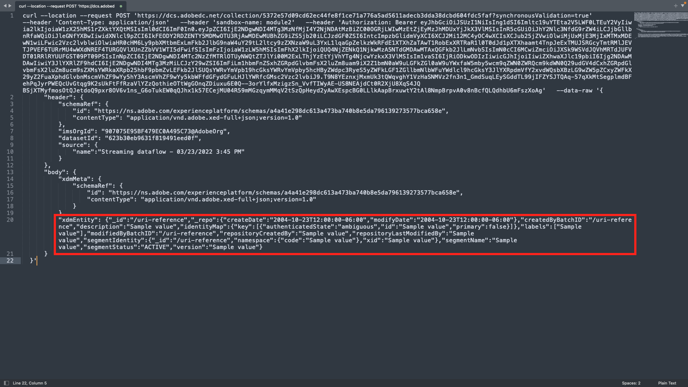
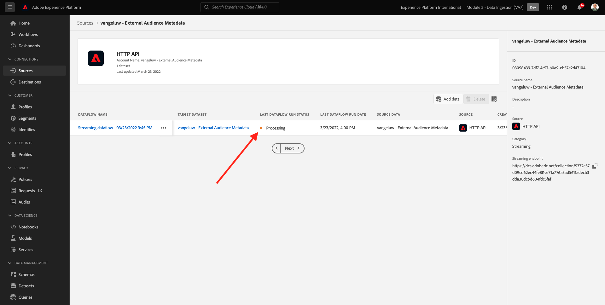
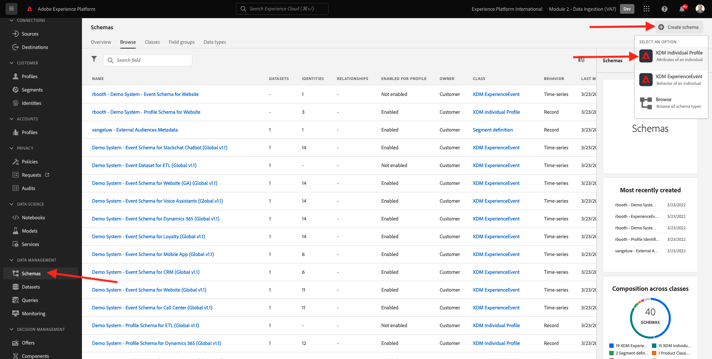
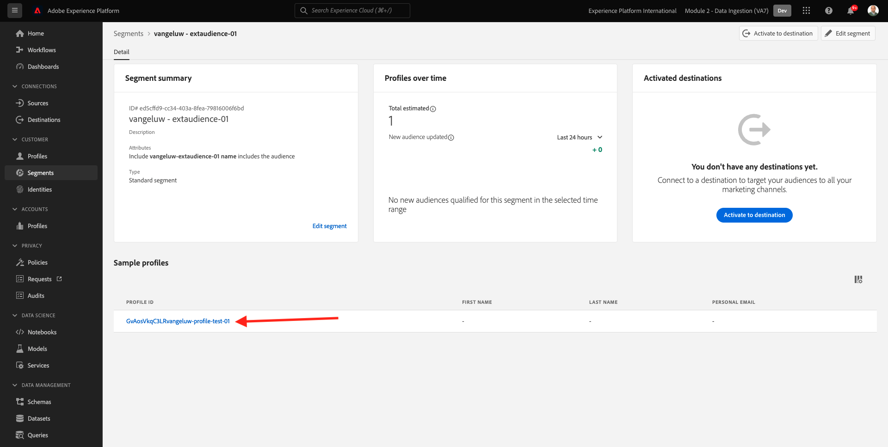

# 2.3.6 Extern publiek

In veel gevallen wil uw bedrijf bestaande segmenten uit andere toepassingen gebruiken om het klantprofiel in Adobe Experience Platform te verrijken.
Die externe doelgroepen kunnen zijn gedefinieerd op basis van een model voor gegevenswetenschap of met behulp van externe gegevensplatforms.

Met de functie Extern publiek van Adobe Experience Platform kunt u de aandacht richten op de opname van het externe publiek en de activering ervan zonder dat u de definitie van het desbetreffende segment in Adobe Experience Platform nader hoeft te definiëren.

Het algemene proces bestaat uit drie hoofdstappen:

- Importeer de metagegevens van het externe publiek: deze stap is bedoeld om de metagegevens van het externe publiek, zoals de naam van het publiek, in Adobe Experience Platform in te voeren.
- Wijs het externe publiekslidmaatschap aan het klantenprofiel toe: deze stap moet het klantenprofiel met de externe attributen van het segmentlidmaatschap verrijken.
- Maak de segmenten in Adobe Experience Platform: deze stap is bedoeld om actioneerbare segmenten te maken op basis van het lidmaatschap van externe doelgroepen.

## 2.3.6.1 Metagegevens

Ga naar [ Adobe Experience Platform ](https://experience.adobe.com/platform). Na het aanmelden landt je op de homepage van Adobe Experience Platform.


>[!IMPORTANT]
>
>De sandbox die u voor deze oefening wilt gebruiken, is ``--module2sandbox--`` .

Alvorens u verdergaat, moet u a **zandbak** selecteren. De te selecteren sandbox krijgt de naam ``--module2sandbox--`` . U kunt dit doen door op de tekst **[!UICONTROL Production Prod]** in de blauwe lijn boven op het scherm te klikken. Nadat u de juiste [!UICONTROL sandbox] hebt geselecteerd, ziet u de schermwijziging en nu bevindt u zich in uw toegewezen [!UICONTROL sandbox] .


Terwijl de segmentgegevens de voorwaarde voor een profiel om deel van een segment bepalen te zijn, zijn de segmentmeta-gegevens informatie over het segment zoals de naam, de beschrijving en de status van het segment. Aangezien de metagegevens van het externe publiek in Adobe Experience Platform worden opgeslagen, moet u een naamruimte gebruiken om de metagegevens in Adobe Experience Platform in te voeren.

## 2.3.6.1.1 Identiteitsnaamruimte voor externe doelgroepen

Een identiteit namespace is reeds gecreeerd voor gebruik met **Extern publiek**.
Om de identiteit te bekijken die reeds werd gecreeerd, ga **Identiteiten**, en onderzoek naar **Extern**. Klik op het item Extern publiek.

Opmerking:

- Het identiteitssymbool **externalaudiences** zal in de volgende stappen worden gebruikt om naar de externe publieksidentiteit te verwijzen.
- Het **herkenningsteken niet-mensen** type wordt gebruikt voor deze identiteit namespace, aangezien dit namespace niet bedoeld is om klantenprofielen maar segmenten te identificeren.


## 2.3.6.1.2 Het schema voor metagegevens van externe doelgroepen maken

De externe publieksmeta-gegevens zijn gebaseerd op het **Schema van de definitiedefinitie van het Segment**. U kunt meer details in de [ bewaarplaats van XDM Github ](https://github.com/adobe/xdm/blob/master/docs/reference/classes/segmentdefinition.schema.md) vinden.

Ga in het linkermenu naar Schemas. Klik **+ creëren Schema** en klik dan **doorbladeren**.


Om een klasse toe te wijzen, onderzoek naar **segmentdefinitie**. Selecteer de **klasse van de definitie van het 0} Segment {en klik** toewijzen Klasse **.**


Dan zie je dit. Klik **annuleren**.


Dan zie je dit. Selecteer het gebied **_id**. In het juiste menu, scrol neer en laat de **Identiteit** en de **Primaire de controledozen van de identiteit** toe. Selecteer de **Externe Publiek** identiteitsnaamruimte. Klik **toepassen**.


Daarna, selecteer de schemanaam **Naamloos schema**. Wijzig de naam in `--demoProfileLdap-- - External Audiences Metadata` .


Laat het **Profiel** knevel en bevestig toe. Tot slot klik **sparen**.


## 2.3.6.1.3 De gegevensset met metagegevens voor externe doelgroepen maken

In **Schema&#39;s**, ga **doorbladeren**. Zoek en klik op het schema `--demoProfileLdap-- - External Audiences Metadata` dat u in de vorige stap hebt gemaakt. Daarna, klik **creeer Dataset van Schema**.


Voor het gebied **Naam**, ga `--demoProfileLdap-- - External Audience Metadata` in. Klik **creëren dataset**.


Dan zie je dit. Vergeet niet om de **knevel van het Profiel** toe te laten!


## 2.3.6.1.4 Een HTTP API Source-verbinding maken

Vervolgens moet u de HTTP API Source-connector configureren die u gebruikt om de metagegevens in de gegevensset in te voeren.

Ga naar **Bronnen**. Op het onderzoeksgebied, ga **HTTP** in. Klik **toevoegen gegevens**.


Voer de volgende gegevens in:

- **Type van Rekening**: uitgezochte **Nieuwe rekening**
- **naam van de Rekening**: ga `--demoProfileLdap-- - External Audience Metadata` in
- Controle checkbox **XDM compatibel vakje**

Daarna, klik **verbinden met bron**.


Dan zie je dit. Klik **daarna**.


Selecteer **Bestaande dataset** en in het dropdown menu, onderzoek en selecteer de dataset `--demoProfileLdap-- - External Audience Metadata`.

Verifieer de **details Dataflow** en klik dan **daarna**.


Dan zie je dit.

De **Afbeelding** stap van de tovenaar is leeg aangezien u een XDM volgzame nuttige lading in de Schakelaar van Source van HTTP API zult opnemen, zodat wordt geen afbeelding vereist. Klik **daarna**.


In de **stap van het Overzicht** kunt u naar keuze de verbinding en de kaartdetails herzien. Klik **Afwerking**.


Dan zie je dit.


## 2.3.6.1.5 Opname van metagegevens van externe doelgroepen

Op uw het overzichtslusje van de Schakelaar van Source, klik **..** en klik dan **het schemalading van het Exemplaar**.


Open de toepassing van de Teksteditor op uw computer en plak de lading die u net hebt gekopieerd. Deze ziet er als volgt uit. Daarna, moet u het **xdmEntiteit** voorwerp in deze nuttige lading bijwerken.



Het voorwerp **xdmEntiteit** moet door de hieronder code worden vervangen. Kopieer de hieronder code, en kleef het in uw tekstdossier door het **xdmEntiteit** voorwerp in de tekstredacteur te vervangen.

```
"xdmEntity": {
    "_id": "--demoProfileLdap---extaudience-01",
    "description": "--demoProfileLdap---extaudience-01 description",
    "segmentIdentity": {
      "_id": "--demoProfileLdap---extaudience-01",
      "namespace": {
        "code": "externalaudiences"
      }
    },
    "segmentName": "--demoProfileLdap---extaudience-01 name",
    "segmentStatus": "ACTIVE",
    "version": "1.0"
  }
```

U zou dan dit moeten zien:


Daarna, open een nieuw **Eind** venster. Kopieer alle tekst in de Teksteditor en plak deze in het terminalvenster.


Daarna, slag **binnengaan**.

U zult dan een bevestiging van uw gegevensopname in het Eind venster zien:


Vernieuw het Source-verbindingsscherm van de HTTP API, waar u nu ziet dat de gegevens worden verwerkt:



## 2.3.6.1.6 De metagegevens van externe doelgroepen valideren

Wanneer de verwerking wordt voltooid kunt u de gegevensbeschikbaarheid in de dataset controleren gebruikend de Dienst van de Vraag.

In het juiste menu, ga naar **Datasets** en selecteer de `--demoProfileLdap-- - External Audience Metadata` dataset u eerder creeerde.


In het juiste menu, ga naar Vragen en klik **creeer vraag**.


Ga de volgende code in en duik dan **SHIFT + ENTER**:

```
select * from --demoProfileLdap--_external_audience_metadata
```

In de vraagresultaten zult u de meta-gegevens van de externe publiek zien die u hebt opgenomen.


## 2.3.6.2 Segmentlidmaatschap

Met de externe publieksmeta-gegevens beschikbaar kunt u nu het segmentlidmaatschap voor een specifiek klantenprofiel opnemen.

U moet nu een profieldataset voorbereiden die tegen het het lidmaatschapsschema van het Segment wordt verrijkt. U kunt meer details in de [ bewaarplaats van XDM Github ](https://github.com/adobe/xdm/blob/master/docs/reference/datatypes/segmentmembership.schema.md) vinden.

## 2.3.6.2.1 Het lidmaatschapsschema voor externe doelgroepen maken

In het juiste menu, ga naar **Schema&#39;s**. Klik **creëren Schema** en klik dan **Individueel Profiel XDM**.



In **voeg gebiedsgroepen** popup toe, onderzoek naar **Kern van het Profiel**. Selecteer de **Kern van het Profiel v2** gebiedsgroep.


Daarna, in **voeg gebiedsgroepen** popup toe, onderzoek naar **het lidmaatschap van het Segment**. Selecteer de **gebiedsgroep van de Details van het Lidmaatschap van het 0} Segment.** Daarna, klik **toevoegen gebiedsgroepen**.


Dan zie je dit. Navigeer naar het veld `--aepTenantId--.identification.core` . Klik het **crmId** gebied. In het juiste menu, scrol neer en controleer de **Identiteit** en **Primaire identiteitskaart** checkboxes. Voor **Namespace van de Identiteit** uitgezocht **Systeem van de Demo - CRMID**.

Klik **toepassen**.


Daarna, selecteer de naam van het Schema **Naamloos schema**. Typ `--demoProfileLdap-- - External Audiences Membership` in het veld Weergavenaam.


Daarna, laat het **knevel en bevestig van het Profiel toe 0}.** Klik **sparen**.


## 2.3.6.2.2 Maak een gegevensset voor leden van externe doelgroepen

In **Schema&#39;s**, ga **doorbladeren**. Zoek en klik op het schema `--demoProfileLdap-- - External Audiences Membership` dat u in de vorige stap hebt gemaakt. Daarna, klik **creeer Dataset van Schema**.


Voor het gebied **Naam**, ga `--demoProfileLdap-- - External Audiences Membership` in. Klik **creëren dataset**.


Dan zie je dit. Vergeet niet om de **knevel van het Profiel** toe te laten!


## 2.3.6.2.3 Een HTTP API Source-verbinding maken


Vervolgens moet u de HTTP API Source-connector configureren die u gebruikt om de metagegevens in de gegevensset in te voeren.

Ga naar **Bronnen**. Op het onderzoeksgebied, ga **HTTP** in. Klik **toevoegen gegevens**.


Voer de volgende gegevens in:

- **Type van Rekening**: uitgezochte **Nieuwe rekening**
- **naam van de Rekening**: ga `--demoProfileLdap-- - External Audience Membership` in
- Controle checkbox **XDM compatibel vakje**

Daarna, klik **verbinden met bron**.


Dan zie je dit. Klik **daarna**.


Selecteer **Bestaande dataset** en in het dropdown menu, onderzoek en selecteer de dataset `--demoProfileLdap-- - External Audiences Membership`.

Verifieer de **details Dataflow** en klik dan **daarna**.


Dan zie je dit.

De **Afbeelding** stap van de tovenaar is leeg aangezien u een XDM volgzame nuttige lading in de Schakelaar van Source van HTTP API zult opnemen, zodat wordt geen afbeelding vereist. Klik **daarna**.


In de **stap van het Overzicht** kunt u naar keuze de verbinding en de kaartdetails herzien. Klik **Afwerking**.


Dan zie je dit.


## 2.3.6.2.4 Opname van gegevens van het externe publiek

Op uw het overzichtslusje van de Schakelaar van Source, klik **..** en klik dan **het schemalading van het Exemplaar**.


Open de toepassing van de Teksteditor op uw computer en plak de lading die u net hebt gekopieerd. Deze ziet er als volgt uit. Daarna, moet u het **xdmEntiteit** voorwerp in deze nuttige lading bijwerken.


Het voorwerp **xdmEntiteit** moet door de hieronder code worden vervangen. Kopieer de hieronder code, en kleef het in uw tekstdossier door het **xdmEntiteit** voorwerp in de tekstredacteur te vervangen.

```
  "xdmEntity": {
    "_id": "--demoProfileLdap---profile-test-01",
    "_experienceplatform": {
      "identification": {
        "core": {
          "crmId": "--demoProfileLdap---profile-test-01"
        }
      }
    },
    "personID": "--demoProfileLdap---profile-test-01",
    "segmentMembership": {
      "externalaudiences": {
        "--demoProfileLdap---extaudience-01": {
          "status": "realized",
          "lastQualificationTime": "2022-03-05T00:00:00Z"
        }
      }
    }
  }
```

U zou dan dit moeten zien:


Daarna, open een nieuw **Eind** venster. Kopieer alle tekst in de Teksteditor en plak deze in het terminalvenster.


Daarna, slag **binnengaan**.

U zult dan een bevestiging van uw gegevensopname in het Eind venster zien:


Vernieuw het Source-verbindingsscherm van de HTTP API, waar u na een paar minuten ziet dat de gegevens worden verwerkt:


## 2.3.6.2.5 Valideren van lidmaatschap voor externe doelgroepen

Wanneer de verwerking wordt voltooid kunt u de gegevensbeschikbaarheid in de dataset controleren gebruikend de Dienst van de Vraag.

In het juiste menu, ga naar **Datasets** en selecteer de `--demoProfileLdap-- - External Audiences Membership ` dataset u eerder creeerde.


In het juiste menu, ga naar Vragen en klik **creeer vraag**.


Ga de volgende code in en duik dan **SHIFT + ENTER**:

```
select * from --demoProfileLdap--_external_audiences_membership
```

In de vraagresultaten zult u de meta-gegevens van de externe publiek zien die u hebt opgenomen.


## 2.3.6.3 Een segment maken

Nu bent u klaar om actie te ondernemen tegen het externe publiek.
In Adobe Experience Platform wordt actie ondernomen door het creëren van segmenten, het vullen van de respectieve doelgroepen en het delen van die doelgroepen.
U zult nu een segment gebruikend het externe publiek creëren u enkel creeerde.

In het linkermenu, ga naar **Segmenten** en klik **creeer segment**.


Ga naar **Soorten publiek**. Dan zie je dit. Klik **Extern publiek**.


Selecteer het externe publiek dat u eerder hebt gemaakt en dat de naam `--demoProfileLdap---extaudience-01` heeft. Sleep het publiek naar het canvas.


Geef uw segment een naam, gebruik `--demoProfileLdap-- - extaudience-01`. Klik **sparen en Sluiten**.


Dan zie je dit. U zult ook opmerken dat het profiel waarvoor u het segmentlidmaatschap hebt opgenomen nu in de lijst van **Profielen van de Steekproef** toont.



Uw segment is nu klaar en kan naar een bestemming voor activering worden verzonden.

## 2.3.6.4 Het profiel van uw klant visualiseren

U kunt nu ook de segmentkwalificatie visualiseren op uw klantprofiel. Ga naar **Profielen**, gebruik het identiteit namespace **Systeem van de Manifestatie - CRMID** en verstrek de identiteit `--demoProfileLdap---profile-test-01`, die u als deel van oefening 6.6.2.4 gebruikte, en klik **Mening**. Vervolgens klikt u op de **Profiel-id** om het profiel te openen.


Ga naar **lidmaatschap van het Segment**, waar u uw extern publiek zult zien verschijnen.


Volgende Stap: [ 2.3.7 Doelen SDK ](./ex7.md)

[Terug naar module 2.3](./real-time-cdp-build-a-segment-take-action.md)

[Terug naar alle modules](../../../overview.md)
