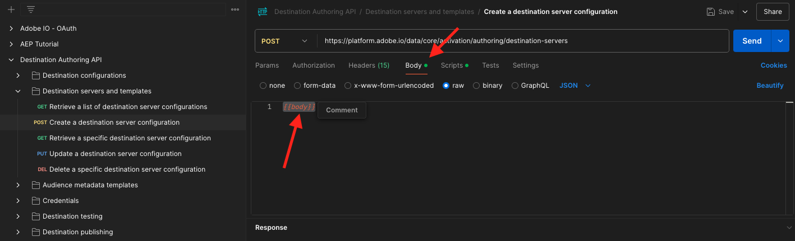

# 2.3.7 SDK van bestemmingen

## Uw Adobe I/O-project instellen

In deze oefening zult u Adobe I/O opnieuw gebruiken om Adobe Experience Platform API&#39;s te vragen. Als u uw Adobe I/O project nog niet hebt gevormd, ga terug naar [ oefening 3 in Module 2.1 ](../module2.1/ex3.md) en volg de instructies daar.

## Postman-verificatie naar Adobe I/O

In deze oefening zult u Postman opnieuw gebruiken om Adobe Experience Platform API&#39;s te vragen. Als u uw toepassing van Postman nog niet hebt gevormd, ga terug naar [ oefening 3 in Module 2.1 ](../module2.1/ex3.md) en volg de instructies daar.

## Definiëren van eindpunt en formaat

Voor deze oefening, zult u een eindpunt nodig hebben om te vormen zodat wanneer een segment kwalificeert, de kwalificatiegebeurtenis aan dat eindpunt kan worden gestroomd. In deze oefening, zult u een steekproefeindpunt gebruiken gebruikend [ https://webhook.site/ ](https://webhook.site/). Ga naar [ https://webhook.site/ ](https://webhook.site/), waar u iets gelijkend op dit zult zien. Klik **Exemplaar aan klembord** om url te kopiëren. U zult deze url in de volgende oefening moeten specificeren. De URL in dit voorbeeld is `https://webhook.site/e0eb530c-15b4-4a29-8b50-e40877d5490a` .


Wat het formaat betreft, zullen wij een standaardmalplaatje gebruiken dat segmentkwalificaties of onkwalificaties samen met meta-gegevens zoals klantenherkenningstekens stroomt. De malplaatjes kunnen worden aangepast om aan de verwachtingen van specifieke eindpunten te voldoen, maar in deze oefening zullen wij een standaardmalplaatje opnieuw gebruiken, dat in een nuttige last als dit zal resulteren die aan het eindpunt zal worden gestroomd.

```json
{
  "profiles": [
    {
      "identities": [
        {
          "type": "ecid",
          "id": "64626768309422151580190219823409897678"
        }
      ],
      "AdobeExperiencePlatformSegments": {
        "add": [
          "f58c723c-f1e5-40dd-8c79-7bb4ab47f041"
        ],
        "remove": []
      }
    }
  ]
}
```

## Een server- en sjabloonconfiguratie maken

De eerste stap om uw eigen Doel in Adobe Experience Platform te creëren is een server en malplaatjeconfiguratie tot stand te brengen.

Om dat te doen, ga naar **Authoring API van de Bestemming**, naar **de servers en de malplaatjes van de Bestemming** en klik om de verzoek **POST te openen - creeer een configuratie van de bestemmingsserver**. Dan zie je dit. Onder **Kopballen**, moet u de waarde voor sleutel **x-zandbak-naam** manueel bijwerken en het plaatsen aan `--aepSandboxName--`. Selecteer de waarde **{{SANDBOX_NAME}}** .


Vervang deze door `--aepSandboxName--` .


Daarna, ga naar **Lichaam**. Selecteer de tijdelijke aanduiding **{{body}}** .



U moet nu de tijdelijke aanduiding **{{body}}** vervangen door de onderstaande code:

```json
{
    "name": "Custom HTTP Destination",
    "destinationServerType": "URL_BASED",
    "urlBasedDestination": {
        "url": {
            "templatingStrategy": "PEBBLE_V1",
            "value": "yourURL"
        }
    },
    "httpTemplate": {
        "httpMethod": "POST",
        "requestBody": {
            "templatingStrategy": "PEBBLE_V1",
            "value": "{\n    \"profiles\": [\n    \n        {\n            \"identities\": [\n            \n            \n                \n                {\n                    \"type\": \"{{ namespace }}\",\n                    \"id\": \"{{ identity.id }}\"\n                },\n                ,\n            \n            ],\n            \"AdobeExperiencePlatformSegments\": {\n                \"add\": [\n                \n                    \"{{ segment.key }}\",\n                \n                ],\n                \"remove\": [\n                {#- Alternative syntax for filtering segments by status: -#}\n                \n                    \"{{ segment.key }}\",\n                \n                ]\n            }\n        },\n    \n    ]\n}"
        },
        "contentType": "application/json"
    }
}
```

Na het kleven van de bovengenoemde code, moet u het gebied **urlBasedDestination.url.value** manueel bijwerken, en u moet het aan url van Webhaak plaatsen u in de vorige stap creeerde, die `https://webhook.site/e0eb530c-15b4-4a29-8b50-e40877d5490a` in dit voorbeeld was.


Na het bijwerken van het gebied **urlBasedDestiantion.url.value**, zou het als dit moeten kijken. Klik **verzenden**.


Na het klikken **verzend**, zal uw servermalplaatje worden gecreeerd, en als deel van de reactie zult u een gebied genoemd **instanceId** zien. Schrijf het neer, aangezien u het in de volgende stap zult nodig hebben. In dit voorbeeld, is **instanceId**
`eb0f436f-dcf5-4993-a82d-0fcc09a6b36c` .


## Uw doelconfiguratie maken

In Postman, onder **Authoring API van de Bestemming**, ga naar **configuraties van de Bestemming** en klik om de verzoek **POST te openen - creeer een bestemmingsconfiguratie**. Dan zie je dit. Onder **Kopballen**, moet u de waarde voor sleutel **x-zandbak-naam** manueel bijwerken en het plaatsen aan `--aepSandboxName--`. Selecteer de waarde **{{SANDBOX_NAME}}** .


Vervang deze door `--aepSandboxName--` .


Daarna, ga naar **Lichaam**. Selecteer de tijdelijke aanduiding **{{body}}** .


U moet nu de tijdelijke aanduiding **{{body}}** vervangen door de onderstaande code:

```json
{
    "name": "--aepUserLdap-- - Webhook",
    "description": "Exports segment qualifications and identities to a custom webhook via Destination SDK.",
    "status": "TEST",
    "customerAuthenticationConfigurations": [
        {
            "authType": "BEARER"
        }
    ],
    "customerDataFields": [
        {
            "name": "endpointsInstance",
            "type": "string",
            "title": "Select Endpoint",
            "description": "We could manage several instances across the globe for REST endpoints that our customers are provisioned for. Select your endpoint in the dropdown list.",
            "isRequired": true,
            "enum": [
                "US",
                "EU",
                "APAC",
                "NZ"
            ]
        }
    ],
    "uiAttributes": {
        "documentationLink": "https://experienceleague.adobe.com/docs/experience-platform/destinations/home.html?lang=en",
        "category": "streaming",
        "connectionType": "Server-to-server",
        "frequency": "Streaming"
    },
    "identityNamespaces": {
        "ecid": {
            "acceptsAttributes": true,
            "acceptsCustomNamespaces": false
        }
    },
    "segmentMappingConfig": {
        "mapExperiencePlatformSegmentName": true,
        "mapExperiencePlatformSegmentId": true,
        "mapUserInput": false
    },
    "aggregation": {
        "aggregationType": "BEST_EFFORT",
        "bestEffortAggregation": {
            "maxUsersPerRequest": "1000",
            "splitUserById": false
        }
    },
    "schemaConfig": {
        "profileRequired": false,
        "segmentRequired": true,
        "identityRequired": true
    },
    "destinationDelivery": [
        {
            "authenticationRule": "NONE",
            "destinationServerId": "yourTemplateInstanceID"
        }
    ]
}
```


Na het kleven van de bovengenoemde code, moet u het gebied **destinationDelivery manueel bijwerken. destinationServerId**, en u moet het plaatsen aan **instanceId** van het malplaatje van de bestemmingsserver u in de vorige stap creeerde, die `eb0f436f-dcf5-4993-a82d-0fcc09a6b36c` in dit voorbeeld was. Daarna, klik **verzenden**.


Dan zie je dit antwoord.


Je bestemming is nu gemaakt in Adobe Experience Platform. Laten we daar naartoe gaan en het controleren.

Ga naar [ Adobe Experience Platform ](https://experience.adobe.com/platform). Na het aanmelden landt je op de homepage van Adobe Experience Platform.


Alvorens u verdergaat, moet u a **zandbak** selecteren. De te selecteren sandbox krijgt de naam ``--aepSandboxName--`` . U kunt dit doen door op de tekst **[!UICONTROL Production Prod]** in de blauwe lijn boven op het scherm te klikken. Nadat u de juiste [!UICONTROL sandbox] hebt geselecteerd, ziet u de schermwijziging en nu bevindt u zich in uw toegewezen [!UICONTROL sandbox] .


In het linkermenu, ga naar **Doelen**, klik **Catalogus** en scrol neer aan de categorie **Streaming**. Je ziet je bestemming nu beschikbaar.


## Uw segment koppelen aan uw doel

In **Doelen** > **Catalogus**, klik **Opstelling** op uw bestemming beginnen segmenten aan uw nieuwe bestemming toe te voegen.


Ga een dummy dragerteken, als **1234** in. Klik **verbinden met bestemming**.


Dan zie je dit. Gebruik `--aepUserLdap-- - Webhook` als naam voor uw doel. Selecteer een eindpunt van keus, in dit voorbeeld **EU**. Klik **daarna**.


U kunt desgewenst een beleid voor gegevensbeheer selecteren. Klik **daarna**.


Selecteer het segment dat u eerder hebt gemaakt en dat de naam `--aepUserLdap-- - Interest in PROTEUS FITNESS JACKSHIRT` heeft. Klik **daarna**.


Dan zie je dit. Zorg ervoor om het **VELD van SOURCE** `--aepTenantId--.identification.core.ecid` aan het gebied `Identity: ecid` in kaart te brengen. Klik **daarna**.


Klik **Afwerking**.


Uw bestemming is nu live. Nieuwe segmentkwalificaties worden nu gestreamd naar uw aangepaste webhaak.


## De segmentactivering testen

Ga naar [ https://builder.adobedemo.com/projects ](https://builder.adobedemo.com/projects). Nadat je je hebt aangemeld bij je Adobe ID, kun je dit zien. Klik op uw websiteproject om het te openen.


U kunt nu de onderstaande workflow volgen om toegang te krijgen tot de website. Klik **Integraties**.


Op de **pagina van de Integraties**, moet u het bezit van de Inzameling van Gegevens selecteren dat in oefening 0.1 werd gecreeerd.


Vervolgens wordt uw demowebsite geopend. Selecteer de URL en kopieer deze naar het klembord.


Open een nieuw Incognito-browservenster.


Plak de URL van uw demowebsite, die u in de vorige stap hebt gekopieerd. Vervolgens wordt u gevraagd u aan te melden met uw Adobe ID.


Selecteer uw accounttype en voltooi het aanmeldingsproces.


Uw website wordt vervolgens geladen in een Incognito-browservenster. Voor elke demonstratie, zult u een vers, incognito browser venster moeten gebruiken om uw demowebsite URL te laden.


Van de **homepage 0} Luma {, ga naar** Mannen **, en klik het product** PROTEUS FITNESS JACKSHIRT **.**


U hebt nu de productpagina voor **PROTEUS FITNESS JACKSHIRT** bezocht, wat betekent u nu voor het segment zult kwalificeren dat u vroeger in deze oefening creeerde.


Wanneer u de Kijker van het Profiel opent, en naar **Segmenten** gaat, zult u het segment zien kwalificeren.


Ga nu terug naar uw open webhaak op [ https://webhook.site/ ](https://webhook.site/), waar u een nieuw inkomend verzoek zou moeten zien, dat uit Adobe Experience Platform voortkomt en die de gebeurtenis van de segmentkwalificatie bevat.


Volgende Stap: [ Samenvatting en voordelen ](./summary.md)

[Terug naar module 2.3](./real-time-cdp-build-a-segment-take-action.md)

[Terug naar alle modules](../../../overview.md)
