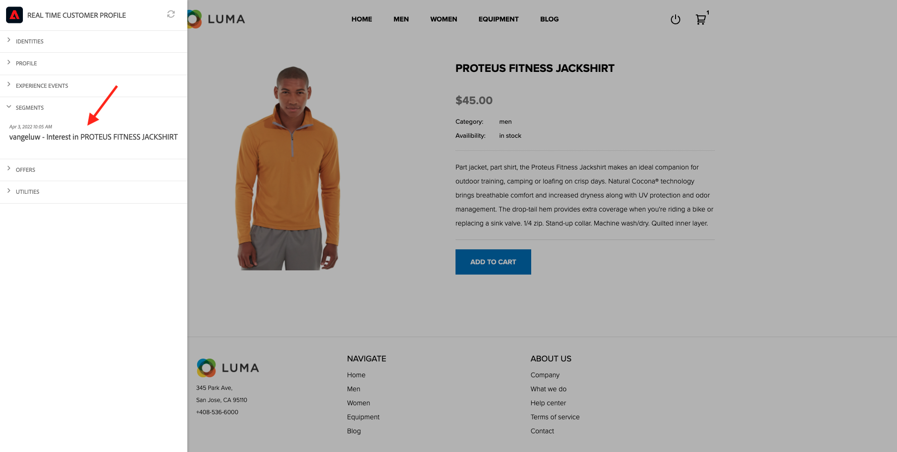

# 2.3.7 SDK van bestemmingen

## 2.3.7.1 Uw Adobe I/O-project instellen

>[!IMPORTANT]
>
>Als u uw project van de Adobe I/O na December 2021 hebt gecreeerd, kunt u dat project hergebruiken, deze oefening overslaan en zich aan oefening 6.7.2 onmiddellijk bewegen.
>
>Als u uw Adobe I/O project vóór December 2021 creeerde, gelieve een nieuw project tot stand te brengen om het met de Authoring API van Doelen compatibel te maken.

In deze oefening zult u Adobe I/O vrij intensief aan vraag tegen Platform APIs gebruiken. Volg de onderstaande stappen om Adobe I/O in te stellen.

Ga naar [ https://developer.adobe.com/console/home](https://developer.adobe.com/console/home)


Selecteer de juiste Adobe Experience Platform-instantie in de rechterbovenhoek van het scherm. Uw instantie is `--envName--` .


Klik **creëren nieuw project**.

 of


Selecteer **+ toevoegen aan Project** en selecteren **API**.


U zult dan dit zien:


Klik het **pictogram van Adobe Experience Platform**.


Klik **Experience Platform API**.


Klik **daarna**.


U kunt er nu voor kiezen om Adobe I/O uw beveiligingssleutel te laten genereren of een bestaand sleutelpaar te laten uploaden.

Kies **Optie 1 - produceer een zeer belangrijk paar**.


Klik **produceren sleutelpaar**.


Je ziet een spinner voor ongeveer 30 seconden.


U zult dan dit zien, en uw geproduceerde keypair zal als zip dossier worden gedownload: **config.zip**.

Pak het dossier **config.zip** op uw Desktop uit, zult u het 2 dossiers zien bevat:


- **certificate_pub.crt** is uw Openbaar zeer belangrijke certificaat. Vanuit een veiligheidsperspectief, is dit het certificaat dat vrij aan opstellingsintegratie met online toepassingen wordt gebruikt.
- **private.key** is uw Persoonlijke sleutel. Dit mag nooit met iemand worden gedeeld. De persoonlijke sleutel is wat u gebruikt voor verificatie voor uw API-implementatie en moet een geheim zijn. Als u uw Privé Sleutel met iedereen deelt, kunnen zij tot uw implementatie toegang hebben en API misbruiken om kwaadwillige gegevens in Platform in te voeren en alle gegevens te halen die in Platform zitten.


Zorg ervoor om het {**dossier 0} config.zip in een veilige plaats te bewaren, aangezien u dit voor de volgende stappen en voor toekomstige toegang tot Adobe I/O en Adobe Experience Platform APIs zult nodig hebben.**

Klik **daarna**.


U moet nu de **Profiel(en) van het Product** voor uw integratie selecteren.

Selecteer de vereiste productprofielen.

**FYI**: in uw instantie van Adobe Experience Platform, zullen de Profielen van het Product een verschillende noemende hebben. U moet ten minste één productprofiel selecteren met de juiste toegangsrechten, die zijn ingesteld in de Adobe Admin Console.


Klik **sparen Vormde API**.


Je ziet een spinner voor een paar seconden.


En daarna zie je je integratie.


Klik de **Download voor Postman** knoop en klik dan **Rekening van de Dienst (JWT)** om een milieu van Postman te downloaden (wacht tot het milieu wordt gedownload, kan dit een paar seconden) nemen.


De rol neer tot u **Rekening van de Dienst (JWT)** ziet, die is waar u al uw integratiedetails kunt vinden die worden gebruikt om de integratie met Adobe Experience Platform te vormen.


Uw IO-project heeft momenteel een algemene naam. Je moet je integratie een vriendelijke naam geven. Klik op **Project 1** (of gelijkaardige naam) zoals vermeld


Klik **uitgeven Project**.


Voer een naam en beschrijving in voor uw integratie. We gebruiken `AEP API --aepUserLdap--` als naamgevingsconventie. Vervang ldap door uw ldap.
Als uw LDAP bijvoorbeeld vangeluw is, worden de naam en beschrijving van uw integratie gewijzigd in AEP API vangeluw.

Ga `AEP API --aepUserLdap--` als **Titel van het Project** in. Klik **sparen**.


Uw Adobe I/O-integratie is nu voltooid.


## 2.3.7.2 Postman-verificatie naar Adobe I/O

Ga naar [ https://www.getpostman.com/ ](https://www.getpostman.com/).

Klik op **krijgen Begonnen**.


Download en installeer vervolgens Postman.


Start de toepassing nadat u Postman hebt geïnstalleerd.

In Postman zijn er twee concepten: omgevingen en verzamelingen.

- Het milieu bevat al uw milieuvariabelen die min of meer samenhangend zijn. In het milieu, zult u dingen zoals IMSOrg van ons milieu van het Platform, naast veiligheidsgeloofsbrieven zoals uw Privé Sleutel en anderen vinden. Het milieudossier is die u tijdens de opstelling van de Adobe I/O in de vorige oefening hebt gedownload, is het naam als dit: **service.postman_environment.json**.

- De verzameling bevat een aantal API-aanvragen die u kunt gebruiken. We gebruiken twee verzamelingen
   - 1 Verzameling voor verificatie naar Adobe I/0
   - 1 Verzameling voor de oefeningen in deze module
   - 1 inzameling voor de oefeningen in de module van Real-Time CDP, voor de Authoring van de Bestemming

Gelieve te downloaden het dossier [ postman.zip ](./../../../assets/postman/postman_profile.zip) aan uw lokale Desktop.

In dit {**dossier 0} postman.zip, zult u de volgende dossiers vinden:**

- `_Adobe I-O - Token.postman_collection.json`
- `_Adobe Experience Platform Enablement.postman_collection.json`
- `Destination_Authoring_API.json`

Pak het {**dossier 0} postman.zip uit en sla deze 3 dossiers in een omslag op uw Desktop, samen met het gedownloade milieu van Postman van Adobe I/O op. U hebt deze 4 bestanden nodig in die map:**


Ga terug naar Postman. Klik **Invoer**.


Klik **uploadt Dossiers**.


Navigeer naar de map op uw bureaublad waarin u de vier gedownloade bestanden hebt uitgepakt. Selecteer deze 4 dossiers tezelfdertijd en klik **Open**.


Na het klikken **Open**, zal Postman u een overzicht van het Milieu en de Inzamelingen tonen u op het punt staat in te voeren. Klik **Invoer**.


U hebt nu alles wat u nodig hebt in Postman om te gaan communiceren met Adobe Experience Platform via de API&#39;s.

Het eerste wat je moet doen, is ervoor zorgen dat je op de juiste manier geverifieerd bent. Om voor authentiek te worden verklaard, moet u om een toegangstoken verzoeken.

Zorg ervoor dat u het juiste Milieu hebt geselecteerd alvorens om het even welk verzoek uit te voeren. U kunt de momenteel geselecteerde omgeving controleren door de vervolgkeuzelijst Omgeving in de rechterbovenhoek te controleren.

De geselecteerde omgeving moet een naam hebben die vergelijkbaar is met deze:


Klik het **oog** pictogram en klik dan **uitgeven** om de Privé Sleutel in het milieudossier bij te werken.


Dan zie je dit. Alle gebieden zijn pre-bevolkt, behalve het gebied **PRIVATE_KEY**.


De persoonlijke sleutel is gegenereerd toen u uw Adobe I/O-project hebt gemaakt. Het werd gedownload als zip dossier, genoemd **config.zip**. Pak dat ZIP-bestand uit op uw bureaublad.


Open de omslag **config** en open het dossier **private.key** met uw tekstredacteur van keus.


Vervolgens ziet u iets dat hierop lijkt, en kopieert u alle tekst naar het klembord.


Ga terug naar Postman en kleef de privé sleutel op de gebieden naast veranderlijke **PRIVATE_KEY**, voor zowel de kolommen **OORSPRONKELIJKE WAARDE** en **HUIDIGE WAARDE**. Klik **sparen**.


Uw Postman-omgeving en -verzamelingen zijn nu geconfigureerd en werken. U kunt nu verifiëren van Postman naar Adobe I/O.

Hiervoor moet u een externe bibliotheek laden die zorgt voor de codering en ontsleuteling van communicatie. Om deze bibliotheek te laden, moet u het verzoek met de naam **INIT uitvoeren: De Bibliotheek van Crypto van de Lading voor RS256**. Selecteer dit verzoek in de **_Adobe I/O - Symbolische inzameling** en u zult het in het midden van uw scherm zien.


Klik de blauwe **verzenden** knoop. Na een paar seconden, zou u een reactie moeten zien die in de **1} sectie van het Lichaam {van Postman wordt getoond:**


Met de cryptobibliotheek nu geladen, kunnen wij aan Adobe I/O voor authentiek verklaren.

In **\_Adobe I/O - de Symbolische inzameling**, selecteer het verzoek met de naam **IMS: JWT produceert + Auth**. Opnieuw, zult u de verzoekdetails zien in het midden van het scherm worden getoond.


Klik de blauwe **verzenden** knoop. Na een paar seconden, zou u een reactie moeten zien die in de **1} sectie van het Lichaam {van Postman wordt getoond:**


Als uw configuratie succesvol was, zou u een gelijkaardige reactie moeten zien die de volgende informatie bevat:

| Sleutel | Waarde |
|:-------------:| :---------------:| 
| token_type | **drager** |
| access_token | **eyJ4NXUiOiJpbXNfbmEx...QT7mqZkumN1tdsPEioOEl4087Dg** |
| verloopt_in | **8639997** |

Adobe I/O heeft u a **drager** - teken, met een specifieke waarde (dit zeer lange access_token) en een vervalvenster gegeven.

De token die we hebben ontvangen, is nu 24 uur geldig. Dit betekent dat na 24 uur, als u Postman wilt gebruiken om aan Adobe I/O voor authentiek te verklaren, u een nieuw teken zult moeten produceren door dit verzoek opnieuw in werking te stellen.

## 2.3.7.3 Definiëren van eindpunt en formaat

Voor deze oefening, zult u een eindpunt nodig hebben om te vormen zodat wanneer een segment kwalificeert, de kwalificatiegebeurtenis aan dat eindpunt kan worden gestroomd. In deze oefening, zult u een steekproefeindpunt gebruiken gebruikend [ https://webhook.site/ ](https://webhook.site/). Ga naar [ https://webhook.site/ ](https://webhook.site/), waar u iets gelijkend op dit zult zien. Klik **Exemplaar aan klembord** om url te kopiëren. U zult deze url in de volgende oefening moeten specificeren. De URL in dit voorbeeld is `https://webhook.site/e0eb530c-15b4-4a29-8b50-e40877d5490a` .


Wat het formaat betreft, zullen wij een standaardmalplaatje gebruiken dat segmentkwalificaties of onkwalificaties samen met meta-gegevens zoals klantenherkenningstekens stroomt. De malplaatjes kunnen worden aangepast om aan de verwachtingen van specifieke eindpunten te voldoen, maar in deze oefening zullen wij een standaardmalplaatje opnieuw gebruiken, dat in een nuttige last als dit zal resulteren die aan het eindpunt zal worden gestroomd.

```json
{
  "profiles": [
    {
      "identities": [
        {
          "type": "ecid",
          "id": "64626768309422151580190219823409897678"
        }
      ],
      "AdobeExperiencePlatformSegments": {
        "add": [
          "f58c723c-f1e5-40dd-8c79-7bb4ab47f041"
        ],
        "remove": []
      }
    }
  ]
}
```

## 2.3.7.4 Een server- en sjabloonconfiguratie maken

De eerste stap om uw eigen Doel in Adobe Experience Platform te creëren is een server en malplaatjeconfiguratie tot stand te brengen.

Om dat te doen, ga naar **Authoring API van de Bestemming**, naar **de servers en de malplaatjes van de Bestemming** en klik om de verzoek **POST te openen - creeer een configuratie van de bestemmingsserver**. Dan zie je dit. Onder **Kopballen**, moet u de waarde voor sleutel **x-zandbak-naam** manueel bijwerken en het plaatsen aan `--aepSandboxName--`. Selecteer de waarde **{{SANDBOX_NAME}}** .


Vervang deze door `--aepSandboxName--` .


Daarna, ga naar **Lichaam**. Selecteer de tijdelijke aanduiding **{{body}}** .


U moet nu de tijdelijke aanduiding **{{body}}** vervangen door de onderstaande code:

```json
{
    "name": "Custom HTTP Destination",
    "destinationServerType": "URL_BASED",
    "urlBasedDestination": {
        "url": {
            "templatingStrategy": "PEBBLE_V1",
            "value": "yourURL"
        }
    },
    "httpTemplate": {
        "httpMethod": "POST",
        "requestBody": {
            "templatingStrategy": "PEBBLE_V1",
            "value": "{\n    \"profiles\": [\n    \n        {\n            \"identities\": [\n            \n            \n                \n                {\n                    \"type\": \"{{ namespace }}\",\n                    \"id\": \"{{ identity.id }}\"\n                },\n                ,\n            \n            ],\n            \"AdobeExperiencePlatformSegments\": {\n                \"add\": [\n                \n                    \"{{ segment.key }}\",\n                \n                ],\n                \"remove\": [\n                {#- Alternative syntax for filtering segments by status: -#}\n                \n                    \"{{ segment.key }}\",\n                \n                ]\n            }\n        },\n    \n    ]\n}"
        },
        "contentType": "application/json"
    }
}
```

Na het kleven van de bovengenoemde code, moet u het gebied **urlBasedDestination.url.value** manueel bijwerken, en u moet het aan url van Webhaak plaatsen u in de vorige stap creeerde, die `https://webhook.site/e0eb530c-15b4-4a29-8b50-e40877d5490a` in dit voorbeeld was.


Na het bijwerken van het gebied **urlBasedDestiantion.url.value**, zou het als dit moeten kijken. Klik **verzenden**.


Na het klikken **verzend**, zal uw servermalplaatje worden gecreeerd, en als deel van de reactie zult u een gebied genoemd **instanceId** zien. Schrijf het neer, aangezien u het in de volgende stap zult nodig hebben. In dit voorbeeld, is **instanceId**
`eb0f436f-dcf5-4993-a82d-0fcc09a6b36c` .


## 2.3.7.5 creeer uw bestemmingsconfiguratie

In Postman, onder **Authoring API van de Bestemming**, ga naar **configuraties van de Bestemming** en klik om de verzoek **POST te openen - creeer een bestemmingsconfiguratie**. Dan zie je dit. Onder **Kopballen**, moet u de waarde voor sleutel **x-zandbak-naam** manueel bijwerken en het plaatsen aan `--aepSandboxName--`. Selecteer de waarde **{{SANDBOX_NAME}}** .


Vervang deze door `--aepSandboxName--` .


Daarna, ga naar **Lichaam**. Selecteer de tijdelijke aanduiding **{{body}}** .


U moet nu de tijdelijke aanduiding **{{body}}** vervangen door de onderstaande code:

```json
{
    "name": "--aepUserLdap-- - Webhook",
    "description": "Exports segment qualifications and identities to a custom webhook via Destination SDK.",
    "status": "TEST",
    "customerAuthenticationConfigurations": [
        {
            "authType": "BEARER"
        }
    ],
    "customerDataFields": [
        {
            "name": "endpointsInstance",
            "type": "string",
            "title": "Select Endpoint",
            "description": "We could manage several instances across the globe for REST endpoints that our customers are provisioned for. Select your endpoint in the dropdown list.",
            "isRequired": true,
            "enum": [
                "US",
                "EU",
                "APAC",
                "NZ"
            ]
        }
    ],
    "uiAttributes": {
        "documentationLink": "https://experienceleague.adobe.com/docs/experience-platform/destinations/home.html?lang=en",
        "category": "streaming",
        "connectionType": "Server-to-server",
        "frequency": "Streaming"
    },
    "identityNamespaces": {
        "ecid": {
            "acceptsAttributes": true,
            "acceptsCustomNamespaces": false
        }
    },
    "segmentMappingConfig": {
        "mapExperiencePlatformSegmentName": true,
        "mapExperiencePlatformSegmentId": true,
        "mapUserInput": false
    },
    "aggregation": {
        "aggregationType": "BEST_EFFORT",
        "bestEffortAggregation": {
            "maxUsersPerRequest": "1000",
            "splitUserById": false
        }
    },
    "schemaConfig": {
        "profileRequired": false,
        "segmentRequired": true,
        "identityRequired": true
    },
    "destinationDelivery": [
        {
            "authenticationRule": "NONE",
            "destinationServerId": "yourTemplateInstanceID"
        }
    ]
}
```


Na het kleven van de bovengenoemde code, moet u het gebied **destinationDelivery manueel bijwerken. destinationServerId**, en u moet het plaatsen aan **instanceId** van het malplaatje van de bestemmingsserver u in de vorige stap creeerde, die `eb0f436f-dcf5-4993-a82d-0fcc09a6b36c` in dit voorbeeld was. Daarna, klik **verzenden**.


Dan zie je dit antwoord.


Je bestemming is nu gemaakt in Adobe Experience Platform. Laten we daar naartoe gaan en het controleren.

Ga naar [ Adobe Experience Platform ](https://experience.adobe.com/platform). Na het aanmelden landt je op de homepage van Adobe Experience Platform.


Alvorens u verdergaat, moet u a **zandbak** selecteren. De te selecteren sandbox krijgt de naam ``--aepSandboxName--`` . U kunt dit doen door op de tekst **[!UICONTROL Production Prod]** in de blauwe lijn boven op het scherm te klikken. Nadat u de juiste [!UICONTROL sandbox] hebt geselecteerd, ziet u de schermwijziging en nu bevindt u zich in uw toegewezen [!UICONTROL sandbox] .


In het linkermenu, ga naar **Doelen**, klik **Catalogus** en scrol neer aan de categorie **Streaming**. Je ziet je bestemming nu beschikbaar.


## 2.3.7.6 Verbinding uw segment aan uw bestemming

In **Doelen** > **Catalogus**, klik **Opstelling** op uw bestemming beginnen segmenten aan uw nieuwe bestemming toe te voegen.


Ga een dummy dragerteken, als **1234** in. Klik **verbinden met bestemming**.


Dan zie je dit. Gebruik `--aepUserLdap-- - Webhook` als naam voor uw doel. Selecteer een eindpunt van keus, in dit voorbeeld **EU**. Klik **daarna**.


U kunt desgewenst een beleid voor gegevensbeheer selecteren. Klik **daarna**.


Selecteer het segment dat u eerder hebt gemaakt en dat de naam `--aepUserLdap-- - Interest in PROTEUS FITNESS JACKSHIRT` heeft. Klik **daarna**.


Dan zie je dit. Zorg ervoor om het **VELD van SOURCE** `--aepTenantId--.identification.core.ecid` aan het gebied `Identity: ecid` in kaart te brengen. Klik **daarna**.


Klik **Afwerking**.


Uw bestemming is nu live. Nieuwe segmentkwalificaties worden nu gestreamd naar uw aangepaste webhaak.


## 2.3.7.7 Test uw segment activeren

Ga naar [ https://builder.adobedemo.com/projects ](https://builder.adobedemo.com/projects). Nadat je je hebt aangemeld bij je Adobe ID, kun je dit zien. Klik op uw websiteproject om het te openen.


U kunt nu de onderstaande workflow volgen om toegang te krijgen tot de website. Klik **Integraties**.


Op de **pagina van de Integraties**, moet u het bezit van de Inzameling van Gegevens selecteren dat in oefening 0.1 werd gecreeerd.


Vervolgens wordt uw demowebsite geopend. Selecteer de URL en kopieer deze naar het klembord.


Open een nieuw Incognito-browservenster.


Plak de URL van uw demowebsite, die u in de vorige stap hebt gekopieerd. Vervolgens wordt u gevraagd u aan te melden met uw Adobe ID.


Selecteer uw accounttype en voltooi het aanmeldingsproces.


Uw website wordt vervolgens geladen in een Incognito-browservenster. Voor elke demonstratie, zult u een vers, incognito browser venster moeten gebruiken om uw demowebsite URL te laden.


Van de **homepage 0} Luma {, ga naar** Mannen **, en klik het product** PROTEUS FITNESS JACKSHIRT **.**


U hebt nu de productpagina voor **PROTEUS FITNESS JACKSHIRT** bezocht, wat betekent u nu voor het segment zult kwalificeren dat u vroeger in deze oefening creeerde.


Wanneer u de Kijker van het Profiel opent, en naar **Segmenten** gaat, zult u het segment zien kwalificeren.



Ga nu terug naar uw open webhaak op [ https://webhook.site/ ](https://webhook.site/), waar u een nieuw inkomend verzoek zou moeten zien, dat uit Adobe Experience Platform voortkomt en die de gebeurtenis van de segmentkwalificatie bevat.


Volgende Stap: [ Samenvatting en voordelen ](./summary.md)

[Terug naar module 2.3](./real-time-cdp-build-a-segment-take-action.md)

[Terug naar alle modules](../../../overview.md)
