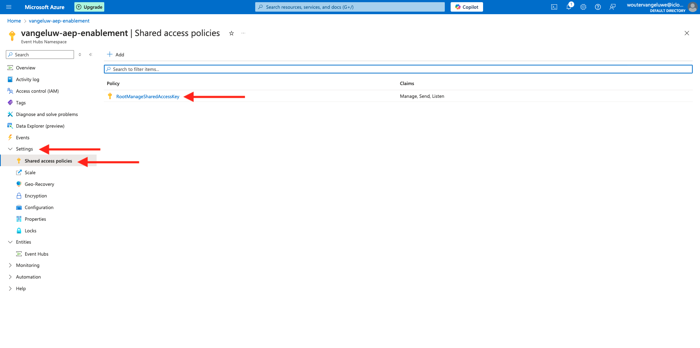
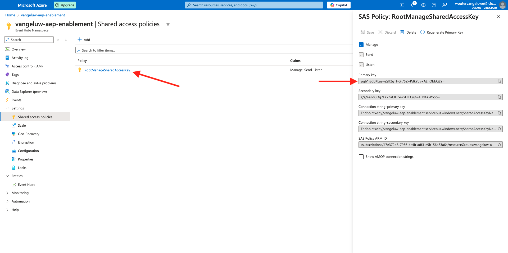

# 2.4.3 Configureer uw Azure Event Hub Destination in Adobe Experience Platform

## Vereiste Azure Connection-parameters identificeren

Om een bestemming van de Hub van de Gebeurtenis in Adobe Experience Platform te vormen hebt u uw nodig:

- Naamruimte van gebeurtenishubs
- Gebeurtenissenhub
- Azure SAS Key Name
- Azure SAS Key

De Hub van de gebeurtenis en EventHub namespace zijn bepaald in de vorige oefening: [ de Hub van de Gebeurtenis van de Opstelling in Azure ](./ex2.md)

### Naamruimte van gebeurtenishubs

Om de bovengenoemde informatie in Azure Portal te zoeken, navigeer aan [ https://portal.azure.com/#home ](https://portal.azure.com/#home). Zorg ervoor dat u het correcte Azure-account gebruikt.

Klik **Alle Middelen** in uw Azure portaal:

Vind uw **Namespace van de Hubs van de Gebeurtenis** in de lijst en klik het.

De naam van uw **Namespace van de Hubs van de Gebeurtenis** is nu duidelijk zichtbaar. Deze zou vergelijkbaar moeten zijn met `--aepUserLdap---aep-enablement` .

### Gebeurtenissenhub

Op uw **pagina van de Hubs Namespace van de Gebeurtenis 0&rbrace;**, klik **Entiteiten > de Hubs van de Gebeurtenis** om een lijst van Gebeurtenishubs te krijgen die in uw Namespace van de Hubs van de Gebeurtenis wordt bepaald, als u de noemende overeenkomsten volgde die in de vorige oefening worden gebruikt zult u een Hub van de Gebeurtenis genoemd `--aepUserLdap---aep-enablement-event-hub` vinden. Neem er nota van, u zult het in de volgende oefening nodig hebben.

### SAS-sleutelnaam

Voor uw **pagina van Namespace van de Hubs van de Gebeurtenis 0&rbrace; &lbrace;, klik** Montages > Gedeeld toegangsbeleid **.** U zult een lijst van Gedeeld toegangsbeleid zien. De SAS Sleutel die wij zoeken is **RootManageSharedAccessKey**, die de **SAS Zeer belangrijke Naam is. Schrijf het op.

### SAS-sleutelwaarde

Daarna, klik op **RootManageSharedAccessKey** om de Belangrijkste Waarde van SAS te krijgen. En druk het **Exemplaar aan klembord** pictogram om de **Primaire sleutel**, in dit geval `pqb1jEC0KLazwZzIf2gTHGr75Z+PdkYgv+AEhObbQEY=` te kopiëren.

### Overzicht van doelwaarden

Op dit punt zou u alle waarden moeten geïdentificeerd hebben nodig om de Azure bestemming van de Hub van de Gebeurtenis in Adobe Experience Platform in real time CDP te bepalen.

| Naam doelkenmerk | Waarde doelkenmerk | Voorbeeldwaarde |
|---|---|---|
| sasKeyName | SAS-sleutelnaam | RootManageSharedAccessKey |
| sasKey | SAS-sleutelwaarde | pqb1jEC0KLazwZzIf2gTHGr75Z+PdkYgv+AEhObbQEY= |
| namespace | Naamruimte van gebeurtenishubs | `--aepUserLdap---aep-enablement` |
| eventHubName | Gebeurtenissenhub | `--aepUserLdap---aep-enablement-event-hub` |

## Azure Event Hub Destination in Adobe Experience Platform maken

Login aan Adobe Experience Platform door naar dit URL te gaan: [ https://experience.adobe.com/platform ](https://experience.adobe.com/platform).

Na het aanmelden landt je op de homepage van Adobe Experience Platform.

Alvorens u verdergaat, moet u a **zandbak** selecteren. De te selecteren sandbox krijgt de naam ``--aepSandboxName--`` . Na het selecteren van de aangewezen zandbak, zult u de het schermverandering zien en nu bent u in uw specifieke zandbak.

Ga naar **Doelen**, dan gaan naar **Catalogus**. Selecteer **Opslag van de Wolk**, ga naar **Azure de Hubs van de Gebeurtenis** en klik **Opstelling**.

Selecteer **Standaardauthentificatie**. Vul de verbindingsgegevens in die u tijdens de vorige oefening hebt verzameld. Daarna, klik **verbinden met Doel**.

Als uw geloofsbrieven correct waren, zult u een bevestiging zien: **Verbonden**.

U moet nu de naam en beschrijving invoeren in de notatie `--aepUserLdap---aep-enablement` . Ga **eventHubName** in (zie vorige oefening, kijkt het als dit: `--aepUserLdap---aep-enablement-event-hub`) en klik **daarna**.

U kunt desgewenst een beleid voor gegevensbeheer selecteren. Klik **sparen en weg**.

Je bestemming is nu gemaakt en beschikbaar in Adobe Experience Platform.

Volgende Stap: [ 2.4.4 leidt tot een publiek ](./ex4.md)

[Terug naar module 2.4](./segment-activation-microsoft-azure-eventhub.md)

[Terug naar alle modules](./../../../overview.md)
