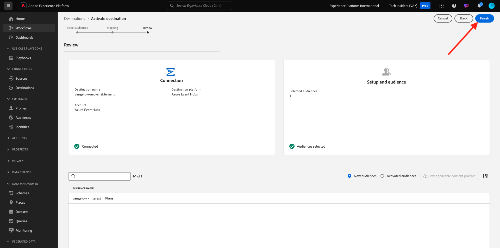

# 2.4.5 Activeer uw publiek

## publiek toevoegen aan Azure Event Hub Destination

In deze exercitie voegt u uw publiek `--aepUserLdap-- - Interest in Plans` toe aan uw `--aepUserLdap---aep-enablement` Azure Event Hub-bestemming.

Login aan Adobe Experience Platform door naar dit URL te gaan: [ https://experience.adobe.com/platform ](https://experience.adobe.com/platform).

Na het aanmelden landt je op de homepage van Adobe Experience Platform.

Alvorens u verdergaat, moet u a **zandbak** selecteren. De te selecteren sandbox krijgt de naam ``--aepSandboxName--`` . Na het selecteren van de aangewezen zandbak, zult u de het schermverandering zien en nu bent u in uw specifieke zandbak.

Ga naar **Doelen**, dan klik **doorbladeren**. U zult dan alle beschikbare bestemmingen zien. Bepaal de plaats van uw bestemming en klik de 3 punten**..** zoals hieronder vermeld, dan klik **actief publiek**.

Dan zie je dit. Zoek naar uw publiek met uw LDAP en selecteer `--aepUserLdap-- - Interest in Plans` in de lijst met soorten publiek.

Klik **daarna**.

Klik **toevoegen nieuw gebied**, doorblader schema en selecteer het gebied `--aepTenantId--identification.core.ecid` (schrap om het even welk ander gebied dat automatisch zou worden getoond).

Klik **daarna**.

Klik **Afwerking**.

Uw publiek wordt nu geactiveerd naar uw bestemming van de Hub van de Gebeurtenis van Microsoft.

Volgende Stap: [ 2.4.6 creeer uw Microsoft Azure Project ](./ex6.md)

[Terug naar module 2.4](./segment-activation-microsoft-azure-eventhub.md)

[Terug naar alle modules](./../../../overview.md)
