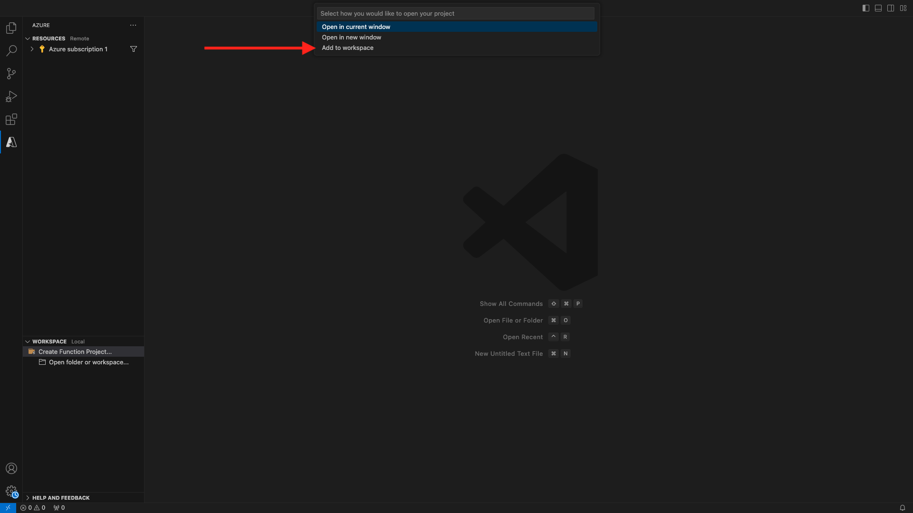
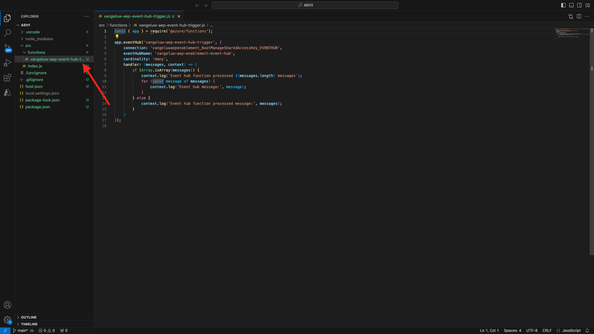

# 2.4.6 Maak uw Microsoft Azure-project

## Het worden vertrouwd met de functies van de Hub van de Gebeurtenis

Azure Functies staan u toe om kleine stukken van code (genoemd **functies**) in werking te stellen zonder zich over toepassingsinfrastructuur ongerust te maken. Met Azure-functies biedt de cloudinfrastructuur alle up-to-date servers die u nodig hebt om uw toepassing op schaal te houden.

Een functie wordt **teweeggebracht** door een specifiek type van gebeurtenis. De gesteunde trekkers omvatten het antwoorden aan veranderingen in gegevens, die aan berichten (bijvoorbeeld de Hubs van de Gebeurtenis) antwoorden, die op een programma, of als resultaat van een HTTP- verzoek lopen.

Azure Functions is een serverloze compute service waarmee u gebeurtenisgestuurde code kunt uitvoeren zonder dat u expliciet infrastructuur hoeft aan te bieden of te beheren.

Azure Event Hubs integreert met Azure Functions voor een serverloze architectuur.

## Open de Code van Visual Studio en Logon aan Azure

De Code van Visual Studio maakt het gemakkelijk aan...

- Azure-functies definiëren en binden aan Event Hubs
- lokaal testen
- implementeren in Azure
- externe logboekfunctie uitvoeren

### Visual Studio-code openen

### Aanmelden bij Azure

Wanneer u met uw Azure rekening aanmelden die u gebruikte om in de vorige oefening te registreren, zal de Code van Visual Studio u alle middelen van de Hub van de Gebeurtenis vinden en binden.

Open de Code van Visual Studio en klik het **Azure** pictogram.

Volgende uitgezochte **Teken binnen aan Azure**:


U wordt omgeleid naar uw browser om u aan te melden. Vergeet niet de Azure-account te selecteren die u hebt gebruikt om u te registreren.

Wanneer u het volgende scherm in uw browser ziet, wordt u het programma geopend met Visual Code Studio:


Terugkeer aan Visual Code Studio (u zult de naam van uw Azure abonnement zien, bijvoorbeeld **Azure abonnement 1**):


## Een Azure-project maken

Klik **creëren het Project van de Functie...**:


Selecteer een lokale omslag van uw keus om het project te bewaren en **Uitgezocht** te klikken:


U gaat nu de wizard voor het maken van projecten openen. Klik **Javascript** als taal voor uw project:


Dan selecteer **Model v4**.


Selecteer {de trekker van de Hub van de Gebeurtenis 0} Azure **als eerste de functiesjabloon van uw project:**


Voer een naam voor de functie in, gebruik de volgende notatie `--aepUserLdap---aep-event-hub-trigger` en druk op Enter:


Selecteer **creeer nieuwe lokale app het plaatsen**:


Klik om de naamruimte van de Hub van de Gebeurtenis te selecteren die u vroeger creeerde, die `--aepUserLdap---aep-enablement` wordt genoemd.


Klik vervolgens om de gebeurtenishub te selecteren die u eerder hebt gemaakt en die de naam `--aepUserLdap---aep-enablement-event-hub` heeft.


Klik om **RootManageSharedAccessKey** als uw beleid van de Hub van de Gebeurtenis te selecteren:


Selecteer **toevoegen aan werkruimte** op hoe te om uw project te openen:



Dan krijg je een bericht als deze. In dat geval, klik ja **, vertrouw ik de auteurs**.


Nadat u project wordt gecreeerd, klik op **index.js** om het dossier te hebben open in de redacteur:



De nuttige lading die door Adobe Experience Platform naar uw Hub van de Gebeurtenis wordt verzonden zal publiek identiteitskaart&#39;s omvatten:

```json
[{
"segmentMembership": {
"ups": {
"ca114007-4122-4ef6-a730-4d98e56dce45": {
"lastQualificationTime": "2020-08-31T10:59:43Z",
"status": "realized"
},
"be2df7e3-a6e3-4eb4-ab12-943a4be90837": {
"lastQualificationTime": "2020-08-31T10:59:56Z",
"status": "realized"
},
"39f0feef-a8f2-48c6-8ebe-3293bc49aaef": {
"lastQualificationTime": "2020-08-31T10:59:56Z",
"status": "realized"
}
}
},
"identityMap": {
"ecid": [{
"id": "08130494355355215032117568021714632048"
}]
}
}]
```

Vervang de code in index.js van uw Code van Visual Studio met de hieronder code. Deze code zal worden uitgevoerd telkens als CDP in real time publiekskwalificaties naar uw bestemming van de Hub van de Gebeurtenis verzendt. In ons voorbeeld gaat de code alleen over het weergeven en verbeteren van de ontvangen lading. Maar je kunt je een of andere functie voorstellen om publiekskwalificaties in real-time te verwerken.

```javascript
// Marc Meewis - Solution Consultant Adobe - 2020
// Adobe Experience Platform Enablement - Module 2.4

// Main function
// -------------
// This azure function is fired for each audience activated to the Adobe Exeperience Platform Real-time CDP Azure 
// Eventhub destination
// This function enriched the received audience payload with the name of the audience. 
// You can replace this function with any logic that is require to process and deliver
// Adobe Experience Platform audiences in real-time to any application or platform that 
// would need to act upon an AEP audience qualification.
// 

module.exports = async function (context, eventHubMessages) {

    return new Promise (function (resolve, reject) {

        context.log('Message : ' + JSON.stringify(eventHubMessages, null, 2));

        resolve();

    });    

};
```

Het resultaat moet er als volgt uitzien:


## Azure Project uitvoeren

Nu is het tijd om uw project uit te voeren. In dit stadium zullen wij niet het project aan Azure opstellen. Wij zullen het plaatselijk in zuivert wijze in werking stellen. Selecteer het pictogram Uitvoeren en klik op de groene pijl.


De eerste keer u in werking stelt u zuivert wijze, zult u een Azure opslagrekening moeten vastmaken, **Uitgezochte opslagrekening** klikken en dan de opslagrekening selecteren die u vroeger creeerde, die `--aepUserLdap--aepstorage` wordt genoemd.

Uw project is nu in gebruik en maakt een lijst van voor gebeurtenissen in de Hub van de Gebeurtenis. In de volgende oefening zult u gedrag op de CitiSignal demo website aantonen die u voor publiek zal kwalificeren. Dientengevolge zult u een nuttige lading van de publiekskwalificatie in de terminal van uw de trekkerfunctie van de Hub van de Gebeurtenis ontvangen.


## Azure-project stoppen

Om uw project tegen te houden, ga naar de KORTE **KNOPSTART** in VSC, klik op de pijl op uw lopend project en klik dan **Einde**.


Volgende Stap: [ 2.4.7 scenario van begin tot eind ](./ex7.md)

[Terug naar module 2.4](./segment-activation-microsoft-azure-eventhub.md)

[Terug naar alle modules](./../../../overview.md)
