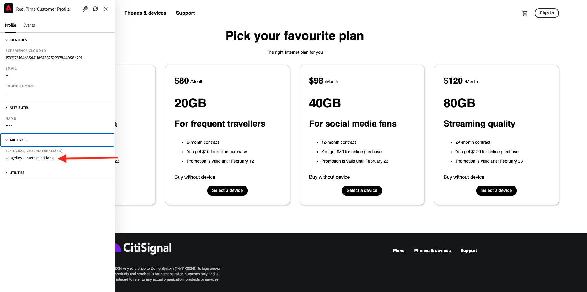

# 2.4.7 End-to-end scenario

## Start Azure Event Hub trigger

Om de nuttige lading te tonen die door Adobe Experience Platform in real time CDP naar onze Azure Hub van de Gebeurtenis op publiekskwalificatie wordt verzonden, moeten wij onze eenvoudige Azure de trekkerfunctie van de Hub van de Gebeurtenis beginnen. Deze functie zal eenvoudig &quot;stortplaats&quot;de nuttige lading aan de console in de Code van Visual Studio. Maar denk eraan dat deze functie op elke manier kan worden uitgebreid om met allerlei omgevingen te communiceren met behulp van specifieke API&#39;s en protocollen.

### De Code van Visual Studio van de lancering en beginproject

Zorg ervoor dat uw geopend en lopend project van de Code van Visual Studio hebt

Om uw Azure functie in de Code van Visual Studio te beginnen/te stoppen/opnieuw te beginnen, verwijs naar de vorige oefening.

Uw Eind van de Code van Visual Studio **&#x200B;**&#x200B;zou iets gelijkend op dit moeten vermelden:

```code
[2024-11-20T20:07:12.316Z] Debugger listening on ws://127.0.0.1:9229/86c8e251-8e2f-4c65-a063-cda77edbf2ca
[2024-11-20T20:07:12.318Z] For help, see: https://nodejs.org/en/docs/inspector
[2024-11-20T20:07:12.343Z] Worker process started and initialized.
[2024-11-20T20:07:12.359Z] Debugger attached.

Functions:

        vangeluw-aep-event-hub-trigger: eventHubTrigger

For detailed output, run func with --verbose flag.
[2024-11-20T20:07:18.150Z] Host lock lease acquired by instance ID '000000000000000000000000000C19D8'.
```

## Uw Citi Signal-website laden

Ga naar [&#x200B; https://dsn.adobe.com &#x200B;](https://dsn.adobe.com). Nadat je je hebt aangemeld bij je Adobe ID, kun je dit zien. Klik de 3 punten **..** op uw websiteproject en klik dan **Looppas** om het te openen.


Vervolgens wordt uw demowebsite geopend. Selecteer de URL en kopieer deze naar het klembord.


Open een nieuw Incognito-browservenster.


Plak de URL van uw demowebsite, die u in de vorige stap hebt gekopieerd. Vervolgens wordt u gevraagd u aan te melden met uw Adobe ID.


Selecteer uw accounttype en voltooi het aanmeldingsproces.


Uw website wordt vervolgens geladen in een Incognito-browservenster. Voor elke oefening, zult u een vers, incognito browser venster moeten gebruiken om uw demowebsite URL te laden.


## Kwalificeren voor uw publiek

Navigeer aan de **Punten** pagina. Deze actie komt in aanmerking voor het publiek van `--aepUserLdap-- - Interest in Plans` .


Open het deelvenster Profielviewer om dit te verifiëren. U moet nu lid zijn van de `--aepUserLdap-- - Interest in Plans` . Als uw publiekslidmaatschappen nog niet in uw paneel van de Kijker van het Profiel worden bijgewerkt, klik de herladingsknoop.



De schakelaar terug naar de Code van Visual Studio en bekijkt uw **TERMINAL** lusje, zou u een lijst van publiek voor uw specifiek **ECID** moeten zien. Deze activeringslading wordt geleverd aan uw gebeurtenishub zodra u voor het `--aepUserLdap-- - Interest in Plans` publiek kwalificeert.


Wanneer u een dichtere blik bij de publiekslading neemt, kunt u zien dat `--aepUserLdap-- - Interest in Plans` in status **gerealiseerde** is.

```json
{
  "identityMap": {
    "ecid": [
      {
        "id": "36281682065771928820739672071812090802"
      }
    ]
  },
  "segmentMembership": {
    "ups": {
      "94db5aed-b90e-478d-9637-9b0fad5bba11": {
        "createdAt": 1732129904025,
        "lastQualificationTime": "2024-11-21T07:33:52Z",
        "mappingCreatedAt": 1732130611000,
        "mappingUpdatedAt": 1732130611000,
        "name": "vangeluw - Interest in Plans",
        "status": "realized",
        "updatedAt": 1732129904025
      }
    }
  }
}
```

Een publieksstatus van **realiseerde** betekent dat uw profiel deel van het publiek uitmaakt, terwijl de **verlaten** status betekent dat ons profiel uit het publiek is verwijderd.

Volgende Stap: [&#x200B; Samenvatting en voordelen &#x200B;](./summary.md)

[Terug naar module 2.4](./segment-activation-microsoft-azure-eventhub.md)

[Terug naar alle modules](./../../../overview.md)
