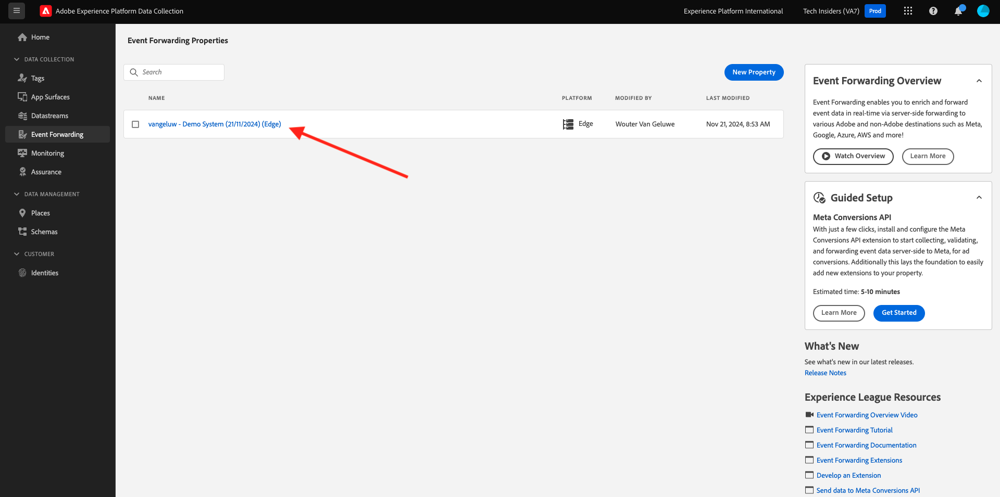

# 2.5.1 Een Adobe Experience Platform-eigenschap voor het doorsturen van gegevensverzamelingsgebeurtenissen maken

>[!NOTE]
>
>De mobiele extensie van Adobe Experience Platform Edge is momenteel in BETA. Gebruik van deze extensie is alleen op uitnodiging. Neem contact op met de Customer Success Manager van de Adobe voor meer informatie en ontvang toegang tot de materialen voor deze zelfstudie.

## 2.5.1.1 Wat is een Adobe Experience Platform Data Collection Event Forwarding-eigenschap?

Typisch, wanneer het gegeven gebruikend de Inzameling van Gegevens van Adobe Experience Platform wordt verzameld, wordt het verzameld op de **Kant van de Cliënt**. De **Kant van de Cliënt** is een milieu zoals een website of een mobiele toepassing. In Module 0 en Module 1, werd de configuratie van een bezit van de Cliënt van de Gegevensverzameling van Adobe Experience Platform diepgaand besproken en u uitvoerde dat het bezit van de Cliënt van de Gegevensverzameling van Adobe Experience Platform op uw website en mobiele toepassing, zodat de gegevens daar konden worden verzameld wanneer een klant met de website en de mobiele toepassing communiceerde.

Wanneer die interactiegegevens worden verzameld door de Adobe Experience Platform Data Collection Client-eigenschap, wordt een aanvraag verzonden door de website of mobiele app naar de Edge van de Adobe. De Edge is het milieu van de Inzameling van Gegevens van de Adobe en is het ingang-punt voor klikstroomgegevens in het ecosysteem van de Adobe. Vanuit de Edge worden die verzamelde gegevens vervolgens verzonden naar toepassingen zoals Adobe Experience Platform, Adobe Analytics, Adobe Audience Manager of Adobe Target.

Met de toevoeging van een Adobe Experience Platform Data Collection Event Forwarding-eigenschap, is het nu mogelijk om een Adobe Experience Platform Data Collection-eigenschap te configureren die luistert naar binnenkomende gegevens op de Edge. Als de Adobe Experience Platform Data Collection Event Forwarding-eigenschap die wordt uitgevoerd op de Edge binnenkomende gegevens ziet, kan deze de gegevens gebruiken en naar een andere locatie doorsturen. Dat elders nu ook een externe webhaak zonder Adobe kan zijn, die het mogelijk maakt om die gegevens naar bijvoorbeeld uw gegevens te verzenden, een meer van keuze, een beslissingstoepassing of een andere toepassing die de mogelijkheid heeft om een webhaak te openen.

De configuratie van een gebeurtenis die van de Gebeurtenis van de Inzameling van Adobe Experience Platform door:sturen kijkt vertrouwd aan een bezit van de Cliënt, met de capaciteit om gegevenselementen en regels te vormen enkel als in het verleden met de eigenschappen van de Cliënt van de Inzameling van Gegevens van Adobe Experience Platform. De manier waarop gegevens worden benaderd en gebruikt, is echter iets anders, afhankelijk van uw gebruiksscenario.

Laten we beginnen met het maken van de Adobe Experience Platform Data Collection Event Forwarding-eigenschap.

## 2.5.1.2 Een Adobe Experience Platform Data Collection Event Forwarding-eigenschap maken

Ga naar [ https://experience.adobe.com/#/data-collection/ ](https://experience.adobe.com/#/data-collection/). In het linkermenu, klik **Gebeurtenis door:sturen**. Vervolgens ziet u een overzicht van alle beschikbare eigenschappen voor het doorsturen van Adobe Experience Platform-gegevensverzamelingsgebeurtenissen. Klik de **Nieuwe knoop van het Bezit**.

U moet nu een naam voor uw Adobe Experience Platform-eigenschap voor het doorsturen van gegevensverzamelingsgebeurtenissen invoeren. Gebruik `--demoProfileLdap-- - Demo System (DD/MM/YYYY) (Edge)` als naamgevingsconventie. Bijvoorbeeld, in dit voorbeeld, is de naam **vangeluw - het Systeem van de Demo (22/02/2022) (Edge)**. Klik **sparen**.

U zult dan terug in de lijst van de Gebeurtenis door:sturen van de Gebeurtenis van de Gegevensverzameling van Adobe Experience Platform zijn. Klik om de eigenschap te openen die u net hebt gemaakt.

## 2.5.1.2 De extensie Adobe Cloud Connector configureren

In het linkermenu, ga naar **Uitbreidingen**. U zult zien dat de **uitbreiding van de Kern** reeds wordt gevormd.

Ga naar **Catalogus**. U zult de **uitbreiding zien van de Verbinding van de Wolk van de Adobe 0}.** Klik **installeren** om het te installeren.

De extensie wordt vervolgens toegevoegd. Er is geen configuratie voor deze stap. U wordt teruggestuurd naar het overzicht van geïnstalleerde extensies.

## 2.5.1.3 Implementeer de eigenschap Adobe Experience Platform Data Collection Forwarding

In het linkermenu, ga naar **het Publiceren Stroom**. Klik **toevoegen Bibliotheek**.

Ga de naam **Belangrijkste** in, selecteer de milieu **Ontwikkeling (ontwikkeling)** en klik **+ voeg Alle Gewijzigde Middelen** toe.

Dan zie je dit. Klik **sparen &amp; bouwt voor Ontwikkeling**.

Uw bibliotheek wordt dan gemaakt, wat 1 tot 2 minuten kan duren.

Tot slot wordt uw bibliotheek gemaakt en klaar.

Volgende Stap: [ 2.5.2 Werk uw DataStream bij om gegevens beschikbaar te maken aan uw Gebeurtenis van de Inzameling van Gegevens die bezit door:sturen ](./ex2.md)

[Ga terug naar Module 2.5](./aep-data-collection-ssf.md)

[Terug naar alle modules](./../../../overview.md)
