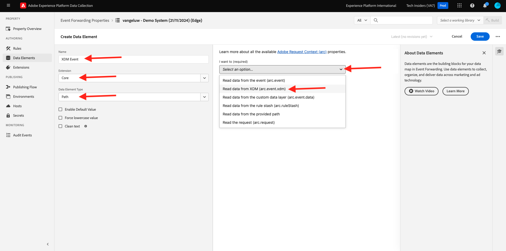
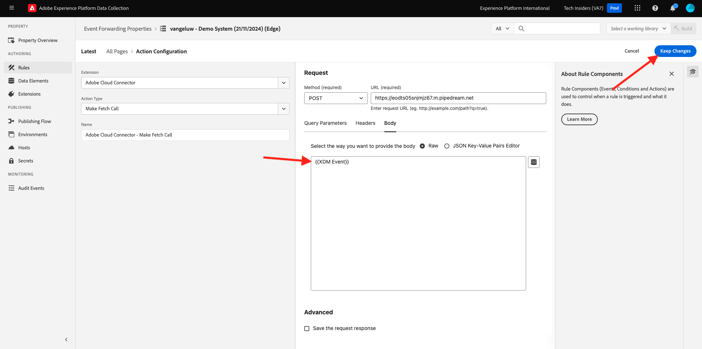

# 2.5.3 Een aangepaste webhaak maken en configureren

## 2.5.3.1 Uw aangepaste webhaak maken

Ga naar [ https://webhook.site/ ](https://webhook.site/). Je ziet iets als dit:

U ziet hier uw unieke URL, die er als volgt uitziet: `https://webhook.site/585126a1-41fc-4721-864b-d4aa8c268a1d` .

Deze website heeft deze website nu voor u gemaakt en u kunt deze webhaak in uw **[!DNL Event Forwarding property]** configureren om het doorsturen van gebeurtenissen te testen.

## 2.5.3.2 Werk uw Event Forwarding-eigenschap bij: Maak een Data Element

Ga naar [ https://experience.adobe.com/#/data-collection/ ](https://experience.adobe.com/#/data-collection/) en ga naar **Gebeurtenis door:sturen**. Zoek in de eigenschap Event Forwarding en klik erop om deze te openen.

In het linkermenu, ga naar **Elementen van Gegevens**. Klik **creëren Nieuw Element van Gegevens**.

U zult dan een nieuw gegevenselement zien om te vormen.

Maak de volgende selectie:

- Als **Naam**, ga **Gebeurtenis XDM** in.
- Als **Uitbreiding**, uitgezochte **Kern**.
- Als het **Type van Element van Gegevens**, uitgezochte **Weg**.
- Als **Weg**, ga **arc.event.xdm** in. Door deze weg in te gaan, zult u uit de **XDM** sectie van de gebeurtenislading filtreren die door de website of mobiele toepassing in Adobe Edge wordt verzonden.

Nu heb je dit. Klik **sparen**.

>[!NOTE]
>
>In de bovengenoemde weg, wordt een verwijzing gemaakt aan **boog**. **boog** staat voor de Context van het Middel van de Adobe en **boog** altijd voor het hoogste beschikbare voorwerp dat in de zijcontext van de Server beschikbaar is. De verbeteringen en de transformaties kunnen aan dat **boog** voorwerp worden toegevoegd gebruikend de functies van de Server van de Inzameling van Gegevens van Adobe Experience Platform.
>
>In de bovengenoemde weg, wordt een verwijzing gemaakt aan **gebeurtenis**. **gebeurtenis** staat voor een unieke gebeurtenis en de Server van de Inzameling van Gegevens van Adobe Experience Platform zal altijd elke gebeurtenis individueel evalueren. Soms, kunt u een verwijzing naar **gebeurtenissen** in de nuttige lading zien die door de Kant van de Cliënt van SDK van het Web wordt verzonden, maar in de Server van de Inzameling van Gegevens van Adobe Experience Platform, wordt elke gebeurtenis individueel geëvalueerd.

## 2.5.3.3 Werk uw Adobe Experience Platform-eigenschap van de Server van de Gegevensverzameling bij: Maak een regel

In het linkermenu, ga naar **Regels**. Klik **creëren Nieuwe Regel**.

U zult dan een nieuwe regel zien om te vormen. Ga de **Naam** in: **Alle Pagina&#39;s**. Voor deze oefening, zult u geen voorwaarde moeten vormen. In plaats daarvan stelt u een handeling in. Klik **+ toevoegen** knoop onder **Acties**.

Dan zie je dit. Maak de volgende selectie:

- Selecteer de **Uitbreiding**: **Verbinding van de Wolk van de Adobe**.
- Selecteer het **Type van Actie**: **maak Vraag van de Vetch**.

Dat zou u deze **Naam** moeten geven: **de Schakelaar van de Wolk van de Adobe - maak Vraag van de Ophalen**. U zou nu dit moeten zien:

Configureer daarna het volgende:

- Verandering de verzoekmethode van GET in **POST**
- Ga URL van de douane webhaak in u in één van de vorige stappen op de [ https://webhook.site/ ](https://webhook.site/) website creeerde, die als dit kijkt: `https://webhook.site/585126a1-41fc-4721-864b-d4aa8c268a1d`

Dat zou u nu moeten doen. Daarna, ga naar **Lichaam**.

Dan zie je dit. Klik op het pictogram voor het gegevenselement zoals hieronder aangegeven.

In popup, selecteer de gebeurtenis van het gegevenselement **XDM** die u in de vorige stap creeerde. Klik **Uitgezocht**.

Dan zie je dit. Klik **houden Veranderingen**.

Dan zie je dit. Klik **sparen**.

U hebt nu uw eerste regel in een Gebeurtenis gevormd die bezit door:sturen. Ga naar **het Publiceren Stroom** om uw veranderingen te publiceren.
Open uw bibliotheek van de Ontwikkeling **Belangrijkste** door **te klikken geef** zoals vermeld uit.

Klik **toevoegen Alle Gewijzigde Middelen** knoop, waarna zult u uw Regel en Element van Gegevens in deze bibliotheek zien verschijnen. Daarna, klik **sparen &amp; bouwt voor Ontwikkeling**. Uw wijzigingen worden nu geïmplementeerd.

Na een paar minuten zult u zien dat de implementatie klaar is en klaar om te worden getest.

## 2.5.3.4 Test uw configuratie

Ga naar [ https://builder.adobedemo.com/projects ](https://builder.adobedemo.com/projects). Nadat je je hebt aangemeld bij je Adobe ID, kun je dit zien. Klik op uw websiteproject om het te openen.

U kunt nu de onderstaande workflow volgen om toegang te krijgen tot de website. Klik **Integraties**.

Op de **pagina van de Integraties**, moet u het bezit van de Inzameling van Gegevens selecteren dat in oefening 0.1 werd gecreeerd.

Vervolgens wordt uw demowebsite geopend. Selecteer de URL en kopieer deze naar het klembord.

Open een nieuw Incognito-browservenster.

Plak de URL van uw demowebsite, die u in de vorige stap hebt gekopieerd. Vervolgens wordt u gevraagd u aan te melden met uw Adobe ID.

Selecteer uw accounttype en voltooi het aanmeldingsproces.

Uw website wordt vervolgens geladen in een Incognito-browservenster. Voor elke demonstratie, zult u een vers, incognito browser venster moeten gebruiken om uw demowebsite URL te laden.

Wanneer u uw browser de Mening van de Ontwikkelaar opent, kunt u de verzoeken van het Netwerk zoals hieronder vermeld inspecteren. Wanneer u de filter **gebruikt in wisselwerking treedt**, zult u de netwerkverzoeken zien die door de Cliënt van de Inzameling van Gegevens van Adobe Experience Platform aan Adobe Edge worden verzonden.

Als u onbewerkte lading selecteert, ga [ https://jsonformatter.org/json-pretty-print ](https://jsonformatter.org/json-pretty-print) en kleef de nuttige lading. Klik **maken Behoorlijk**. U zult dan de nuttige lading JSON, het **gebeurtenissen** voorwerp en het **xdm** voorwerp zien. In één van de vorige stappen, toen u het Element van Gegevens bepaalde, gebruikte u de verwijzing **arc.event.xdm**, die in u het **xdm** voorwerp van deze nuttige lading zal resulteren ontleden.

Schakelaar uw mening aan de website [ https://webhook.site/ ](https://webhook.site/) die u in één van de vorige stappen gebruikte. U zou nu een mening gelijkend op dit moeten hebben, met netwerkverzoeken die in het linkermenu worden getoond. U ziet de **xdm** nuttige lading die uit het netwerkverzoek filterde dat hierboven werd getoond.

De rol neer een beetje in de nuttige lading om de paginanaam te vinden, die in dit geval **vangeluw-OCUC** is (die de projectnaam van uw demowebsite is).

Als u nu door de website navigeert, zult u extra netwerkverzoeken zien die op deze douanewebsite in real time beschikbaar worden.

U hebt nu de Server Door:sturen van de nuttige ladingen van SDK/XDM van het Web aan een externe douanetoewijzing gevormd. In de volgende oefeningen, zult u een gelijkaardige benadering vormen, en u zult die zelfde gegevens naar de milieu&#39;s van Google en van AWS verzenden.

Volgende Stap: [ 2.5.4 creeer en vorm een Functie van de Wolk van Google ](./ex4.md)

[Ga terug naar Module 2.5](./aep-data-collection-ssf.md)

[Terug naar alle modules](./../../../overview.md)
