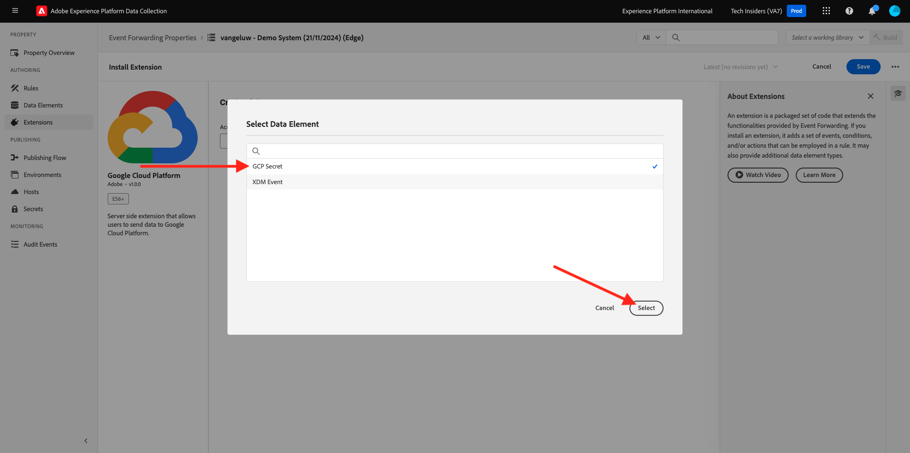

# 2.5.4 Voorwaartse gebeurtenissen naar GCP Pub/Sub

>[!NOTE]
>
>Hiervoor hebt u toegang nodig tot een Google Cloud Platform-omgeving. Als u nog geen toegang hebt tot GCP, maakt u een nieuw account met uw persoonlijke e-mailadres.

## Een Google Cloud Pub/Subonderwerp maken

Ga naar [ https://console.cloud.google.com/ ](https://console.cloud.google.com/). Typ `pub/sub` in de zoekbalk. Klik het onderzoeksresultaat **Pub/Sub - Globaal overseinen in real time**.

Dan zie je dit. Klik **CREËREN ONDERWERP**.

Dan zie je dit. Gebruik `--aepUserLdap---event-forwarding` voor uw onderwerpid. Klik **creëren**.

Uw onderwerp is nu gemaakt. Klik identiteitskaart van het Abonnement van het onderwerp ****.

Dan zie je dit. Kopieer de **naam van het Onderwerp** aan uw klembord en sla het op, aangezien u het in de volgende oefeningen zult nodig hebben.

Laten we nu naar Adobe Experience Platform Data Collection Event Forwarding gaan om uw Event Forwarding-eigenschap bij te werken om gebeurtenissen naar Pub/Sub door:sturen.

## Werk uw Event Forwarding-eigenschap bij: geheimen

**Geheimen** in Gebeurtenis Door:sturen eigenschappen worden gebruikt om geloofsbrieven op te slaan die zullen worden gebruikt om tegen externe API&#39;s voor authentiek te verklaren. In dit voorbeeld moet u een geheim configureren voor het opslaan van het OAuth-token van het Google Cloud-platform. Dit wordt gebruikt voor verificatie bij het gebruik van Pub/Sub voor het streamen van gegevens naar GCP.

Ga naar [ https://experience.adobe.com/#/data-collection/ ](https://experience.adobe.com/#/data-collection/) en ga naar **Geheimen**. Klik **creëren Nieuw Geheim**.

Dan zie je dit. Volg deze instructies:

- Naam: gebruik `--aepUserLdap---gcp-secret`
- Het Milieu van het doel: uitgezochte **Ontwikkeling**
- Type: **Google OAuth 2**
- Controle checkbox voor **Pub/Sub**

Klik **creeer Geheim**.

Na het klikken **creeer Geheim**, zult u popup aan opstelling zien de authentificatie tussen het geheim van uw Gebeurtenis door:sturen bezit en Google. Klik **creeer en geef geheim `--aepUserLdap---gcp-secret` met Google** toe.

Klik om je Google-account te selecteren.

Klik **verdergaan**.

>[!NOTE]
>
>Het pop-upbericht kan afwijken. Toestaan of geef de gevraagde toegang om door te gaan met de oefening.

Na succesvolle authentificatie, zult u dit zien.

Uw geheim wordt nu met succes gevormd en kan in een gegevenselement worden gebruikt.

## Werk uw Event Forwarding-eigenschap bij: Data Element

Om uw geheim in uw Gebeurtenis te gebruiken die bezit door:sturen, moet u een gegevenselement tot stand brengen dat de waarde van het geheim zal opslaan.

Ga naar [ https://experience.adobe.com/#/data-collection/ ](https://experience.adobe.com/#/data-collection/) en ga naar **Gebeurtenis door:sturen**. Zoek in de eigenschap Event Forwarding en klik erop om deze te openen.

In het linkermenu, ga naar **Elementen van Gegevens**. Klik **toevoegen het Element van Gegevens**.

Configureer uw gegevenselement als volgt:

- Naam: **Geheime GCP**
- Uitbreiding: **Kern**
- Het Type van Element van gegevens: **Geheim**
- Ontwikkelingsgeheim: selecteer het geheim dat u hebt gemaakt en dat de naam `--aepUserLdap---gcp-secret` heeft

Klik **sparen**

## Update your Event Forwarding property: Extension

Als uw Geheim en Gegevenselement zijn geconfigureerd, kunt u nu de extensie voor Google Cloud Platform instellen in uw eigenschap voor het doorsturen van gebeurtenissen.

Ga naar [ https://experience.adobe.com/#/data-collection/ ](https://experience.adobe.com/#/data-collection/), ga **Gebeurtenis door:sturen** en open uw Gebeurtenis door:sturen bezit.

Daarna, ga naar **Uitbreidingen**, aan **Catalogus**. Klik de **uitbreiding van het Platform van de Wolk van Google** en klik **installeren**.

Dan zie je dit. Klik op het pictogram Gegevenselement.

Selecteer het gegevenselement u in de vorige oefening creeerde, die **Geheime GCP** wordt genoemd. Klik **Uitgezocht**.

Dan zie je dit. Klik **sparen**.

## Werk uw Gebeurtenis door:sturen bezit bij: Werk een Regel bij

Nu uw uitbreiding van het Platform van Google Cloud wordt gevormd, kunt u een regel bepalen beginnen gebeurtenisgegevens aan uw Pub/Subtopic door:sturen. Om dat te doen, zult u uw **Alle Pagina&#39;s** regel moeten bijwerken die u in één van de vorige oefeningen creeerde.

In het linkermenu, ga naar **Regels**. In de vorige oefening, creeerde u de regel **Alle Pagina&#39;s**. Klik op die regel om deze te openen.

Dan ga je dit doen. Klik **+** pictogram onder **Acties** om een nieuwe actie toe te voegen.

Dan zie je dit. Maak de volgende selectie:

- Selecteer de **Uitbreiding**: **Google Cloud Platform**.
- Selecteer het **Type van Actie**: **verzend Gegevens naar Wolk Pub/Sub**.

Dat zou u deze **Naam** moeten geven: **de Cloudplatform van Google - verzend Gegevens naar de Wolk Pub/Sub**. U zou nu dit moeten zien:

U moet nu het Pub/Subonderwerp vormen dat u vroeger creeerde.

U kunt de **naam van het Onderwerp** hier vinden, het kopiëren.

Plak de **naam van het Onderwerp** in uw configuratie van de Regel. Daarna, klik het pictogram van het Element van Gegevens naast het **(vereiste) Gegevens** gebied.

Selecteer **Gebeurtenis XDM** en klik **Uitgezocht**.

Dan zie je dit. Klik **houden Veranderingen**.

Klik **sparen**.

Dan zie je dit.

## Je wijzigingen Publish

Uw configuratie is nu voltooid. Ga naar **het Publiceren Stroom** om uw veranderingen te publiceren. Open uw bibliotheek van de Ontwikkeling **Belangrijkste** door **te klikken geef** zoals vermeld uit.

Klik **toevoegen Alle Gewijzigde Middelen** knoop, waarna zult u uw Regel en Element van Gegevens in deze bibliotheek zien verschijnen. Daarna, klik **sparen &amp; bouwt voor Ontwikkeling**. Uw wijzigingen worden nu geïmplementeerd.

Na een paar minuten zult u zien dat de implementatie klaar is en klaar om te worden getest.

## Uw configuratie testen

Ga naar [ https://dsn.adobe.com ](https://dsn.adobe.com). Nadat je je hebt aangemeld bij je Adobe ID, kun je dit zien. Klik de 3 punten **..** op uw websiteproject en klik dan **Looppas** om het te openen.

Vervolgens wordt uw demowebsite geopend. Selecteer de URL en kopieer deze naar het klembord.

Open een nieuw Incognito-browservenster.

Plak de URL van uw demowebsite, die u in de vorige stap hebt gekopieerd. Vervolgens wordt u gevraagd u aan te melden met uw Adobe ID.

Selecteer uw accounttype en voltooi het aanmeldingsproces.

Uw website wordt vervolgens geladen in een Incognito-browservenster. Voor elke oefening, zult u een vers, incognito browser venster moeten gebruiken om uw demowebsite URL te laden.

Schakelaar uw mening aan uw Google Cloud Pub/Sub en ga naar **BERICHTEN**. Klik **PULL** en na een paar seconden zult u sommige berichten in de lijst zien. Klik op een bericht om de inhoud te visualiseren.

U kunt de XDM-lading van uw gebeurtenis nu zien in Google Pub/Sub. U hebt nu met succes gegevens verzonden die door de Inzameling van Gegevens van Adobe Experience Platform, in real time, aan een PoB/Subeindpunt van de Wolk van Google werden verzameld. Vanaf dat punt kunnen die gegevens worden gebruikt door elke Google Cloud Platform-toepassing, zoals BigQuery voor opslag en rapportage of voor de gebruiksgevallen van Machine Learning.

Volgende Stap: [ 2.5.5 door:sturen gebeurtenissen aan AWS Kinesis &amp; AWS S3 ](./ex5.md)

[Ga terug naar Module 2.5](./aep-data-collection-ssf.md)

[Terug naar alle modules](./../../../overview.md)

