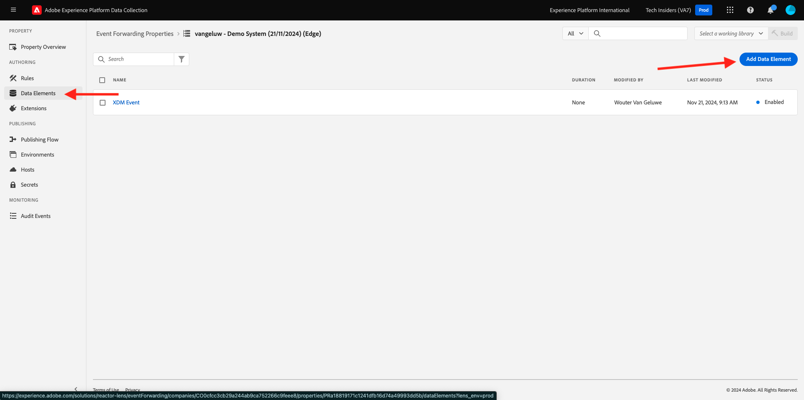

# 2.5.4 Een Google Cloud-functie maken en configureren

## 2.5.4.1 Uw Google Cloud-functie maken

Ga naar [ https://console.cloud.google.com/ ](https://console.cloud.google.com/). Ga naar **Functies van de Wolk**.


Dan zie je dit. Klik **CREËREN FUNCTIE**.


Dan zie je dit.


Maak de volgende keuzen:

- **Naam van de Functie**: `--aepUserLdap---event-forwarding`
- **Gebied**: selecteer om het even welk gebied
- **Type van Trekker**: uitgezochte **HTTP**
- **Authentificatie**: uitgezochte **staat unauthenticated aanroepen** toe

Dat zou u nu moeten doen. Klik **OPSLAAN**.


Klik **VOLGENDE**.


U zult dan dit zien:


Maak de volgende keuzen:

- **Runtime**: uitgezochte **Node.js 16** (of recenter)
- **Punt van de Ingang**: ga **helloAEP** in

Klik **toelaten API** om **de Wolk toe te laten bouwt API**. Dan zie je een nieuw venster. In dat nieuwe venster, laat **** opnieuw toe.


Dan zie je dit. Klik **toelaten**.


Zodra **de Wolk bouwt API** is toegelaten, zult u dit zien.


Ga terug naar uw **Functie van de Wolk**.
Controleer of u in de Inline-editor voor cloudfuncties de volgende code hebt:

```javascript
/**
 * Responds to any HTTP request.
 *
 * @param {!express:Request} req HTTP request context.
 * @param {!express:Response} res HTTP response context.
 */
exports.helloAEP = (req, res) => {
  let message = req.query.message || req.body.message || 'Hello World!';
  res.status(200).send(message);
};
```

Daarna, klik **DEPLOY**.


Dan zie je dit. Uw cloudfunctie wordt nu gemaakt. Dit kan een paar minuten duren.


Als uw functie eenmaal is gemaakt en uitgevoerd, ziet u dit. Klik op de naam van uw functie om deze te openen.


Dan zie je dit. Ga naar **TRIGGER**. U zult dan **Trekker URL** zien die is wat u zult gebruiken om het eindpunt in de Zijde van de Server van de Lancering te bepalen.


Kopieer de Trekker URL, die als dit kijkt: **https://europe-west1-dazzling-pillar-273812.cloudfunctions.net/vangeluw-event-forwarding**.

In de volgende stappen, zult u de Server van de Inzameling van Gegevens van Adobe Experience Platform vormen om specifieke informatie over **de Meningen van de Pagina** aan uw Functie van de Wolk van Google te stromen. In plaats van enkel het door:sturen van de volledige nuttige lading zoals-is, zult u dingen als **ECID**, **timestamp** en **Naam van de Pagina** aan uw Functie van de Wolk van Google slechts verzenden.

Hier is een voorbeeld van een lading die u zult moeten ontleden om de bovengenoemde variabelen uit te filteren:

```json
{
  "events": [
    {
      "xdm": {
        "eventType": "web.webpagedetails.pageViews",
        "web": {
          "webPageDetails": {
            "URL": "https://builder.adobedemo.com/run/vangeluw-OCUC",
            "name": "vangeluw-OCUC",
            "viewName": "vangeluw-OCUC",
            "pageViews": {
              "value": 1
            }
          },
          "webReferrer": {
            "URL": "https://builder.adobedemo.com/run/vangeluw-OCUC/equipment"
          }
        },
        "device": {
          "screenHeight": 1080,
          "screenWidth": 1920,
          "screenOrientation": "landscape"
        },
        "environment": {
          "type": "browser",
          "browserDetails": {
            "viewportWidth": 1920,
            "viewportHeight": 451
          }
        },
        "placeContext": {
          "localTime": "2022-02-23T06:51:07.140+01:00",
          "localTimezoneOffset": -60
        },
        "timestamp": "2022-02-23T05:51:07.140Z",
        "implementationDetails": {
          "name": "https://ns.adobe.com/experience/alloy/reactor",
          "version": "2.8.0+2.9.0",
          "environment": "browser"
        },
        "_experienceplatform": {
          "identification": {
            "core": {
              "ecid": "08346969856929444850590365495949561249"
            }
          },
          "demoEnvironment": {
            "brandName": "vangeluw-OCUC"
          },
          "interactionDetails": {
            "core": {
              "channel": "web"
            }
          }
        }
      },
      "query": {
        "personalization": {
          "schemas": [
            "https://ns.adobe.com/personalization/html-content-item",
            "https://ns.adobe.com/personalization/json-content-item",
            "https://ns.adobe.com/personalization/redirect-item",
            "https://ns.adobe.com/personalization/dom-action"
          ],
          "decisionScopes": [
            "eyJ4ZG06YWN0aXZpdHlJZCI6Inhjb3JlOm9mZmVyLWFjdGl2aXR5OjE0YzA1MjM4MmUxYjY1MDUiLCJ4ZG06cGxhY2VtZW50SWQiOiJ4Y29yZTpvZmZlci1wbGFjZW1lbnQ6MTRiZjA5ZGM0MTkwZWJiYSJ9",
            "__view__"
          ]
        }
      }
    }
  ],
  "query": {
    "identity": {
      "fetch": [
        "ECID"
      ]
    }
  },
  "meta": {
    "state": {
      "domain": "adobedemo.com",
      "cookiesEnabled": true,
      "entries": [
        {
          "key": "kndctr_907075E95BF479EC0A495C73_AdobeOrg_identity",
          "value": "CiYwODM0Njk2OTg1NjkyOTQ0NDg1MDU5MDM2NTQ5NTk0OTU2MTI0OVIPCPn66KfyLxgBKgRJUkwx8AH5-uin8i8="
        },
        {
          "key": "kndctr_907075E95BF479EC0A495C73_AdobeOrg_consent_check",
          "value": "1"
        },
        {
          "key": "kndctr_907075E95BF479EC0A495C73_AdobeOrg_consent",
          "value": "general=in"
        }
      ]
    }
  }
}
```

Dit zijn de gebieden die de informatie bevatten die moet worden ontleed:

- ECID: **events.xdm._experiencePlatform.identification.core.ecid**
- timestamp: **timestamp**
- De Naam van de pagina: **events.xdm.web.webPageDetails.name**

Laten we nu naar de Adobe Experience Platform Data Collection Server gaan om de gegevenselementen te configureren om dat mogelijk te maken.

## 2.5.4.2 Werk uw eigenschap Event Forwarding bij: Data Elements

Ga naar [ https://experience.adobe.com/#/data-collection/ ](https://experience.adobe.com/#/data-collection/) en ga naar **Gebeurtenis door:sturen**. Zoek in de eigenschap Event Forwarding en klik erop om deze te openen.


In het linkermenu, ga naar **Elementen van Gegevens**. Klik **toevoegen het Element van Gegevens**.



U zult dan een nieuw gegevenselement zien om te vormen.


Maak de volgende selectie:

- Als **Naam**, ga **customerECID** in.
- Als **Uitbreiding**, uitgezochte **Kern**.
- Als het **Type van Element van Gegevens**, uitgezochte **Weg**.
- Als **Weg**, ga `arc.event.xdm.--aepTenantId--.identification.core.ecid` in. Door deze weg in te gaan, zult u uit het gebied **ecid** van de gebeurtenislading filtreren die door de website of mobiele toepassing in Adobe Edge wordt verzonden.

>[!NOTE]
>
>In de bovengenoemde en hieronder wegen, wordt een verwijzing gemaakt aan **boog**. **boog** staat voor de Context van het Middel van de Adobe en **boog** altijd voor het hoogste beschikbare voorwerp dat in de zijcontext van de Server beschikbaar is. De verbeteringen en de transformaties kunnen aan dat **boog** voorwerp worden toegevoegd gebruikend de functies van de Server van de Inzameling van Gegevens van Adobe Experience Platform.
>
>In de bovengenoemde en hieronder wegen, wordt een verwijzing gemaakt aan **gebeurtenis**. **gebeurtenis** staat voor een unieke gebeurtenis en de Server van de Inzameling van Gegevens van Adobe Experience Platform zal altijd elke gebeurtenis individueel evalueren. Soms, kunt u een verwijzing naar **gebeurtenissen** in de nuttige lading zien die door de Kant van de Cliënt van SDK van het Web wordt verzonden, maar in de Server van de Inzameling van Gegevens van Adobe Experience Platform, wordt elke gebeurtenis individueel geëvalueerd.

Nu heb je dit. Klik **sparen**.


Klik **toevoegen het Element van Gegevens**.


U zult dan een nieuw gegevenselement zien om te vormen.


Maak de volgende selectie:

- Als **Naam**, ga **eventTimestamp** in.
- Als **Uitbreiding**, uitgezochte **Kern**.
- Als het **Type van Element van Gegevens**, uitgezochte **Weg**.
- Als **Weg**, ga **arc.event.xdm.timestamp** in. Door deze weg in te gaan, zult u uit het gebied **timestamp** van de gebeurtenislading filtreren die door de website of mobiele toepassing in Adobe Edge wordt verzonden.

Nu heb je dit. Klik **sparen**.


Klik **toevoegen het Element van Gegevens**.


U zult dan een nieuw gegevenselement zien om te vormen.


Maak de volgende selectie:

- Als **Naam**, ga **pageName** in.
- Als **Uitbreiding**, uitgezochte **Kern**.
- Als het **Type van Element van Gegevens**, uitgezochte **Weg**.
- Als **Weg**, ga **arc.event.xdm.web.webPageDetails.name** in. Door deze weg in te gaan, zult u uit het gebied **naam** van de gebeurtenislading filtreren die door de website of mobiele toepassing in Adobe Edge wordt verzonden.

Nu heb je dit. Klik **sparen**.


U hebt nu de volgende gegevenselementen gemaakt:


## 2.5.4.3 Werk uw Gebeurtenis bij die bezit door:sturen: Werk een Regel bij

In het linkermenu, ga naar **Regels**. In de vorige oefening, creeerde u de regel **Alle Pagina&#39;s**. Klik op die regel om deze te openen.


Dan ga je dit doen. Klik **+** pictogram onder **Acties** om een nieuwe actie toe te voegen.


Dan zie je dit.


Maak de volgende selectie:

- Selecteer de **Uitbreiding**: **Verbinding van de Wolk van de Adobe**.
- Selecteer het **Type van Actie**: **maak Vraag van de Vetch**.

Dat zou u deze **Naam** moeten geven: **de Schakelaar van de Wolk van de Adobe - maak Vraag van de Ophalen**. U zou nu dit moeten zien:


Configureer daarna het volgende:

- Verandering het verzoekprotocol van GET in **POST**
- Ga URL van de functie van de Wolk van Google in u in één van de vorige stappen creeerde die als dit kijkt: **https://europe-west1-dazzling-pillar-273812.cloudfunctions.net/vangeluw-event-forwarding**

Dat zou u nu moeten doen. Daarna, ga naar **Lichaam**.


Dan zie je dit. Klik het radioknoop voor **JSON**.


Vorm het **Lichaam** als volgt:

| SLEUTEL | WAARDE |
|--- |--- |
| customerECID | {{customerECID}} |
| pageName | {{pageName}} |
| eventTimestamp | {{eventTimestamp}} |

Dan zie je dit. Klik **houden Veranderingen**.


Dan zie je dit. Klik **sparen**.


U hebt nu uw bestaande regel in een bezit van de Server van de Inzameling van Gegevens van Adobe Experience Platform bijgewerkt. Ga naar **het Publiceren Stroom** om uw veranderingen te publiceren. Open uw bibliotheek van de Ontwikkeling **Belangrijkste** door **te klikken geef** zoals vermeld uit.


Klik **toevoegen Alle Gewijzigde Middelen** knoop, waarna zult u uw Regel en Element van Gegevens in deze bibliotheek zien verschijnen. Daarna, klik **sparen &amp; bouwt voor Ontwikkeling**. Uw wijzigingen worden nu geïmplementeerd.


Na een paar minuten zult u zien dat de implementatie klaar is en klaar om te worden getest.


## 2.5.3.4 Test uw configuratie

Ga naar [ https://builder.adobedemo.com/projects ](https://builder.adobedemo.com/projects). Nadat je je hebt aangemeld bij je Adobe ID, kun je dit zien. Klik op uw websiteproject om het te openen.


U kunt nu de onderstaande workflow volgen om toegang te krijgen tot de website. Klik **Integraties**.


Op de **pagina van de Integraties**, moet u het bezit van de Inzameling van Gegevens selecteren dat in oefening 0.1 werd gecreeerd.


Vervolgens wordt uw demowebsite geopend. Selecteer de URL en kopieer deze naar het klembord.


Open een nieuw Incognito-browservenster.


Plak de URL van uw demowebsite, die u in de vorige stap hebt gekopieerd. Vervolgens wordt u gevraagd u aan te melden met uw Adobe ID.


Selecteer uw accounttype en voltooi het aanmeldingsproces.


Uw website wordt vervolgens geladen in een Incognito-browservenster. Voor elke demonstratie, zult u een vers, incognito browser venster moeten gebruiken om uw demowebsite URL te laden.


Wanneer u uw browser de Mening van de Ontwikkelaar opent, kunt u de verzoeken van het Netwerk zoals hieronder vermeld inspecteren. Wanneer u de filter **gebruikt in wisselwerking treedt**, zult u de netwerkverzoeken zien die door de Cliënt van de Inzameling van Gegevens van Adobe Experience Platform aan Adobe Edge worden verzonden.


Schakelaar uw mening aan uw Functie van de Wolk van Google en ga naar **LOGS**. U zou nu een mening gelijkend op dit moeten hebben, met een aantal logboekingangen die worden getoond. Telkens als u **begonnen uitvoering van de Functie** ziet, betekent het dat het inkomende verkeer in uw Functie van de Wolk van Google werd ontvangen.


Werk uw functie een beetje bij om met de inkomende gegevens te werken, en toon de informatie die van de Server van de Inzameling van Gegevens van Adobe Experience Platform werd ontvangen. Ga naar **SOURCE** en klik **BEWERKEN**.


In het volgende scherm, klik **VOLGENDE**.


Werk de code als volgt bij:

```javascript
/**
 * Responds to any HTTP request.
 *
 * @param {!express:Request} req HTTP request context.
 * @param {!express:Response} res HTTP response context.
 */
exports.helloAEP = (req, res) => {
  console.log('>>>>> Function has started. The following information was received from Event Forwarding:');
  console.log(req.body);

  let message = req.query.message || req.body.message || 'Hello World!';
  res.status(200).send(message);
};
```

Dan heb je dit. Klik **DEPLOY**.


Na een paar minuten wordt uw functie opnieuw geïmplementeerd. Klik op de naam van de functie om deze te openen.


Voor uw demowebsite, navigeer aan een product, als bijvoorbeeld **DEIRDRE RELAXED-FIT CAPRI**.


Schakelaar uw mening aan uw Functie van de Wolk van Google en ga naar **LOGS**. U zou nu een mening gelijkend op dit moeten hebben, met een aantal logboekingangen die worden getoond.

Voor elke paginaweergave op uw demo-website wordt nu een nieuw logbericht weergegeven in de logboeken van de functie Google Cloud, waarin de ontvangen informatie wordt weergegeven.


U hebt nu met succes gegevens verzonden die door de Inzameling van Gegevens van Adobe Experience Platform, in real time, aan een eindpunt van de Functie van de Wolk van Google werden verzameld. Vanaf dat punt kunnen die gegevens worden gebruikt door elke Google Cloud Platform-toepassing, zoals BigQuery voor opslag en rapportage of voor de gebruiksgevallen van Machine Learning.

Volgende Stap: [ 2.5.5 door:sturen gebeurtenissen naar het ecosysteem van AWS ](./ex5.md)

[Ga terug naar Module 2.5](./aep-data-collection-ssf.md)

[Terug naar alle modules](./../../../overview.md)
