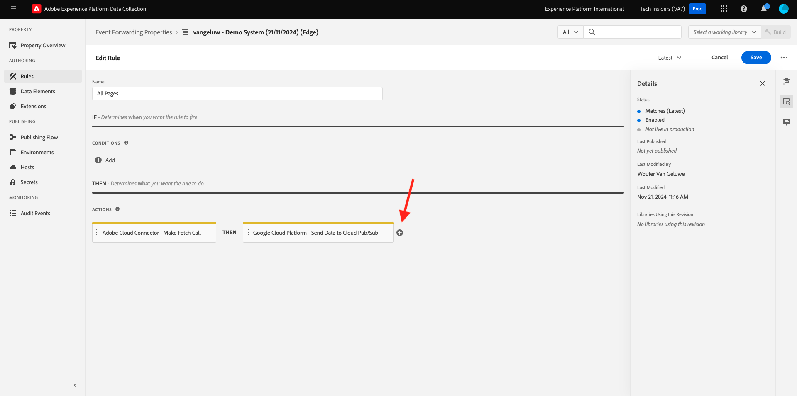
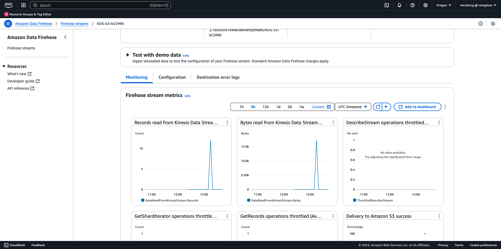

# 2.5.5 Toekomstige ontwikkelingen in het ecosysteem van AWS

>[!IMPORTANT]
>
>De afronding van deze exercitie is optioneel en er zijn kosten verbonden aan het gebruik van AWS Kinesis. Hoewel AWS een gratis tier-account biedt waarmee u veel services zonder kosten kunt testen en configureren, maakt AWS Kinesis geen deel uit van die gratis tier-account. Om deze exercitie uit te voeren en te testen, zullen er kosten verbonden zijn aan het gebruik van AWS Kinesis.

## Goed om te weten

Adobe Experience Platform ondersteunt verschillende Amazon-services als bestemming.
Kinesis en S3 zijn zowel [ de uitvoerbestemmingen van het profielaandeel ](https://experienceleague.adobe.com/docs/experience-platform/destinations/destination-types.html?lang=en) en kunnen als deel van Adobe Experience Platform Real-Time CDP worden gebruikt.
U kunt hoogwaardige segmentgebeurtenissen en de bijbehorende profielkenmerken eenvoudig in uw eigen systemen invoeren.

In deze notitie leert u hoe u uw eigen Amazon Kinesis-stream instelt om gebeurtenisgegevens te streamen die van het Adobe Experience Platform Edge-ecosysteem naar een locatie voor cloudopslag, zoals Amazon S3, komen. Dit is handig voor het geval u ervaringsgebeurtenissen wilt verzamelen van web- en mobiele eigenschappen en deze in uw database wilt plaatsen voor analyse en operationele rapportage. Datalakes nemen over het algemeen gegevens op een partijwijze met grote dagelijkse dossierinvoer op, zij stellen openbaar http eindpunt niet bloot dat samen met gebeurtenis kon worden gebruikt door:sturen.

Als u de bovenstaande gebruiksgevallen ondersteunt, moeten gestreamde gegevens worden gebufferd of in een wachtrij worden geplaatst voordat ze naar een bestand worden geschreven. Er moet op worden gelet dat het bestand niet wordt geopend voor schrijftoegang in meerdere processen. Het delegeren van deze taak aan toegewijde systemen is ideaal om mooi te schalen en tegelijk een hoog niveau van dienstverlening te garanderen, daar komt Kinesis bij.

Amazon Kinesis Data Streams richt zich op het opnemen en opslaan van gegevensstromen. Kinesis Data Firehose richt zich op het leveren van gegevensstromen om doelen te selecteren, zoals S3 emmers.

Als onderdeel van deze oefening zult u...

- Een basisconfiguratie van een Kinesis-gegevensstroom uitvoeren
- Een leveringsstream van Fireworks maken en S3-emmertje gebruiken als doel
- Amazon API-gateway configureren als een rest-API-eindpunt om uw gebeurtenisgegevens te ontvangen
- Raw-gebeurtenisgegevens vanuit de Edge van Adobe doorsturen naar uw Kinesis-stroom

## 2.5.5.1 Uw AWS S3-emmertje configureren

Ga naar [ https://console.aws.amazon.com ](https://console.aws.amazon.com) en teken binnen met de Amazon-rekening u eerder creeerde.


Na het programma openen, zult u aan de **Console van het Beheer van AWS** opnieuw worden gericht.


In het **menu van de Diensten van de Vondst**, onderzoek naar **s3**. Klik het eerste onderzoeksresultaat: **S3 - Schaalbare Opslag in de Wolk**.


U zult dan de **homepage van Amazon S3** zien. Klik **creëren Emmertje**.


In **creeer het 1} scherm van het Emmertje {, moet u twee dingen vormen:**

- Naam: gebruik de naam `eventforwarding---aepUserLdap--` . Als voorbeeld, in deze oefening is de emmernaam **aepmodulertcdpvangeluw**
- Regio: gebruik de regio **EU (Frankfurt) eu-central-1**


Laat alle andere standaardinstellingen ongewijzigd. De rol neer en klikt **creeert emmer**.


Vervolgens ziet u dat uw emmer is gemaakt en wordt deze omgeleid naar de startpagina van Amazon S3.


## 2.5.5.2 Uw AWS Kinesis-gegevensstroom configureren

In het **menu van de Diensten van de Vondst**, onderzoek naar **kinesis**. Klik het eerste onderzoeksresultaat: **Kinesis - Werk met In real time het Streamen Gegevens**.


Selecteer **de Streams van Gegevens van Kinesis**. Klik **creëren gegevensstroom**.


Voor de **naam van de gegevensstroom**, gebruik `--aepUserLdap---datastream`.


U hoeft geen van de andere instellingen te wijzigen. De rol neer en klikt **creeert gegevensstroom**.


Dan zie je dit. Zodra uw gegevensstroom met succes wordt gecreeerd, kunt u zich aan de volgende oefening bewegen.


## 2.5.5.3 Configureer uw AWS Firehose Delivery Stream

In het **menu van de Diensten van de Vondst**, onderzoek naar **kinesis**. Klik **Vuurwerk van Gegevens van Kinesis**.


Klik **creëren leveringsstroom**.


Voor **Source**, uitgezochte **de Streams van de Gegevens van Kinesis van Amazon**. Voor **Bestemming**, uitgezochte **Amazon S3**. Klik **doorbladeren** om uw gegevensstroom te selecteren.


Selecteer de gegevensstroom. Klik **kiezen**.


Dan zie je dit. Herinner de **naam van de leveringsstroom** aangezien u het later zult nodig hebben.


De rol neer tot u **Montages van de Bestemming** ziet. Klik **doorbladeren** om uw S3 emmer te selecteren.


Selecteer uw S3 emmertje en klik **kiezen**.


Dan zie je zoiets. Werk de volgende instellingen bij:

- Dynamisch het verdelen: reeks aan **Toegelaten**
- De veelvoudige gebiedssamenvoeging van het verslag: reeks aan **Gehandicapten**
- Nieuw lijnafbakening: reeks aan **Toegelaten**
- Inline het ontleden voor JSON: reeks aan **Toegelaten**


Schuif een beetje omlaag, dan ziet u dit. Werk de volgende instellingen bij:

- Dynamische partitioneringssleutels
   - Sleutelnaam: **dynamicPartitioningKey**
   - JQ-expressie: **.dynamicPartitioningKey**
- S3 bucket prefix: voeg de volgende code toe:

```bash
!{partitionKeyFromQuery:dynamicPartitioningKey}/!{timestamp:yyyy}/!{timestamp:MM}/!{timestamp:dd}/!{timestamp:HH}/}
```

- S3 de prefix van de de outputfout van de emmerfout: reeks aan **fout**


Tot slot scrol neer meer en klik **tot leveringsstroom**


Na een paar notulen, zal uw leveringsstroom niet worden gecreeerd en **Actief**.


## 2.5.5.4 Uw AWS IAM-rol configureren

In het **menu van de Diensten van de Vondst**, onderzoek naar **iam**. Klik **API Gateway**.


Klik **Rollen**.


Onderzoek naar uw **KinesisFirehose** rol. Klik erop om het te openen.


Klik op de naam van het machtigingenbeleid om dit te openen.


In het nieuwe scherm dat opent, geeft de klik **Beleid** uit.


Onder **Kinesis** - **Acties**, zorg ervoor dat **schrijft** toestemmingen voor **PutRecord** wordt toegelaten. Klik **Beleid van het Overzicht**.


Klik **sparen Veranderingen**.


Dan ben je hier weer. Klik **Rollen**.


Onderzoek naar uw **KinesisFirehose** rol. Klik erop om het te openen.


Ga naar **verhoudingen van het Vertrouwen** en klik **geef vertrouwensbeleid** uit.


Overschrijf het huidige vertrouwensbeleid door deze code te plakken ter vervanging van de bestaande code:

```json
{
	"Version": "2012-10-17",
	"Statement": [
		{
			"Effect": "Allow",
			"Principal": {
				"Service": [
                    "firehose.amazonaws.com",
                    "kinesis.amazonaws.com",
                    "apigateway.amazonaws.com"
                ]
			},
			"Action": "sts:AssumeRole"
		}
	]
}
```

Klik **Beleid van de Update**


Dan zie je dit. U zult **ARN** voor deze rol in de volgende stap moeten specificeren.


## 2.5.5.5 Uw AWS API Gateway configureren

Amazon API Gateway is een AWS-service voor het maken, publiceren, onderhouden, controleren en beveiligen van REST-, HTTP- en WebSocket-API&#39;s op elke schaal. API-ontwikkelaars kunnen API&#39;s maken die toegang krijgen tot AWS of andere webservices en tot gegevens die zijn opgeslagen in de AWS Cloud.

De Kinesis-gegevensstroom wordt nu via een HTTPS-eindpunt beschikbaar gemaakt voor gebruik op internet. Dit kan vervolgens rechtstreeks worden gebruikt door Adobe-services, zoals Gebeurtenis doorsturen.

In het **menu van de Diensten van de Vondst**, onderzoek naar **api gateway**. Klik **API Gateway**.


Dan zie je zoiets. Klik **creeer API**.


Klik **Bouwstijl** op de **REST API** kaart.


Dan zie je dit. Vul de instellingen als volgt in:

- Kies het protocol: uitgezochte **REST**
- Creeer nieuwe API: uitgezochte **Nieuwe API**
- Instellingen:
   - API-naam: gebruik `--aepUserLdap---eventforwarding`
   - Type eindpunt: uitgezochte **Regionale**

Klik **creeer API**.


Dan zie je dit. Klik **Acties** en klik dan **creeer Middel**.


Dan zie je dit. Plaats {de Naam van het Middel 0} **aan** stroom **.** Klik **creëren Middel**.


Dan zie je dit. Klik **Acties** en klik dan **creeer Methode**.


In dropdown, uitgezochte **POST** en klik de **v** knoop.


Dan zie je dit. Vul de instellingen als volgt in:

- Het type van integratie: **de Dienst van AWS**
- AWS Gebied: selecteer het gebied dat door uw Stream van Gegevens van Kinesis, in dit geval wordt gebruikt: **us-west-2**
- De Dienst van AWS: uitgezochte **Kinesis**
- AWS Subdomain: leeg laten
- HTTP Methode: uitgezochte **POST**
- Type van actie: uitgezochte **actienaam van het Gebruik**
- Actie: ga **PutRecord** in
- De rol van de uitvoering: deeg **ARN** van de uitvoeringsrol die door uw Vuurwerk van Gegevens van Kinesis wordt gebruikt, zoals geïnstrueerd in de vorige oefening
- Inhoud die behandelt: uitgezochte **Passthrough**
- Standaardtime-out gebruiken: selectievakje inschakelen

Klik **sparen**.


Dan zie je dit. Klik **Verzoek van de Integratie**.


Klik **Kopballen van HTTP**.


De rol neer een beetje en klikt **kopbal** toevoegen.


Plaats **Naam** aan **inhoud-Type**, plaats **Toegewezen van** aan `'application/x-amz-json-1.1'`. Klik het **v** pictogram om uw veranderingen te bewaren.


Dan zie je dit. Voor **het lichaamshouding van het Verzoek**, uitgezochte **wanneer er geen (geadviseerde) malplaatjes worden bepaald**. Vervolgens klikt u op **Toewijzingssjabloon toevoegen** .


Onder **inhoud-Type**, ga **toepassing/json** in. Klik het **v** pictogram om uw veranderingen te bewaren.


Schuif omlaag om een venster van de coderedacteur te vinden. Plak de onderstaande code in:

```json
{
  "StreamName": "$input.path('StreamName')",
  "Data": "$util.base64Encode($input.json('$.Data'))",
  "PartitionKey": "$input.path('$.PartitionKey')"
}
```

Klik **sparen**.


Blader vervolgens omhoog en klik op **&lt;- Method Execution** om terug te gaan.


Klik **TEST**.


De rol neer, en kleeft deze code onder **Lichaam van het Verzoek**. Klik **Test**.

```json
{
  "Data": {
    "message": "Hello World",
    "dynamicPartitioningKey": "v2"
  },
  "PartitionKey": "1",
  "StreamName": "--aepUserLdap---datastream"
}
```


Dan zie je een vergelijkbaar resultaat:


Dan zie je dit. Klik **Acties** en klik dan **opstellen API**.


Voor **het stadium van de Plaatsing**, uitgezochte **Nieuw Stadium**. Als **naam van het Stadium**, ga **prod** in. Klik **opstellen**.


Dan zie je dit. Klik **sparen Veranderingen**. FYI: de URL in de afbeelding is de URL waarnaar gegevens worden verzonden (in dit voorbeeld: https://vv1i5vwg2k.execute-api.us-west-2.amazonaws.com/prod).


U kunt de instelling testen met de onderstaande cURL-aanvraag. U hoeft alleen de onderstaande URL te vervangen door de uwe, `https://vv1i5vwg2k.execute-api.us-west-2.amazonaws.com/prod` in dit voorbeeld en `/stream` toe te voegen aan het einde van de URL.

```json
curl --location --request POST 'https://vv1i5vwg2k.execute-api.us-west-2.amazonaws.com/prod/stream' \
--header 'Content-Type: application/json' \
--data-raw '{
    "Data": {
        "userid": "--aepUserLdap--@adobe.com",
        "firstName":"--aepUserLdap--",
        "offerName":"10% off on outdoor gears",
        "offerCode": "10OFF-SPRING",
        "dynamicPartitioningKey": "campaign"
    },
    "PartitionKey": "1",
    "StreamName": "--aepUserLdap---datastream"
}'
```

Plak de bovenstaande bijgewerkte code in een Eindvenster en druk op Enter. Deze reactie is vergelijkbaar met de reactie die je kunt zien tijdens het testen hierboven.


## 2.5.5.6 Werk uw Event Forwarding-eigenschap bij

U kunt nu uw AWS Kinesis-gegevensstroom activeren via AWS API Gateway, zodat u nu uw onbewerkte ervaringsgebeurtenissen naar het AWS-ecosysteem kunt verzenden. Gebruikend de Verbindingen van Real-Time CDP en Gebeurtenis door:sturen, kunt u gebeurtenis nu gemakkelijk toelaten door:sturen aan uw onlangs gecreeerd eindpunt van de Gateway van AWS API.

### 2.5.5.6.1 Werk uw Event Forwarding-eigenschap bij: Maak een Data Element

Ga naar [ https://experience.adobe.com/#/data-collection/ ](https://experience.adobe.com/#/data-collection/) en ga naar **Gebeurtenis door:sturen**. Zoek in de eigenschap Event Forwarding en klik erop om deze te openen.


In het linkermenu, ga naar **Elementen van Gegevens**. Klik **toevoegen het Element van Gegevens**.


U zult dan een nieuw gegevenselement zien om te vormen.


Maak de volgende selectie:

- Als **Naam**, ga **awsDataObject** in.
- Als **Uitbreiding**, uitgezochte **Kern**.
- Als het **Type van Element van Gegevens**, uitgezochte **Code van de Douane**.

Nu heb je dit. Klik op **&lt;/> Editor openen** .


Plak in de Editor de volgende code op regel 3. Klik **sparen**.

```javascript
const newObj = {...arc.event.xdm, dynamicPartitioningKey: "event_forwarding"}
return JSON.stringify(newObj);
```


>[!NOTE]
>
>In de bovengenoemde weg, wordt een verwijzing gemaakt aan **boog**. **boog** staat voor de Context van het Middel van de Adobe en **boog** altijd voor het hoogste beschikbare voorwerp dat in de zijcontext van de Server beschikbaar is. De verbeteringen en de transformaties kunnen aan dat **boog** voorwerp worden toegevoegd gebruikend de functies van de Server van de Inzameling van Gegevens van Adobe Experience Platform.
>
>In de bovengenoemde weg, wordt een verwijzing gemaakt aan **gebeurtenis**. **gebeurtenis** staat voor een unieke gebeurtenis en de Server van de Inzameling van Gegevens van Adobe Experience Platform zal altijd elke gebeurtenis individueel evalueren. Soms, kunt u een verwijzing naar **gebeurtenissen** in de nuttige lading zien die door de Kant van de Cliënt van SDK van het Web wordt verzonden, maar in de Gebeurtenis die van de Inzameling van Adobe Experience Platform door:sturen, wordt elke gebeurtenis individueel geëvalueerd.

Dan ben je hier weer. Klik **sparen** of **sparen aan Bibliotheek**.


### 2.5.5.6.2 Werk uw bezit van de Server van de Gegevensverzameling van Adobe Experience Platform bij: Werk uw Regel bij

In het linkermenu, ga naar **Regels**. Klik om de regel **te openen Alle Pagina&#39;s** die u in één van de vorige oefeningen creeerde.


Dan zie je dit. Klik op het pictogram **+** om een nieuwe handeling toe te voegen.



Dan zie je dit. Maak de volgende selectie:

- Selecteer de **Uitbreiding**: **Verbinding van de Wolk van de Adobe**.
- Selecteer het **Type van Actie**: **maak Vraag van de Vetch**.

Dat zou u deze **Naam** moeten geven: **de Schakelaar van de Wolk van de Adobe - maak Vraag van de Ophalen**. U zou nu dit moeten zien:


Configureer daarna het volgende:

- Verandering de verzoekmethode van GET in **POST**
- Voer de URL in van het eindpunt van de AWS API Gateway dat u in een van de vorige stappen hebt gemaakt. Deze URL ziet er als volgt uit: `https://vv1i5vwg2k.execute-api.us-west-2.amazonaws.com/prod/stream`

Dat zou u nu moeten doen. Daarna, ga naar **Kopballen**.


Onder kopballen, voeg een nieuwe kopbal met sleutel **toe inhoud-Type** en waarde **toepassing/json**. Daarna, ga naar **Lichaam**.


Dan zie je dit. Plak de volgende code op het gebied **Lichaam (Ruwe)**. Klik **houden Veranderingen**.

```json
{
    "Data":{{awsDataObject}},
    "PartitionKey": "1",
    "StreamName": "--aepUserLdap---datastream"
}
```


Dan zie je hier weer zijn. Klik **sparen** of **sparen aan Bibliotheek**.


U hebt nu uw eerste regel in een Gebeurtenis gevormd die bezit door:sturen. Ga naar **het Publiceren Stroom** om uw veranderingen te publiceren.
Open uw bibliotheek van de Ontwikkeling door **Hoofd** te klikken.


Klik **toevoegen Alle Gewijzigde Middelen** knoop, waarna zult u uw veranderingen van het Regel en van het Element van Gegevens in deze bibliotheek zien verschijnen. Daarna, klik **sparen &amp; bouwt voor Ontwikkeling**. Uw wijzigingen worden nu geïmplementeerd.


Na een paar minuten zult u zien dat de implementatie klaar is en klaar om te worden getest.


## 2.5.5.7 Test uw configuratie

Ga naar [ https://builder.adobedemo.com/projects ](https://builder.adobedemo.com/projects). Nadat je je hebt aangemeld bij je Adobe ID, kun je dit zien. Klik op uw websiteproject om het te openen.


U kunt nu de onderstaande workflow volgen om toegang te krijgen tot de website. Klik **Integraties**.


Op de **pagina van de Integraties**, moet u het bezit van de Inzameling van Gegevens selecteren dat in oefening 0.1 werd gecreeerd.


Vervolgens wordt uw demowebsite geopend. Selecteer de URL en kopieer deze naar het klembord.


Open een nieuw Incognito-browservenster.


Plak de URL van uw demowebsite, die u in de vorige stap hebt gekopieerd. Vervolgens wordt u gevraagd u aan te melden met uw Adobe ID.


Selecteer uw accounttype en voltooi het aanmeldingsproces.


Uw website wordt vervolgens geladen in een Incognito-browservenster. Voor elke demonstratie, zult u een vers, incognito browser venster moeten gebruiken om uw demowebsite URL te laden.


Wanneer u uw browser de Mening van de Ontwikkelaar opent, kunt u de verzoeken van het Netwerk zoals hieronder vermeld inspecteren. Wanneer u de filter **gebruikt in wisselwerking treedt**, zult u de netwerkverzoeken zien die door de Cliënt van de Inzameling van Gegevens van Adobe Experience Platform aan Adobe Edge worden verzonden.


Als u onbewerkte lading selecteert, ga [ https://jsonformatter.org/json-pretty-print ](https://jsonformatter.org/json-pretty-print) en kleef de nuttige lading. Klik **maken Behoorlijk**. U zult dan de nuttige lading JSON, het **gebeurtenissen** voorwerp en het **xdm** voorwerp zien. In één van de vorige stappen, toen u het Element van Gegevens bepaalde, gebruikte u de verwijzing **arc.event.xdm**, die in u het **xdm** voorwerp van deze nuttige lading zal resulteren ontleden.


Schakelaar uw mening aan **AWS**. Door uw gegevensstroom te openen en in de **Controle** tabel te gaan, zult u inkomend verkeer nu zien.


Wanneer u dan uw leveringsstroom opent en in de **Controle** tabel gaat, zult u inkomend verkeer ook zien.



Tot slot wanneer u een blik bij uw S3 emmertje hebt, zult u nu merken dossiers die daar als gevolg van uw gegevensopname worden gecreeerd.


Wanneer u een dergelijk bestand downloadt en opent met een teksteditor, ziet u dat het de XDM-lading bevat van de gebeurtenissen die zijn doorgestuurd.


Volgende Stap: [ Samenvatting en voordelen ](./summary.md)

[Ga terug naar Module 2.5](./aep-data-collection-ssf.md)

[Terug naar alle modules](./../../../overview.md)
