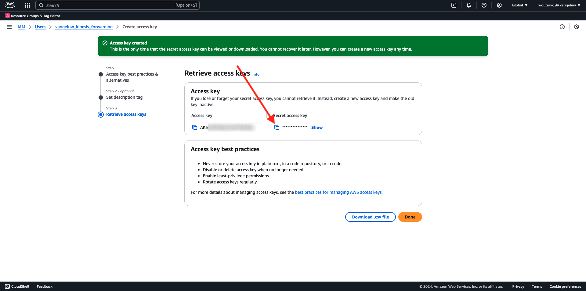

# 2.5.5 Gebeurtenissen doorsturen naar AWS Kinesis en AWS S3

>[!IMPORTANT]
>
>De afronding van deze exercitie is optioneel en er zijn kosten verbonden aan het gebruik van AWS Kinesis. Hoewel AWS een gratis tier-account biedt waarmee u veel services zonder kosten kunt testen en configureren, maakt AWS Kinesis geen deel uit van die gratis tier-account. Om deze exercitie uit te voeren en te testen, zullen er kosten verbonden zijn aan het gebruik van AWS Kinesis.

## Goed om te weten

Adobe Experience Platform ondersteunt verschillende Amazon-services als bestemming.
Kinesis en S3 zijn zowel [ de uitvoerbestemmingen van het profielaandeel ](https://experienceleague.adobe.com/docs/experience-platform/destinations/destination-types.html?lang=nl-NL) en kunnen als deel van Adobe Experience Platform Real-Time CDP worden gebruikt.
U kunt hoogwaardige segmentgebeurtenissen en de bijbehorende profielkenmerken eenvoudig in uw eigen systemen invoeren.

In deze oefening, zult u leren hoe te om uw eigen stroom van Amazon Kinesis te plaatsen om gebeurtenisgegevens te stromen die van het ecosysteem van Adobe Experience Platform Edge aan een bestemming van de wolkenopslag, zoals Amazon S3 komen. Dit is handig voor het geval u ervaringsgebeurtenissen wilt verzamelen van web- en mobiele eigenschappen en deze in uw database wilt plaatsen voor analyse en operationele rapportage. Datalakes nemen over het algemeen gegevens op een partijwijze met grote dagelijkse dossierinvoer op, zij stellen openbaar http eindpunt niet bloot dat samen met gebeurtenis kon worden gebruikt door:sturen.

Als u de bovenstaande gebruiksgevallen ondersteunt, moeten gestreamde gegevens worden gebufferd of in een wachtrij worden geplaatst voordat ze naar een bestand worden geschreven. Er moet op worden gelet dat het bestand niet wordt geopend voor schrijftoegang in meerdere processen. Het delegeren van deze taak aan toegewijde systemen is ideaal om mooi te schalen en tegelijk een hoog niveau van dienstverlening te garanderen, daar komt Kinesis bij.

Amazon Kinesis Data Streams richt zich op het opnemen en opslaan van gegevensstromen. Kinesis Data Firehose richt zich op het leveren van gegevensstromen om doelen te selecteren, zoals S3 emmers.

Als onderdeel van deze oefening zult u...

- Een basisconfiguratie van een Kinesis-gegevensstroom uitvoeren
- Een leveringsstream van Fireworks maken en S3-emmertje gebruiken als doel
- Amazon API-gateway configureren als een rest-API-eindpunt om uw gebeurtenisgegevens te ontvangen
- Raw-gebeurtenisgegevens vanuit de Edge van Adobe doorsturen naar uw Kinesis-stroom

## AWS S3-emmertje configureren

Ga naar [ https://console.aws.amazon.com ](https://console.aws.amazon.com) en teken binnen met uw Amazon-rekening.

Na het programma openen, zult u aan de **Console van het Beheer van AWS** opnieuw worden gericht.

In het **menu van de Diensten van de Vondst**, onderzoek naar **s3**. Klik het eerste onderzoeksresultaat: **S3 - Schaalbare Opslag in de Wolk**.

U zult dan de **homepage van Amazon S3** zien. Klik **creëren Emmertje**.

In **creeer het 1&rbrace; scherm van het Emmertje &lbrace;, moet u twee dingen vormen:**

- Naam: gebruik de naam `eventforwarding---aepUserLdap--` .

Laat alle andere standaardinstellingen ongewijzigd. De rol neer en klikt **creeert emmer**.

Vervolgens ziet u dat uw emmer is gemaakt en wordt deze omgeleid naar de startpagina van Amazon S3.

## AWS Kinesis-gegevensstroom configureren

In het **menu van de Diensten van de Vondst**, onderzoek naar **kinesis**. Klik het eerste onderzoeksresultaat: **Kinesis - Werk met In real time het Streamen Gegevens**.

Selecteer **de Streams van Gegevens van Kinesis**. Klik **creëren gegevensstroom**.

Voor de **naam van de gegevensstroom**, gebruik `--aepUserLdap---datastream`.

U hoeft geen van de andere instellingen te wijzigen. De rol neer en klikt **creeert gegevensstroom**.

Dan zie je dit. Zodra uw gegevensstroom met succes wordt gecreeerd, kunt u zich aan de volgende oefening bewegen.

## Uw AWS Firehose Delivery Stream configureren

In het **menu van de Diensten van de Vondst**, onderzoek naar **kinesis**. Klik **Vuurwerk van Gegevens van Kinesis**.

Klik **creëren de stroom van het Vuurwerk**.

Voor **Source**, uitgezochte **de Streams van de Gegevens van Kinesis van Amazon**. Voor **Bestemming**, uitgezochte **Amazon S3**. Klik **doorbladeren** om uw gegevensstroom te selecteren.

Selecteer de gegevensstroom. Klik **kiezen**.

Dan zie je dit. Herinner de **naam van de de stroomstroom van het Vuurwerk** aangezien u het later zult nodig hebben.

De rol neer tot u **Montages van de Bestemming** ziet. Klik **doorbladeren** om uw S3 emmer te selecteren.

Selecteer uw S3 emmertje en klik **kiezen**.

Dan zie je zoiets. Werk de volgende instellingen bij:

- Nieuw lijnafbakening: reeks aan **Toegelaten**
- Dynamisch het verdelen: reeks aan **niet toegelaten**

Schuif neer meer en klik **creeer de stroom van het Vuurwerk**

Na een paar notulen, zal uw stroom van het Vuurwerk worden gecreeerd en **Actief**.

## IAM-gebruiker maken

In het linkermenu van AWS IAM, klik **Gebruikers**. U zult dan het **scherm van Gebruikers** zien. Klik **creëren gebruiker**.

Configureer vervolgens de gebruiker:

- Gebruikersnaam: gebruik `--aepUserLdap--_kinesis_forwarding`

Klik **daarna**.

U zult dan dit toestemmingenscherm zien. Klik **beleid van de Band direct**.

Ga de onderzoekstermijn **kinesisfirehose** in om al verwant beleid te zien. Selecteer het beleid **AmazonKinesisFirehoseFullAccess**. De rol neer en klikt **daarna**.

Controleer uw configuratie. Klik **creëren Gebruiker**.

Dan zie je dit. Klik **Gebruiker van de Mening**.

Klik **toevoegen toestemmingen** en klik **leiden gealigneerd beleid**.

Dan zie je dit. Selecteer de dienst **Kinesis**.

Ga naar **schrijven** en controleer checkbox voor **PutRecord**.

De rol neer aan **Middelen** en selecteert **allen**. Klik **daarna**.

Noem uw beleid kike dit: **Kinesis_PutRecord** en klik **tot beleid** leidt.

Dan zie je dit. Klik **geloofsbrieven van de Veiligheid**.

Klik **creëren toegangssleutel**.

Selecteer **Toepassing die buiten AWS** loopt. De rol neer en klikt **daarna**.

Klik **creëren toegangssleutel**

Dan zie je dit. Klik **tonen** om uw Geheime toegangstoets te zien:

Uw **Geheime toegangssleutel** wordt nu getoond.

>[!IMPORTANT]
>
>Sla uw gegevens op in een tekstbestand op uw computer.
>
> - Toegang sleutel-id: ...
> - Geheime toegangssleutel: ...
>
> Zodra u **Gedaan** klikt zult u uw geloofsbrieven nooit meer zien!

Klik **Gedaan**.

U hebt nu met succes een gebruiker IAM met juiste toestemmingen gecreeerd, die u zult moeten specificeren wanneer het vormen van de uitbreiding van AWS in uw Gebeurtenis die bezit door:sturen.

## Update your Event Forwarding property: Extension

Als uw Geheim en Gegevenselement zijn geconfigureerd, kunt u nu de extensie voor Google Cloud Platform instellen in uw eigenschap voor het doorsturen van gebeurtenissen.

Ga naar [ https://experience.adobe.com/#/data-collection/ ](https://experience.adobe.com/#/data-collection/), ga **Gebeurtenis door:sturen** en open uw Gebeurtenis door:sturen bezit.

Daarna, ga naar **Uitbreidingen**, aan **Catalogus**. Klik de **uitbreiding van AWS** en klik **installeren**.

Voer de IAM-gebruikersgegevens in die u in de vorige oefening hebt gegenereerd. Klik **sparen**.

Daarna, moet u een regel vormen die begint gebeurtenisgegevens aan Kinesis door:sturen.

## Update your Event Forwarding property: Rule

In het linkermenu, ga naar **Regels**. Klik om de regel **te openen Alle Pagina&#39;s** die u in één van de vorige oefeningen creeerde.

Dan zie je dit. Klik op het pictogram **+** om een nieuwe handeling toe te voegen.

Dan zie je dit. Maak de volgende selectie:

- Selecteer de **Uitbreiding**: **AWS**
- Selecteer het **Type van Actie**: **verzendt Gegevens naar de Stream van de Gegevens van Kinesis**
- Naam: **AWS - verzend Gegevens naar de Stream van de Gegevens van Kinesis**

U zou nu dit moeten zien:

Configureer daarna het volgende:

- Naam stream: `--aepUserLdap---datastream`
- AWS-regio: controleer uw regio in de configuratie van AWS-gegevensstroom
- Verdeelsleutel: **0**

Je kunt hier je AWS-regio zien:

Dat zou u nu moeten doen. Daarna, klik het pictogram van het gegevenselement voor het **gebied van Gegevens**.

Selecteer **Gebeurtenis XDM** en klik **Uitgezocht**.

Dan heb je dit. Klik **houden Veranderingen**.

Dan zie je dit. Klik **sparen**.

Ga naar **het Publiceren Stroom** om uw veranderingen te publiceren.
Open uw bibliotheek van de Ontwikkeling door **Hoofd** te klikken.

Klik **toevoegen Alle Gewijzigde Middelen** knoop, waarna zult u uw veranderingen van het Regel en van het Element van Gegevens in deze bibliotheek zien verschijnen. Daarna, klik **sparen &amp; bouwt voor Ontwikkeling**. Uw wijzigingen worden nu geïmplementeerd.

Na een paar minuten zult u zien dat de implementatie klaar is en klaar om te worden getest.

## Uw configuratie testen

Ga naar [ https://dsn.adobe.com ](https://dsn.adobe.com). Nadat je je hebt aangemeld bij je Adobe ID, kun je dit zien. Klik de 3 punten **..** op uw websiteproject en klik dan **Looppas** om het te openen.

Vervolgens wordt uw demowebsite geopend. Selecteer de URL en kopieer deze naar het klembord.

Open een nieuw Incognito-browservenster.

Plak de URL van uw demowebsite, die u in de vorige stap hebt gekopieerd. Vervolgens wordt u gevraagd u aan te melden met uw Adobe ID.

Selecteer uw accounttype en voltooi het aanmeldingsproces.

Uw website wordt vervolgens geladen in een Incognito-browservenster. Voor elke oefening, zult u een vers, incognito browser venster moeten gebruiken om uw demowebsite URL te laden.

Schakelaar uw mening aan **AWS**. Door uw gegevensstroom te openen en in de **Controle** tabel te gaan, zult u inkomend verkeer nu zien.

Wanneer u dan uw stroom van het Vuurwerk van Gegevens opent en in de **Controle** tabel gaat, zult u inkomend verkeer ook zien.

Tot slot wanneer u een blik bij uw S3 emmertje hebt, zult u nu merken dossiers die daar als gevolg van uw gegevensopname worden gecreeerd.

Wanneer u een dergelijk bestand downloadt en opent met een teksteditor, ziet u dat het de XDM-lading bevat van de gebeurtenissen die zijn doorgestuurd.

>[!IMPORTANT]
>
>Vergeet niet om uw AWS Kinesis Data Stream en Data Firehose uit te schakelen om te voorkomen dat deze worden geladen wanneer uw installatie naar behoren functioneert!

Volgende Stap: [ Samenvatting en voordelen ](./summary.md)

[Ga terug naar Module 2.5](./aep-data-collection-ssf.md)

[Terug naar alle modules](./../../../overview.md)

