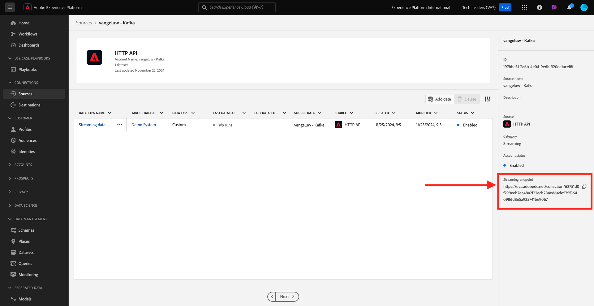

# 2.6.3 Het HTTP API-streamingeindpunt in Adobe Experience Platform configureren

Voordat u de Adobe Experience Platform Sink Connector kunt instellen in Kafka, moet u een HTTP API Source Connector maken in Adobe Experience Platform. De URL voor het HTTP API-streamingeindpunt is vereist voor het instellen van de Adobe Experience Platform Sink Connector.

Om een Schakelaar van HTTP API Source tot stand te brengen, login aan Adobe Experience Platform door aan dit URL te gaan: [ https://experience.adobe.com/platform ](https://experience.adobe.com/platform).

Na het aanmelden landt je op de homepage van Adobe Experience Platform.

Alvorens u verdergaat, moet u a **zandbak** selecteren. De te selecteren sandbox krijgt de naam ``--aepSandboxName--`` . Na het selecteren van de aangewezen zandbak, zult u de het schermverandering zien en nu bent u in uw specifieke zandbak.

In het linkermenu, ga naar **Bronnen** en rol neer in de **Broncatalogus** tot u **HTTP API** ziet. Klik **Opstelling**.

Klik **Nieuwe rekening**. Gebruik `--aepUserLdap-- - Kafka` als naam voor uw verbinding van HTTP API, in dit geval **vangeluw - Kafka**. Laat checkbox voor **Compatible XDM** toe. Klik **verbinden met bron**.

U zult dan dit zien, klik **daarna**.

Selecteer **Bestaande dataset**, open het dropdown menu. Onderzoek en selecteer het dataset **Systeem van de Demo - de Dataset van de Gebeurtenis voor het Centrum van de Vraag (Globale v1.1)**.

Klik **daarna**.

Klik **Afwerking**.

Vervolgens ziet u een overzicht van de HTTP API Source Connector die u zojuist hebt gemaakt.

U zult het **Streaming eindpunt** URL moeten kopiëren, die als hieronder kijkt, aangezien u het in de volgende oefening zult nodig hebben.

`https://dcs.adobedc.net/collection/63751d0f299eeb7aa48a2f22acb284ed64de575f8640986d8e5a935741be9067`

U hebt deze oefening voltooid.

Volgende Stap: [ 2.6.4 installeer en vorm Kafka verbindt en de Schakelaar van het Sink van Adobe Experience Platform ](./ex4.md)

[Terug naar module 2.6](./aep-apache-kafka.md)

[Terug naar alle modules](../../../overview.md)
