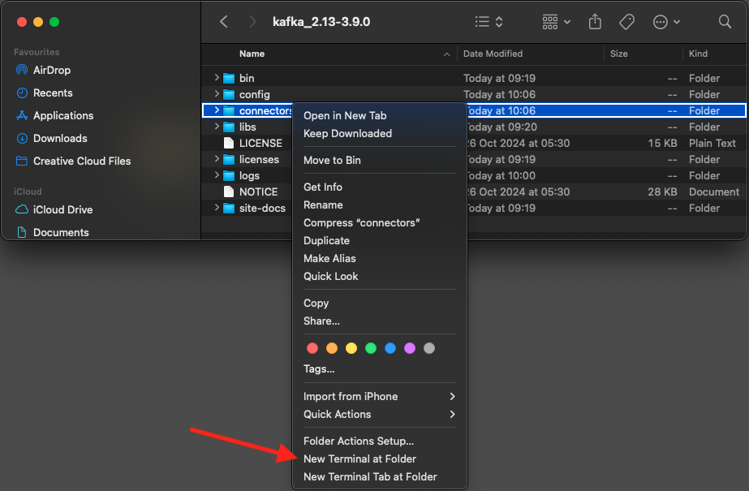
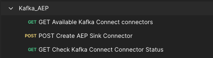

# 2.6.4 Kafka Connect en de Adobe Experience Platform Sink Connector installeren en configureren

## 2.6.4.1 Download de Adobe Experience Platform Sink Connector

Ga naar [ https://github.com/adobe/experience-platform-streaming-connect/releases ](https://github.com/adobe/experience-platform-streaming-connect/releases) en download de recentste officiële versie van de Schakelaar van de Zink van Adobe Experience Platform.


Plaats het downloaddossier, **het stromen-verbinden-goot-0.0.14-java-11.jar**, op uw Desktop.


## 2.6.4.2 Kafka Connect configureren

Ga naar de omslag op uw Desktop genoemd **Kafka_AEP** en navigeer aan de omslag `kafka_2.13-3.1.0/config`.
In die omslag, open het dossier **connect-distribute.properties** gebruikend om het even welke Redacteur van de Tekst.


Ga in de Teksteditor naar regel 34 en 35 en stel de velden in op `key.converter.schemas.enable` en `value.converter.schemas.enable` op `false`

```json
key.converter.schemas.enable=false
value.converter.schemas.enable=false
```

Sla uw wijzigingen in dit bestand op.


Ga vervolgens terug naar de map `kafka_2.13-3.1.0` en maak handmatig een nieuwe map en noem deze `connectors` .


Klik de omslag met de rechtermuisknop aan en klik **Nieuwe terminal bij Omslag**.



Dan zie je dit. Voer de opdracht `pwd` in om het volledige pad voor die map op te halen. Selecteer het volledige pad en kopieer het naar het klembord.


Ga terug naar uw Redacteur van de Tekst, aan het dossier **connect-distribute.properties** en rol neer aan de laatste lijn (lijn 86 in het schermafbeelding). Verwijder de commentaarmarkering van de regel die begint met `# plugin.path=` en plak het volledige pad naar de map met de naam `connectors` . Het resultaat moet er ongeveer als volgt uitzien:

`plugin.path=/Users/woutervangeluwe/Desktop/Kafka_AEP/kafka_2.13-3.1.0/connectors`

Sparen uw veranderingen in het dossier **connect-distribute.properties** en sluit uw Redacteur van de Tekst.


Kopieer vervolgens de meest recente officiële release van de Adobe Experience Platform Sink Connector die u naar de map met de naam `connectors` hebt gedownload. Het dossier dat u alvorens wordt gedownload wordt genoemd **streaming-verbinden-goot-0.0.14-java-11.jar**, kunt u het eenvoudig in de `connectors` omslag bewegen.


Daarna, open een nieuw Eind venster op het niveau van **kafka_2.13-3.1.0** omslag. Klik die omslag met de rechtermuisknop aan en klik **Nieuwe Terminal bij Omslag**.

In het Eind venster, kleef dit bevel: `bin/connect-distributed.sh config/connect-distributed.properties` en klik **gaat** binnen. Met deze opdracht start u Kafka Connect en laadt u de bibliotheek van de Adobe Experience Platform Sink Connector.


Na een paar seconden zie je iets als dit:


## 2.6.4.3 Maak uw Adobe Experience Platform Sink Connector met Postman

U kunt nu communiceren met Kafka Connect via Postman. Om dit te doen, download [ deze Inzameling van Postman ](./../../../assets/postman/postman_kafka.zip) en uncompress het aan uw lokale computer op de Desktop. Vervolgens hebt u een bestand met de naam `Kafka_AEP.postman_collection.json` .


U moet dit bestand importeren in Postman. Om dit te doen, open Postman, klik **Invoer**, sleep en laat vallen het dossier `Kafka_AEP.postman_collection.json` in popup en klik **de Invoer**.


U zult dan deze inzameling in het linkermenu van Postman vinden. Klik het eerste verzoek, **GET Beschikbare schakelaars Kafka verbinden** om het te openen.



Dan zie je dit. Klik de blauwe **verzenden** knoop, waarna u een lege reactie `[]` zou moeten zien. De lege reactie is het gevolg van het feit dat er momenteel geen Kafka Connect-connectors zijn gedefinieerd.


Om een schakelaar tot stand te brengen, klik om het tweede verzoek in de inzameling te openen Kafka, **POST leidt tot Schakelaar van de Zink AEP**. Dan zie je dit. Op lijn 11, waar het **&quot;aep.Endpoint&quot; zegt: &quot;&quot;**, moet u in het HTTP API stromen eindpunt URL kleven die u aan het eind van oefening [ 15.3 ](./ex3.md) ontving. De URL voor het HTTP API-streamingeindpunt ziet er als volgt uit: `https://dcs.adobedc.net/collection/d282bbfc8a540321341576275a8d052e9dc4ea80625dd9a5fe5b02397cfd80dc`.


Na het plakken zou de tekst van uw verzoek als dit moeten kijken. Klik de blauwe **verzenden** knoop om uw schakelaar tot stand te brengen. U zult een directe reactie van de verwezenlijking van uw schakelaar krijgen.


Klik het eerste verzoek, **GET Beschikbare Kafka verbindt schakelaars** om het opnieuw te openen en de blauwe **te klikken verzenden** knoop opnieuw. U ziet nu dat er een Kafka Connect-aansluiting is gemaakt.


Daarna, open het derde verzoek in de inzameling Kafka, **Controle Kafka verbindt de Status van de Verbinding van de GET**. Klik de blauwe **verzenden** knoop, zult u dan een reactie zoals hieronder krijgen, verklarend dat de schakelaar loopt.


## 2.6.4.4 Een ervaringsevenement maken

Open een nieuw **Eind** venster door uw omslag **kafka_2.13-3.1.0** met de rechtermuisknop aan te klikken en **Nieuwe Eind bij Omslag** te klikken.


Voer de volgende opdracht in:

`bin/kafka-console-producer.sh --broker-list 127.0.0.1:9092 --topic aep`


Dan zie je dit. Elke nieuwe lijn die door de Enter knoop wordt gevolgd zal in een nieuw bericht resulteren dat in het onderwerp **wordt verzonden aep**.


U kunt nu een bericht verzenden dat zal resulteren in het gebruik door de Adobe Experience Platform Sink Connector, en dat in real time in Adobe Experience Platform zal worden opgenomen.

Laten we een demo doen om dit te testen.

Ga naar [ https://builder.adobedemo.com/projects ](https://builder.adobedemo.com/projects). Nadat je je hebt aangemeld bij je Adobe ID, kun je dit zien. Klik op uw websiteproject om het te openen.


Op de **Screens** pagina, klik **Looppas**.


Vervolgens wordt uw demowebsite geopend. Selecteer de URL en kopieer deze naar het klembord.


Open een nieuw Incognito-browservenster.


Plak de URL van uw demowebsite, die u in de vorige stap hebt gekopieerd. Vervolgens wordt u gevraagd u aan te melden met uw Adobe ID.


Selecteer uw accounttype en voltooi het aanmeldingsproces.


Uw website wordt vervolgens geladen in een Incognito-browservenster. Voor elke demonstratie, zult u een vers, incognito browser venster moeten gebruiken om uw demowebsite URL te laden.


Klik op het Adobe-logopictogram in de linkerbovenhoek van het scherm om de Profile Viewer te openen.


Heb een blik bij het paneel van de Kijker van het Profiel en het Profiel van de Klant in real time met **identiteitskaart van het Experience Cloud** als primaire herkenningsteken voor deze momenteel onbekende klant.


Ga naar de pagina Registreren/Aanmelden. Klik **CREËREN EEN ACCOUNT**.


Vul uw details in en klik **Register** waarna u aan de vorige pagina opnieuw zult worden gericht.


Open het deelvenster Profielviewer en ga naar Klantprofiel in realtime. In het deelvenster Profielviewer worden al uw persoonlijke gegevens weergegeven, zoals de zojuist toegevoegde e-mail- en telefoon-id&#39;s.


U kunt bepaalde ervaringsgebeurtenissen zien die gebaseerd zijn op eerdere activiteiten.


Laten we dat veranderen en een Callcenter Experience-evenement sturen van Kafka naar Adobe Experience Platform.

Neem de onderstaande voorbeeldervaring op bij het laden van de gebeurtenis en kopieer deze naar een teksteditor.

```json
{
  "header": {
    "datasetId": "61fe23fd242870194a6d779c",
    "imsOrgId": "--aepImsOrgID--",
    "source": {
      "name": "Launch"
    },
    "schemaRef": {
      "id": "https://ns.adobe.com/experienceplatform/schemas/b0190276c6e1e1e99cf56c99f4c07a6e517bf02091dcec90",
      "contentType": "application/vnd.adobe.xed-full+json;version=1"
    }
  },
  "body": {
    "xdmMeta": {
      "schemaRef": {
        "id": "https://ns.adobe.com/experienceplatform/schemas/b0190276c6e1e1e99cf56c99f4c07a6e517bf02091dcec90",
        "contentType": "application/vnd.adobe.xed-full+json;version=1"
      }
    },
    "xdmEntity": {
      "eventType": "callCenterInteractionKafka",
      "_id": "",
      "timestamp": "2022-02-23T09:54:12.232Z",
      "_experienceplatform": {
        "identification": {
          "core": {
            "phoneNumber": ""
          }
        },
        "interactionDetails": {
          "core": {
            "callCenterAgent": {
              "callID": "Support Contact - 3767767",
              "callTopic": "contract",
              "callFeeling": "negative"
            }
          }
        }
      }
    }
  }
}
```

Dan zie je dit. U moet twee velden handmatig bijwerken:

- **_id**: te plaatsen gelieve willekeurige identiteitskaart, iets als `--aepUserLdap--1234`
- **timestamp**: werk timestamp aan de huidige datum en de tijd bij
- **phoneNumber**: ga phoneNumber van de rekening in die enkel op de demowebsite werd gecreeerd. U kunt het op het paneel van de Kijker van het Profiel onder **Identiteiten** vinden.

U moet ook deze velden controleren en mogelijk bijwerken:
- **datasetId**: u moet identiteitskaart van de Dataset voor het Systeem van de Dataset van de Demo kopiëren - de Dataset van de Gebeurtenis voor het Centrum van de Vraag (Globale v1.1)
- **imsOrgID**: uw IMS Org identiteitskaart is `--aepImsOrgId--`

>[!NOTE]
>
>Het veld **_id** moet uniek zijn voor elke gegevensinvoer. Als u veelvoudige gebeurtenissen veroorzaakt, gelieve ervoor te zorgen dat u het gebied **_id** telkens aan een nieuwe, unieke waarde bijwerkt.


Dan zou je iets als dit moeten hebben:


Kopieer vervolgens de volledige ervaringsgebeurtenis naar het klembord. De witruimte van uw JSON-lading moet worden verwijderd en daarvoor gebruiken we een online tool. Ga naar [ http://jsonviewer.stack.hu/ ](http://jsonviewer.stack.hu/) om dat te doen.


Plak uw ervaringsgebeurtenis in de redacteur en klik **verwijdert witte ruimte**.


Selecteer vervolgens alle uitvoertekst en kopieer deze naar het klembord.


Ga terug naar uw Eind venster.


Plak de nieuwe nuttige lading zonder whitespaces in het Eind venster en klik **gaat** binnen.


Ga vervolgens terug naar uw demowebsite en vernieuw de pagina. U zou nu een ervaringsgebeurtenis op uw profiel, onder **Andere Gebeurtenissen**, enkel als hieronder moeten zien:


>[!NOTE]
>
>Als u uw interacties van het vraagcentrum op het paneel van de Kijker van het Profiel wilt verschijnen, moet u het hieronder etiket en de filter in uw project op [ https://builder.adobedemo.com/projects ](https://builder.adobedemo.com/projects) toevoegen, door naar de lusje **Kijker van het Profiel** te gaan.


U hebt deze oefening voltooid.

Volgende Stap: [ Samenvatting en voordelen ](./summary.md)

[Terug naar module 2.6](./aep-apache-kafka.md)

[Terug naar alle modules](../../../overview.md)
