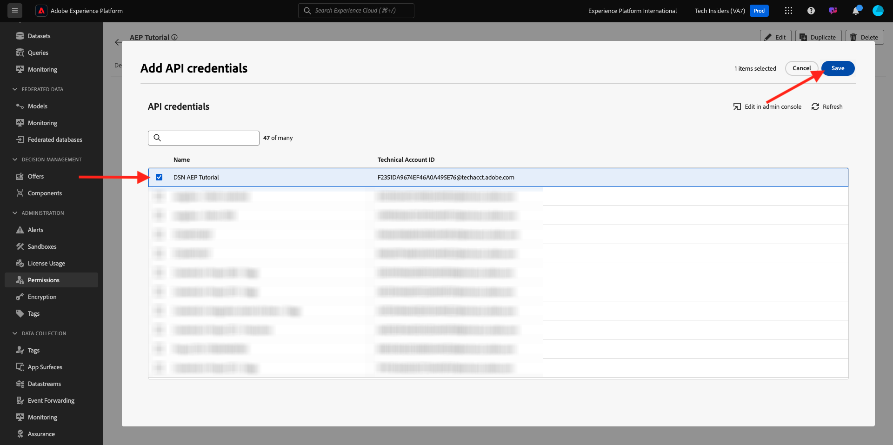
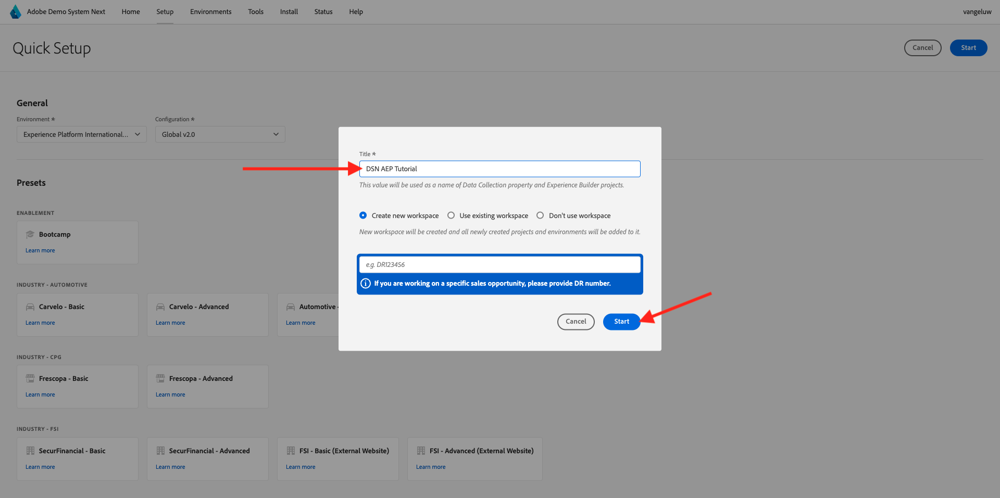

# Adobe Experience Platform-instantie instellen

>[!IMPORTANT]
>
>Deze pagina is alleen bedoeld voor systeembeheerdersrollen. U hebt toegangsrechten voor systeembeheerders nodig om de onderstaande stappen te kunnen volgen. Als u geen systeembeheerder op uw Adobe Experience Cloud-org bent, neemt u contact op met uw systeembeheerder en vraagt u om goedkeuring en hulp voordat u verdergaat met een van de onderstaande stappen.

## Overzicht

Als u al deze zelfstudies in handen wilt hebben, dient u de volgende Adobe Experience Cloud-toepassingen op te nemen in uw IMS-organisatie:

- Adobe in realtime CDP
- Adobe Experience Platform-gegevensverzameling
- Adobe Journey Optimizer
- Customer Journey Analytics
- Data Distiller
- Samenstelling van Federated-doelgroep

Als een specifieke toepassingsservice niet is ingericht voor uw IMS-organisatie, kunt u die specifieke oefening niet in de praktijk uitvoeren.

## Een sandbox maken

Als u de zelfstudie wilt doorlopen in uw eigen Adobe Experience Platform-instantie, is het raadzaam eerst een nieuwe ontwikkelingssandbox in te stellen. Om een nieuwe zandbak tot stand te brengen, ga [&#x200B; https://experience.adobe.com/platform &#x200B;](https://experience.adobe.com/platform), ga naar Sandboxes en ga dan naar **doorbladeren**. Klik **creeer zandbak**.

Maak uw zandbak als volgt:

- Type: **Ontwikkeling**
- Naam: **aep-tutorial**
- Titel: **Zelfstudie van Adobe Experience Platform**

Klik **creëren**.

Uw sandbox wordt nu gemaakt. Na een paar minuten zie je dit.

## Machtigingen instellen

Ga naar **Toestemmingen**, dan gaan **Rollen**.

Klik om de specifieke **Rol** te openen die door de studenten zal worden gebruikt die door dit leerprogramma zullen gaan. Klik **creeer rol**.

Geef uw rol een naam als **Zelfstudie van Adobe Experience Platform**, klik **bevestigen**.

In het **zandbakken** dropdown menu, selecteer de zandbak die u enkel creeerde en verzekerde om het even welke andere zandbak (ook verwijder **Prod**) te verwijderen.

Voeg de verschillende bronnen toe en stel machtigingen in. Gelieve te verzekeren niet om het even welke toestemmingen voor **Beleid Sandbox** toe te voegen.

Voeg meer bronnen toe zoals aangegeven en stel machtigingen in.

Voeg meer bronnen toe zoals aangegeven en stel machtigingen in. Klik **sparen**. Dan, klik **dicht**.

## Adobe I/O instellen

Ga naar
[&#x200B; https://developer.adobe.com/console/integrations &#x200B;](https://developer.adobe.com/console/integrations). Zorg ervoor dat je in de juiste instantie bent. Klik **creëren nieuw project**.

Klik **toevoegen aan Project** en klik dan **API**.

Klik **Adobe Experience Platform** en laat dan **Experience Platform API** toe. Klik **daarna**.

Voor de **Referentienaam**, gebruik **DSN AEP Leerprogramma**. Klik **daarna**.

Selecteer een van de beschikbare productprofielen. Dit productprofiel bepaalt geen toestemmingen voor dit project van Adobe I/O - dit zal in een volgende stap worden gedaan. Klik **sparen gevormde API**.

Klik **toevoegen aan Project** en klik dan **API** opnieuw.

Klik **Adobe Experience Platform** en laat dan **Experience Platform Launch API** toe. Klik **daarna**.

Klik **daarna**.

Selecteer een productprofiel waarmee u eigenschappen voor gegevensverzameling kunt maken en beheren. Klik **sparen gevormde API**.

Dan zie je dit. Klik de huidige **naam van 0&rbrace; Project XXX.**

Klik **uitgeven Project**.

Ga een nieuwe **Titel van het Project** in, zoals **het Leerprogramma van DSN Adobe Experience Platform**. Klik **sparen**.

Uw Adobe I/O-project is nu klaar.

## Adobe I/O-project koppelen aan rol

Ga naar **Toestemmingen**, aan **Rollen** en klik dan de nieuwe rol u vroeger creeerde.

Ga naar **API geloofsbrieven**. Klik op **+ Add API credentials**.

Vervolgens ziet u de Adobe I/O-referentie die u in de vorige stap hebt gemaakt. Selecteer het en klik **sparen**.

Uw Adobe I/O Project is nu ingesteld met de vereiste machtigingen voor toegang tot Adobe Experience Platform API&#39;s.

>[!IMPORTANT]
>
>U moet minimaal 10 minuten wachten voordat u verdergaat met de volgende stappen in Demo System Next.

## Uw omgeving instellen in Demo System Next

Ga naar [&#x200B; https://dsn.adobe.com/tools/org-admin &#x200B;](https://dsn.adobe.com/tools/org-admin). Klik op **+ Org toevoegen** .

Vul de vereiste velden in:

- IMS Org ID
- Naam
- Identiteitskaart van de huurder (omvat geen **onderstrepingsteken**)
- Regio

Uw systeembeheerder zou u met de waarden voor deze gebieden moeten kunnen helpen.

Klik **sparen**.

Uw omgeving wordt nu opgenomen in de lijst. Vind het in de lijst en klik het **verbindings** pictogram.

U moet nu de waarden ingaan die u als deel van de geloofsbrieven van uw Project van Adobe I/O creeerde. U kunt **identiteitskaart van de Cliënt** vinden, **Geheime Cliënt** en **Scopes** hier:

**identiteitskaart van de Technische Rekening**:

Kopieer en kleef die hier, klik **sparen**.

Uw DSN-omgeving is nu op de juiste wijze ingesteld.

## Uw toegang tot de DSN-omgeving instellen

Ga naar [&#x200B; https://dsn.adobe.com/tools/environment-admin &#x200B;](https://dsn.adobe.com/tools/environment-admin). Selecteer IMS Org die u enkel creeerde, uw gebruiker selecteren en dan klikken **+ toewijzen** onder **Sandboxes**.

Ga de **Naam Sandbox** in die u in de eerste hierboven stap bepaalde. Het moet er als volgt uitzien:

- Naam: **aep-tutorial**

Klik **bevestigen**.

Uw sandbox is nu beschikbaar voor de gebruiker die u hebt geselecteerd.

## DSN Quick Setup

Ga naar [&#x200B; https://dsn.adobe.com/quick-setup &#x200B;](https://dsn.adobe.com/quick-setup). Open het **Milieu** dropdown menu en selecteer uw IMS Org/Sandbox.

Voor **Configuratie**, uitgezochte **Globale v2.0**.

De rol neer aan **Industrie - Telco** en selecteert **Signaal van Citi - Geavanceerd**.

De rol omhoog en klikt **Begin**.

Ga a **Titel** in en klik **Begin**.

>[!NOTE]
>
>Er kunnen fouten optreden als er geen standaardbeleid voor samenvoegen in de sandbox is gemaakt. Als dat het geval is, of wacht een beetje meer op automatisch tot het fusiebeleid wordt gecreeerd, of ga manueel in Adobe Experience Platform, aan Profielen > het Beleid van de Fusie en creeer een nieuw standaard fusiebeleid.

U zult dan de vooruitgang van de aan de gang zijnde installatie zien, die een paar notulen zal nemen.

Zodra alles is voltooid, is uw Adobe Experience Platform-exemplaar geconfigureerd en is het klaar voor studenten om de zelfstudie uit te voeren.

>[!NOTE]
>
>De stap van de Invoer van Gegevens wordt niet gebruikt door het leerprogramma, zodat als die stap ontbreekt, maak zich geen zorgen en gelieve verder te gaan.

Ga naar [&#x200B; https://experience.adobe.com/platform &#x200B;](https://experience.adobe.com/platform), aan **Datasets**. U zou nu een gelijkaardige lijst van datasets moeten zien, die allen door DSN Snelle Opstelling werden gecreeerd.

>[!NOTE]
>
>Bedankt dat u uw tijd hebt geïnvesteerd in het leren van alles wat er over Adobe Experience Platform en zijn toepassingen te weten komt. Als u vragen hebt, wil algemene terugkoppelen van hebben suggesties over toekomstige inhoud delen, gelieve direct contactTech Insiders, door een e-mail naar **techinsiders@adobe.com** te verzenden.

{width="50px" align="left"}

>[!NOTE]
>
>Als u vragen hebt, wil algemene terugkoppelen van hebben suggesties over toekomstige inhoud delen, gelieve direct contactTech Insiders, door een e-mail naar **techinsiders@adobe.com** te verzenden.

[Terug naar alle modules](./overview.md)
