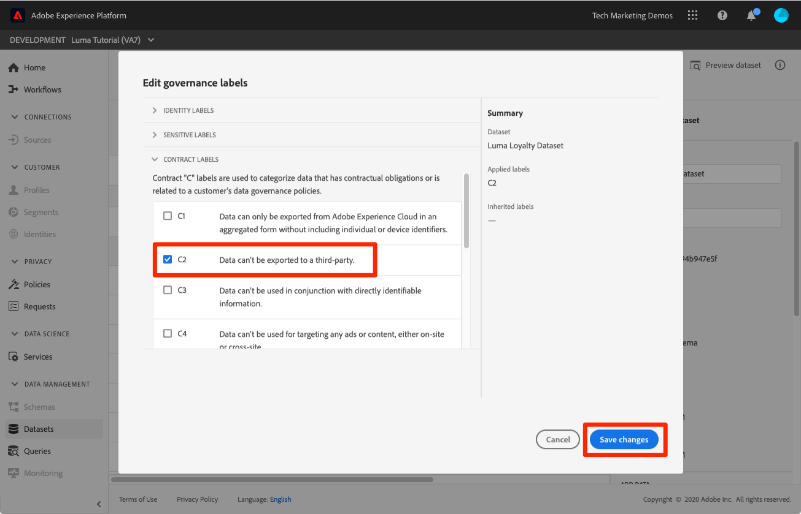

# Het kader voor gegevensbeheer toepassen

<!--15min-->

In deze les, zult u het kader van het gegevensbeheer op de gegevens toepassen u in uw zandbak hebt opgenomen.

Met Adobe Experience Platform Data Governance kunt u klantgegevens beheren en ervoor zorgen dat de regels, beperkingen en beleidsregels die van toepassing zijn op het gebruik van gegevens worden nageleefd. Het speelt een sleutelrol binnen Experience Platform op diverse niveaus, met inbegrip van het controleren van het gebruik van gegevens.

Bekijk voordat u de oefeningen start de volgende korte video&#39;s over gegevensbeheer:
>[!VIDEO](https://video.tv.adobe.com/v/36653?learn=on&enablevpops)

>[!VIDEO](https://video.tv.adobe.com/v/29708?learn=on&enablevpops)

<!--
## Permissions required

In the [Configure Permissions](configure-permissions.md) lesson, you set up all the access controls required to complete this lesson, specifically:

* Permission items **[!UICONTROL Data Governance]** > **[!UICONTROL Manage Usage Labels]**, **[!UICONTROL Manage Data Usage Policies]** and **[!UICONTROL View Data Usage Policies]**
* Permission items **[!UICONTROL Data Management]** > **[!UICONTROL View Datasets]** and **[!UICONTROL Manage Datasets]**
* Permission item **[!UICONTROL Sandboxes]** > `Luma Tutorial`
* User-role access to the `Luma Tutorial Platform` Product Profile
-->

## Bedrijfscenario

Luma doet een belofte aan leden van hun Loyalty-programma, dat Loyalty-gegevens niet met derden zullen worden gedeeld. Wij zullen dit scenario in de rest van de les uitvoeren.

## Labels voor gegevensbeheer toepassen

De eerste stap in het gegevensbeheerproces is het toepassen van governancelabels op uw gegevens. Voordat we dat doen, moeten we even kijken naar de labels die beschikbaar zijn:

1. Selecteer in de gebruikersinterface van Platform de optie **[!UICONTROL Policies]** in de linkernavigatie
1. Ga naar het tabblad **[!UICONTROL Labels]** om alle labels in de account weer te geven.

Er zijn veel labels buiten de doos, plus u kunt uw creëren via de knoop [!UICONTROL Create label]. Er zijn drie hoofdtypen: [!UICONTROL Contract labels] , [!UICONTROL Identity labels] en [!UICONTROL Sensitive labels] die overeenkomen met algemene redenen waarom gegevens mogelijk beperkt zijn. Elk van de labels heeft een [!UICONTROL Friendly Name] en een korte [!UICONTROL Name] . Dit is slechts een afkorting van het type en een getal. Het label [!DNL C1] is bijvoorbeeld voor &#39;Geen export van derden&#39;, wat we nodig hebben voor ons kwaliteitsbeleid.

Nu is het tijd om de gegevens te etiketteren waarvan gebruik wij willen beperken:

1. Selecteer in de gebruikersinterface van Platform de optie **[!UICONTROL Datasets]** in de linkernavigatie
1. De `Luma Loyalty Dataset` openen
1. Ga naar de tab **[!UICONTROL Data Governance]**
1. U kunt labels toepassen op afzonderlijke velden of deze toepassen op de gehele gegevensset. Wij zullen het etiket op de volledige dataset toepassen. Klik op het potloodpictogram. Als u het pictogram niet ziet, maakt u uw browser breder of schuift u het middelste deelvenster naar rechts.
   
1. Vouw in het modaal de sectie **[!UICONTROL Contract Labels]** uit en controleer het label **[!UICONTROL C2]** .
1. Selecteer de knop **[!UICONTROL Save changes]**
   
1. Als u terugkeert naar het hoofdscherm van [!UICONTROL Data Governance] en de schakeloptie **[!UICONTROL Show inherited labels]** inschakelt, kunt u zien hoe het label is toegepast op alle velden in de gegevensset.
   

<!--adding extra, unnecessary fields from field groups makes it harder to see which fields really need labels-->
<!--Are there any best practices for applying governance labels-->

## Beleid voor gegevensbeheer maken

Nu onze gegevens gelabeld zijn, kunnen we een beleid maken.

1. Selecteer in de gebruikersinterface van Platform de optie **[!UICONTROL Policies]** in de linkernavigatie
1. Op het Browse lusje, is er reeds een uit-van-de-doos beleid genoemd &quot;de uitvoerbeperking van de derde partij&quot;die het etiket C2 met de marketing actie [!UICONTROL Export to Third Party] associeert - precies wat wij nodig hebben!
1. Selecteer het beleid en schakel het vervolgens in via de **[!UICONTROL Policy status]** -schakeloptie
   

U kunt uw eigen beleid maken door de knop **[!UICONTROL Create policy]** te selecteren. Hierdoor wordt een wizard geopend waarmee u meerdere labels en beperkingen voor marketingacties kunt combineren.

## Beleid inzake governance afdwingen

Handhaving van het governancebeleid is duidelijk een essentieel onderdeel van het kader. De handhaving gebeurt stroomafwaarts wanneer gegevens worden geactiveerd en verzonden vanuit Platform, met name met de Real-Time Customer Data Platform, die u al dan niet in licentie geeft. Hoe dan ook, het valt buiten het bereik van deze zelfstudie. Maar dus je blijft niet hangen, je kunt meer leren over hoe beleid wordt afgedwongen in deze video, die ik in de rij heb gezet voor het relevante gedeelte. Het zal u ook tonen wat gebeurt wanneer een beleid wordt geschonden.

>[!VIDEO](https://video.tv.adobe.com/v/33631/?t=151&quality=12&learn=on&enablevpops)

## Aanvullende bronnen

* [ documentatie van het Beheer van Gegevens ](https://experienceleague.adobe.com/docs/experience-platform/data-governance/home.html)
* [ Verwijzing van de Dienst API van de Dataset ](https://www.adobe.io/experience-platform-apis/references/dataset-service/)
* [ de Verwijzing van de Dienst API van het Beleid van het Beleid van het Beheer ](https://www.adobe.io/experience-platform-apis/references/policy-service/)

Nu gaan op [ vraagdienst ](run-queries.md).
