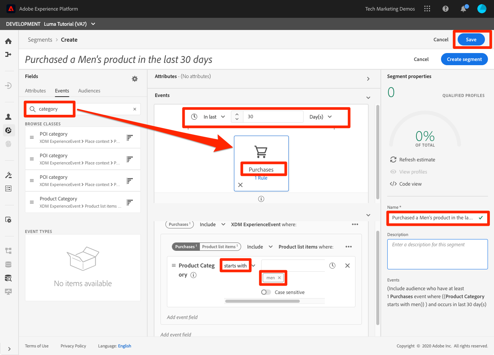

# Segmenten maken

<!-- 30 min-->
In deze les, zullen wij sommige segmenten bouwen die op de profielgegevens worden gebaseerd die wij in de vorige lessen hebben opgenomen.

Zodra u de Profielen van de Klant in real time hebt, kunt u segmenten van individuen tot stand brengen die gelijkaardige eigenschappen delen en op gelijkaardige wijze aan marketing strategieën zouden kunnen antwoorden. De bouwstenen van deze segmenten zijn de XDM gebieden die u vroeger creeerde.

**Architecten van Gegevens** zullen segmenten buiten dit leerprogramma moeten tot stand brengen en hun collega&#39;s met deze taak steunen.

Voordat u de oefeningen start, bekijkt u deze korte video voor meer informatie over het maken van segmenten:
>[!VIDEO](https://video.tv.adobe.com/v/27254?learn=on&enablevpops)

## Vereiste machtigingen

In [ vorm de 1&rbrace; les van Toestemmingen &lbrace;, u opstelling alle toegangscontroles die worden vereist om deze les te voltooien, specifiek:](configure-permissions.md)

* Machtigingspunten **[!UICONTROL Profile Management]** > **[!UICONTROL Manage Segments]** , **[!UICONTROL View Segments]** en **[!UICONTROL Export Audience Segment]**
* Machtigingspunten **[!UICONTROL Profile Management]** > **[!UICONTROL View Profiles]** en **[!UICONTROL Manage Profiles]**
* Machtigingspunt **[!UICONTROL Sandboxes]** > `Luma Tutorial`
* Toegang tot het productprofiel van `Luma Tutorial Platform` door de gebruikersrol
* Toegang tot het productprofiel van `Luma Tutorial Platform` (voor API) voor de rol van ontwikkelaar

## Een basissegment maken

Laten we een eenvoudig segment maken voor klanten van een loyaliteitsprogramma met een Gold- of Platinum Status

1. Ga in de gebruikersinterface van het Platform naar **[!UICONTROL Segments]** in de linkernavigatie
1. Selecteer de knop **[!UICONTROL Create segment]**
1. Op de linkerzijde van de schemabouwer zijn drie lusjes voor Attributen (de gegevens van het Verslag), Gebeurtenissen (de gegevens van de tijd-reeksen), en Publiek
1. Selecteer het tandwielpictogram om op te merken hoe de segmentbouwer standaard slechts u gebieden met gegevens toont en staat u toe om het samenvoegbeleid te veranderen
1. In het lusje van Attributen, navigeer aan **XDM Individueel Profiel > Loyalty** omslag (u kon ook naar &quot;loyaliteit&quot;zoeken)
1. Sleep `Tier` van het menu Kenmerkvelden naar het canvas van de segmentbuilder
1. Selecteer `Tier` gelijk aan `Gold` of `Platinum`
1. Selecteer **[!UICONTROL Refresh estimate]** om te zien hoeveel profielen in aanmerking komen voor uw segment
1. Als **[!UICONTROL Name]** voert u `Luma customers with level Gold or Above` in
1. Selecteren **[!UICONTROL Save]**
   

<!--## Build a sequential segment-->

## Een dynamisch segment maken

In deze oefening, zullen wij een segment voor klanten creëren die het zelfde product tweemaal binnen 30 dagen hebben gekocht. Met dynamische segmenten kunt u de segmentatie schalen door velden als variabelen te gebruiken.

1. Ga naar **[!UICONTROL Segments]** in de linkernavigatie
1. Selecteer de knop **[!UICONTROL Create segment]**
1. Selecteer de tab **[!UICONTROL Events]**
1. De lijst filteren op `purchases`
1. Sleep het **[!UICONTROL Purchases]** gebeurtenistype op het canvas _twee afzonderlijke tijden_
1. Selecteer het klokpictogram tussen de twee **[!UICONTROL Purchases]** -gebeurtenissen en kies &quot;binnen 30 dagen&quot;
1. Bevestig dat uw segmentdefinitie op dit punt **&quot;omvat publiek die minstens 1 gebeurtenis van Aankopen dan binnen 30 dagen heeft minstens 1 gebeurtenis van Aankopen&quot;heeft**
   
1. Wijzig nu het gebeurtenisfilter in `sku`
1. Sleep het veld SKU naar de tweede aankoopgebeurtenis
   
1. Wis nu het gebeurtenisfilter
1. In de **[!UICONTROL Browse Variables]** -sectie ziet u mappen voor de twee aankoopgebeurtenissen. Klik om te verkennen **[!UICONTROL Purchases 1]**\
   
1. Ga omlaag naar de map **[!UICONTROL Product list items]** , selecteer het veld **[!UICONTROL SKU]** en sleep dit naar de rechterkant van de operand **[!UICONTROL equals]** . Wanneer u de cursor op het gebied plaatst, zet u de aanwijzer neer in de sectie &quot;Toevoegen om operands te vergelijken&quot;
1. Geef het segment een naam `Bought same product within 30 days`
1. Bevestig dat uw publieksdefinitie **&quot;omvat publiek is die minstens 1 de gebeurtenis van Aankopen dan binnen 30 dagen hebben heeft minstens 1 de gebeurtenis van Aankopen waar (SKU evenaart aan Aankopen1 SKU)&quot;**
1. Selecteer de knop **[!UICONTROL Save]**

   

## Een segment met meerdere entiteiten maken

Herinner hoe wij de verhouding tussen `Luma Offline Purchase Events Schema` en `Luma Product Catalog Schema` in vroegere lessen creeerden? We deden dat zodat we de relatie in ons schema konden gebruiken met behulp van segmentatie met meerdere entiteiten.

Met de geavanceerde functie voor segmentatie van meerdere entiteiten kunt u segmenten maken met behulp van meerdere XDM-klassen om uw schema&#39;s uit te breiden. Dientengevolge, kan de segmentbouwer tot extra gebieden toegang hebben alsof zij aan de opslag van profielgegevens inheems waren

U zult het volgende segment tot stand brengen door de verhouding toe te passen u tussen uw `Luma Product Catalog Schema` en uw `Luma Offline Purchase Events Schema` bouwde.

1. Ga naar **[!UICONTROL Segments]** in de linkernavigatie
1. Selecteer de knop **[!UICONTROL Create segment]**
1. Selecteer de tab **[!UICONTROL Events]**
1. De lijst filteren op `purchases`
1. Sleep het gebeurtenistype **[!UICONTROL Purchases]** naar het canvas
1. Selecteer het vervolgkeuzemenu van de klok boven de gebeurtenis en kies **[!UICONTROL in last 30 days]**
1. Filter de lijst **[!UICONTROL Events]** naar `category` en sleep het veld **[!UICONTROL Product Category]** naar **[!UICONTROL Purchases]**
1. De operator wijzigen in **[!UICONTROL starts with]** en `men` invoeren in het tekstvak
1. Als **[!UICONTROL Name]** voert u `Purchased a Men's product in the last 30 days` in
1. De publieksdefinitie bevestigen `(Include audience who have at least 1 Purchases event where ((Product Category starts with men)) ) and occurs in last 30 day(s)`
1. Selecteer de knop **[!UICONTROL Save]**

   

## Segmentering in batch- en streaming

Klik op **[!UICONTROL Segments]** in de linkernavigatie en laten we even kijken naar onze drie segmenten:

* Twee van onze segmenten zijn batchsegmenten en één is een streaming segment.
* Platform blijft aan het stromen segmentatie waar mogelijk in gebreke, kwalificerend de klant voor een segment zodra zij aan de criteria voldoen. Wanneer segmentdefinities te complex zijn voor streaming, worden deze automatisch omgezet in batch. In dit geval werden de twee segmenten standaard in batch geplaatst omdat het terugkijkvenster van de aankoopgebeurtenissen langer was dan zeven dagen. Voor een volledige en huidige lijst van het stromen beperkingen, zie [ de documentatie ](https://experienceleague.adobe.com/docs/experience-platform/segmentation/ui/streaming-segmentation.html).
* De batchtaken worden dagelijks uitgevoerd en kunnen worden uitgeschakeld.

## Aanvullende bronnen

* [ documentatie van de Dienst van de Segmentatie ](https://experienceleague.adobe.com/docs/experience-platform/segmentation/home.html)
* [ de Verwijzing van de Dienst API van de Segmentatie ](https://www.adobe.io/experience-platform-apis/references/segmentation/)

segmentatie is veel belangrijker, vooral bij het activeren van segmenten. Deze onderwerpen zullen in een andere zelfstudie worden besproken.

Je hebt het gemaakt door alle oefeningen! Gelieve te werk te gaan aan de [ conclusie ](conclusion.md).
