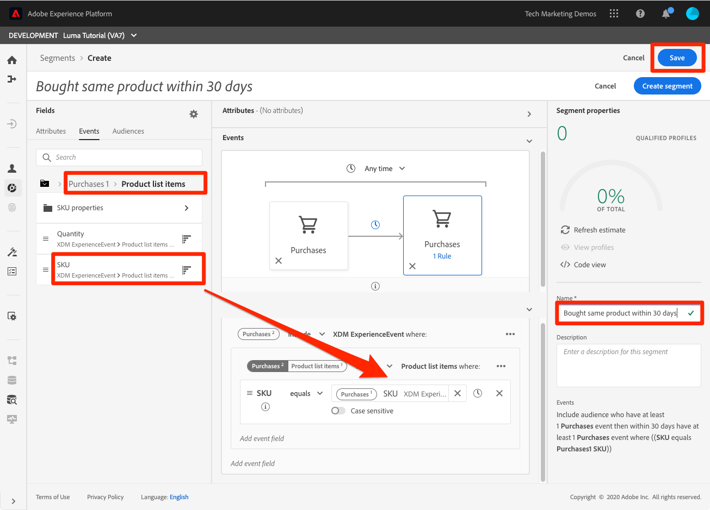

# Segmenten maken

<!-- 30 min-->
In deze les, zullen wij sommige segmenten bouwen die op de profielgegevens worden gebaseerd die wij in de vorige lessen hebben opgenomen.

Zodra u de Profielen van de Klant in real time hebt, kunt u segmenten van individuen tot stand brengen die gelijkaardige eigenschappen delen en op gelijkaardige wijze aan marketing strategieën zouden kunnen antwoorden. De bouwstenen van deze segmenten zijn de XDM gebieden die u vroeger creeerde.

**Gegevensarchitecten** zal segmenten buiten deze zelfstudie moeten creëren en hun collega&#39;s met deze taak steunen.

Voordat u de oefeningen start, bekijkt u deze korte video voor meer informatie over het maken van segmenten:
>[!VIDEO](https://video.tv.adobe.com/v/27254?quality=12&learn=on)

## Vereiste machtigingen

In de [Machtigingen configureren](configure-permissions.md) les, plaatst u opstelling alle toegangscontroles die worden vereist om deze les te voltooien, specifiek:

* Machtigingsonderdelen **[!UICONTROL Profielbeheer]** > **[!UICONTROL Segmenten beheren]**, **[!UICONTROL Segmenten weergeven]**, en **[!UICONTROL Audience-segment exporteren]**
* Machtigingsonderdelen **[!UICONTROL Profielbeheer]** > **[!UICONTROL Profielen weergeven]**, en **[!UICONTROL Profielen beheren]**
* Machtigingsitem **[!UICONTROL Sandboxen]** > `Luma Tutorial`
* Toegang tot de `Luma Tutorial Platform` productprofiel
* Toegang tot de rol van ontwikkelaar tot de `Luma Tutorial Platform` productprofiel (voor API)

## Een basissegment maken

Laten we een eenvoudig segment maken voor klanten van een loyaliteitsprogramma met een Gold- of Platinum Status

1. Ga in de gebruikersinterface van het Platform naar **[!UICONTROL Segmenten]** in de linkernavigatie
1. Selecteer **[!UICONTROL Segment maken]** knop
1. Op de linkerzijde van de schemabouwer zijn drie lusjes voor Attributen (de gegevens van het Verslag), Gebeurtenissen (de gegevens van de tijd-reeksen), en Publiek
1. Selecteer het tandwielpictogram om op te merken hoe de segmentbouwer standaard slechts u gebieden met gegevens toont en staat u toe om het samenvoegbeleid te veranderen
1. Navigeer op het tabblad Kenmerken naar het tabblad **XDM Individueel profiel > Loyalty** map (u kunt ook zoeken naar &quot;loyaliteit&quot;)
1. Slepen en neerzetten, `Tier` van het menu van de attributengebieden aan het segment bouwercanvas
1. Selecteren `Tier` equals `Gold` of `Platinum`
1. Selecteren **[!UICONTROL Raming vernieuwen]** om te zien hoeveel profielen in aanmerking komen voor uw segment
1. Als de **[!UICONTROL Naam]**, enter `Luma customers with level Gold or Above`
1. Selecteren **[!UICONTROL Opslaan]**
   

<!--## Build a sequential segment-->

## Een dynamisch segment maken

In deze oefening, zullen wij een segment voor klanten creëren die het zelfde product tweemaal binnen 30 dagen hebben gekocht. Met dynamische segmenten kunt u de segmentatie schalen door velden als variabelen te gebruiken.

1. Ga naar **[!UICONTROL Segmenten]** in de linkernavigatie
1. Selecteer **[!UICONTROL Segment maken]** knop
1. Selecteer **[!UICONTROL Gebeurtenissen]** tab
1. De lijst filteren op `purchases`
1. Sleep de **[!UICONTROL Aankopen]** gebeurtenistype op het canvas _twee afzonderlijke tijden_
1. Het klokpictogram tussen beide selecteren **[!UICONTROL Aankopen]** en kies &quot;binnen 30 dagen&quot;
1. Bevestig dat uw segmentdefinitie op dit punt leest **&quot;Neem een publiek op dat minstens 1 aankoopgebeurtenis heeft en dat vervolgens binnen 30 dagen minstens 1 aankoopgebeurtenis heeft&quot;**

   
1. Wijzig nu het gebeurtenisfilter in `sku`
1. Sleep het veld SKU naar de tweede aankoopgebeurtenis
   
1. Wis nu het gebeurtenisfilter
1. U moet de **[!UICONTROL Door variabelen bladeren]** , zijn er mappen voor de twee aankoopgebeurtenissen. Klik om te verkennen **[!UICONTROL Aankopen 1]**\
   
1. Boor neer in de **[!UICONTROL Objecten in de productlijst]** map, selecteert u de **[!UICONTROL SKU]** en sleep het naar de rechterkant van het **[!UICONTROL equals]** operand. Wanneer u de cursor op het gebied plaatst, zet u de aanwijzer neer in de sectie &quot;Toevoegen om operands te vergelijken&quot;
1. Geef uw segment een naam `Bought same product within 30 days`
1. Bevestig dat uw publieksdefinitie is **&quot;Neem een publiek op dat minstens 1 aankoopgebeurtenis heeft en dat vervolgens binnen 30 dagen ten minste 1 aankoopgebeurtenis heeft (SKU is gelijk aan Aankopen1 SKU)&quot;**
1. Selecteer **[!UICONTROL Opslaan]** knop

   

## Een segment met meerdere entiteiten maken

Onthoud hoe we de relatie tussen de `Luma Offline Purchase Events Schema` en de `Luma Product Catalog Schema` in eerdere lessen ? We deden dat zodat we de relatie in ons schema konden gebruiken met behulp van segmentatie met meerdere entiteiten.

Met de geavanceerde functie voor segmentatie van meerdere entiteiten kunt u segmenten maken met behulp van meerdere XDM-klassen om uw schema&#39;s uit te breiden. Dientengevolge, kan de segmentbouwer tot extra gebieden toegang hebben alsof zij aan de opslag van profielgegevens inheems waren

U zult het volgende segment tot stand brengen door de verhouding toe te passen u tussen uw bouwde `Luma Product Catalog Schema` en uw `Luma Offline Purchase Events Schema`.

1. Ga naar **[!UICONTROL Segmenten]** in de linkernavigatie
1. Selecteer **[!UICONTROL Segment maken]** knop
1. Selecteer **[!UICONTROL Gebeurtenissen]** tab
1. De lijst filteren op `purchases`
1. Sleep de **[!UICONTROL Aankopen]** gebeurtenistype op het canvas
1. Selecteer het keuzemenu van de klok boven de gebeurtenis en kies **[!UICONTROL in de afgelopen 30 dagen]**
1. Filter de **[!UICONTROL Gebeurtenissen]** lijst naar `category` en sleep vervolgens de **[!UICONTROL Productcategorie]** veld op **[!UICONTROL Aankopen]**
1. De operator wijzigen in **[!UICONTROL begint met]** en betreden `men` in het tekstvak
1. Als de **[!UICONTROL Naam]**, enter `Purchased a Men's product in the last 30 days`
1. De publieksdefinitie bevestigen `(Include audience who have at least 1 Purchases event where ((Product Category starts with men)) ) and occurs in last 30 day(s)`
1. Selecteer **[!UICONTROL Opslaan]** knop

   

## Segmentering in batch- en streaming

Klikken op **[!UICONTROL Segmenten]** in de linkernavigatie en laten we even kijken naar onze drie segmenten :

* Twee van onze segmenten zijn batchsegmenten en één is een streaming segment.
* Platform is standaard segmentatie aan het streamen wanneer dat mogelijk is, waarbij de klant voor een segment in aanmerking komt zodra deze aan de criteria voldoet. Wanneer segmentdefinities te complex zijn voor streaming, worden deze automatisch omgezet in batch. In dit geval werden de twee segmenten standaard in batch geplaatst omdat het terugkijkvenster van de aankoopgebeurtenissen langer was dan zeven dagen. Voor een volledige en huidige lijst met streamingbeperkingen raadpleegt u [de documentatie](https://experienceleague.adobe.com/docs/experience-platform/segmentation/ui/streaming-segmentation.html).
* De batchtaken worden dagelijks uitgevoerd en kunnen worden uitgeschakeld.

## Aanvullende bronnen

* [Documentatie voor segmentatieservice](https://experienceleague.adobe.com/docs/experience-platform/segmentation/home.html)
* [Verwijzing naar API voor segmentatieservice](https://www.adobe.io/experience-platform-apis/references/segmentation/)

segmentatie is veel belangrijker, vooral bij het activeren van segmenten. Deze onderwerpen zullen in een andere zelfstudie worden besproken.

Je hebt het gemaakt door alle oefeningen! Ga door naar [conclusie](conclusion.md).
