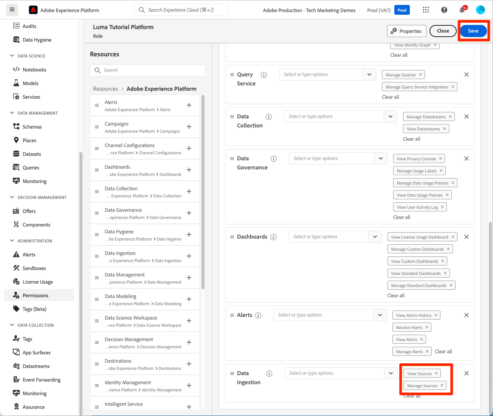

# Machtigingen configureren

<!--30min-->

In deze les configureert u Adobe Experience Platform-gebruikersmachtigingen met behulp van [!DNL Adobe's Admin Console] en het scherm [!UICONTROL Permissions] in de interface Platform.

Toegangsbeheer is een sleutelfunctie voor privacy in Experience Platform en wij raden u aan de machtigingen tot het minimum te beperken dat vereist is voor het uitvoeren van hun taakfuncties. Zie de [ documentatie van het Toegangsbeheer ](https://experienceleague.adobe.com/docs/experience-platform/access-control/home.html) voor meer informatie.

Data Architects en Data Engineers zijn krachtige gebruikers van Adobe Experience Platform en u hebt veel machtigingen nodig om deze zelfstudie en later in uw dagelijkse werk te kunnen voltooien. De Architecten van gegevens zijn waarschijnlijk betrokken bij het beleid van *andere gebruikers van het Platform* bij hun bedrijf zoals marketers, analisten, en gegevenswetenschappers. Aangezien u deze les voltooit, denk over hoe u deze eigenschappen zou kunnen gebruiken om andere gebruikers bij uw bedrijf te beheren.

**Architecten van Gegevens** vormen vaak toestemmingen voor andere gebruikers buiten dit leerprogramma.

>[!IMPORTANT]
>
>Een beheerder van het Systeem van de producten van Adobe Experience Cloud moet enkele stappen in deze les voltooien, die in de sectiekoppen wordt geroepen. Als u geen Beheerder van het Systeem bent, te bereiken gelieve bij uw bedrijf en hen te vragen deze taken te voltooien. Er is ook een taak zij tijdens de [ Opstelling Developer Console en Postman ](set-up-developer-console-and-postman.md) les moeten voltooien.

## Over de Admin Console

[!DNL Admin Console] is de interface die wordt gebruikt om gebruikerstoegang tot alle Adobe Experience Cloud-producten te beheren. Voor toegang tot Platform, moet een gebruiker of in de Admin Console worden toegevoegd en dan worden elk van hun korrelige toestemmingspunten beheerd in het scherm van Toestemmingen van Adobe Experience Platform.

Hier volgt een korte samenvatting van de rollen die voor Platform bestaan:

* **Gebruikers** van een productprofiel kunnen taken in het gebruikersinterface van het Platform volgens de toestemmingen voltooien die in het productprofiel worden toegewezen.
* **de Ontwikkelaars** kunnen API geloofsbrieven en projecten in Adobe Developer Console tot stand brengen, beginnen gebruikend Experience Platform API te gebruiken
* **Admins van het Product** kan gebruikers en ontwikkelaars aan het product van Adobe Experience Platform in Adobe Admin Console toevoegen, evenals granulaire gebruikerstoegang in het scherm van Toestemmingen van de interface van het Platform beheren.
* **de Beheerders van het Systeem** kunnen productbeheerders toevoegen en hoofdzakelijk om het even welke toestemmingen voor alle producten van Adobe Experience Cloud beheren.

## Een gebruiker en ontwikkelaar toevoegen aan het productprofiel van `AEP-Default-All-Users` (hiervoor is een systeembeheerder of productbeheerder vereist)

Hierbij voegt u of een systeembeheerder of productbeheerder u toe als gebruiker en ontwikkelaar in het Adobe Experience Platform-product van de Adobe Admin Console.

>[!NOTE]
>
>Als u een Beheerder van het Systeem een collega die dit leerprogramma neemt bijstaat, denk na toevoegend uw collega als Beheerder van het a *Product* voor Adobe Experience Platform. Als productbeheerder kunnen ze deze stappen zelfstandig uitvoeren en in de toekomst andere gebruikers in de Experience Platform beheren.

De tutorial participant toevoegen als a [!UICONTROL User] en [!UICONTROL Developer] :

1. Logboek in [ Adobe Admin Console ](https://adminconsole.adobe.com)
1. Selecteer **[!UICONTROL Products]** op de bovenste navigatie
1. Selecteer **Adobe Experience Platform**
   
1. U hebt mogelijk al meerdere profielen in uw Experience Platform-instantie. Selecteer het profiel `AEP-Default-All-Users`
   

1. Ga naar de tab **[!UICONTROL Users]**
1. Selecteer de knop **[!UICONTROL Add User]**
   
1. Voltooi de workflow om de zelfstudie-deelnemer als gebruiker toe te voegen aan het productprofiel

1. Ga naar de tab **[!UICONTROL Developers]**
1. Selecteer de knop **[!UICONTROL Add Developer]**
   
1. Voltooi de workflow om de tutorial deelnemer als ontwikkelaar toe te voegen aan het productprofiel

## Een rol toevoegen in Adobe Experience Platform (hiervoor is een systeembeheerder of productbeheerder vereist)

De korrelige toestemmingen aan Experience Platform worden beheerd in het scherm van Toestemmingen van de interface van het Platform. Alleen systeem- en productbeheerders hebben toegang tot dit scherm, dus als u geen beheerdersrechten hebt, hebt u hulp nodig van iemand die dit doet.

De toestemmingen worden beheerd in Rollen. Een rol maken voor de zelfstudie:

1. Logboek in [ Adobe Experience Platform ](https://platform.adobe.com)
1. Selecteer **[!UICONTROL Permissions]** in de linkernavigatie die u naar het [!UICONTROL Roles] -scherm brengt.
1. Selecteren **[!UICONTROL Create role]**

   
1. Geef een naam op voor de rol `Luma Tutorial Platform` (voeg de naam van de tutorial-deelnemer toe aan het einde als meerdere personen van uw bedrijf deze zelfstudie volgen) en selecteer **[!UICONTROL Confirm]**

   

1. Voeg met **[!UICONTROL +]** en **[!UICONTROL Add all]** alle machtigingsitems voor de volgende bronnen toe:

   1. Gegevensmodellering
   1. Data management
   1. Profielbeheer
   1. Identity Management
   1. Sandbox-beheer
   1. Query-service
   1. Dataverzameling
   1. Gegevensbeheer
   1. Dashboards
   1. Waarschuwingen

       toe

1. Onder de Ingestie van Gegevens, voeg de Manage Bronnen en de punten van de de toestemmingstoestemming van de Mening toe.

1. Nadat u alle machtigingsitems hebt toegevoegd, moet u de knop Opslaan selecteren
   

U zult een paar kleine updates aan deze rol na [ maken een zandbak ](create-a-sandbox.md) en [ Opstelling Developer Console en Postman ](set-up-developer-console-and-postman.md) lessen creëren.

## Een productprofiel voor gegevensverzameling maken (hiervoor is een systeembeheerder of productbeheerder vereist)

In deze oefening, zult u of een Beheerder van het Systeem bij uw bedrijf een productprofiel voor de Inzameling van Gegevens (vroeger genoemd als Adobe Experience Platform Launch) creëren en zult u als beheer van het productprofiel toevoegen.

>[!NOTE]
>
>Als u een Beheerder van het Systeem een collega met dit leerprogramma bijstaat, denk na toevoegend hen als Beheerder van het a *Product* voor de Inzameling van Gegevens. Als Beheerder van het Product, zullen zij deze stappen op hun kunnen voltooien en andere gebruikers van de Inzameling van Gegevens in de toekomst beheren.

Het productprofiel maken:

1. Ga in de [!DNL Adobe Admin Console] naar het Adobe Experience Platform Data Collection-product
1. Een nieuw profiel met de naam `Luma Tutorial Data Collection` toevoegen (voeg de naam van de deelnemer aan de zelfstudie toe aan het einde als meerdere personen van uw bedrijf deze zelfstudie volgen)
1. De instelling **[!UICONTROL Properties]** > **[!UICONTROL Auto-include]** uitschakelen
1. Wijs op dit punt geen eigenschappen of machtigingen toe
1. De tutorial-deelnemer toevoegen als beheerder van dit profiel

Nadat u deze stappen hebt uitgevoerd, ziet u dat het `Luma Tutorial Data Collection` -profiel is ingesteld met één beheerder.

## Het productprofiel voor gegevensverzameling configureren

Nu u een beheerder bent van het productprofiel van `Luma Tutorial Data Collection` kunt u de machtigingen en rollen configureren die u nodig hebt om de zelfstudie te voltooien.

### Machtigingen toevoegen

Nu gaat u de afzonderlijke machtigingsitems toevoegen aan het profiel:

1. In [ Adobe Admin Console ](https://adminconsole.adobe.com), ga **[!UICONTROL Products]** > **[!UICONTROL Data Collection]**
1. Het profiel `Luma Tutorial Data Collection` openen
1. Ga naar de tab **[!UICONTROL Permissions]**
1. Openen **[!UICONTROL Platforms]**
1. Zorg ervoor dat alle beschikbare platforms zijn geselecteerd (u ziet mogelijk verschillende opties op basis van uw licentie)
1. **[!UICONTROL Save]** alle wijzigingen
    toe
1. Openen **[!UICONTROL Properties]**
1. Zorg ervoor dat de schakeloptie **[!UICONTROL Auto-Include]** uit is, zodat u geen toegang hebt tot eigenschappen (we voegen deze later toe)
1. **[!UICONTROL Save]** alle wijzigingen
   
1. Openen **[!UICONTROL Property Rights]**
1. Selecteer **[!UICONTROL Add all]** om alle eigenschapsmachtigingen toe te voegen
1. **[!UICONTROL Save]**
   
1. Openen **[!UICONTROL Company Rights]**
1. Toevoegen **[!UICONTROL Manage Properties]**
1. Selecteren **[!UICONTROL Save]**
   

### uzelf toevoegen als gebruiker

Voeg nu uzelf toe als gebruiker aan het profiel voor gegevensverzameling:

1. Ga naar de tab **[!UICONTROL Users]**
1. Selecteer de knop **[!UICONTROL Add User]**
   
1. Voltooi de workflow om uzelf als gebruiker toe te voegen aan het productprofiel

U te hoeven niet om zich als Ontwikkelaar voor de Inzameling van Gegevens toe te voegen.

Nu hebt u bijna alle vereiste machtigingen om de zelfstudie te voltooien! Er zullen enkel twee meer tweaks zijn die u binnen [!DNL Adobe Admin Console] zult maken, met inbegrip van één nadat u [ een zandbak ](create-a-sandbox.md) creeert!
