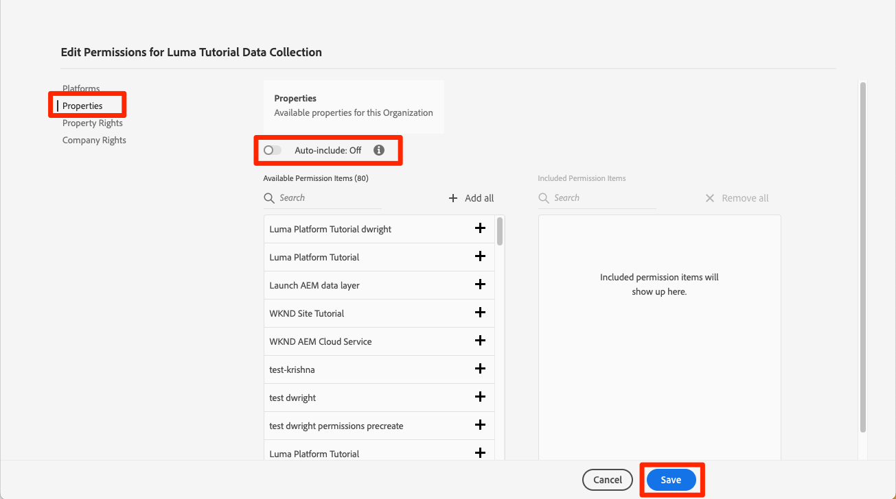

# Machtigingen configureren

<!--30min-->

In deze les configureert u Adobe Experience Platform-gebruikersmachtigingen met [!DNL Adobe's Admin Console].

Toegangsbeheer is een sleutelfunctie voor privacy in Experience Platform en wij raden u aan de machtigingen tot het minimum te beperken dat vereist is voor het uitvoeren van hun taakfuncties. Zie de [Documentatie over toegangsbeheer](https://experienceleague.adobe.com/docs/experience-platform/access-control/home.html) voor meer informatie .

Data Architects en Data Engineers zijn krachtige gebruikers van Adobe Experience Platform en u hebt veel machtigingen nodig om deze zelfstudie en later in uw dagelijkse werk te kunnen voltooien. Data Architects zijn waarschijnlijk betrokken bij het beheer van *andere gebruikers van Platform* op hun bedrijf, zoals marketers, analisten en data wetenschappers. Aangezien u deze les voltooit, denk over hoe u deze eigenschappen zou kunnen gebruiken om andere gebruikers bij uw bedrijf te beheren.

**Gegevensarchitecten** Vaak vormen toestemmingen voor andere gebruikers buiten dit leerprogramma.

>[!IMPORTANT]
>
>Een beheerder van het Systeem van de producten van Adobe Experience Cloud moet enkele stappen in deze les voltooien, die in de sectiekoppen wordt geroepen. Als u geen Beheerder van het Systeem bent, te bereiken gelieve bij uw bedrijf en hen te vragen deze taken voltooien.

## Over de Admin Console

De [!DNL Admin Console] is de interface die wordt gebruikt om gebruikerstoegang tot alle producten van Adobe Experience Cloud te beheren. Zie [Adobe Admin Console-documentatie](https://helpx.adobe.com/nl/enterprise/using/admin-console.html) voor meer gedetailleerde informatie. Hier volgen enkele voorbeelden [!DNL Admin Console] concepten:

* A **productprofiel** is een combinatie toestemmingen, rollen, en zandbakmilieu&#39;s verbonden aan een specifiek product van Adobe. U kunt meerdere productprofielen maken voor één Adobe-product. Een &quot;Marketer&quot;-profiel kan bijvoorbeeld de machtigingen beperken tot wat een typische markator nodig heeft om belangrijke taken uit te voeren in de omgeving van het productie-Platform, terwijl een &quot;Data Architect&quot;-profiel kan worden gebruikt om verschillende machtigingen te verlenen in omgevingen met meerdere Platforms. In deze les zult u een &quot;Luma Tutorial&quot;productprofiel met alle toestemmingen tot stand brengen een Architect van Gegevens en een Ingenieur van Gegevens zouden deze zelfstudie in een zandbakmilieu moeten voltooien.
* An **integratie** is een verbinding met een *project* in de Adobe Developer Console. De Adobe Developer-console vormt de kern van verificatie en configuratie van Adobe-API&#39;s. U configureert een integratie in de Developer Console en [!DNL Postman] les.

Hier volgt een kort overzicht van de rollen die voor Platform bestaan:

* **Gebruikers** van een productprofiel kunnen taken in de gebruikersinterface van het Platform uitvoeren op basis van de machtigingen die in het productprofiel zijn toegewezen.
* **Ontwikkelaars** van een productprofiel kunnen taken uitvoeren met de API van het Platform volgens de machtigingen in het productprofiel.
* **Productprofielbeheerders** kan bewerken *dat specifieke profiel* en voegt gebruikers, ontwikkelaars en extra profielbeheerders toe.
* **Productbeheerders** kan beheren *alle productprofielen* voor Platform en voeg nieuwe productprofielen toe.
* **Systeembeheerders** U kunt productbeheerders toevoegen en in wezen alle machtigingen voor alle Adobe Experience Cloud-producten beheren.

## Een productprofiel voor een Experience Platform maken (hiervoor is een systeembeheerder of productbeheerder vereist)

In deze exercitie, zult u of een Beheerder van het Systeem bij uw bedrijf een productprofiel voor Adobe Experience Platform tot stand brengen en u als admin voor dat productprofiel toevoegen.

>[!NOTE]
>
>Als u een Beheerder van het Systeem bent die een collega bijstaat die deze zelfstudie neemt, denk na toevoegend uw collega als a *Productbeheerder* voor Adobe Experience Platform. Als productbeheerder kunnen ze deze stappen zelfstandig uitvoeren en in de toekomst andere gebruikers in de Experience Platform beheren.

Het productprofiel maken:

1. Aanmelden bij [Adobe Admin Console](https://adminconsole.adobe.com)
1. Selecteren **[!UICONTROL Producten]** op de bovenste navigatie
1. Selecteren **[!UICONTROL Adobe Experience Platform]** op de linkernavigatie (u kunt moeten uitbreiden **[!UICONTROL Experience Cloud]** deel)
1. U hebt mogelijk al meerdere profielen in uw Experience Platform-instantie. Selecteer **[!UICONTROL Nieuw profiel]** knop om nog een toe te voegen
   
1. Geef het profiel een naam `Luma Tutorial Platform` (voeg de naam van de deelnemer aan de zelfstudie toe aan het einde als meerdere personen van uw bedrijf deze zelfstudie volgen) en selecteer de **[!UICONTROL Volgende]** knop
   
1. Afhankelijk van de details van uw productvergunning, kunt u deze tweede al dan niet zien **[!UICONTROL Services]** scherm. In deze zelfstudie gebruiken we geen van deze services, dus uncheck **[!UICONTROL Alle services inschakelen]** tot *remove* alle services en selecteer **[!UICONTROL Opslaan]**.
   

Voeg nu de tutorial-deelnemer toe als beheerder van het nieuwe productprofiel. Indien *u* zijn de tutorial deelnemer, ga vooruit naar [Productprofiel Experience Platform configureren](#configure-experience-platform-product-profile):

1. Selecteer `Luma Tutorial Platform` productprofiel:

   

1. Selecteer **[!UICONTROL Admins]** en selecteert u vervolgens de **[!UICONTROL Admin toevoegen]** knop:

   

1. Voltooi de werkstroom om de tutorial deelnemer als beheerder toe te voegen.

Nadat u deze stappen hebt uitgevoerd, dient u te controleren of de `Luma Tutorial Platform` -profiel is ingesteld met één beheerder.

## Productprofiel Experience Platform configureren

Nu bent u beheerder van de `Luma Tutorial Platform` productprofiel u kunt de toestemmingen en de rollen vormen u de leerprogramma zult moeten voltooien.

### Machtigingen toevoegen

Nu gaat u de afzonderlijke machtigingsitems toevoegen aan het profiel:

1. Open de `Luma Tutorial Platform` productprofiel
1. Selecteer **[!UICONTROL Machtigingen]** tab
1. Onder **[!UICONTROL Sandboxen]**, voegt u de **[!UICONTROL Prod]** naar het profiel. Het is noodzakelijk toegang te hebben tot [!DNL Prod] sandbox om extra sandboxen te maken. Nadat de zelfstudie-sandbox in de volgende les is toegevoegd, worden de [!DNL Prod] van het productprofiel.
1. Onder [!UICONTROL Gegevensinname], voegt u de [!UICONTROL Bronnen beheren] en [!UICONTROL Bronnen weergeven] machtigingsitems.
1. Voeg alle machtigingsitems toe voor:
   1. [!UICONTROL Gegevensmodellering]
   1. [!UICONTROL Data management]
   1. [!UICONTROL Profielbeheer]
   1. [!UICONTROL Identity Management]
   1. [!UICONTROL Sandbox-beheer]
   1. [!UICONTROL Query-service]
   1. [!UICONTROL Gegevensverzameling]
   1. [!UICONTROL Data Governance]
   1. [!UICONTROL Dashboards]
   1. [!UICONTROL Waarschuwingen]

1. Nadat u alle machtigingsitems hebt toegevoegd, moet u de opdracht **[!UICONTROL Opslaan]** knop

### uzelf toevoegen als gebruiker

Op dit punt, als `Luma Tutorial Platform` was *alleen* Het productprofiel van het Experience Platform, zou u nog niet in de gebruikersinterface van het Experience Platform kunnen registreren. Hiervoor moet u een *user* in het productprofiel. Gelukkig bent u een *beheerder* van een productprofiel kunt u uzelf toevoegen als *user*!

1. Ga naar de **[!UICONTROL Gebruikers]** tab
1. Selecteer **[!UICONTROL Gebruiker toevoegen]** knop
   
1. Voltooi de workflow om uzelf als gebruiker toe te voegen aan het productprofiel

### zichzelf toevoegen als ontwikkelaar

Als u de Platform-API wilt gebruiken, voegt u uzelf toe als ontwikkelaar:

1. Ga naar de **[!UICONTROL Ontwikkelaars]** tab
1. Selecteer **[!UICONTROL Ontwikkelaar toevoegen]** knop
   
1. Voltooi de workflow om uzelf als ontwikkelaar toe te voegen aan het productprofiel

## Een productprofiel voor gegevensverzameling maken (hiervoor is een systeembeheerder of productbeheerder vereist)

In deze oefening, zult u of een Beheerder van het Systeem bij uw bedrijf een productprofiel voor de Inzameling van Gegevens (vroeger genoemd als Adobe Experience Platform Launch) creëren en zult u als beheer van het productprofiel toevoegen.

>[!NOTE]
>
>Als u een Beheerder bent van het Systeem die een collega met deze leerprogramma bijstaat, denk na toevoegend hen als a *Productbeheerder* voor gegevensverzameling. Als Beheerder van het Product, zullen zij deze stappen op hun kunnen voltooien en andere gebruikers van de Inzameling van Gegevens in de toekomst beheren.

Het productprofiel maken:

1. In de [!DNL Adobe Admin Console] Ga naar het Adobe Experience Platform Data Collection-product
1. Een nieuw profiel met de naam toevoegen `Luma Tutorial Data Collection` (voeg de naam van de deelnemer aan de zelfstudie toe aan het einde als meerdere personen van uw bedrijf deze zelfstudie volgen)
1. Schakel de **[!UICONTROL Eigenschappen]** > **[!UICONTROL Automatisch opnemen]** instellen
1. Wijs op dit punt geen eigenschappen of machtigingen toe
1. De tutorial-deelnemer toevoegen als beheerder van dit profiel

Nadat u deze stappen hebt uitgevoerd, dient u te controleren of de `Luma Tutorial Data Collection` -profiel is ingesteld met één beheerder.

## Het productprofiel voor gegevensverzameling configureren

Nu bent u beheerder van de `Luma Tutorial Data Collection` productprofiel u kunt de toestemmingen en de rollen vormen u de leerprogramma zult moeten voltooien.

### Machtigingen toevoegen

Nu gaat u de afzonderlijke machtigingsitems toevoegen aan het profiel:

1. In de [Adobe Admin Console](https://adminconsole.adobe.com), ga naar **[!UICONTROL Producten]** > **[!UICONTROL Gegevensverzameling]**
1. Open de `Luma Tutorial Data Collection` profiel
1. Ga naar de **[!UICONTROL Machtigingen]** tab
1. Openen **[!UICONTROL Platforms]**
1. Zorg ervoor dat alle beschikbare platforms zijn geselecteerd (u ziet mogelijk verschillende opties op basis van uw licentie)
1. **[!UICONTROL Opslaan]** alle wijzigingen
   
1. Openen **[!UICONTROL Eigenschappen]**
1. Zorg ervoor dat de **[!UICONTROL Automatisch opnemen]** toggle is Uit zodat u geen toegang tot eigenschappen hebt (wij zullen later toevoegen)
1. **[!UICONTROL Opslaan]** alle wijzigingen
   
1. Openen **[!UICONTROL Eigendomsrechten]**
1. Selecteren **[!UICONTROL Alles toevoegen]** om alle eigenschapsmachtigingen toe te voegen
1. **[!UICONTROL Opslaan]**
   
1. Openen **[!UICONTROL Bedrijfsrechten]**
1. Toevoegen **[!UICONTROL Eigenschappen beheren]**
1. Selecteren **[!UICONTROL Opslaan]**

   

### uzelf toevoegen als gebruiker

Voeg nu uzelf toe als gebruiker aan het profiel Gegevensverzameling:

1. Ga naar de **[!UICONTROL Gebruikers]** tab
1. Selecteer **[!UICONTROL Gebruiker toevoegen]** knop
   
1. Voltooi de workflow om uzelf als gebruiker toe te voegen aan het productprofiel

U te hoeven niet om zich als Ontwikkelaar voor de Inzameling van Gegevens toe te voegen.

Nu hebt u bijna alle vereiste machtigingen om de zelfstudie te voltooien! Er zullen nog twee tweelingen zijn die je in de [!DNL Adobe Admin Console], inclusief één na u [een sandbox maken](create-a-sandbox.md)!
