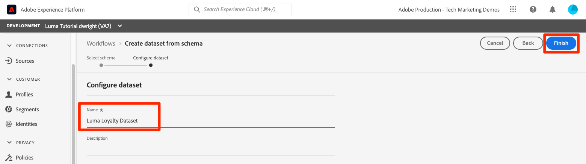

# Gegevenssets maken

<!--15min-->

In deze les, zult u datasets creëren om uw gegevens te ontvangen. U zult blij zijn om te weten dat dit de kortste les in de zelfstudie is!

Alle gegevens die met succes in Adobe Experience Platform worden opgenomen, blijven in het gegevensmeer als datasets bestaan. Een dataset is een opslag en beheersconstructie voor een inzameling van gegevens, typisch een lijst, die een schema (kolommen) en gebieden (rijen) bevat. Datasets bevatten ook metagegevens die verschillende aspecten van de gegevens beschrijven die ze opslaan.

**Gegevensarchitecten** zal datasets buiten dit leerprogramma moeten tot stand brengen.

Voordat u de oefeningen start, bekijkt u deze korte video voor meer informatie over gegevenssets:
>[!VIDEO](https://video.tv.adobe.com/v/27269?quality=12&learn=on)

## Vereiste machtigingen

In de [Machtigingen configureren](configure-permissions.md) les, plaatst u opstelling alle toegangscontroles die worden vereist om deze les te voltooien.

<!--
* Permission items **[!UICONTROL Data Management]** > **[!UICONTROL View Datasets]** and **[!UICONTROL Manage Datasets]**
* Permission item **[!UICONTROL Sandboxes]** > `Luma Tutorial`
* User-role access to the `Luma Tutorial Platform` product profile
* Developer-role access to the `Luma Tutorial Platform` product profile (for API)
-->

## Gegevenssets maken in de gebruikersinterface

In deze oefening, zullen wij datasets in UI creëren. Laten we beginnen met de loyaliteitsgegevens:

1. Ga naar **[!UICONTROL Gegevenssets]** in de linkernavigatie van de gebruikersinterface van het Platform
1. Selecteer **[!UICONTROL Gegevensset maken]** knop
   

1. Selecteer in het volgende scherm de optie **Gegevensset maken van schema**
1. Selecteer in het volgende scherm de optie `Luma Loyalty Schema` en selecteer vervolgens de **[!UICONTROL Volgende]** knop
   

1. De gegevensset een naam geven `Luma Loyalty Dataset` en selecteert u de **[!UICONTROL Voltooien]** knop
   
1. Wanneer de dataset heeft bewaard, zult u aan een scherm als dit worden genomen:
   

Dat is het! Ik zei dat dit snel zou gaan. Creeer deze andere datasets gebruikend de zelfde stappen:

1. `Luma Offline Purchase Events Dataset` voor uw `Luma Offline Purchase Events Schema`
1. `Luma Web Events Dataset` voor uw `Luma Web Events Schema`
1. `Luma Product Catalog Dataset` voor uw `Luma Product Catalog Schema`


## Een gegevensset maken met behulp van API

Maak nu de `Luma CRM Dataset` met de API.

>[!NOTE]
>
>Als u de API-oefening wilt overslaan en de `Luma CRM Dataset` in de gebruikersinterface die prima is. Naam geven `Luma CRM Dataset` en gebruiken de `Luma CRM Schema`.

### Krijg identiteitskaart van het schema dat in de dataset moet worden gebruikt

Eerst moeten we de `$id` van de `Luma CRM Schema`:

1. Open [!DNL Postman]
1. Als je de afgelopen 24 uur geen aanvraag hebt ingediend, zijn je autorisatietokens waarschijnlijk verlopen. De aanvraag openen **[!DNL Adobe I/O Access Token Generation > Local Signing (Non-production use-only) > IMS: JWT Generate + Auth via User Token]** en selecteert u **Verzenden** om nieuwe JWT en Tokens van de Toegang aan te vragen, enkel zoals u in [!DNL Postman] les.
1. De aanvraag openen **[!DNL Schema Registry API > Schemas > Retrieve a list of schemas within the specified container.]**
1. Selecteer **Verzenden** knop
1. Je moet 200 reacties krijgen
1. Kijk in de reactie voor de `Luma CRM Schema` en kopieer het `$id` value
   

### De gegevensset maken

Nu kunt u de dataset tot stand brengen:

1. Downloaden [Catalog Service API.postman_collection.json](https://raw.githubusercontent.com/adobe/experience-platform-postman-samples/master/apis/experience-platform/Catalog%20Service%20API.postman_collection.json) aan uw `Luma Tutorial Assets` map.
1. De verzameling importeren in [!DNL Postman]
1. Selecteer de aanvraag **[!DNL Catalog Service API > Datasets > Create a new dataset.]**
1. Plak het volgende als de **Lichaam** van het verzoek, ***de id-waarde vervangen door uw eigen waarde***:

   ```json
   {
       "name": "Luma CRM Dataset",
   
       "schemaRef": {
           "id": "REPLACE_WITH_YOUR_OWN_ID",
           "contentType": "application/vnd.adobe.xed-full+json;version=1"
       },
       "fileDescription": {
           "persisted": true,
           "containerFormat": "parquet",
           "format": "parquet"
       }
   }
   ```

1. Selecteer **Verzenden** knop
1. U zou 201 moeten krijgen leidde reactie die identiteitskaart van uw nieuwe dataset bevat!
   

>[!TIP]
>
> Gemeenschappelijke kwesties die dit verzoek indienen en waarschijnlijk oplossen:
>
> * `400: There was a problem retrieving xdm schema`. Controleer of u de id in het bovenstaande voorbeeld hebt vervangen door de id van uw eigen id `Luma CRM Schema`
> * Geen auteur-token: Voer de **IMS: JWT Genereren + Auth via gebruikerstoken** aanroep om nieuwe tokens te genereren
> * `401: Not Authorized to PUT/POST/PATCH/DELETE for this path : /global/schemas/`: Werk de **CONTAINER_ID** omgevingsvariabele van `global` tot `tenant`
> * `403: PALM Access Denied. POST access is denied for this resource from access control`: Gebruikersmachtigingen controleren in de Admin Console


U kunt teruggaan naar de **[!UICONTROL Gegevenssets]** het scherm in het gebruikersinterface van het Platform, kunt u de succesvolle verwezenlijking van alle vijf datasets verifiëren!


## Aanvullende bronnen

* [Documentatie over gegevenssets](https://experienceleague.adobe.com/docs/experience-platform/catalog/datasets/overview.html)
* [Referentie voor de API voor gegevenssets (onderdeel van Catalog Service)](https://www.adobe.io/experience-platform-apis/references/catalog/#tag/Datasets)

Nu al onze schema&#39;s, identiteiten, en datasets op zijn plaats zijn, kunnen we [hen voor het Profiel van de Klant in real time toelaten](enable-profiles.md).
