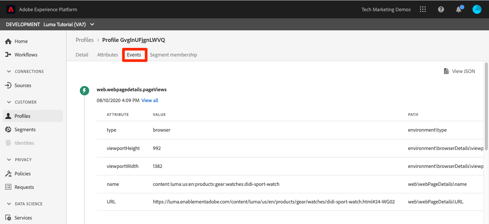

# Samenvoegbeleid maken

<!--20 min-->

In deze les, zult u samenvoegbeleid tot stand brengen om voorrang te geven aan hoe de veelvoudige gegevensbronnen in profielen samenvoegen.

Met Adobe Experience Platform kunt u gegevens uit meerdere bronnen samenbrengen en combineren om een volledig beeld van elke afzonderlijke klant te krijgen. Bij het samenbrengen van deze gegevens, bepaalt het samenvoegbeleid hoe aan de gegevens prioriteit wordt gegeven en welke gegevens worden gecombineerd om die verenigde mening tot stand te brengen.

We blijven bij de gebruikersinterface voor deze les, maar API-opties bestaan ook voor het maken van samenvoegbeleid.

**Architecten van Gegevens** zullen fusiebeleid buiten dit leerprogramma moeten tot stand brengen.

Voordat u met de oefeningen begint, bekijkt u deze korte video voor meer informatie over het samenvoegbeleid:
>[!VIDEO](https://video.tv.adobe.com/v/330433?learn=on&enablevpops)

## Vereiste machtigingen

In [&#x200B; vorm toestemmingen &#x200B;](configure-permissions.md) les, u opstelling alle toegangscontroles die worden vereist om deze les te voltooien.

<!--* Permission items **[!UICONTROL Profile Management]** > **[!UICONTROL View Merge Policies]** and **[!UICONTROL Manage Merge Policies]**
* Permission item **[!UICONTROL Profile Management]** > **[!UICONTROL View Profiles]** and **[!UICONTROL Manage Profiles]**
* Permission item **[!UICONTROL Sandboxes]** > `Luma Tutorial`
* User-role access to the `Luma Tutorial Platform` product profile
-->

## Over het samenvoegingsbeleid en Unieschema

U kunt zich herinneren, in de les over partijopname, uploadden wij twee verslagen met lichtjes verschillende informatie voor de zelfde klant. In de [!DNL Loyalty] -gegevens was de voornaam van de klant `Daniel` en woonde hij in `New York City` , maar in de CRM-gegevens was de voornaam van de klant `Danny` en woonde hij in `Portland` . Wijzigingen in klantgegevens in de loop der tijd. Misschien is hij van `Portland` naar `New York City` gegaan. Ook andere dingen veranderen, zoals telefoonnummers en e-mailadressen. Met samenvoegingsbeleid kunt u bepalen hoe deze soorten conflicten moeten worden afgehandeld wanneer twee gegevensbronnen verschillende informatie voor dezelfde gebruiker geven.

Dus waarom heeft `Danny` gewonnen als voornaam? Laten we eens kijken:

1. Selecteer in de gebruikersinterface van Platform de optie **[!UICONTROL Profiles]** in de linkernavigatie
1. Ga naar de tab **[!UICONTROL Merge Polices]**
1. Het standaardbeleid voor samenvoegen is een geordende tijdstempel. Omdat u de CRM-gegevens na de Loyalty-gegevens hebt geüpload, wordt `Danny` als voornaam in het profiel weergegeven:

Wanneer meerdere schema&#39;s zijn ingeschakeld voor een profiel, wordt automatisch een [!UICONTROL Union Schema] gemaakt voor alle voor profielen ingeschakelde, recordschema&#39;s die een basisklasse delen. U kunt de [!UICONTROL Union Schemas] weergeven door naar de tab **[!UICONTROL Union Schema]** te gaan.

Merk op dat er geen verenigingsschema voor de klasse ExperienceEvent is. ExperienceEvent-gegevens blijven in het profiel staan, omdat het tijdreeksen zijn, elke gebeurtenis een tijdstempel en id bevat en botsingen geen probleem zijn.

Wat gebeurt er als dat standaardsamenvoegbeleid u niet bevalt? Wat als Luma beslist dat hun loyaliteitssysteem de bron van de waarheid zou moeten zijn als er een conflict is? Daarvoor zullen we een fusiebeleid ontwikkelen.

## Een samenvoegbeleid maken in de gebruikersinterface

1. Selecteer in het scherm Beleid samenvoegen de knop **[!UICONTROL Create Merge Policy]** rechtsboven
1. Als **[!UICONTROL Name]** voert u `Loyalty Prioritized` in
1. Als **[!UICONTROL Schema]**, uitgezochte **[!UICONTROL XDM Profile]** (merk op dat uw douaneklasse—aangezien het recordgegevens is—voor samenvoegbeleid, ook beschikbaar is)
1. Selecteer **[!UICONTROL Id Stitching]** bij **[!UICONTROL Private Graph]**
1. Selecteer **[!UICONTROL Attribute Merge]** bij **[!UICONTROL Dataset precedence]**
1. Sleep `Luma Loyalty Dataset` en `Luma CRM Dataset` naar het deelvenster **[!UICONTROL Dataset]** .
1. Zorg ervoor dat `Luma Loyalty Dataset` bovenaan staat door te slepen en neer te zetten boven `Luma CRM Dataset`
1. Selecteer de knop **[!UICONTROL Save]**
   <!--do i need to explain Private Graph? Is that GA?-->
   

## Het samenvoegingsbeleid valideren

Laten we eens kijken of het fusiebeleid doet wat we zouden verwachten:

1. Ga naar de tab **[!UICONTROL Browse]**
1. Wijzig de **[!UICONTROL Merge policy]** in uw nieuwe `Loyalty Prioritized` -beleid
1. Als **[!UICONTROL Identity namespace]** gebruikt u uw `Luma CRM Id`
1. Als **[!UICONTROL Identity value]** use `b642b4217b34b1e8d3bd915fc65c4452`
1. Selecteer de knop **[!UICONTROL Show profile]**
1. `Daniel` is terug!

## Een samenvoegbeleid met beperkte gegevenssets maken

Wanneer het creëren van beleid van de Fusie gebruikend datasetbelangrijkheid, slechts zijn de datasets van de zelfde basisklasse die u in het recht omvat inbegrepen in het profiel. Laten we een ander samenvoegingsbeleid instellen

1. Selecteer in het scherm Beleid samenvoegen de knop **[!UICONTROL Create Merge Policy]** rechtsboven
1. Als **[!UICONTROL Name]** voert u `Loyalty Only` in
1. Als **[!UICONTROL Schema]** selecteert u **[!UICONTROL XDM Profile]**
1. Selecteer **[!UICONTROL Id Stitching]** bij **[!UICONTROL None]**
1. Selecteer **[!UICONTROL Attribute Merge]** bij **[!UICONTROL Dataset precedence]**
1. Sleep alleen de `Luma Loyalty Dataset` naar het deelvenster **[!UICONTROL Selected Dataset]** .
1. Selecteer de knop **[!UICONTROL Save]**

## Het samenvoegingsbeleid valideren

Laten we nu eens kijken wat dit samenvoegbeleid doet:

1. Ga naar de tab **[!UICONTROL Browse]**
1. Wijzig de **[!UICONTROL Merge policy]** in uw nieuwe `Loyalty Only` -beleid
1. Als **[!UICONTROL Identity namespace]** gebruikt u uw `Luma CRM Id`
1. Als **[!UICONTROL Identity value]** use `b642b4217b34b1e8d3bd915fc65c4452`
1. Selecteer de knop **[!UICONTROL Show profile]**
1. Bevestig dat er geen profielen zijn gevonden:
   

CRM-id is een identiteitsveld in de `Luma Loyalty Dataset` , maar alleen primaire identiteiten kunnen worden gebruikt om profielen op te zoeken. Laten we dus het profiel opzoeken met de primaire identiteit, `Luma Loyalty Id`&quot;

1. De **[!UICONTROL Identity Namespace]** wijzigen in `Luma Loyalty Id`
1. Als **[!UICONTROL Identity value]** use `5625458`
1. Selecteer de knop **[!UICONTROL Show profile]**
1. Selecteer profiel-id om het profiel te openen
1. Ga naar de tab **[!UICONTROL Attributes]**
1. Andere profieldetails van de dataset van CRM, zoals het mobiele telefoonaantal en e-mailadres niet beschikbaar zijn omdat ons `Loyalty Only` fusieprincipe niet de dataset van CRM omvat.
   
1. Ga naar de tab **[!UICONTROL Events]**
1. De gegevens van ExperienceEvent zijn beschikbaar ondanks niet uitdrukkelijk het opnemen in de datasets van het fusiebeleid:
   

## Meer informatie over samenvoegingsbeleid

Wijzig in de profielzoekopdracht het samenvoegbeleid terug naar `Default Timebased` en selecteer de knop **[!UICONTROL Show profile]** . Danny is terug!

Wat is hier aan de hand? Welnu, het samenvoegen van profielen is niet één keer. De de klantenprofielen van de in real time worden verzameld op de vlucht, die op diverse factoren wordt gebaseerd, met inbegrip van welk fusieprincipe wordt gebruikt. U kunt meerdere samenvoegbeleidsregels maken om in verschillende contexten te gebruiken, afhankelijk van de weergave van de klant die u wilt gebruiken.

Een belangrijke reden voor samenvoegbeleid is gegevensbeheer. Bijvoorbeeld, zeg u derdegegevens in Platform opneemt die niet voor verpersoonlijkingsgebruiksgevallen kunnen worden gebruikt, maar _kan_ voor het adverteren van gebruiksgevallen worden gebruikt. U kunt een fusiebeleid tot stand brengen dat deze derde dataset sluit en dit fusiebeleid gebruiken om segmenten voor uw het advertentiegebruikgevallen te bouwen.

## Aanvullende bronnen

* [&#x200B; documentatie van het Beleid van de Fusie &#x200B;](https://experienceleague.adobe.com/docs/experience-platform/profile/merge-policies/overview.html?lang=nl-NL)
* [&#x200B; het Beleid van de Fusie API (deel van Realtime API van het Profiel van de Klant) verwijzing &#x200B;](https://www.adobe.io/experience-platform-apis/references/profile/#tag/Merge-policies)

Nu gaan op het [&#x200B; kader van het gegevensbeheer &#x200B;](apply-data-governance-framework.md).
