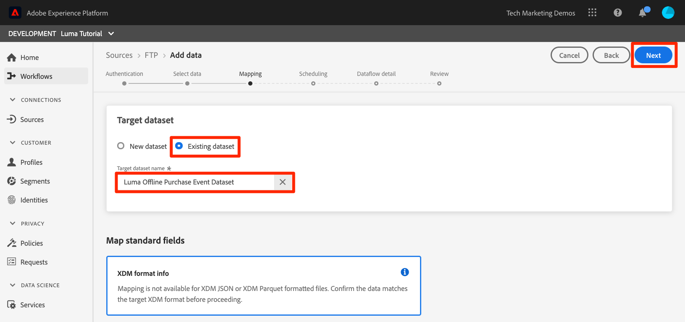
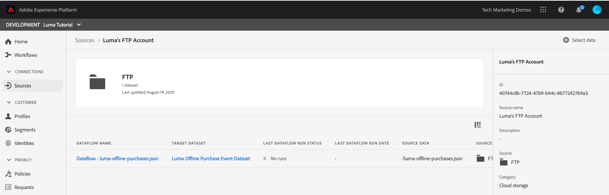

# Gegevens van groep samenvoegen

<!-- 1hr-->
In deze les zult u batchgegevens via verschillende methoden in Experience Platform opnemen.

Met gegevensinvoer via batch kunt u een grote hoeveelheid gegevens tegelijk in Adobe Experience Platform innemen. U kunt batchgegevens invoeren in één keer uploaden binnen de interface van Platform of met de API. U kunt ook regelmatig geplande batchuploads configureren van externe services, zoals cloudopslagservices, met Source-connectors.

**de Ingenieurs van Gegevens** zullen partijgegevens buiten dit leerprogramma moeten opnemen.

Voordat u de oefeningen start, bekijkt u deze korte video voor meer informatie over gegevensinvoer:

>[!VIDEO](https://video.tv.adobe.com/v/27106?learn=on&enablevpops)


## Vereiste machtigingen

In [ vorm toestemmingen ](configure-permissions.md) les, u opstelling alle toegangscontroles die worden vereist om deze les te voltooien.

<!--
* Permission item **[!UICONTROL Data Management]** > **[!UICONTROL View Datasets]**, **[!UICONTROL Manage Datasets]** and **[!UICONTROL Data Monitoring]**
* Permission items **[!UICONTROL Data Ingestion]** > **[!UICONTROL View Sources]** and **[!UICONTROL Manage Sources]**
* Permission item **[!UICONTROL Profile Management]** > **[!UICONTROL View Profiles]**
* Permission item **[!UICONTROL Sandboxes]** > `Luma Tutorial`
* User-role access to the `Luma Tutorial Platform` product profile
* Developer-role access to the `Luma Tutorial Platform` product profile (for API)
-->

Voor de Bronenoefening hebt u toegang nodig tot een (S)FTP-server of cloudopslagoplossing. Er is een oplossing als u er geen hebt.

## Gegevens in batches samenvoegen met de gebruikersinterface van Platform

De gegevens kunnen direct in een dataset op het datasetscherm in JSON en parquet formaten worden geupload. Dit is een goede manier om inname van sommige gegevens te testen nadat u een

### De gegevens downloaden en voorbereiden

Eerst, krijg de steekproefgegevens en pas het voor uw huurder aan:

>[!NOTE]
>
>De gegevens in het {[&#128279;](assets/luma-data.zip) dossier 0} luma-data.zip zijn fictief en moeten slechts voor demonstratiedoeleinden worden gebruikt.

1. De download [ luma-data.zip ](assets/luma-data.zip) aan uw **omslag van het Luminantiemateriaal van Assets**.
1. Pak het bestand uit en maak een map met de naam `luma-data` die de vier gegevensbestanden bevat die we in deze les gebruiken
1. Open `luma-loyalty.json` in een teksteditor en vervang alle varianten van `_techmarketingdemos` door uw eigen id voor onderstrepingsteken, zoals in uw eigen schema&#39;s wordt getoond:
   

1. Het bijgewerkte bestand opslaan

### De gegevens samenvoegen

1. Selecteer in de gebruikersinterface van Platform de optie **[!UICONTROL Datasets]** in de linkernavigatie
1. Open uw `Luma Loyalty Dataset`
1. Omlaag schuiven totdat u de sectie **[!UICONTROL Add Data]** in de rechterkolom ziet
1. Upload het `luma-loyalty.json` -bestand.
1. Wanneer het bestand is geüpload, wordt een rij voor de batch weergegeven
1. Als u de pagina na een paar minuten opnieuw laadt, ziet u dat de batch is geüpload met 1000 records en 1000 profielfragmenten.

   
   <!--do i need to explain error diagnostics and partial ingestion-->

>[!NOTE]
>
>Er zijn een paar opties, **[!UICONTROL Error diagnostics]** en **[!UICONTROL Partial ingestion]**, die u op verschillende schermen in deze les zult zien. Deze opties worden niet behandeld in de zelfstudie. Enkele snelle informatie:
>
>* Als u foutdiagnostiek inschakelt, worden gegevens over de inname van uw gegevens gegenereerd. U kunt deze gegevens vervolgens controleren met de API voor gegevenstoegang. Leer meer over het in [ de documentatie ](https://experienceleague.adobe.com/docs/experience-platform/data-access/home.html?lang=nl-NL).
>* Gedeeltelijke invoer maakt het mogelijk gegevens met fouten in te voeren, tot een bepaalde drempel die u kunt opgeven. Leer meer over het in [ de documentatie ](https://experienceleague.adobe.com/docs/experience-platform/ingestion/batch/partial.html?lang=nl-NL)

### De gegevens valideren

Er zijn een paar manieren om te bevestigen dat de gegevens met succes werden opgenomen.

#### Valideren in de gebruikersinterface van het Platform

Om te bevestigen dat de gegevens in de dataset werden opgenomen:

1. Selecteer op dezelfde pagina waar u de gegevens hebt ingevoerd de knop **[!UICONTROL Preview dataset]** rechtsboven
1. Selecteer de **knoop van de Voorproef** en u zou sommige ingebedde gegevens moeten kunnen zien.

   


Om te bevestigen dat de in Profiel aangelande gegevens (kan een paar minuten duren voor de gegevens aan land zijn):

1. Ga naar **[!UICONTROL Profiles]** in de linkernavigatie
1. Selecteer het pictogram naast het veld **[!UICONTROL Select identity namespace]** om het modaal te openen
1. Uw naamruimte `Luma Loyalty Id` selecteren
1. Voer vervolgens een van de `loyaltyId` -waarden uit uw gegevensset in, `5625458`
1. Selecteren **[!UICONTROL View]**
   

#### Valideren met gebeurtenissen voor gegevensinvoer

Als u zich in de vorige les hebt geabonneerd op gegevensinsluitingsgebeurtenissen, controleert u de unieke URL van website.site. Er worden drie aanvragen weergegeven in de volgende volgorde, met daartussen enige tijd, met de volgende `eventCode` -waarden:

1. `ing_load_success` - de batch als ingesloten
1. `ig_load_success`—De batch is in de identiteitsgrafiek opgenomen
1. `ps_load_success` - de batch is in de profielservice opgenomen


Zie de [ documentatie ](https://experienceleague.adobe.com/docs/experience-platform/ingestion/quality/subscribe-events.html?lang=nl-NL#available-status-notification-events) voor meer details op de berichten.

## Gegevens in batches samenvoegen met platform-API

Laten we nu gegevens uploaden met de API.

>[!NOTE]
>
>Gegevensarchitecten kunnen de CRM-gegevens gratis uploaden via de gebruikersinterfacemethode.

### De gegevens downloaden en voorbereiden

1. U zou reeds [ luma-data.zip ](assets/luma-data.zip) in uw `Luma Tutorial Assets` omslag moeten gedownload en gedecomprimeerd.
2. Open `luma-crm.json` in een teksteditor en vervang alle instanties van `_techmarketingdemos` door uw eigen onderstrepingsteken-huurder-id, zoals in uw schema&#39;s wordt getoond
3. Het bijgewerkte bestand opslaan

### Hiermee wordt de gegevensset-id opgehaald

Eerst krijgen wij identiteitskaart van dataset identiteitskaart van de dataset waarin wij gegevens willen opnemen:

1. Openen [!DNL Postman]
1. Als u geen toegangstoken hebt, open het verzoek **[!DNL OAuth: Request Access Token]** en selecteer **verzend** om een nieuw toegangstoken aan te vragen, enkel zoals u in de [!DNL Postman] les deed.
1. Open uw milieuvariabelen en zorg ervoor de waarde van **CONTAINER_ID** nog is `tenant`
1. Open het verzoek **[!DNL Catalog Service API > Datasets > Retrieve a list of datasets.]** en selecteer **verzenden**
1. U krijgt een `200 OK` reactie
1. Kopieer de id van de `Luma CRM Dataset` uit de hoofdtekst van de reactie
   

### De batch maken

Nu kunnen wij een partij in de dataset tot stand brengen:

1. Download [ Ingestie API.postman_collection.json van Gegevens ](https://raw.githubusercontent.com/adobe/experience-platform-postman-samples/master/apis/experience-platform/Data%20Ingestion%20API.postman_collection.json) aan uw `Luma Tutorial Assets` omslag
1. De verzameling importeren in [!DNL Postman]
1. Selecteer de aanvraag **[!DNL Data Ingestion API > Batch Ingestion > Create a new batch in Catalog Service.]**
1. Plak het volgende als **Lichaam** van het verzoek, ***die de waarde datasetId met uw vervangen***:

   ```json
   {
       "datasetId":"REPLACE_WITH_YOUR_OWN_DATASETID",
       "inputFormat": {
           "format": "json"
       }
   }
   ```

1. Selecteer **verzenden** knoop
1. Er moet een 201 Created-reactie komen met de id van de nieuwe batch!
1. De `id` van de nieuwe batch kopiëren
   

### De gegevens samenvoegen

Nu kunnen we de gegevens uploaden naar de batch:

1. Selecteer de aanvraag **[!DNL Data Ingestion API > Batch Ingestion > Upload a file to a dataset in a batch.]**
1. In het **lusje van Params**, ga uw dataset identiteitskaart en batch-id in hun respectieve gebieden in
1. In het **lusje van Params**, ga `luma-crm.json` als **filePath** in
1. In het **Lichaam** lusje, selecteer de **binaire** optie
1. Selecteer de gedownloade `luma-crm.json` map in de lokale `Luma Tutorial Assets` -map
1. Selecteer **verzenden** en u zou een 200 o.k. reactie met &quot;1&quot;in het reactiekarakter moeten krijgen

   

Op dit punt, als u uw partij in het gebruikersinterface van het Platform bekijkt, zult u zien dat het in een &quot;[!UICONTROL Loading]&quot;status is:


Omdat de batch-API vaak wordt gebruikt om meerdere bestanden te uploaden, moet u het Platform op de hoogte stellen wanneer een batch voltooid is. Dat zullen we in de volgende stap doen.

### De batch voltooien

De batch voltooien:

1. Selecteer de aanvraag **[!DNL Data Ingestion API > Batch Ingestion > Finish uploading a file to a dataset in a batch.]**
1. In het **lusje van Params**, ga `COMPLETE` als **actie** in
1. In het **lusje van Params**, ga uw partijidentiteitskaart in. Maak zich geen zorgen over dataset id of filePath, als zij aanwezig zijn.
1. Zorg ervoor dat de URL van de POST `https://platform.adobe.io/data/foundation/import/batches/:batchId?action=COMPLETE` is en dat er geen overbodige verwijzingen naar de `datasetId` of `filePath` zijn
1. Selecteer **verzenden** en u zou een 200 o.k. reactie met &quot;1&quot;in het reactiekarakter moeten krijgen

   

### De gegevens valideren

#### Valideren in de gebruikersinterface van het Platform

Bevestig de gegevens in het gebruikersinterface van het Platform enkel zoals u voor de dataset van de Loyalty hebt geland.

Bevestig eerst de batch waaruit blijkt dat er 1000 records zijn ingeslikt:


Bevestig vervolgens de batch met de gegevensset Voorvertoning:


Bevestig ten slotte dat een van uw profielen is gemaakt door een van de profielen op te zoeken met de naamruimte `Luma CRM Id` , bijvoorbeeld `112ca06ed53d3db37e4cea49cc45b71e`


Er is één interessant ding dat zojuist is gebeurd en waarop ik wil wijzen. Open dat `Danny Wright` -profiel. Het profiel heeft zowel een `Lumacrmid` als een `Lumaloyaltyid` . Onthoud dat `Luma Loyalty Schema` twee identiteitsvelden bevatte, Luminantie-id en CRM-id. Nu we beide gegevenssets hebben geüpload, zijn ze samengevoegd tot één profiel. De Loyalty-gegevens hadden `Daniel` als voornaam en &quot;New York City&quot; als huisadres, terwijl de CRM-gegevens `Danny` als voornaam en `Portland` als huisadres voor de klant met dezelfde Loyalty-id hadden. We komen terug naar de reden waarom de voornaam `Danny` weergeeft in de les over samenvoegbeleid.

U hebt zojuist profielen samengevoegd.


#### Valideren met gebeurtenissen voor gegevensinvoer

Als u zich in de vorige les hebt geabonneerd op gegevensinsluitingsgebeurtenissen, controleert u de unieke URL van website.site. U zou drie verzoeken moeten zien binnen komen, enkel zoals met de loyaliteitsgegevens:


Zie de [ documentatie ](https://experienceleague.adobe.com/docs/experience-platform/ingestion/quality/subscribe-events.html?lang=nl-NL#available-status-notification-events) voor meer details op de berichten.

## Gegevens samenvoegen met workflows

Laten we eens kijken naar een andere manier om gegevens te uploaden. Met de workflows kunt u CSV-gegevens invoeren die nog niet in XDM zijn gemodelleerd.

### De gegevens downloaden en voorbereiden

1. U zou reeds [ luma-data.zip ](assets/luma-data.zip) in uw `Luma Tutorial Assets` omslag moeten gedownload en gedecomprimeerd.
1. Bevestig dat u `luma-products.csv` hebt

### Een workflow maken

Laten we nu een workflow instellen:

1. Ga naar **[!UICONTROL Workflows]** in de linkernavigatie
1. Selecteer **[!UICONTROL Map CSV to XDM schema]** en selecteer de knop **[!UICONTROL Launch]**
   
1. Selecteer uw `Luma Product Catalog Dataset` en selecteer de **[!UICONTROL Next]** knoop
   
1. Voeg het `luma-products.csv` -bestand toe dat u hebt gedownload en selecteer de knop **[!UICONTROL Next]** .
   
1. Nu bevindt u zich in de mapperinterface, waarin u een veld van de brongegevens (een van de kolomnamen in het `luma-products.csv` -bestand) kunt toewijzen aan XDM-velden in het doelschema. In ons voorbeeld, zijn de kolomnamen dicht genoeg aan de namen van het schemagebied dat mapper de juiste afbeelding kan auto-ontdekken! Als de mapper het juiste veld niet automatisch kan detecteren, selecteert u het pictogram rechts van het doelveld om het juiste XDM-veld te selecteren. Ook, als u niet één van de kolommen van CSV wilt opnemen, kon u de rij van mapper schrappen. U kunt de kolomkoppen in de `luma-products.csv` omspelen en wijzigen om te leren hoe de mapper werkt.
1. Selecteer de knop **[!UICONTROL Finish]**
   

### De gegevens valideren

Wanneer de partij heeft geupload, verifieer upload door de dataset te bekijken.

Omdat `Luma Product SKU` een naamruimte zonder personen is, worden er geen profielen voor de productskus weergegeven.

Je moet de drie hits op je website zien.

## Gegevens samenvoegen met bronnen

Oké, je deed dingen op de moeilijke manier. Nu gaan in het beloofde land van _geautomatiseerde_ partijingestie! Als ik zeg: &quot;SET IT!&quot; je zegt: &quot;VERGEET HET!&quot; &quot;STEL IT IN!&quot; &quot;VERGEET HET!&quot; &quot;STEL IT IN!&quot; &quot;VERGEET HET!&quot; Grapje, je zou zoiets nooit doen! Oké, weer aan het werk. Je bent bijna klaar.

Ga naar **[!UICONTROL Sources]** in de linkernavigatie om de Broncatalogus te openen. Hier ziet u verschillende kant-en-klare integraties met toonaangevende gegevens- en opslagproviders.


Oké, we nemen gegevens in met een bronaansluiting.

Deze oefening zal kiezen-uw-eigen-avontuurstijl zijn. Ik ga het werkschema tonen gebruikend de bron van FTP schakelaar. U kunt of een verschillende Bron van de Opslag van de Wolk gebruiken die u bij uw bedrijf gebruikt, of het JSON dossier uploaden gebruikend het gegevenssetgebruikersinterface zoals wij met de loyaliteitsgegevens deden.

Veel van de Bronnen hebben een gelijkaardige configuratiewerkschema, waarin u:

1. Voer uw verificatiegegevens in
1. Selecteer de gegevens die u wilt invoeren
1. Selecteer de dataset van het Platform waarin u het wilt opnemen
1. De velden toewijzen aan uw XDM-schema
1. Kies de frequentie waarmee u gegevens vanaf die locatie opnieuw wilt invoeren

>[!NOTE]
>
>De gegevens voor offline aanschaf die we in deze exercitie gebruiken, bevatten gegevens over datumtijd. De gegevens van de tijd van de datum zouden in of [ ISO 8061 geformatteerde koorden ](https://www.iso.org/iso-8601-date-and-time-format.html) (&quot;2018-07-10T15 :05: 59.000-08:00&quot;) of Unix Tijd moeten zijn die in milliseconden wordt geformatteerd (153126959999 (00) en worden bij inname omgezet in het doel-XDM-type. Voor meer op gegevensomzetting en andere beperkingen, zie [ de documentatie van de Ingestie API van de Partij ](https://experienceleague.adobe.com/docs/experience-platform/ingestion/batch/api-overview.html?lang=nl-NL#types).

### Download, prep en upload de gegevens naar de voorkeursleverancier voor cloudopslag

1. U zou reeds [ luma-data.zip ](assets/luma-data.zip) in uw `Luma Tutorial Assets` omslag moeten gedownload en gedecomprimeerd.
1. Open `luma-offline-purchases.json` in een teksteditor en vervang alle instanties van `_techmarketingdemos` door uw eigen onderstrepingsteken-huurder-id, zoals in uw schema&#39;s wordt getoond
1. Werk alle tijdstempels bij, zodat de gebeurtenissen in de laatste maand plaatsvinden (zoek bijvoorbeeld naar `"timestamp":"2022-06` en vervang het jaar en de maand)
1. Kies uw voorkeursleverancier voor cloudopslag en zorg ervoor dat deze beschikbaar is in de catalogus van [!UICONTROL Sources]
1. `luma-offline-purchases.json` uploaden naar een locatie in uw voorkeursbureau voor cloudopslag

### Vermeld de gegevens naar de gewenste locatie voor cloudopslag

1. In de gebruikersinterface van het Platform, filter de [!UICONTROL Sources] catalogus aan **[!UICONTROL Cloud storage]**
1. Er zijn handige koppelingen naar documentatie onder de `...` .
1. Selecteer de knop **[!UICONTROL Configure]** in het vak van uw voorkeursleverancier voor cloudopslag
   
1. **[!UICONTROL Authentication]** is de eerste stap. Voer de naam voor uw account in, bijvoorbeeld `Luma's FTP Account` en uw verificatiedetails. Deze stap zou voor alle bronnen van de wolkenopslag vrij gelijkaardig moeten zijn, hoewel de gebieden lichtjes kunnen variëren. Zodra u de authentificatiedetails voor een rekening hebt ingegaan, kunt u hen voor andere bronverbindingen opnieuw gebruiken die verschillende gegevens over verschillende programma&#39;s van andere dossiers in de zelfde rekening zouden kunnen verzenden
1. Selecteer de **[!UICONTROL Connect to source button]**
1. Wanneer Platform verbinding heeft met de Source, selecteert u de knop **[!UICONTROL Next]**
   

1. In de stap **[!UICONTROL Select data]** gebruikt de gebruikersinterface uw gegevens om de map op de cloudopslagoplossing te openen
1. Selecteer de bestanden die u wilt invoeren, bijvoorbeeld `luma-offline-purchases.json`
1. Als **[!UICONTROL Data format]** selecteert u `XDM JSON`
1. U kunt dan een voorbeeld van de verbindingsstructuur en voorbeeldgegevens in uw bestand bekijken
1. Selecteer de knop **[!UICONTROL Next]**
   

1. Selecteer in de stap **[!UICONTROL Mapping]** de `Luma Offline Purchase Events Dataset` -toets en selecteer de **[!UICONTROL Next]** -knop. Let op: aangezien de gegevens die we invoeren een JSON-bestand zijn, is er geen toewijzingsstap waarin we het bronveld aan het doelveld toewijzen. JSON-gegevens moeten zich al in XDM bevinden. Als u een CSV opnam, zou u de volledige kaartgebruiker interface op deze stap zien:
   
1. In de stap **[!UICONTROL Scheduling]** kiest u de frequentie waarmee u gegevens uit de Source wilt terugnemen. Neem even de tijd om naar de opties te kijken. We gaan gewoon een eenmalige opname uitvoeren. Laat de knop **[!UICONTROL Frequency]** aan **[!UICONTROL Once]** en selecteer de knop **[!UICONTROL Next]** :
   
1. In de stap **[!UICONTROL Dataflow detail]** kunt u een naam voor de gegevensstroom kiezen, een optionele beschrijving invoeren, de diagnose van fouten inschakelen en de opname van gegevens gedeeltelijk. Laat de instellingen ongewijzigd en selecteer de knop **[!UICONTROL Next]** :
   
1. In de stap **[!UICONTROL Review]** kunt u al uw instellingen tegelijk bekijken en deze bewerken of de knop **[!UICONTROL Finish]** selecteren
1. Nadat u hebt opgeslagen, landt u op een scherm als dit:
   

### De gegevens valideren

Wanneer de partij heeft geupload, verifieer upload door de dataset te bekijken.

Je moet de drie hits op je website zien.

Zoek het profiel met waarde `5625458` opnieuw op in de naamruimte `loyaltyId` om te zien of zich aankoopgebeurtenissen in hun profiel bevinden. Je moet één aankoop zien. U kunt de details van de aankoop bekijken door **[!UICONTROL View JSON]** te selecteren:


## ETL-gereedschappen

Adobe werkt samen met meerdere leveranciers van ETL om gegevensinvoer in Experience Platform te ondersteunen. Wegens de verscheidenheid van derdeverkopers, is ETL niet behandeld in dit leerprogramma, hoewel u welkom bent om sommige van deze middelen te herzien:

* [ het Ontwikkelen ETL Integraties voor Adobe Experience Platform ](https://experienceleague.adobe.com/docs/experience-platform/etl/home.html?lang=nl-NL)
* [[!DNL Snaplogic]  Adobe Experience Platform Snap Pack ](https://www.snaplogic.com/resources/videos/august-2020-aep)

## Aanvullende bronnen

* [ de documentatie van de Ingestie van de Partij ](https://experienceleague.adobe.com/docs/experience-platform/ingestion/batch/overview.html?lang=nl-NL)
* [ Verwijzing van de Opname API van de Partij ](https://developer.adobe.com/experience-platform-apis/references/batch-ingestion/)

Nu laten [ stroomgegevens gebruiken het Web SDK ](ingest-streaming-data.md)
