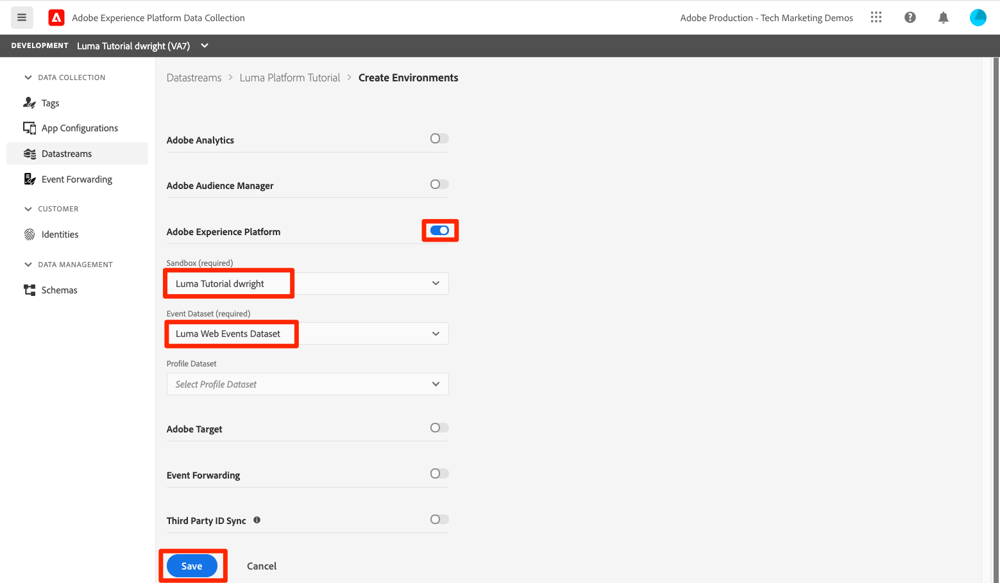
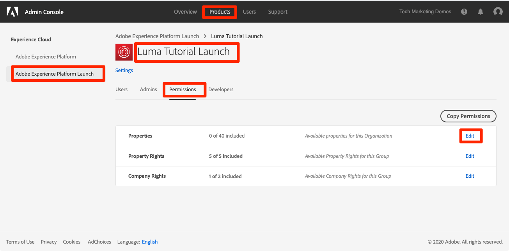
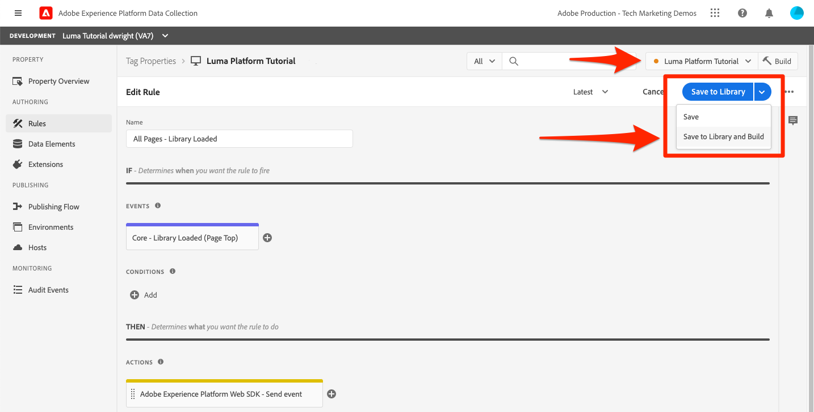

# De grootste streaminggegevens

<!--1hr-->

In deze les, zult u gegevens stromen gebruikend het Web SDK van Adobe Experience Platform.

Er zijn twee belangrijke taken wij in de interface van de Inzameling van Gegevens moeten voltooien:

* We moeten Web SDK implementeren op de Luma-website om gegevens over bezoekersactiviteiten van de website naar het Adobe Edge-netwerk te verzenden. We zullen een eenvoudige implementatie uitvoeren met behulp van labels (voorheen Starten)

* We moeten een datastream configureren, die het Edge-netwerk vertelt waar de gegevens moeten worden doorgestuurd. Wij zullen het vormen om de gegevens naar onze `Luma Web Events` dataset in onze zandbak van het Platform te verzenden.

**de Ingenieurs van Gegevens** zullen het stromen gegevens buiten dit leerprogramma moeten opnemen. Wanneer het uitvoeren van het Web van Adobe Experience Platform of Mobiele SDKs, typisch is een Web of een mobiele ontwikkelaar betrokken bij de verwezenlijking van de gegevenslaag en de configuratie van het markeringsbezit.

Voordat u de oefeningen start, bekijkt u deze twee korte video&#39;s voor meer informatie over het streamen van gegevens en Web SDK:

>[!VIDEO](https://video.tv.adobe.com/v/28425?learn=on&enablevpops)

>[!VIDEO](https://video.tv.adobe.com/v/34141?learn=on&enablevpops)

>[!NOTE]
>
>Terwijl dit leerprogramma zich op het stromen ingestie van websites met het Web SDK concentreert, kunt u gegevens ook stromen gebruikend [&#x200B; SDK van Adobe Mobile &#x200B;](https://developer.adobe.com/client-sdks/documentation/), [&#x200B; Apache Kafka verbindt &#x200B;](https://github.com/adobe/experience-platform-streaming-connect), en andere mechanismen.

## Vereiste machtigingen

In [&#x200B; vorm toestemmingen &#x200B;](configure-permissions.md) les, u opstelling alle toegangscontroles die worden vereist om deze les te voltooien.

<!--
* Permission items **[!UICONTROL Launch]** > **[!UICONTROL Property Rights]** > **[!UICONTROL Approve]**, **[!UICONTROL Develop]**, **[!UICONTROL Manage Environments]**, **[!UICONTROL Manage Extensions]**, and **[!UICONTROL Publish]**
* Permission item **[!UICONTROL Launch]** > **[!UICONTROL Company Rights]** > **[!UICONTROL Manage Properties]**
* User-role access to the `Luma Tutorial Launch` product profile
* Admin-role access to the `Luma Tutorial Launch` product profile
* Permission items **[!UICONTROL Platform]** > **[!UICONTROL Data Ingestion]** > **[!UICONTROL View Sources]** and **[!UICONTROL Manage Sources]**
* Permission items **[!UICONTROL Platform]** > **[!UICONTROL Data Management]** > **[!UICONTROL View Datasets]** and **[!UICONTROL Manage Datasets]**
* Permission items **[!UICONTROL Platform]** > **[!UICONTROL Profiles]** > **[!UICONTROL View Profiles]**, **[!UICONTROL Manage Profiles]** and **[!UICONTROL Export Audience Segment]**
* Permission item **[!UICONTROL Platform]** > **[!UICONTROL Sandbox Administration]** > **[!UICONTROL View Sandboxes]**
* Permission item **[!UICONTROL Platform]** > **[!UICONTROL Sandboxes]** > `Luma Tutorial`
* User-role access to the `Luma Tutorial Platform` product profile
-->

<!--## Create a streaming source

1. Log into the [Experience Platform  user interface](https://experience.adobe.com/platform/)
1. Go to **[!UICONTROL Sources]** in the left navigation
1. Filter the list by selecting **[!UICONTROL Streaming]**
1. In the **[!UICONTROL HTTP API]** section, select the **[!UICONTROL Configure]** button
    
1. On the **[!UICONTROL Authentication]** step, enter `Luma Web Events Source` as the **[!UICONTROL Account name]** and select the **[!UICONTROL Connect to source]** button (we don't need to enable authentication since the data will be originating from website visitors)
    
1. Once connected, select the **[!UICONTROL Next]** button to proceed to the next step in the workflow
1. On the **[!UICONTROL Select data]** step, choose **[!UICONTROL Existing Dataset]**, select your `Luma Web Events Dataset`, and then select the **[!UICONTROL Next]** button
    
1. On the **[!UICONTROL Dataflow detail]** step, select the **[!UICONTROL Next]** button:
    
    <!--What is a good practice for naming the data flow vs the source-->
<!--
1. On the **[!UICONTROL Review]** step, review your source details and select the **[!UICONTROL Finish]** button:
    
-->

## De gegevensstroom configureren

Eerst zullen wij de datastream vormen. Een gegevensstroom vertelt het netwerk van Adobe Edge waar te om de gegevens te verzenden nadat het van de vraag van SDK van het Web wordt ontvangen. Wilt u de gegevens bijvoorbeeld naar Experience Platform, Adobe Analytics of Adobe Target verzenden? De stromen van gegevens worden beheerd in het gebruikersinterface van de Inzameling van Gegevens (vroeger Lancering) en zijn kritiek aan gegevensinzameling met Web SDK.

Maak uw [!UICONTROL datastream] als volgt:

1. Logboek in het [&#x200B; gebruikersinterface van de Inzameling van Gegevens van Experience Platform &#x200B;](https://experience.adobe.com/launch/)
   <!--when will the edge config go live?-->

1. Selecteren **[!UICONTROL Datastreams]** in de linkernavigatie
1. Selecteer de knop **[!UICONTROL New Datastream]** in de rechterbovenhoek

   

1. Voor **[!UICONTROL Friendly Name]**, ga `Luma Platform Tutorial` in (voeg uw naam aan het eind toe, als de veelvoudige mensen van uw bedrijf deze zelfstudie nemen)
1. Selecteer de knop **[!UICONTROL Save]**

   

In het volgende scherm geeft u op waar u gegevens wilt verzenden. Gegevens verzenden naar Experience Platform:

1. In-/uitschakelen **[!UICONTROL Adobe Experience Platform]** om extra velden beschikbaar te maken
1. Selecteer `Luma Tutorial` bij **[!UICONTROL Sandbox]**
1. Selecteer `Luma Web Events Dataset` bij **[!UICONTROL Event Dataset]**
1. Als u andere Adobe-toepassingen gebruikt, kunt u de andere secties raadplegen om te zien welke informatie vereist is in de Edge-configuratie van deze andere oplossingen. Onthoud dat Web SDK niet alleen is ontwikkeld om gegevens te streamen naar Experience Platform, maar ook om alle vorige JavaScript-bibliotheken te vervangen die door andere Adobe-toepassingen worden gebruikt. De Configuratie van Edge wordt gebruikt om de rekeningsdetails van elke toepassing te specificeren waarnaar u de gegevens wilt verzenden.
1. Selecteren **[!UICONTROL Save]**
   

Zodra de Configuratie van Edge heeft bewaard, zal het resulterende scherm drie milieu&#39;s voor Ontwikkeling, het Opvoeren, en Productie tonen zijn gecreeerd. Er kunnen extra ontwikkelomgevingen worden toegevoegd:
 hebben
Alle drie de milieu&#39;s bevatten de details van het Platform u enkel inging. Nochtans, kunnen deze details verschillend per milieu worden gevormd. U kunt bijvoorbeeld elke omgeving gegevens laten verzenden naar een andere platformsandbox. In deze zelfstudie maken we geen verdere aanpassingen van onze gegevensstroom door.

## De extensie Web SDK installeren

### Een eigenschap toevoegen

Eerst moeten we een eigenschap tag maken (voorheen een eigenschap tag). Een eigenschap is een container voor alle JavaScript, regels en andere functies die zijn vereist voor het verzamelen van gegevens van een webpagina en het verzenden ervan naar verschillende locaties.

Een eigenschap maken:

1. Ga naar **[!UICONTROL Properties]** in de linkernavigatie
1. Selecteer de knop **[!UICONTROL New Property]**
    toe
1. Als **[!UICONTROL Name]**, ga `Luma Platform Tutorial` in (voeg uw naam aan het eind toe, als de veelvoudige mensen van uw bedrijf deze zelfstudie nemen)
1. Als **[!UICONTROL Domains]** voert u `enablementadobe.com` in (zoals verderop wordt uitgelegd)
1. Selecteren **[!UICONTROL Save]**
   

<!--
After saving the property, you might see an error message like the one below. If so, this is because you don't actually have access to the property you just created. To fix this, we need to go to the Admin Console to give yourself access:
    

To give yourself access to the property:

1. In a separate browser tab, log into the [Admin Console](https://adminconsole.adobe.com/)
1. Go to **[!UICONTROL Products]** from the top navigation
1. Select **[!UICONTROL Adobe Experience Platform Launch]** on the left navigation
1. Go to your `Luma Tutorial Launch` product profile
1. Go to the **[!UICONTROL Permissions]** tab
1. On the **[!UICONTROL Properties]** row, select **[!UICONTROL Edit]**
    
1. Select the "+" icon to move your `Luma Platform Tutorial` property to the right-hand side and select the **[!UICONTROL Save]** button to update the permissions
   
    

Now switch back to your browser tab with the Data Collection interface still open. Reload the page and the `Luma Platform Tutorial` property should display in the list. Select to open the property:

-->

## De extensie Web SDK toevoegen

Nu u een bezit hebt kunt u het Web SDK toevoegen gebruikend een uitbreiding. Een extensie is een pakket code waarmee de interface en functionaliteit voor gegevensverzameling worden uitgebreid. De extensie toevoegen:

1. De eigenschap tag openen
1. Ga naar **[!UICONTROL Extensions]** in de linkernavigatie
1. Ga naar de tab **[!UICONTROL Catalog]**
1. Er zijn veel extensies beschikbaar voor tags. De catalogus filteren met de term `Web SDK`
1. Selecteer in de extensie **[!UICONTROL Adobe Experience Platform Web SDK]** de knop **[!UICONTROL Install]**
   
1. Er zijn verscheidene configuraties beschikbaar voor de uitbreiding van SDK van het Web, maar er slechts twee zullen wij voor dit leerprogramma vormen. Werk **[!UICONTROL Edge Domain]** aan `data.enablementadobe.com` bij. Met deze instelling kunt u cookies van eerste partijen instellen met uw Web SDK-implementatie, wat wordt aangemoedigd. Later in deze les wijst u een website op het domein `enablementadobe.com` toe aan uw eigenschap tag. De CNAME voor het `enablementadobe.com` -domein is al geconfigureerd, zodat `data.enablementadobe.com` naar Adobe-servers wordt doorgestuurd. Wanneer u Web SDK op uw eigen website implementeert, moet u een CNAME maken voor uw eigen gegevensverzamelingsdoeleinden, bijvoorbeeld `data.YOUR_DOMAIN.com`
1. Selecteer in het vervolgkeuzemenu **[!UICONTROL Datastream]** de `Luma Platform Tutorial` -gegevensstroom.
1. Bekijk de andere configuratieopties (maar wijzig deze niet!) en selecteer vervolgens **[!UICONTROL Save]**
   <!--is edge domain required for first party? when will it break?-->
   <!--any other fields that should be highlighted-->
   

## Een regel maken voor het verzenden van gegevens

Nu maken we een regel voor het verzenden van gegevens naar Platform. Een regel is een combinatie van gebeurtenissen, voorwaarden en handelingen die ervoor zorgen dat tags iets doen. Een regel maken:

1. Ga naar **[!UICONTROL Rules]** in de linkernavigatie
1. Selecteer de knop **[!UICONTROL Create New Rule]**
   
1. Naam van de regel `All Pages - Library Loaded`
1. Selecteer onder **[!UICONTROL Events]** de knop **[!UICONTROL Add]**
    toe
1. Gebruik **[!UICONTROL Core]** **[!UICONTROL Extension]** en selecteer **[!UICONTROL Library Loaded (Page Top)]** als **[!UICONTROL Event Type]**. Deze instelling betekent dat de regel wordt geactiveerd wanneer de bibliotheek Starten op een pagina wordt geladen.
1. Selecteer **[!UICONTROL Keep Changes]** om terug te keren naar het hoofdregelscherm
    toe
1. Laat **[!UICONTROL Conditions]** leeg, want we willen dat deze regel op alle pagina&#39;s wordt toegepast, zoals bij de naam die we hem gaven
1. Selecteer onder **[!UICONTROL Actions]** de knop **[!UICONTROL Add]**
1. Gebruik **[!UICONTROL Adobe Experience Platform Web SDK]** **[!UICONTROL Extension]** en selecteer **[!UICONTROL Send Event]** als **[!UICONTROL Action Type]**
1. Selecteer rechts in het vervolgkeuzemenu **[!UICONTROL Type]** de optie **[!UICONTROL web.webpagedetails.pageViews]** . Dit is een van de XDM-velden in onze `Luma Web Events Schema`
1. Selecteer **[!UICONTROL Keep Changes]** om terug te keren naar het hoofdregelscherm
    toe
1. Selecteer **[!UICONTROL Save]** om de regel op te slaan\
   

## De regel in een bibliotheek publiceren

Vervolgens publiceren we de regel naar onze ontwikkelomgeving, zodat we kunnen controleren of deze werkt.

<!--
There are a few quick steps we must take in the **[!UICONTROL Publishing]** section of Launch.

### Create a host

Launch libraries can be hosted on Adobe's Content Delivery Network (CDN) or on your own servers. In this tutorial, we will use Adobe's CDN since it is faster to set up:

1. Go to **[!UICONTROL Hosts]** in the left navigation
1. Select the **[!UICONTROL Create New Host]** button
       
1. For the **[!UICONTROL Name]**, enter `Adobe CDN`
1. For the **[!UICONTROL Type]**, select **[!UICONTROL Managed by Adobe]**
1. Select the **[!UICONTROL Save]** button to complete the setup of the host
       

### Create an environment

Environments allow you to have different versions of a library in different publishing environments to accommodate your publishing workflow. For example, the fully tested version of your library can be published to a Production environment, while new changes are being created in a Development environment. You can also use different hosts for each environment. To create an environment:

1. Go to **[!UICONTROL Environments]** in the left navigation
1. Select the **[!UICONTROL Create New Environment]** button
     
1. Under **[!UICONTROL Development]** select **[!UICONTROL Select]**   
     
1. For the **[!UICONTROL Name]**, enter `Development`
1. For the **[!UICONTROL Select Host]** dropdown, select `Adobe CDN`
1. Select the **[!UICONTROL Save]** button to complete the setup of the environment
    
1. You will see a modal with URL and other implementation details of this library. These are critical for a real Launch implementation, but we don't need to worry about them for this tutorial. Select the **[!UICONTROL Close]** button to exit the modal.

### Create and publish the library

Now let's bundle the contents of our property&mdash;currently an extension and a rule&mdash;into a library. 
-->

Een bibliotheek maken:

1. Ga naar **[!UICONTROL Publishing Flow]** in de linkernavigatie
1. Selecteren **[!UICONTROL Add Library]**
    toe
1. Voer bij **[!UICONTROL Name]** `Luma Platform Tutorial` in
1. Selecteer `Development` voor **[!UICONTROL Environment]**
1. Selecteer de knop **[!UICONTROL Add All Changed Resources]** . (Naast de extensie [!UICONTROL Adobe Experience Platform Web SDK] en de `All Pages - Library Loaded` -regel, wordt ook de extensie [!UICONTROL Core] toegevoegd die de basis-JavaScript bevat die is vereist voor alle wegeigenschappen van Launch.)
1. Selecteer de knop **[!UICONTROL Save & Build for Development]**
   

Het kan enkele minuten duren voordat de bibliotheek is gemaakt en wanneer deze is voltooid, wordt links van de naam van de bibliotheek een groene stip weergegeven:

Zoals u kunt zien op het scherm [!UICONTROL Publishing Flow] , is er veel meer aan het publicatieproces dat buiten het bereik van deze zelfstudie valt. We gaan gewoon één bibliotheek gebruiken in onze ontwikkelomgeving.

## De gegevens in de aanvraag valideren

### De Adobe Experience Platform Debugger toevoegen

De Experience Platform Debugger is een extensie die beschikbaar is voor Chrome- en Firefox-browsers en waarmee u de Adobe-technologie kunt bekijken die in uw webpagina&#39;s is geïmplementeerd. Download de versie voor uw voorkeursbrowser:

* [&#x200B; uitbreiding Firefox &#x200B;](https://addons.mozilla.org/nl/firefox/addon/adobe-experience-platform-dbg/)
* [&#x200B; de uitbreiding van Chrome &#x200B;](https://chrome.google.com/webstore/detail/adobe-experience-platform/bfnnokhpnncpkdmbokanobigaccjkpob)

Als u Foutopsporing nooit eerder hebt gebruikt—en deze is anders dan de oudere Adobe Experience Cloud Debugger—kunt u deze overzichtsvideo van vijf minuten bekijken:

>[!VIDEO](https://video.tv.adobe.com/v/32156?learn=on&enablevpops)

### De Luma-website openen

Voor deze zelfstudie gebruiken we een openbaar gehoste versie van de Luma-demo-website. Laten we het openen en een bladwijzer maken:

1. In een nieuw browser lusje, open de [&#x200B; website van de Luma &#x200B;](https://luma.enablementadobe.com/content/luma/us/en.html).
1. Bladwijzer maken van de pagina voor gebruik in de rest van de zelfstudie

Daarom hebben we `enablementadobe.com` in het veld [!UICONTROL Domains] van de initiële configuratie met de eigenschap tag gebruikt en hebben we `data.enablementadobe.com` gebruikt als het domein van de eerste partij in de extensie [!UICONTROL Adobe Experience Platform Web SDK] . Zie je, ik had een plan!

### Foutopsporing in Experience Platform gebruiken om de tag-eigenschap toe te wijzen

De Experience Platform Debugger heeft een coole functie waarmee u een bestaande tag-eigenschap kunt vervangen door een andere. Dit is nuttig voor bevestiging en staat ons toe om vele implementatiestappen in dit leerprogramma over te slaan.

1. Zorg ervoor dat de Luminantiesite is geopend en selecteer het extensiepictogram van Experience Platform Debugger
1. Foutopsporing opent en toont sommige details van de hard-gecodeerde implementatie, die met dit leerprogramma niet verwant is (u kunt de plaats van de Luma na het openen van Debugger moeten opnieuw laden)
1. Bevestig dat Debugger &quot;**[!UICONTROL Connected to Luma]**&quot;zoals hieronder afgebeeld is en selecteer dan het &quot;**[!UICONTROL lock]**&quot;pictogram is om Debugger aan de plaats van de Luma te sluiten.
1. Selecteer de knop **[!UICONTROL Sign In]** rechtsboven om te verifiëren.
1. Ga nu naar **[!UICONTROL Launch]** in de linkernavigatie
1. Selecteer het tabblad Configuratie
1. Open rechts van waar de **[!UICONTROL Page Embed Codes]** wordt weergegeven het vervolgkeuzemenu **[!UICONTROL Actions]** en selecteer **[!UICONTROL Replace]**
   
1. Aangezien u voor authentiek wordt verklaard, zal Foutopsporing in uw beschikbare eigenschappen en milieu&#39;s van de Lancering trekken. Selecteer uw eigenschap `Luma Platform Tutorial`
1. Selecteer uw `Development` -omgeving
1. Selecteer de knop **[!UICONTROL Apply]**
   
1. De website van de Luma zal _met uw markeringsbezit_ nu opnieuw laden. Help, ik ben gehackt! Grapje.
   
1. Ga naar **[!UICONTROL Summary]** in de linkernavigatie om de details van uw eigenschap [!UICONTROL Launch] te bekijken
   
1. Ga nu naar **[!UICONTROL AEP Web SDK]** in de linkernavigatie om de **[!UICONTROL Network Requests]** te zien
1. De rij **[!UICONTROL events]** openen

   
1. Let op hoe we het gebeurtenistype `web.webpagedetails.pageView` zien dat we in onze [!UICONTROL Send Event] -actie hebben opgegeven, en andere variabelen die zich buiten het vak bevinden, in de `AEP Web SDK ExperienceEvent Mixin` -indeling.
   
1. Deze types van verzoekdetails zijn ook zichtbaar in de hulpmiddelen van de Webontwikkelaar van browser **Netwerk** tabel. Open het en laad de pagina opnieuw. Filter voor vraag met `interact` om van de vraag de plaats te bepalen, het te selecteren, en dan in het **Kopballen** lusje, **gebied van de Payload van het Verzoek** te kijken.
   
1. Ga naar het **lusje van de Reactie** en neem nota hoe de ECID waarde in de reactie inbegrepen is. Kopieer deze waarde zoals u deze gebruikt om de profielgegevens in de volgende oefening te valideren.
   

## De gegevens valideren in Experience Platform

U kunt controleren of de gegevens in Platform landen door de batches met gegevens in de `Luma Web Events Dataset` te bekijken. (Ik weet dat het streaming data-opname heet, maar nu zeg ik dat het in batches aankomt! Het stroomt in real time aan Profiel, zodat kan het voor segmentatie en activering in real time worden gebruikt, maar wordt verzonden in partijen om de 15 minuten aan het gegevenspeer.)

De gegevens valideren:

1. Ga in de gebruikersinterface van het Platform naar **[!UICONTROL Datasets]** in de linkernavigatie
1. Open `Luma Web Events Dataset` en bevestig dat een partij is aangekomen. Herinner me, worden zij verzonden om de 15 minuten, zodat zou u op de partij kunnen moeten wachten om omhoog te verschijnen.
1. Selecteer de knop **[!UICONTROL Preview dataset]**
   
1. Let in de voorvertoningsmodus op hoe u verschillende velden van het schema aan de linkerkant kunt selecteren om een voorvertoning van die specifieke gegevenspunten weer te geven:
   

U kunt ook bevestigen dat het nieuwe profiel wordt weergegeven:

1. Ga in de gebruikersinterface van het Platform naar **[!UICONTROL Profiles]** in de linkernavigatie
1. Selecteer de naamruimte **[!UICONTROL ECID]** en zoek naar de ECID-waarde (kopieer deze uit de reactie). Het profiel heeft een eigen id, gescheiden van de ECID.
1. Selecteer de **[!UICONTROL Profile ID]** om het profiel te openen
   
1. Selecteer het tabblad **[!UICONTROL Events]** om de weergegeven pagina&#39;s weer te geven
   \
   <!---->

## Aangepaste gegevens aan de gebeurtenis toevoegen

### Een gegevenselement voor een paginanaam maken

1. Open in de interface met tags voor gegevensverzameling rechtsboven in de eigenschap `Luma Platform Tutorial` het vervolgkeuzemenu **[!UICONTROL Select a Working Library]** en selecteer de `Luma Platform Tutorial` -bibliotheek. Met deze instelling kunt u gemakkelijker aanvullende updates naar onze bibliotheek publiceren.
1. Ga nu naar **[!UICONTROL Data Elements]** in de linkernavigatie
1. Selecteer de knop **[!UICONTROL Create New Data Element]**

   
1. Als **[!UICONTROL Name]** voert u `Page Name` in
1. Als **[!UICONTROL Data Element Type]** selecteert u `JavaScript Variable`
1. Als **[!UICONTROL JavaScript variable name]** voert u `digitalData.page.pageInfo.pageName` in
1. Als u de notatie van de waarden wilt standaardiseren, schakelt u de selectievakjes **[!UICONTROL Force lowercase value]** en **[!UICONTROL Clean text]** in
1. Zorg ervoor dat `Luma Platform Tutorial` is geselecteerd als de werkbibliotheek
1. Selecteren **[!UICONTROL Save to Library]**
   

### De paginanaam toewijzen aan het gegevenselement XDM Object

Nu zullen wij onze paginanaam aan het Web SDK in kaart brengen.

>[!IMPORTANT]
>
>Om deze taak te voltooien, moeten wij ervoor zorgen dat uw gebruiker eerst toegang tot de zandbak van de Prod heeft. Als u nog geen toegang hebt tot de prod-sandbox vanuit een ander productprofiel, opent u snel het `Luma Tutorial Platform` -profiel en voegt u het machtigingsitem **[!UICONTROL Sandboxes]** > **[!UICONTROL Prod]** toe. Voer vervolgens een SHIFT-Opnieuw laden op de pagina Data Elements uit om de cache te wissen
>&#x200B;>

Op de pagina **[!UICONTROL Data Elements]** :

1. Een nieuw gegevenselement maken
1. Als **[!UICONTROL Name]** voert u `XDM Object` in
1. Als **[!UICONTROL Extension]** selecteert u `Adobe Experience Platform Web SDK`
1. Als **[!UICONTROL Data Element Type]** selecteert u `XDM object`
1. Als **[!UICONTROL Sandbox]** selecteert u de `Luma Tutorial` -sandbox
1. Als de **[!UICONTROL Schema]** , selecteert u uw `Luma Web Events Schema`
1. Selecteer het veld `web.webPageDetails.name`
1. Als **[!UICONTROL Value]** selecteert u het pictogram waarmee u het selectiemodel van het gegevenselement wilt openen en het gegevenselement `Page Name` wilt kiezen
1. Selecteren **[!UICONTROL Save to Library]**
    toe

Hetzelfde proces wordt gebruikt om extra aangepaste gegevens op uw website toe te wijzen aan XDM-velden.

### De XDM-gegevens toevoegen aan de handeling Verzendgebeurtenis

Nu u gegevens hebt toegewezen aan XDM-velden, kunt u deze opnemen in de handeling Verzendgebeurtenis:

1. Naar het **[!UICONTROL Rules]** -scherm gaan
1. De regel `All Pages - Library Loaded` openen
1. De handeling `Adobe Experience Platform Web SDK - Send Event` openen
1. Als **[!UICONTROL XDM data]** selecteert u het pictogram waarmee u het selectiemodel van het gegevenselement wilt openen en het gegevenselement `XDM Object` wilt kiezen
1. Selecteer de knop **[!UICONTROL Keep Changes]**
   
1. Nu u `Luma Platform Tutorial` als werkbibliotheek hebt geselecteerd voor de laatste paar oefeningen, zijn uw recente wijzigingen direct opgeslagen in de bibliotheek. In plaats van onze wijzigingen te publiceren via het scherm Publishing Flow, kunt u gewoon het vervolgkeuzemenu op de blauwe knop openen en **[!UICONTROL Save to Library and Build]** selecteren
   

Hiermee maakt u een nieuwe tagbibliotheek met de drie wijzigingen die u zojuist hebt aangebracht.

### De XDM-gegevens valideren

U moet nu de startpagina Luma opnieuw kunnen laden, terwijl deze aan uw markeringseigenschap is toegewezen met de foutopsporing zoals u eerder hebt geleerd, en controleren of het veld Paginanaam in de aanvraag wordt ingevuld!

U kunt ook controleren of de gegevens van de paginanaam zijn ontvangen in Platform door een voorbeeld van de gegevensset en het profiel weer te geven.

## Extra identiteiten verzenden

Uw Web SDK-implementatie verzendt nu gebeurtenissen met de Experience Cloud-id (ECID) als primaire id. De ECID wordt automatisch gegenereerd door de Web SDK en is uniek per apparaat en browser. Eén klant kan meerdere ECID&#39;s hebben, afhankelijk van het apparaat en de browser die hij of zij gebruikt. Dus hoe kunnen we een uniforme weergave van deze klant krijgen en hun online activiteiten koppelen aan onze gegevens over CRM, Loyalty en offline aankoop? Dat doen we door tijdens hun sessie aanvullende identiteiten te verzamelen en hun profiel via identiteitsstitching vastberaden te koppelen.

Als u zich herinnert, vermeldde ik dat wij ECID en identiteitskaart van CRM als identiteiten voor onze Webgegevens in de [&#x200B; Identiteiten van de Kaart &#x200B;](map-identities.md) les zouden gebruiken. Dus laten we de CRM-id verzamelen met de Web SDK!

### Gegevenselement toevoegen voor de CRM-id

Eerst slaan wij CRM identiteitskaart in een gegevenselement op:

1. Voeg een gegevenselement met de naam `CRM Id` toe aan de taginterface
1. Als **[!UICONTROL Data Element Type]** selecteert u **[!UICONTROL JavaScript Variable]**
1. Als **[!UICONTROL JavaScript variable name]** voert u `digitalData.user.0.profile.0.attributes.username` in
1. Selecteer de knop **[!UICONTROL Save to Library]** (`Luma Platform Tutorial` moet nog steeds uw werkbibliotheek zijn)
    toe

### Voeg CRM-id toe aan het gegevenselement Identiteitskaart

Nu we de CRM-id-waarde hebben vastgelegd, moeten we deze koppelen aan een speciaal type gegevenselement, het gegevenselement [!UICONTROL Identity Map] genaamd:

1. Een gegevenselement met de naam `Identities` toevoegen
1. Als **[!UICONTROL Extension]** selecteert u **[!UICONTROL Adobe Experience Platform Web SDK]**
1. Als **[!UICONTROL Data Element Type]** selecteert u **[!UICONTROL Identity map]**
1. Als **[!UICONTROL Namespace]**, ga `Luma CRM Id` in, dat is [!UICONTROL namespace] wij in een vroegere les creeerden

   >[!WARNING]
   >
   >Met de Adobe Experience Platform Web SDK-extensie versie 2.2 kunt u Namespace selecteren in een vooraf ingevuld vervolgkeuzemenu met de werkelijke waarden in uw Platform-account. Helaas is deze functie nog niet &#39;bewust van de sandbox&#39; en wordt de waarde `Luma CRM Id` mogelijk niet weergegeven in het vervolgkeuzemenu. Hierdoor kan het voorkomen dat u deze oefening voltooit. We zullen een tijdelijke oplossing plaatsen zodra dit is bevestigd.

1. Als **[!UICONTROL ID]** selecteert u het pictogram waarmee u het selectiemodel van het gegevenselement wilt openen en het gegevenselement `CRM Id` wilt kiezen
1. Als **[!UICONTROL Authenticated State]** selecteert u **[!UICONTROL Authenticated]**
1. **[!UICONTROL Primary]** controleren

   >[!TIP]
   >
   > Adobe raadt aan identiteiten die een persoon, zoals `Luma CRM Id` , vertegenwoordigen, als de [!UICONTROL primary] -identiteit te verzenden.
   >
   > Als het identiteitsoverzicht de persoon-id bevat (bijvoorbeeld `Luma CRM Id` ), wordt de persoon-id de [!UICONTROL primary] identity. Anders wordt `ECID` de [!UICONTROL primary] identiteit.

1. Selecteer de knop **[!UICONTROL Save to Library]** (`Luma Platform Tutorial` moet nog steeds uw werkbibliotheek zijn)
   

>[!NOTE]
>
>U kunt meerdere id&#39;s doorgeven met het gegevenstype [!UICONTROL Identity map] .

### Het gegevenselement Identiteitskaart toevoegen aan het XDM-object

Er is nog één gegevenselement dat we moeten bijwerken: het XDM Object-gegevenselement. Het kan vreemd lijken om drie afzonderlijke gegevenselementen bij te werken om deze ene identiteit door te geven, maar dit proces is ontworpen om te schalen voor meerdere identiteiten. Maak je geen zorgen, we zijn bijna klaar met deze les!

1. Het XDM Object-gegevenselement openen
1. Open het XDM-veld IdentityMap
1. Als **[!UICONTROL Data element]** selecteert u het pictogram waarmee u het selectiemodel van het gegevenselement wilt openen en het gegevenselement `Identities` wilt kiezen
1. Nu u `Luma Platform Tutorial` als werkbibliotheek hebt geselecteerd voor de laatste paar oefeningen, zijn uw recente wijzigingen direct opgeslagen in de bibliotheek. In plaats van onze wijzigingen te publiceren via het scherm Publishing Flow, kunt u het vervolgkeuzemenu op de blauwe knop openen en **[!UICONTROL Save to Library and Build]** selecteren
    toe

### De identiteit valideren

Om te bevestigen dat CRM identiteitskaart nu door het Web SDK wordt verzonden:

1. Open de [&#x200B; website Luma &#x200B;](https://luma.enablementadobe.com/content/luma/us/en.html)
1. Wijs het aan uw markeringsbezit toe gebruikend Debugger, zoals in vroegere instructies
1. Selecteer de **Login** verbinding op het hoogste recht van de website van de Luma
1. Meld u aan met de aanmeldingsgegevens `test@test.com`/`test`
1. Zodra geverifieerd, inspecteert u de Experience Platform Web SDK-aanroep in Foutopsporing (**[!UICONTROL Adobe Experience Platform Web SDK]** > **[!UICONTROL Network Requests]** > **[!UICONTROL events]** van de meest recente aanvraag) en ziet u de `lumaCrmId` :
   
1. Zoek het gebruikersprofiel op met behulp van de ECID-naamruimte en -waarde. In het profiel, zult u CRM identiteitskaart en ook Loyalty identiteitskaart en de profieldetails zoals de naam en het telefoonaantal zien. Alle identiteiten en gegevens zijn samengevoegd tot één enkel, real-time klantenprofiel!
   

## Aanvullende bronnen

* [Adobe Experience Cloud implementeren met Web SDK](/help/tutorial-web-sdk/overview.md)
* [&#x200B; Streaming de documentatie van de Ingestie &#x200B;](https://experienceleague.adobe.com/docs/experience-platform/ingestion/streaming/overview.html?lang=nl)
* [&#x200B; Streaming Ingestie API verwijzing &#x200B;](https://developer.adobe.com/experience-platform-apis/references/streaming-ingestion/)

Geweldig werk! Dat was veel informatie over Web SDK en Launch. Er is veel meer betrokken bij een volledige implementatie, maar dat zijn de basisbeginselen om u te helpen aan de slag te gaan en de resultaten in Platform te zien.

>[!NOTE]
>
>Nu u klaar bent met de les over streaming integratie, kunt u de sandbox [!UICONTROL Prod] uit het productprofiel van `Luma Tutorial Platform` verwijderen

De Ingenieurs van gegevens, als u van mening bent kunt vooruit aan de [&#x200B; looppas vraagles &#x200B;](run-queries.md) overslaan.

De Architecten van gegevens, kunt u zich op [&#x200B; bewegen verenigt beleid &#x200B;](create-merge-policies.md)!
