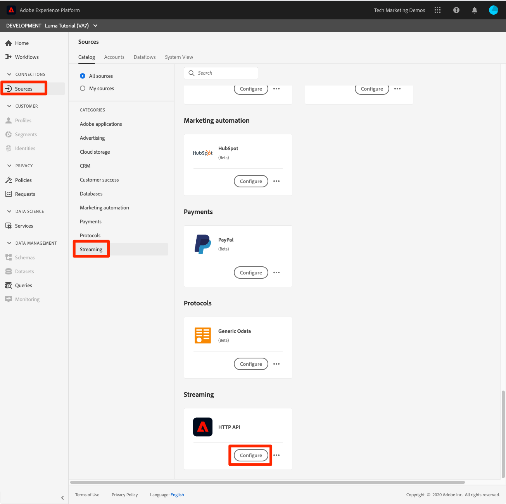
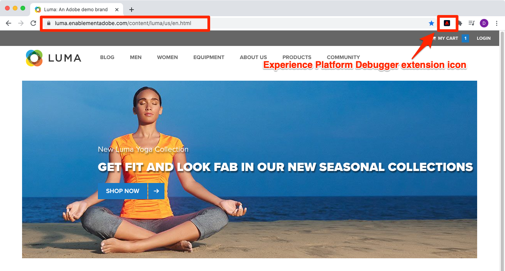
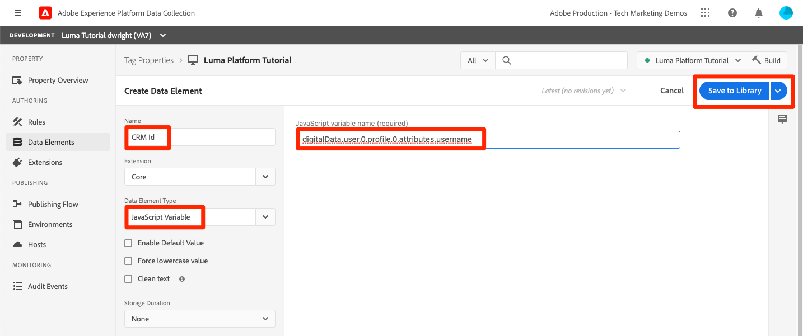

# De grootste streaminggegevens

<!--1hr-->

In deze les, zult u gegevens stromen gebruikend het Web SDK van Adobe Experience Platform.

Er zijn twee belangrijke taken wij in de interface van de Inzameling van Gegevens moeten voltooien:

* We moeten Web SDK implementeren op de Luma-website om gegevens over bezoekersactiviteit van de website naar het Adobe Edge-netwerk te verzenden. We zullen een eenvoudige implementatie uitvoeren met behulp van labels (voorheen Starten)

* Wij moeten een gegevensstroom vormen, die het netwerk van de Rand vertelt waar te om de gegevens door:sturen. Wij zullen het vormen om de gegevens naar onze te verzenden `Luma Web Events` dataset in onze zandbak van het Platform.

**Gegevensengineers** streaming gegevens opnemen buiten deze zelfstudie. Wanneer het uitvoeren van het Web van Adobe Experience Platform of Mobiele SDKs, typisch is een Web of een mobiele ontwikkelaar betrokken bij de verwezenlijking van de gegevenslaag en de configuratie van het markeringsbezit.

Voordat u met de oefeningen begint, bekijkt u deze twee korte video&#39;s voor meer informatie over het streamen van gegevensinvoer en Web SDK:
>[!VIDEO](https://video.tv.adobe.com/v/28425?quality=12&learn=on)

>[!VIDEO](https://video.tv.adobe.com/v/34141?quality=12&learn=on)

>[!NOTE]
>
>Hoewel deze zelfstudie vooral gericht is op het streamen van ingesloten gegevens van websites met Web SDK, kunt u ook gegevens streamen met de [Adobe Mobile SDK](https://developer.adobe.com/client-sdks/documentation/), [Apache Kafka Connect](https://github.com/adobe/experience-platform-streaming-connect)en andere mechanismen.

## Vereiste machtigingen

In de [Machtigingen configureren](configure-permissions.md) les, plaatst u opstelling alle toegangscontroles die worden vereist om deze les te voltooien.

<!--
* Permission items **[!UICONTROL Launch]** > **[!UICONTROL Property Rights]** > **[!UICONTROL Approve]**, **[!UICONTROL Develop]**, **[!UICONTROL Manage Environments]**, **[!UICONTROL Manage Extensions]**, and **[!UICONTROL Publish]**
* Permission item **[!UICONTROL Launch]** > **[!UICONTROL Company Rights]** > **[!UICONTROL Manage Properties]**
* User-role access to the `Luma Tutorial Launch` product profile
* Admin-role access to the `Luma Tutorial Launch` product profile
* Permission items **[!UICONTROL Platform]** > **[!UICONTROL Data Ingestion]** > **[!UICONTROL View Sources]** and **[!UICONTROL Manage Sources]**
* Permission items **[!UICONTROL Platform]** > **[!UICONTROL Data Management]** > **[!UICONTROL View Datasets]** and **[!UICONTROL Manage Datasets]**
* Permission items **[!UICONTROL Platform]** > **[!UICONTROL Profiles]** > **[!UICONTROL View Profiles]**, **[!UICONTROL Manage Profiles]** and **[!UICONTROL Export Audience Segment]**
* Permission item **[!UICONTROL Platform]** > **[!UICONTROL Sandbox Administration]** > **[!UICONTROL View Sandboxes]**
* Permission item **[!UICONTROL Platform]** > **[!UICONTROL Sandboxes]** > `Luma Tutorial`
* User-role access to the `Luma Tutorial Platform` product profile
-->

<!--## Create a streaming source

1. Log into the [Experience Platform  user interface](https://experience.adobe.com/platform/)
1. Go to **[!UICONTROL Sources]** in the left navigation
1. Filter the list by selecting **[!UICONTROL Streaming]**
1. In the **[!UICONTROL HTTP API]** section, select the **[!UICONTROL Configure]** button
    
1. On the **[!UICONTROL Authentication]** step, enter `Luma Web Events Source` as the **[!UICONTROL Account name]** and select the **[!UICONTROL Connect to source]** button (we don't need to enable authentication since the data will be originating from website visitors)
    
1. Once connected, select the **[!UICONTROL Next]** button to proceed to the next step in the workflow
1. On the **[!UICONTROL Select data]** step, choose **[!UICONTROL Existing Dataset]**, select your `Luma Web Events Dataset`, and then select the **[!UICONTROL Next]** button
    
1. On the **[!UICONTROL Dataflow detail]** step, select the **[!UICONTROL Next]** button:
    
    <!--What is a good practice for naming the data flow vs the source-->
<!--
1. On the **[!UICONTROL Review]** step, review your source details and select the **[!UICONTROL Finish]** button:
    
-->

## De gegevensstroom configureren

Eerst zullen wij de datastream vormen. Een gegevensstroom vertelt het netwerk van Adobe Edge waar te om de gegevens te verzenden na het ontvangen van het van de vraag van SDK van het Web. Wilt u de gegevens bijvoorbeeld naar Experience Platform, Adobe Analytics of Adobe Target verzenden? De stromen van gegevens worden beheerd in het gebruikersinterface van de Inzameling van Gegevens (vroeger Lancering) en zijn kritiek aan gegevensinzameling met Web SDK.

Om uw [!UICONTROL datastream]:

1. Aanmelden bij [Gebruikersinterface voor gegevensverzameling Experience Platforms](https://experience.adobe.com/launch/)
   <!--when will the edge config go live?-->

1. Selecteren **[!UICONTROL DataStreams]** in de linkernavigatie
1. Selecteer **[!UICONTROL Nieuwe DataStream]** in de rechterbovenhoek

   

1. Voor de **[!UICONTROL Vriendschappelijke naam]**, enter `Luma Platform Tutorial` (voeg uw naam aan het eind toe, als de veelvoudige mensen van uw bedrijf dit leerprogramma nemen)
1. Selecteer **[!UICONTROL Opslaan]** knop

   

In het volgende scherm geeft u op waar u gegevens wilt verzenden. Gegevens verzenden naar Experience Platform:

1. In-/uitschakelen **[!UICONTROL Adobe Experience Platform]** aanvullende velden beschikbaar maken
1. Voor **[!UICONTROL Sandbox]**, selecteert u `Luma Tutorial`
1. Voor **[!UICONTROL Gebeurtenisgegevens]**, selecteert u `Luma Web Events Dataset`
1. Als u andere toepassingen van Adobe gebruikt, voel vrij om de andere secties te onderzoeken om te zien welke informatie in de Configuratie van de Rand van deze andere oplossingen wordt vereist. Herinner me, werd SDK van het Web ontwikkeld niet alleen om gegevens in Experience Platform te stromen, maar ook om alle vorige bibliotheken te vervangen JavaScript die door andere toepassingen van Adobe worden gebruikt. De configuratie van de Rand wordt gebruikt om de rekeningsdetails van elke toepassing te specificeren waarnaar u de gegevens wilt verzenden.
1. Selecteren **[!UICONTROL Opslaan]**
   

Zodra de Configuratie van de Rand heeft bewaard, zal het resulterende scherm drie milieu&#39;s voor Ontwikkeling, het Opvoeren, en Productie tonen zijn gecreeerd. Er kunnen extra ontwikkelomgevingen worden toegevoegd:

Alle drie omgevingen bevatten de Platforms die u zojuist hebt ingevoerd. Nochtans, kunnen deze details verschillend per milieu worden gevormd. U kunt bijvoorbeeld elke omgeving gegevens laten verzenden naar een andere sandbox met Platforms. In deze zelfstudie maken we geen verdere aanpassingen van onze gegevensstroom door.

## De web SDK-extensie installeren

### Een eigenschap toevoegen

Eerst moeten we een tag-eigenschap maken (voorheen een tag-eigenschap). Een eigenschap is een container voor alle JavaScript, regels en andere functies die vereist zijn om gegevens van een webpagina te verzamelen en naar verschillende locaties te verzenden.

Een eigenschap maken:

1. Ga naar **[!UICONTROL Eigenschappen]** in de linkernavigatie
1. Selecteer **[!UICONTROL Nieuwe eigenschap]** knop
   
1. Als de **[!UICONTROL Naam]**, enter `Luma Platform Tutorial` (voeg uw naam aan het eind toe, als de veelvoudige mensen van uw bedrijf dit leerprogramma nemen)
1. Als de **[!UICONTROL Domeinen]**, enter `enablementadobe.com` (later toegelicht)
1. Selecteren **[!UICONTROL Opslaan]**
   

<!--
After saving the property, you might see an error message like the one below. If so, this is because you don't actually have access to the property you just created. To fix this, we need to go to the Admin Console to give yourself access:
    

To give yourself access to the property:

1. In a separate browser tab, log into the [Admin Console](https://adminconsole.adobe.com/)
1. Go to **[!UICONTROL Products]** from the top navigation
1. Select **[!UICONTROL Adobe Experience Platform Launch]** on the left navigation
1. Go to your `Luma Tutorial Launch` product profile
1. Go to the **[!UICONTROL Permissions]** tab
1. On the **[!UICONTROL Properties]** row, select **[!UICONTROL Edit]**
    
1. Select the "+" icon to move your `Luma Platform Tutorial` property to the right-hand side and select the **[!UICONTROL Save]** button to update the permissions
   
    

Now switch back to your browser tab with the Data Collection interface still open. Reload the page and the `Luma Platform Tutorial` property should display in the list. Select to open the property:

-->

## De Web SDK-extensie toevoegen

Nu u een bezit hebt kunt u SDK van het Web toevoegen gebruikend een uitbreiding. Een extensie is een pakket code waarmee de interface en functionaliteit voor gegevensverzameling worden uitgebreid. De extensie toevoegen:

1. De eigenschap tag openen
1. Ga naar **[!UICONTROL Extensies]** in de linkernavigatie
1. Ga naar de **[!UICONTROL Catalogus]** tab
1. Er zijn veel extensies beschikbaar voor tags. De catalogus filteren met de term `Web SDK`
1. In de **[!UICONTROL Adobe Experience Platform Web SDK]** -extensie selecteert u de **[!UICONTROL Installeren]** knop
   
1. Er zijn verscheidene configuraties beschikbaar voor de uitbreiding van SDK van het Web, maar er slechts twee zullen wij voor dit leerprogramma vormen. Werk de **[!UICONTROL Edge-domein]** tot `data.enablementadobe.com`. Met deze instelling kunt u cookies van de eerste partij instellen met uw Web SDK-implementatie, wat wordt aangemoedigd. Verderop in deze les, zult u een website op de `enablementadobe.com` naar de eigenschap tag. De NAAM voor de `enablementadobe.com` het domein is reeds gevormd zodat `data.enablementadobe.com` wordt doorgestuurd naar Adobe-servers. Wanneer u SDK van het Web op uw eigen website uitvoert, zult u CNAME voor uw eigen doeleinden van de gegevensinzameling, bijvoorbeeld moeten creëren `data.YOUR_DOMAIN.com`
1. Van de **[!UICONTROL DataStream]** vervolgkeuzelijst, selecteert u uw `Luma Platform Tutorial` datastream.
1. Voel vrij om de andere configuratieopties (maar verander hen niet!) te bekijken en selecteer vervolgens **[!UICONTROL Opslaan]**
   <!--is edge domain required for first party? when will it break?-->
   <!--any other fields that should be highlighted-->
   

## Een regel maken voor het verzenden van gegevens

Nu maken we een regel voor het verzenden van gegevens naar het Platform. Een regel is een combinatie van gebeurtenissen, voorwaarden en handelingen die ervoor zorgen dat tags iets doen. Een regel maken:

1. Ga naar **[!UICONTROL Regels]** in de linkernavigatie
1. Selecteer **[!UICONTROL Nieuwe regel maken]** knop
   
1. Naam van de regel `All Pages - Library Loaded`
1. Onder **[!UICONTROL Gebeurtenissen]**, selecteert u de **[!UICONTROL Toevoegen]** knop
   
1. Gebruik de **[!UICONTROL Kern]** **[!UICONTROL Extensie]** en selecteert u **[!UICONTROL Bibliotheek geladen (pagina boven)]** als de **[!UICONTROL Type gebeurtenis]**. Deze instelling betekent dat de regel wordt geactiveerd wanneer de bibliotheek Starten op een pagina wordt geladen.
1. Selecteren **[!UICONTROL Wijzigingen behouden]** om op het belangrijkste regelscherm terug te keren
   
1. Verlaten **[!UICONTROL Voorwaarden]** leeg, omdat we willen dat deze regel op alle pagina&#39;s wordt toegepast, zoals bij de naam die we hem gaven
1. Onder **[!UICONTROL Handelingen]**, selecteert u de **[!UICONTROL Toevoegen]** knop
1. Gebruik de **[!UICONTROL Adobe Experience Platform Web SDK]** **[!UICONTROL Extensie]** en selecteert u **[!UICONTROL Gebeurtenis verzenden]** als de **[!UICONTROL Type handeling]**
1. Selecteer rechts **[!UICONTROL web.webpagedetails.pageViews]** van de **[!UICONTROL Type]** vervolgkeuzelijst. Dit is een van de XDM-velden in onze `Luma Web Events Schema`
1. Selecteren **[!UICONTROL Wijzigingen behouden]** om op het belangrijkste regelscherm terug te keren
   
1. Selecteren **[!UICONTROL Opslaan]** om de regel op te slaan\
   

## De regel in een bibliotheek publiceren

Vervolgens publiceren we de regel naar onze ontwikkelomgeving, zodat we kunnen controleren of deze werkt.

<!--
There are a few quick steps we must take in the **[!UICONTROL Publishing]** section of Launch.

### Create a host

Launch libraries can be hosted on Adobe's Content Delivery Network (CDN) or on your own servers. In this tutorial, we will use Adobe's CDN since it is faster to set up:

1. Go to **[!UICONTROL Hosts]** in the left navigation
1. Select the **[!UICONTROL Create New Host]** button
       
1. For the **[!UICONTROL Name]**, enter `Adobe CDN`
1. For the **[!UICONTROL Type]**, select **[!UICONTROL Managed by Adobe]**
1. Select the **[!UICONTROL Save]** button to complete the setup of the host
       

### Create an environment

Environments allow you to have different versions of a library in different publishing environments to accommodate your publishing workflow. For example, the fully tested version of your library can be published to a Production environment, while new changes are being created in a Development environment. You can also use different hosts for each environment. To create an environment:

1. Go to **[!UICONTROL Environments]** in the left navigation
1. Select the **[!UICONTROL Create New Environment]** button
     
1. Under **[!UICONTROL Development]** select **[!UICONTROL Select]**   
     
1. For the **[!UICONTROL Name]**, enter `Development`
1. For the **[!UICONTROL Select Host]** dropdown, select `Adobe CDN`
1. Select the **[!UICONTROL Save]** button to complete the setup of the environment
    
1. You will see a modal with URL and other implementation details of this library. These are critical for a real Launch implementation, but we don't need to worry about them for this tutorial. Select the **[!UICONTROL Close]** button to exit the modal.

### Create and publish the library

Now let's bundle the contents of our property&mdash;currently an extension and a rule&mdash;into a library. 
-->

Een bibliotheek maken:

1. Ga naar **[!UICONTROL Publishing Flow]** in de linkernavigatie
1. Selecteren **[!UICONTROL Bibliotheek toevoegen]**
   
1. Voor de **[!UICONTROL Naam]**, enter `Luma Platform Tutorial`
1. Voor de **[!UICONTROL Omgeving]**, selecteert u `Development`
1. Selecteer **[!UICONTROL Alle gewijzigde bronnen toevoegen]** knop. (Naast de [!UICONTROL Adobe Experience Platform Web SDK] en de `All Pages - Library Loaded` regel, u zult ook zien [!UICONTROL Kern] toegevoegd met de basis-JavaScript die is vereist voor alle wegeigenschappen van Launch.)
1. Selecteer **[!UICONTROL Opslaan en bouwen voor ontwikkeling]** knop
   

Het kan enkele minuten duren voordat de bibliotheek is gemaakt en wanneer deze is voltooid, wordt links van de bibliotheeknaam een groene stip weergegeven:

Zoals u kunt zien op het tabblad [!UICONTROL Publishing Flow] screen, is er veel meer aan het het publiceren proces dat buiten het werkingsgebied van deze zelfstudie is. We gaan gewoon één bibliotheek gebruiken in onze ontwikkelomgeving.

## De gegevens in de aanvraag valideren

### Het Adobe Experience Platform Debugger toevoegen

Foutopsporing voor Experience Platforms is een extensie die beschikbaar is voor Chrome- en Firefox-browsers en waarmee u de Adobe-technologie kunt bekijken die in uw webpagina&#39;s is geïmplementeerd. Download de versie voor uw voorkeursbrowser:

* [Firefox-extensie](https://addons.mozilla.org/nl/firefox/addon/adobe-experience-platform-dbg/)
* [Chrome-extensie](https://chrome.google.com/webstore/detail/adobe-experience-platform/bfnnokhpnncpkdmbokanobigaccjkpob)

Als u Foutopsporing nooit eerder hebt gebruikt—en deze is anders dan de oudere Adobe Experience Cloud Debugger—kunt u deze overzichtsvideo van vijf minuten bekijken:

>[!VIDEO](https://video.tv.adobe.com/v/32156?quality=12&learn=on)

### De Luma-website openen

Voor deze zelfstudie gebruiken we een openbaar gehoste versie van de Luma-demo-website. Laten we het openen en een bladwijzer maken:

1. Open op een nieuw browsertabblad het tabblad [Luma-website](https://luma.enablementadobe.com/content/luma/us/en.html).
1. Bladwijzer maken van de pagina voor gebruik in de rest van de zelfstudie

Deze gehoste website is de reden waarom we deze website hebben gebruikt `enablementadobe.com` in de [!UICONTROL Domeinen] gebied van onze aanvankelijke configuratie van het markeringsbezit en waarom wij gebruikten `data.enablementadobe.com` als ons eersteklas domein in de [!UICONTROL Adobe Experience Platform Web SDK] extensie. Zie je, ik had een plan!

### Gebruik Foutopsporing Experience Platform om aan uw markeringsbezit in kaart te brengen

Foutopsporing voor Experience Platform heeft een coole functie waarmee u een bestaande eigenschap voor tags kunt vervangen door een andere eigenschap. Dit is nuttig voor bevestiging en staat ons toe om vele implementatiestappen in dit leerprogramma over te slaan.

1. Zorg ervoor dat de Luminasite is geopend en selecteer het extensiepictogram Experience Platform debugger
1. Foutopsporing opent en toont sommige details van de hard-gecodeerde implementatie, die met dit leerprogramma niet verwant is (u kunt de plaats van de Luma na het openen van Debugger moeten opnieuw laden)
1. Controleer of Foutopsporing &quot;**[!UICONTROL Verbonden met luminantie]**&quot; zoals hieronder wordt weergegeven en selecteer vervolgens &quot;**[!UICONTROL vergrendelen]**&quot; pictogram om Foutopsporing te vergrendelen op de Luministensite.
1. Selecteer **[!UICONTROL Aanmelden]** boven aan rechts om te verifiëren.
1. Ga nu naar **[!UICONTROL Starten]** in de linkernavigatie
1. Selecteer het tabblad Configuratie
1. Rechts van waar het u toont **[!UICONTROL Pagina-insluitcodes]**, opent u de **[!UICONTROL Handelingen]** vervolgkeuzelijst en selecteert u **[!UICONTROL Vervangen]**
   
1. Aangezien u voor authentiek wordt verklaard, zal Foutopsporing in uw beschikbare eigenschappen en milieu&#39;s van de Lancering trekken. Selecteer uw `Luma Platform Tutorial` eigenschap
1. Selecteer uw `Development` milieu
1. Selecteer **[!UICONTROL Toepassen]** knop
   
1. De Luma-website wordt nu opnieuw geladen _met uw eigenschap tag_. Help, ik ben gehackt! Grapje.
   
1. Ga naar **[!UICONTROL Samenvatting]** in de linkernavigatie, om de details van uw te zien [!UICONTROL Starten] eigenschap
   
1. Ga nu naar **[!UICONTROL AEP Web SDK]** in de linkernavigatie om de **[!UICONTROL Netwerkverzoeken]**
1. Open de **[!UICONTROL gebeurtenissen]** rij

   
1. Let op hoe we de `web.webpagedetails.pageView` gebeurtenistype dat we in onze [!UICONTROL Gebeurtenis verzenden] handeling en andere variabelen die zich aan de `AEP Web SDK ExperienceEvent Mixin` format
   
1. Deze typen aanvraagdetails zijn ook zichtbaar in de webontwikkelaarsgereedschappen van de browser **Netwerk** tab. Open het en laad de pagina opnieuw. Filter voor aanroepen met `interact` om van de vraag de plaats te bepalen, het te selecteren, en dan in te kijken **Kopteksten** tab, **Payload aanvragen** gebied.
   
1. Ga naar de **Antwoord** en noteer hoe de ECID-waarde wordt opgenomen in het antwoord. Kopieer deze waarde zoals u deze gebruikt om de profielgegevens in de volgende oefening te valideren.
   

## Gegevens in Experience Platform valideren

U kunt controleren of de gegevens in het Platform worden geladen door te kijken naar de batches met gegevens die in het dialoogvenster `Luma Web Events Dataset`. (Ik weet dat het streaming data-opname heet, maar nu zeg ik dat het in batches aankomt! Het stroomt in real time aan Profiel, zodat kan het voor segmentatie en activering in real time worden gebruikt, maar wordt verzonden in partijen om de 15 minuten aan het gegevenspeer.)

De gegevens valideren:

1. Ga in de gebruikersinterface van het Platform naar **[!UICONTROL Gegevenssets]** in de linkernavigatie
1. Open de `Luma Web Events Dataset` en bevestigen dat een partij is aangekomen. Herinner me, worden zij verzonden om de 15 minuten, zodat zou u op de partij kunnen moeten wachten om omhoog te verschijnen.
1. Selecteer **[!UICONTROL Gegevensset voorvertoning]** knop
   
1. Let in de voorvertoningsmodus op hoe u verschillende velden van het schema aan de linkerkant kunt selecteren om een voorvertoning van die specifieke gegevenspunten weer te geven:
   

U kunt ook bevestigen dat het nieuwe profiel wordt weergegeven:

1. Ga in de gebruikersinterface van het Platform naar **[!UICONTROL Profielen]** in de linkernavigatie
1. Selecteer **[!UICONTROL ECID]** naamruimte en zoek naar uw ECID-waarde (kopieer deze uit de reactie. Het profiel heeft een eigen id, gescheiden van de ECID.
1. Selecteer **[!UICONTROL Profiel-id]** om het profiel te openen
   
1. Selecteer **[!UICONTROL Gebeurtenissen]** tabblad om de weergegeven pagina&#39;s weer te geven
   \
   <!---->

## Aangepaste gegevens aan de gebeurtenis toevoegen

### Een gegevenselement voor een paginanaam maken

1. In de interface van de markeringen van de Inzameling van Gegevens, op de hoogste juiste hoek van uw `Luma Platform Tutorial` eigenschap, opent u de **[!UICONTROL Een werkbibliotheek selecteren]** vervolgkeuzelijst en selecteer uw `Luma Platform Tutorial` bibliotheek. Met deze instelling kunt u gemakkelijker aanvullende updates naar onze bibliotheek publiceren.
1. Ga nu naar **[!UICONTROL Gegevenselementen]** in de linkernavigatie
1. Selecteer **[!UICONTROL Nieuw gegevenselement maken]** knop

   
1. Als de **[!UICONTROL Naam]**, enter `Page Name`
1. Als de **[!UICONTROL Type gegevenselement]**, selecteert u `JavaScript Variable`
1. Als de **[!UICONTROL JavaScript variabelenaam]**, enter `digitalData.page.pageInfo.pageName`
1. Als u de notatie van de waarden wilt standaardiseren, schakelt u de selectievakjes in op **[!UICONTROL Waarde in kleine letters forceren]** en **[!UICONTROL Tekst opschonen]**
1. Controleer of `Luma Platform Tutorial` is geselecteerd als de werkbibliotheek
1. Selecteren **[!UICONTROL Opslaan in bibliotheek]**
   

### De paginanaam toewijzen aan het gegevenselement XDM Object

Nu zullen wij onze paginanaam aan het Web SDK in kaart brengen.

>[!IMPORTANT]
>
>Om deze taak te voltooien, moeten wij ervoor zorgen dat uw gebruiker eerst toegang tot de zandbak van de Prod heeft. Als u nog geen toegang hebt tot de Prod-sandbox vanuit een ander productprofiel, opent u snel uw `Luma Tutorial Platform` profiel instellen en het machtigingsitem toevoegen **[!UICONTROL Sandboxen]** > **[!UICONTROL Prod]**. Voer vervolgens een SHIFT-Opnieuw laden op de pagina Data Elements uit om de cache te wissen
>

Op de **[!UICONTROL Gegevenselementen]** pagina:

1. Een nieuw gegevenselement maken
1. Als de **[!UICONTROL Naam]**, enter `XDM Object`
1. Als de **[!UICONTROL Extensie]**, selecteert u `Adobe Experience Platform Web SDK`
1. Als de **[!UICONTROL Type gegevenselement]**, selecteert u `XDM object`
1. Als de **[!UICONTROL Sandbox]**, selecteert u uw `Luma Tutorial` sandbox
1. Als de **[!UICONTROL Schema]**, selecteert u uw `Luma Web Events Schema`
1. Selecteer `web.webPageDetails.name` field
1. Als de **[!UICONTROL Waarde]**, selecteert u het pictogram om de selectie van het gegevenselement modaal te openen en uw `Page Name` gegevenselement
1. Selecteren **[!UICONTROL Opslaan in bibliotheek]**
   

Hetzelfde proces wordt gebruikt om extra aangepaste gegevens op uw website toe te wijzen aan XDM-velden.

### De XDM-gegevens toevoegen aan de handeling Verzendgebeurtenis

Nu u gegevens hebt toegewezen aan XDM-velden, kunt u deze opnemen in de handeling Verzendgebeurtenis:

1. Ga naar de **[!UICONTROL Regels]** scherm
1. Open uw `All Pages - Library Loaded` regel
1. Open de `Adobe Experience Platform Web SDK - Send Event` action
1. Als de **[!UICONTROL XDM-gegevens]**, selecteert u het pictogram om de selectie van het gegevenselement modaal te openen en uw `XDM Object` gegevenselement
1. Selecteer **[!UICONTROL Wijzigingen behouden]** knop
   
1. Sinds u `Luma Platform Tutorial` als uw werkbibliotheek voor de laatste verschillende oefeningen geselecteerd, zijn uw recente veranderingen direct aan de bibliotheek bewaard. In plaats van dat u onze wijzigingen moet publiceren via het scherm Publishing Flow, kunt u gewoon het vervolgkeuzemenu op de blauwe knop openen en **[!UICONTROL Opslaan in bibliotheek en samenstellen]**
   

Hiermee maakt u een nieuwe tagbibliotheek met de drie wijzigingen die u zojuist hebt aangebracht.

### De XDM-gegevens valideren

U moet nu de startpagina Luma opnieuw kunnen laden, terwijl deze aan uw markeringseigenschap is toegewezen met de foutopsporing zoals u eerder hebt geleerd, en controleren of het veld Paginanaam in de aanvraag wordt ingevuld!

U kunt ook controleren of de gegevens van de paginanaam in het Platform zijn ontvangen door een voorbeeld van de gegevensset en het profiel weer te geven.

## Extra identiteiten verzenden

Uw Web SDK-implementatie verzendt nu gebeurtenissen met de Experience Cloud-id (ECID) als primaire id. De ECID wordt automatisch gegenereerd door de Web SDK en is uniek per apparaat en browser. Eén klant kan meerdere ECID&#39;s hebben, afhankelijk van het apparaat en de browser die hij of zij gebruikt. Dus hoe kunnen we een uniforme weergave van deze klant krijgen en hun online activiteiten koppelen aan onze gegevens over CRM, Loyalty en offline aankoop? Dat doen we door tijdens hun sessie aanvullende identiteiten te verzamelen en hun profiel via identiteitsstitching vastberaden te koppelen.

Als u zich herinnert, vermeldde ik dat wij ECID en CRM Identiteitskaart als identiteiten voor onze Webgegevens in zouden gebruiken [Identiteiten kaart](map-identities.md) les. Zo verzamelen wij CRM identiteitskaart met het Web SDK!

### Gegevenselement toevoegen voor de CRM-id

Eerst slaan wij CRM identiteitskaart in een gegevenselement op:

1. Voeg in de taginterface een gegevenselement met de naam `CRM Id`
1. Als de **[!UICONTROL Type gegevenselement]**, selecteert u **[!UICONTROL JavaScript-variabele]**
1. Als de **[!UICONTROL JavaScript variabelenaam]**, enter `digitalData.user.0.profile.0.attributes.username`
1. Selecteer **[!UICONTROL Opslaan in bibliotheek]** knop (`Luma Platform Tutorial` moet nog steeds uw werkbibliotheek zijn)
   

### Voeg CRM-id toe aan het gegevenselement Identiteitskaart

Nu wij de waarde van CRM ID hebben gevangen, moeten wij het met een speciaal type van gegevenselement associëren genoemd [!UICONTROL Identiteitskaart] gegevenselement:

1. Een gegevenselement toevoegen met de naam `Identities`
1. Als de **[!UICONTROL Extensie]**, selecteert u **[!UICONTROL Adobe Experience Platform Web SDK]**
1. Als de **[!UICONTROL Type gegevenselement]**, selecteert u **[!UICONTROL Identiteitskaart]**
1. Als de **[!UICONTROL Naamruimte]**, enter `Luma CRM Id`, die [!UICONTROL namespace] we hebben een eerdere les gemaakt

   >[!WARNING]
   >
   >Met de Adobe Experience Platform Web SDK-extensie versie 2.2 kunt u Namespace selecteren in een vooraf ingevuld vervolgkeuzemenu met de werkelijke waarden in uw Platform-account. Helaas is deze functie nog niet &#39;sandbox aware&#39; en dus de `Luma CRM Id` Deze waarde wordt mogelijk niet weergegeven in het vervolgkeuzemenu. Hierdoor kan het voorkomen dat u deze oefening voltooit. We zullen een tijdelijke oplossing plaatsen zodra dit is bevestigd.

1. Als de **[!UICONTROL ID]**, selecteert u het pictogram om de selectie van het gegevenselement modaal te openen en uw `CRM Id` gegevenselement
1. Als de **[!UICONTROL Geverifieerde status]**, selecteert u **[!UICONTROL Geverifieerd]**
1. Verlaten **[!UICONTROL Primair]** _uitgeschakeld_. Aangezien de CRM-id niet aanwezig is voor de meeste bezoekers van de Luma-website, bent u zeker _wilt de ECID niet overschrijven als primaire id_. Het zou een zeldzaam geval zijn om iets anders dan de ECID als primaire identificator te gebruiken. Meestal noem ik de standaardinstellingen niet in deze instructies, maar ik roep deze aan om u te helpen hoofdproblemen later in uw eigen implementatie te voorkomen.
1. Selecteer **[!UICONTROL Opslaan in bibliotheek]** knop (`Luma Platform Tutorial` moet nog steeds uw werkbibliotheek zijn)
   

>[!NOTE]
>
>U kunt meerdere id&#39;s doorgeven met de opdracht [!UICONTROL Identiteitskaart] gegevenstype.

### Het gegevenselement Identiteitskaart toevoegen aan het XDM-object

Er is nog één gegevenselement dat we moeten bijwerken: het XDM Object-gegevenselement. Het kan vreemd lijken om drie afzonderlijke gegevenselementen bij te werken om deze ene identiteit door te geven, maar dit proces is ontworpen om te schalen voor meerdere identiteiten. Maak je geen zorgen, we zijn bijna klaar met deze les!

1. Het XDM Object-gegevenselement openen
1. Open het XDM-veld IdentityMap
1. Als de **[!UICONTROL Gegevenselement]**, selecteert u het pictogram om de selectie van het gegevenselement modaal te openen en uw `Identities` gegevenselement
1. Sinds u `Luma Platform Tutorial` als uw werkbibliotheek voor de laatste verschillende oefeningen geselecteerd, zijn uw recente veranderingen direct aan de bibliotheek bewaard. In plaats van onze wijzigingen te publiceren via het scherm Publishing Flow, kunt u het vervolgkeuzemenu openen op de blauwe knop en **[!UICONTROL Opslaan in bibliotheek en samenstellen]**
   

### De identiteit valideren

Om te bevestigen dat CRM identiteitskaart nu door het Web SDK wordt verzonden:

1. Open de [Luma-website](https://luma.enablementadobe.com/content/luma/us/en.html)
1. Wijs het aan uw markeringsbezit toe gebruikend Debugger, zoals in vroegere instructies
1. Selecteer **Aanmelden** koppeling in de rechterbovenhoek van de Luma-website
1. Aanmelden met de aanmeldingsgegevens `test@adobe.com`/`test`
1. Zodra voor authentiek verklaard, inspecteer de vraag van SDK van het Web van het Experience Platform in Debugger (**[!UICONTROL Adobe Experience Platform Web SDK]** > **[!UICONTROL Netwerkverzoeken]** > **[!UICONTROL gebeurtenissen]** van het meest recente verzoek) en u dient de `lumaCrmId`:
   
1. Zoek het gebruikersprofiel op met behulp van de ECID-naamruimte en -waarde. In het profiel, zult u CRM identiteitskaart en ook Loyalty identiteitskaart en de profieldetails zoals de naam en het telefoonaantal zien. Alle identiteiten en gegevens zijn samengevoegd tot één enkel, real-time klantenprofiel!
   

## Aanvullende bronnen

* [Adobe Experience Cloud implementeren met Web SDK](/help/tutorial-web-sdk/overview.md)
* [Documentatie voor streaming insluiting](https://experienceleague.adobe.com/docs/experience-platform/ingestion/streaming/overview.html?lang=nl)
* [Referentie voor API voor streaming](https://www.adobe.io/experience-platform-apis/references/data-ingestion/#tag/Streaming-Ingestion)

Geweldig werk! Dat was veel informatie over Web SDK en Starten. Er is veel meer betrokken bij een volledige implementatie, maar dat zijn de basisbeginselen om u te helpen aan de slag te gaan en de resultaten in het Platform te zien.

>[!NOTE]
>
>Nu u klaar bent met de les over streaming inscriptie, kunt u de [!UICONTROL Prod] sandbox van uw `Luma Tutorial Platform` productprofiel

De Ingenieurs van gegevens, als u wilt kunt vooruit naar het [run query les](run-queries.md).

Gegevensarchitecten, u kunt verdergaan naar [beleid samenvoegen](create-merge-policies.md)!
