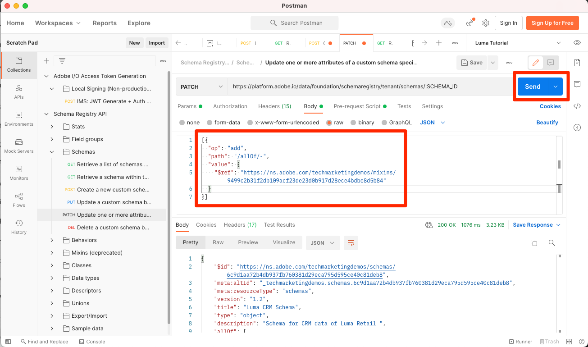

# Modelgegevens in schema&#39;s

<!-- 60min -->
In deze les, zult u de gegevens van Luma in schema&#39;s modelleren. Dit is een van de langste lessen in de zelfstudie, dus maak een glas water en sluit op!

Standaardisering en interoperabiliteit zijn de belangrijkste concepten achter Adobe Experience Platform. Het Model van Gegevens van de ervaring (XDM) is een inspanning om de gegevens van de klantenervaring te standaardiseren en schema&#39;s voor het beheer van de klantenervaring te bepalen.

XDM is een openbaar gedocumenteerde specificatie die wordt ontworpen om de macht van digitale ervaringen te verbeteren. Het verstrekt gemeenschappelijke structuren en definities voor om het even welke toepassing om met de diensten van het Platform te gebruiken te communiceren. Door zich aan de normen van XDM te houden, kunnen alle gegevens van de klantenervaring in een gemeenschappelijke vertegenwoordiging worden opgenomen die inzichten op een snellere, meer geïntegreerde manier kan leveren. U kunt waardevolle inzichten van klantenacties bereiken, klantenpubliek door segmenten bepalen, en klantenattributen voor verpersoonlijkingsdoeleinden uitdrukken.

XDM is het grondkader dat Adobe Experience Cloud, aangedreven door Experience Platform, toestaat om het juiste bericht aan de juiste persoon, op het juiste kanaal, op precies het juiste moment te leveren. De methodologie waarop het Experience Platform wordt gebouwd, **XDM Systeem**, stelt de Modelschema&#39;s van Gegevens van de Ervaring voor gebruik door de diensten van het Platform in werking.

<!--
This seems too lengthy. The video should suffice

Key terms:

* **Schema**: a representation of your data. A schema is comprised of a class and optional field groups and is used to create datasets. A schema includes behavioral attributes, timestamp, identity, attribute definitions, and relationships.
* **XDM Profile Class**: a common schema class used to represent record data
* **XDM ExperienceEvent Class**: a common schema class used to represent time-series data
* **Field group**: allows users to extend reusable fields that contain variables defining one or more attribute intended to be included in a schema or added to a class.
* **Standard Field group**: an open-source Field group built to conform to common industry standards, used to accelerate implementation and support repeatable services operating on the data
* **Data type**: a reusable object with properties in a hierarchical representation. These can be standard types or custom-defined defined types to describe your own data in your own way (for example, a collection of fields that you use to describe your products). Unlike Field groups, data types can be used in schemas regardless of the class.
* **Field**: a field is the lowest level element of a schema. Each field has a name for referencing and a type to identify the type of data that it contains. Field types can include, integer, number, string, Boolean and schema.
-->

**Architecten van Gegevens** zullen schema&#39;s buiten dit leerprogramma moeten tot stand brengen, maar **de Ingenieurs van Gegevens** zullen nauw met de schema&#39;s werken die door de Architect van Gegevens worden gecreeerd.

Voordat u met de oefeningen begint, bekijk deze korte video om meer over schema&#39;s en het Model van de Gegevens van de Ervaring te leren (XDM):
>[!VIDEO](https://video.tv.adobe.com/v/27105?learn=on)

>[!TIP]
>
> Voor een diepere duik in gegevens modellering in Experience Platform, adviseren wij het nemen van het cursus [ ModelUw Gegevens van de Ervaring van de Klant met XDM ](https://experienceleague.adobe.com/?recommended=ExperiencePlatform-D-1-2021.1.xdm), beschikbaar voor vrij op Experience League!

## Vereiste machtigingen

In [ vorm toestemmingen ](configure-permissions.md) les, u opstelling alle toegangscontroles die worden vereist om deze les te voltooien.

<!--, specifically:

* Permission items **[!UICONTROL Data Modeling]** > **[!UICONTROL View Schemas]** and **[!UICONTROL Manage Schemas]**
* Permission item **[!UICONTROL Sandboxes]** > `Luma Tutorial`
* User-role access to the `Luma Tutorial Platform` product profile
* Developer-role access to the `Luma Tutorial Platform` product profile (for API)-->


<!--
## Luma's goals
-->

## Loyalty-schema maken via gebruikersinterface

In deze oefening, zullen wij een schema voor de loyaliteitsgegevens van Luma tot stand brengen.

1. Ga naar de gebruikersinterface van het Platform en zorg ervoor dat uw zandbak wordt geselecteerd.
1. Ga naar **[!UICONTROL Schemas]** in de linkernavigatie.
1. Selecteer de knop **[!UICONTROL Create schema]** rechtsboven.
   

1. Selecteer in de workflow Schema maken **[!UICONTROL Individual Profile]** als basisklasse voor uw schema, omdat we kenmerken van een individuele klant (punten, status, enzovoort) gaan modelleren.
1. Selecteer **[!UICONTROL Next]**.
   

1. Voer `Luma Loyalty Schema` in het tekstveld **[!UICONTROL Schema display name]** in. In het onderstaande canvas kunt u ook de basisschemastructuur bekijken en verifiëren die wordt geleverd door de klasse die u hebt gekozen.
1. Selecteer **[!UICONTROL Finish]** om uw schema te maken.
   

### Standaardveldgroepen toevoegen

Zodra het schema wordt gecreeerd, zult u aan de redacteur van het Schema worden opnieuw gericht waar u gebieden aan het schema kunt toevoegen. U kunt afzonderlijke velden rechtstreeks aan het schema toevoegen of veldgroepen gebruiken. Houd er rekening mee dat alle afzonderlijke velden nog steeds zijn gekoppeld aan een klasse of veldgroep. U kunt kiezen uit een groot aantal industriestandaard veldgroepen die door Adobe worden geleverd, of u kunt uw eigen veldgroepen maken. Wanneer u uw eigen gegevens in het Experience Platform gaat modelleren, is het goed om vertrouwd te raken met de industriestandaard veldgroepen die door de Adobe worden geleverd. Waar mogelijk, is het beste praktijken om hen te gebruiken aangezien zij soms stroomafwaartse diensten, zoals KlantenAI, Attribution AI, en Adobe Analytics aandrijven.

Wanneer u met uw eigen gegevens werkt, is het belangrijk te bepalen welke van uw eigen gegevens in Platform moeten worden vastgelegd en hoe deze moeten worden gemodelleerd. Dit grote onderwerp wordt besproken meer diepgaand in de cursus [ ModelUw Gegevens van de Ervaring van de Klant met XDM ](https://experienceleague.adobe.com/?recommended=ExperiencePlatform-D-1-2021.1.xdm). In deze zelfstudie zal ik u enkel door de implementatie van sommige vooraf bepaalde schema&#39;s begeleiden.

Veld toevoegen:

1. Selecteer **[!UICONTROL Add]** onder de kop **[!UICONTROL Field Groups]** .
    toe
1. Selecteer in het modaal **[!UICONTROL Add Field groups]** de volgende veldgroepen:
   1. **[!UICONTROL Demographic Details]** voor basisklantgegevens zoals naam en geboortedatum
   1. **[!UICONTROL Personal Contact Details]** voor standaardcontactgegevens zoals e-mailadres en telefoonnummer
1. U kunt een voorvertoning van de toegevoegde velden weergeven in de veldgroep door het pictogram aan de rechterkant van de rij te selecteren.
   

1. Schakel het selectievakje **[!UICONTROL Industry]** > **[!UICONTROL Retail]** in om industriespecifieke veldgroepen beschikbaar te maken.
1. Selecteer **[!UICONTROL Loyalty Details]** om de velden voor het loyaliteitsprogramma toe te voegen.
1. Selecteer **[!UICONTROL Add field groups]** om alle drie veldgroepen aan het schema toe te voegen.
    toe


Nu, neem wat tijd om de huidige staat van het schema te onderzoeken. De veldgroepen hebben standaardvelden toegevoegd die betrekking hebben op een persoon, de contactgegevens en de status van het loyaliteitsprogramma. Deze twee veldgroepen zijn wellicht handig wanneer u schema&#39;s voor de gegevens van uw eigen bedrijf maakt. Selecteer een specifieke veldgroeprij of schakel het selectievakje naast de naam van de veldgroep in om te zien hoe de visualisatie verandert.

Selecteer **[!UICONTROL Save]** om het schema op te slaan.


>[!NOTE]
>
>Het is oké als een veldgroep een veld toevoegt voor een gegevenspunt dat u niet verzamelt. &#39;faxPhone&#39; kan bijvoorbeeld een veld zijn waarvoor Luma geen gegevens verzamelt. Dat is prima. Enkel omdat een gebied in het schema wordt bepaald betekent niet dat de gegevens voor het ** later op moeten worden opgenomen. U kunt het veld ook uit het schema verwijderen.

### Een aangepaste veldgroep toevoegen

Laten we nu een aangepaste veldgroep maken.

Terwijl de groep van het loyaliteitsgebied een `loyaltyID` gebied bevatte, zou Luma al hun systeemherkenningstekens in één enkele groep willen beheren helpen consistentie over hun schema&#39;s verzekeren.

Veldgroepen moeten worden gemaakt in de schemaworkflow. U kunt:

* Voeg eerst een nieuw aangepast veld toe aan uw schema en maak vervolgens een aangepaste veldgroep, of
* Maak eerst een aangepaste veldgroep en voeg daar vervolgens velden aan toe.

In deze zelfstudie beginnen we met het maken van een aangepaste veldgroep.

De veldgroep maken:

1. **[!UICONTROL Add]** selecteren onder de kop **[!UICONTROL Schema Field Groups]**
    toe
1. Selecteren **[!UICONTROL Create new field group]**
1. `Luma Identity profile field group` gebruiken als de **[!UICONTROL Display name]**
1. `system identifiers for XDM Individual Profile class` gebruiken als de **[!UICONTROL Description]**
1. Selecteren **[!UICONTROL Add field groups]**
    toe

De nieuwe, lege veldgroep wordt toegevoegd aan uw schema. Met de knoppen **[!UICONTROL +]** kunt u nieuwe velden toevoegen aan elke locatie in de hiërarchie. In ons geval willen we velden toevoegen op het hoofdniveau:

1. Selecteer **[!UICONTROL +]** naast de naam van het schema. Hiermee wordt een nieuw veld onder de naamruimte voor id van een huurder toegevoegd voor het beheer van conflicten tussen uw aangepaste velden en standaardvelden.
1. Voeg in de zijbalk **[!UICONTROL Field properties]** de details van het nieuwe veld toe:
   1. **[!UICONTROL Field name]**: `systemIdentifier`
   1. **[!UICONTROL Display name]**: `System Identifier`
   1. **[!UICONTROL Type]**: **[!UICONTROL Object]**
   1. In **[!UICONTROL Field Group]** dropdown selecteer de **Luminantiegids de groep van het profielgebied van de Identiteit** die wij hebben gecreeerd.
       toe
   1. Selecteren **[!UICONTROL Apply]**
       toe

Voeg nu twee velden toe onder het object `systemIdentifier` :

1. Eerste veld
   1. **[!UICONTROL Field name]**: `loyaltyId`
   1. **[!UICONTROL Display name:]** `Loyalty Id`
   1. **[!UICONTROL Type]**: **[!UICONTROL String]**
1. Tweede veld
   1. **[!UICONTROL Field Name]**: `crmId`
   1. **[!UICONTROL Display Name]**: `CRM Id`
   1. **[!UICONTROL Type]**: **[!UICONTROL String]**

Uw nieuwe veldgroep moet er zo uitzien. Selecteer de knop **[!UICONTROL Save]** om het schema op te slaan, maar laat het schema open voor de volgende oefening.


## Een gegevenstype maken

Veldgroepen, zoals uw nieuwe `Luma Identity profile field group` , kunnen in andere schema&#39;s opnieuw worden gebruikt, zodat u standaardgegevensdefinities op meerdere systemen kunt toepassen. Maar zij kunnen slechts _in schema&#39;s worden opnieuw gebruikt die een klasse_ delen, in dit geval de individuele klasse van het Profiel XDM.

Het gegevenstype is een andere multifield constructie die in schema&#39;s _over veelvoudige klassen_ kan worden opnieuw gebruikt. Laten we ons nieuwe `systemIdentifier` -object omzetten in een gegevenstype:

Zorg dat `Luma Loyalty Schema` nog steeds is geopend en selecteer het `systemIdentifier` -object en selecteer **[!UICONTROL Convert to new data type]**


Als u het schema **[!UICONTROL Cancel]** verlaat en naar het tabblad **[!UICONTROL Data types]** navigeert, ziet u het nieuwe gegevenstype. Dit gegevenstype wordt later in de les gebruikt.


## CRM-schema maken via API

Nu maken we een schema met de API.

>[!TIP]
>
> Als u liever de API-oefening overslaat, kunt u het volgende schema maken met de gebruikersinterfacemethode:
>
> 1. De klasse [!UICONTROL Individual Profile] gebruiken
> 1. Naam geven `Luma CRM Schema`
> 1. Gebruik de volgende veldgroepen: Demografische details, Persoonlijke contactgegevens en Luminimitatieprofielveldgroep

Eerst maken we het lege schema:

1. Openen [!DNL Postman]
1. Als u geen toegangstoken hebt, open het verzoek **[!DNL OAuth: Request Access Token]** en selecteer **verzend** om een nieuw toegangstoken te verzoeken.
1. Open uw milieuvariabelen en verander de waarde van **CONTAINER_ID** van `global` in `tenant`. Vergeet niet dat u `tenant` moet gebruiken wanneer u met uw eigen aangepaste elementen in Platform wilt werken, zoals het maken van een schema.
1. Selecteer **sparen**
   
1. De aanvraag openen **[!DNL Schema Registry API > Schemas > Create a new custom schema.]**
1. Open het **Lichaam** lusje en kleef de volgende code en selecteer **verzenden** om de API vraag te maken. Met deze aanroep wordt een nieuw schema gemaakt met dezelfde basisklasse `XDM Individual Profile` :

   ```json
   {
     "type": "object",
     "title": "Luma CRM Schema",
     "description": "Schema for CRM data of Luma Retail ",
     "allOf": [{
       "$ref": "https://ns.adobe.com/xdm/context/profile"
     }]
   }
   ```

   >[!NOTE]
   >
   >De naamruimteverwijzingen in dit en volgende codevoorbeelden (bijvoorbeeld `https://ns.adobe.com/xdm/context/profile` ) kunnen worden verkregen door API-aanroepen van lijsten te gebruiken met de **[!DNL CONTAINER_ID]** en koptekst te accepteren die is ingesteld op de juiste waarden. Sommige zijn ook gemakkelijk toegankelijk in het gebruikersinterface.

1. U krijgt een `201 Created` reactie
1. Kopieer `meta:altId` uit de hoofdtekst van de reactie. We zullen het later in een andere oefening gebruiken.
   

1. Het nieuwe schema moet zichtbaar zijn in de gebruikersinterface, maar zonder veldgroepen
   

>[!NOTE]
>
> De id van `meta:altId` of schema kan ook worden verkregen door de API-aanvraag **[!DNL Schema Registry API > Schemas > Retrieve a list of schemas within the specified container.]** in te dienen met de instelling **[!UICONTROL CONTAINER_ID]** op `tenant` en een accept header `application/vnd.adobe.xdm+json` .

>[!TIP]
>
> Gemeenschappelijke kwesties met deze vraag en waarschijnlijke moeilijke situaties:
>
> * Geen autetoken: stel **OAuth in werking: Verzoek om Token van de Toegang** verzoek om een nieuw token te produceren
> * `401: Not Authorized to PUT/POST/PATCH/DELETE for this path : /global/schemas/`: Werk **CONTAINER_ID** milieu variabele van `global` aan `tenant` bij
> * `403: PALM Access Denied. POST access is denied for this resource from access control`: controleer uw gebruikersmachtigingen in de Admin Console

### Standaardveldgroepen toevoegen

Nu is het tijd om de gebiedsgroepen aan het schema toe te voegen:

1. Open in [!DNL Postman] de aanvraag **[!DNL Schema Registry API > Schemas > Update one or more attributes of a custom schema specified by ID.]**
1. In het **lusje van Params**, kleef de `meta:altId` waarde van de vorige reactie als `SCHEMA_ID`
1. Open het lusje van het Lichaam en kleef de volgende code en selecteer **verzend** om de API vraag te maken. Met deze aanroep worden de standaardveldgroepen aan uw `Luma CRM Schema` toegevoegd:

   ```json
   [{
       "op": "add",
       "path": "/allOf/-",
       "value": {
         "$ref": "https://ns.adobe.com/xdm/context/profile-personal-details"
       }
     },
     {
       "op": "add",
       "path": "/allOf/-",
       "value": {
         "$ref": "https://ns.adobe.com/xdm/context/profile-person-details"
       }
     }
   ]
   ```

1. U zou een 200 O.K. status voor de reactie moeten krijgen en de gebiedsgroepen zouden als deel van uw schema in UI zichtbaar moeten zijn

   


### Aangepaste veldgroep toevoegen

Nu voegen wij `Luma Identity profile field group` aan het schema toe. Ten eerste moeten we de id van onze nieuwe veldgroep vinden met een lijst-API:

1. De aanvraag openen **[!DNL Schema Registry API > Field groups > Retrieve a list of field groups within the specified container.]**
1. Selecteer **verzenden** knoop om een lijst van alle groepen van het douanegebied in uw rekening terug te winnen
1. Pak de `$id` waarde van `Luma Identity profile field group` in (de waarde die u krijgt, verschilt van de waarde in deze schermafbeelding)
    terug
1. Open de aanvraag opnieuw **[!DNL Schema Registry API > Schemas > Update one or more attributes of a custom schema specified by ID.]**
1. Het **lusje van Params** zou nog `$id` van uw schema moeten hebben
1. Open het **lusje van het Lichaam** en kleef de volgende code, die de `$ref` waarde met `$id` van uw vervangt `Luma Identity profile field group`:

   ```json
   [{
     "op": "add",
     "path": "/allOf/-",
     "value": {
       "$ref": "REPLACE_WITH_YOUR_OWN_FIELD_GROUP_ID"
     }
   }]
   ```

1. Selecteer **verzenden**
   

Controleer of de veldgroep aan het schema is toegevoegd door zowel de API-reactie als de interface te controleren.

## Offline schema Aankoopgebeurtenissen maken

Laten we nu een schema maken op basis van de klasse **[!UICONTROL Experience Event]** voor de aanschafgegevens voor offline gebruik van Luma. Aangezien u nu vertrouwd met het gebruikersinterface van de schemaredacteur wordt, zal ik het aantal screenshots in de instructies verminderen:

1. Maak een schema met de klasse **[!UICONTROL Experience Event]** .
1. Geef het schema een naam `Luma Offline Purchase Events Schema`.
1. Voeg de standaardveldgroep **[!UICONTROL Commerce Details]** toe om algemene orderdetails vast te leggen. Besteed een paar minuten om de objecten daarbinnen te verkennen.
1. Zoeken naar `Luma Identity profile field group` . Het is niet beschikbaar! Herinner dat de gebiedsgroepen aan een klasse gebonden zijn, en aangezien wij een verschillende klasse voor dit schema gebruiken kunnen wij het niet gebruiken. We moeten een nieuwe veldgroep toevoegen voor de klasse XDM ExperienceEvent die de identiteitsvelden bevat. Ons gegevenstype maakt dat echt gemakkelijk!
1. Het keuzerondje **[!UICONTROL Create new field group]** selecteren
1. Voer de **[!UICONTROL Display name]** as `Luma Identity ExperienceEvent field group` in en selecteer de knop **[!UICONTROL Add field groups]**
1. Selecteer **[!UICONTROL +]** naast de naam van het schema.
1. Voer `systemIdentifier` in als de **[!UICONTROL Field Name]** .
1. Voer `System Identifier` in als de **[!UICONTROL Display Name]** .
1. Als **[!UICONTROL Type]**, uitgezochte **Identifier van het Systeem** die het type van douanegegevens is u vroeger creeerde.
1. Als **[!UICONTROL Field Group]** uitgezocht **Luma het gebiedsgroep van Identity ExperienceEvent**.
1. Selecteer de knop **[!UICONTROL Apply]**.
1. Selecteer de knop **[!UICONTROL Save]**.

Houd er rekening mee hoe het gegevenstype alle velden heeft toegevoegd!

 toe

Selecteer ook **[!UICONTROL XDM ExperienceEvent]** onder de kop **[!UICONTROL Class]** en inspecteer enkele velden die door deze klasse worden toegevoegd. _id- en tijdstempelvelden zijn vereist bij gebruik van de XDM ExperienceEvent-klasse. Deze velden moeten worden ingevuld voor elke record die u opgeeft bij gebruik van dit schema:


## Webgebeurtenissenschema maken

Nu gaan we nog een schema maken voor de websitegegevens van Luma. Op dit punt zou u een deskundige in het creëren van schema&#39;s moeten zijn! Het volgende schema samenstellen met deze eigenschappen

| Eigenschap | Waarde |
|---------------|-----------------|
| Klasse | Experience Event |
| Schemanaam | Luma-webgebeurtenissenschema |
| Veldgroep | AEP Web SDK ExperienceEvent |
| Veldgroep | Consumentenervaringsgebeurtenis |

Selecteer de veldgroep **[!UICONTROL Consumer Experience Event]** . Deze veldgroep bevat de objecten commerce en productListItems die zich ook in [!UICONTROL Commerce Details] bevonden. [!UICONTROL Consumer Experience Event] is een combinatie van verschillende andere standaardveldgroepen die ook afzonderlijk beschikbaar zijn. [!UICONTROL AEP Web SDK ExperienceEvent] -veldgroep bevat ook andere veldgroepen, waaronder enkele van dezelfde in [!UICONTROL Consumer Experience Event] . Gelukkig vloeien ze naadloos samen.

We hebben de `Luma Identity ExperienceEvent field group` niet aan dit schema toegevoegd. Dit komt doordat de SDK van het Web een andere manier heeft om identiteiten te verzamelen. Als u de klasse **[!UICONTROL XDM ExperienceEvent]** selecteert in het gedeelte **[!UICONTROL Composition]** van de schema-editor, wordt een van de velden die de klasse standaard toevoegt, **[!UICONTROL IdentityMap]** genoemd. [!DNL IdentityMap] wordt gebruikt door verschillende Adobe toepassingen om aan Platform te verbinden. U zult zien hoe identiteiten via identityMap naar Platform worden verzonden in de streaming opname les.


## Productcatalogusschema maken

Door de [!UICONTROL Commerce Details] en [!UICONTROL Consumer Experience Event] gebiedsgroepen te gebruiken, meldt Luma sommige details van product-verwante gebeurtenissen via het standaardproductListItems gegevenstype. Maar ze hebben ook extra productdetailvelden die ze naar Platform willen sturen. In plaats van al deze velden op te nemen in hun verkooppunten en e-commercesystemen, zou Luma liever deze velden rechtstreeks uit hun productcatalogussysteem innemen. Een &quot;schemaverhouding&quot;staat u toe om een verhouding tussen twee schema&#39;s voor classificaties of raadplegingen te bepalen. Luma gebruikt een relatie om hun productdetails in te delen. We beginnen het proces nu en voltooien het aan het einde van de volgende les.

>[!NOTE]
>
>Als u een bestaande klant van Analytics of van het Doel bent, is het classificeren van entiteiten met schemaverhoudingen analoog aan SAINT classificaties of het uploaden van uw productcatalogus voor Recommendations

Eerst moeten we een schema voor de productcatalogus van Luma maken met behulp van een aangepaste klasse:

1. Selecteer de knop **[!UICONTROL Create schema]**.
1. Selecteer de optie **[!UICONTROL Other]** in de workflow Schema maken.
   
1. Selecteer de knop **[!UICONTROL Create class]**
1. Naam geven `Luma Product Catalog Class`
1. De **[!UICONTROL Behavior]** behouden als **[!UICONTROL Record]**
1. Selecteer de knop **[!UICONTROL Create]**.
   
1. De **Klasse van de Catalogus van het Product van de Luma** u hebt gecreeerd verschijnt in de lijst van Klassen hieronder. Zorg ervoor dat de klasse is geselecteerd en selecteer vervolgens **[!UICONTROL Next]** .
   
1. Geef het schema een naam `Luma Product Catalog Schema` .
1. Maak een nieuwe [!UICONTROL field group] genaamd `Luma Product Catalog field group` met de volgende velden:
   1. productName: Product Name: String
   1. productCategorie: Productcategorie: String
   1. productColor: Product Color: String
   1. productSku: Product SKU: String | Vereist
   1. productSize : Product Size : String
   1. productPrice: Product Price: Double
1. **[!UICONTROL Save]** het schema

Uw nieuwe schema zou als dit moeten kijken. Let op hoe het veld `productSku` wordt weergegeven in de sectie [!UICONTROL Required fields] :


De volgende stap bestaat uit het definiëren van de relatie tussen de twee ExperienceEvent-schema&#39;s en de `Luma Product Catalog Schema` . Er zijn echter een paar extra stappen die we in de volgende les moeten ondernemen voordat we dat kunnen doen.


## Aanvullende bronnen

* [ de documentatie van het Systeem van de Gegevens van de Ervaring Model (XDM) ](https://experienceleague.adobe.com/docs/experience-platform/xdm/home.html?lang=nl)
* [ de Registratie API van het Schema ](https://www.adobe.io/experience-platform-apis/references/schema-registry/)


Nu u uw schema&#39;s hebt kunt u [ kaartidentiteiten ](map-identities.md)!
