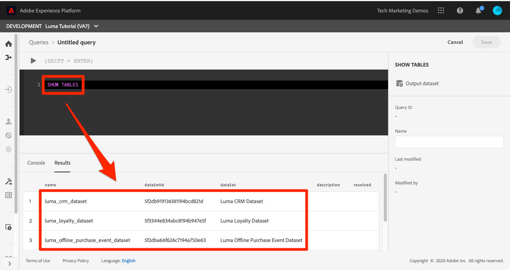

# Zoekopdrachten uitvoeren

<!-- 15 min-->
In deze les, zult u leren om, vragen te plaatsen te schrijven en uit te voeren om de gegevens te bevestigen u hebt opgenomen.

Met de Adobe Experience Platform Query Service kunt u uw gegevens begrijpen door standaard SQL te gebruiken voor query&#39;s op gegevens in het Platform. Gebruikend de Dienst van de Vraag, kunt u zich bij om het even welke dataset in het meer van Gegevens aansluiten en de vraagresultaten vangen als nieuwe dataset voor gebruik in rapportering, machine het leren, of voor opname in het Profiel van de Klant in real time.

**de Architecten van Gegevens 0} en** Ingenieurs van Gegevens **zullen de vraagdienst buiten dit leerprogramma moeten gebruiken.**

Alvorens u met de oefeningen begint, bekijk deze korte video om meer over de Dienst van de Vraag te leren:
>[!VIDEO](https://video.tv.adobe.com/v/29795?learn=on)

## Vereiste machtigingen

In [ vorm toestemmingen ](configure-permissions.md) les, u opstelling alle toegangscontroles die worden vereist om deze les te voltooien.

<!-- Settings > **[!UICONTROL Services]** > **[!UICONTROL Query Service]**
* Permission items Data Management > **[!UICONTROL View Datasets]** and  **[!UICONTROL Manage Datasets]**
* Permission item Sandboxes > `Luma Tutorial`
* User-role access to the `Luma Tutorial Platform` product profile
-->

## Eenvoudige query&#39;s

Laten we beginnen met enkele eenvoudige vragen:

1. In het gebruikersinterface van het Platform, ga naar **Vragen** in de linkernavigatie
1. Selecteer de **Create knoop van de Vraag** op het hoogste recht om een tekstvakje te openen om vragen in werking te stellen en uit te voeren
1. Voer de volgende query in de editor in en druk op Shift+Enter of Shift+Return om de query uit te voeren.

   ```
   SHOW TABLES
   ```

1. Hier wordt de lijst met beschikbare tabellen weergegeven

   


1. Probeer nu deze query, waarbij u `_techmarketingdemos` vervangt door uw eigen huurdersnaamruimte, die, als u eraan herinnert, zichtbaar is in uw schema&#39;s.

   ```
   SELECT person.name.lastName,loyalty.tier
   FROM luma_loyalty_dataset
   WHERE loyalty.tier ='gold'
   ```

   

1. Als er een fout optreedt, worden gedetailleerde berichten weergegeven op het tabblad **[!UICONTROL Console]** , zoals hieronder wordt weergegeven
   

1. Met uw geslaagde query, **[!UICONTROL Name]** it `Luma Gold Level Customers`
1. Selecteer de knop **[!UICONTROL Save]**
   


<!--SELECT COUNT(DISTINCT (_techmarketingdemos.systemIdentifier.loyaltyId)) FROM luma_loyalty_dataset 


SELECT _techmarketingdemos.systemIdentifier.loyaltyId, COUNT(_techmarketingdemos.systemIdentifier.loyaltyId)
FROM luma_loyalty_dataset 
GROUP BY _techmarketingdemos.systemIdentifier.loyaltyId
HAVING COUNT(_techmarketingdemos.systemIdentifier.loyaltyId) > 1;-->

## Aanvullende oefeningen

De extra oefeningen van de Dienst van de Vraag zullen aan het leerprogramma op een recentere datum worden toegevoegd.
<!--
## Join Datasets

In this exercise, we will join two datasets `Luma Loyalty Dataset` and `Luma Offline Purchase` to get list of gold customers who have spend over $500 dollars in one purchase.

1. Create a new query
1. Copy and paste following query in query editor and execute, again replacing `_techmarketingdemos` with your own tenant namespace
    
    ```
    SELECT DISTINCT lopd.commerce.order.purchaseID as PurchaseId ,
        lld.person.name.firstName as LastName ,
        lld.person.name.lastName as LastName ,
        lopd.personalEmail.address as email,
        lopd.commerce.order.priceTotal as Total

    FROM luma_loyalty_dataset lld
    JOIN luma_offline_purchase_event_dataset lopd
    ON lopd._techmarketingdemos.systemIdentifier.loyaltyId = lld._techmarketingdemos.systemIdentifier.loyaltyId

    WHERE lld._techmarketingdemos.loyalty.level ='gold' AND lopd.commerce.order.priceTotal >500;
    ```

1. You should get list of Gold Customers who have spend over $500 in single purchase.

## Output datasets

1. Select on Output Dataset button
1. Provide name and description to the dataset
1. Save.
1. Go to **Datasets** under **Data Management** to find new dataset created.

-->
<!--Add content for Adobe Defined Functions-->

## Aanvullende bronnen

* [ documentatie van de Dienst van de Vraag ](https://experienceleague.adobe.com/docs/experience-platform/query/home.html?lang=nl)
* [ de Verwijzing van de Dienst API van de Vraag ](https://www.adobe.io/experience-platform-apis/references/query-service/)

En nu voor de definitieve hands-on les, [ creërend segmenten ](build-segments.md)!
