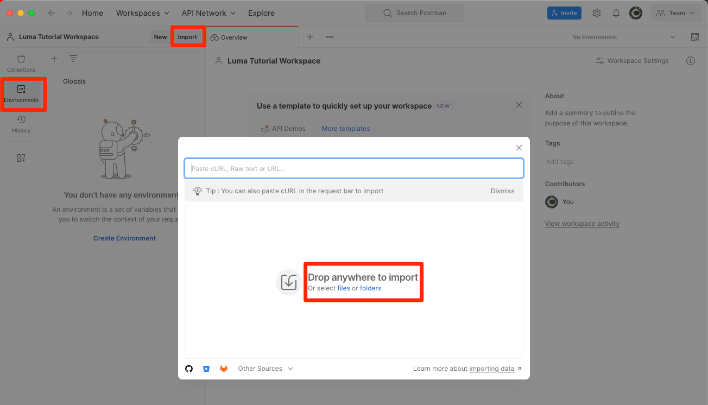
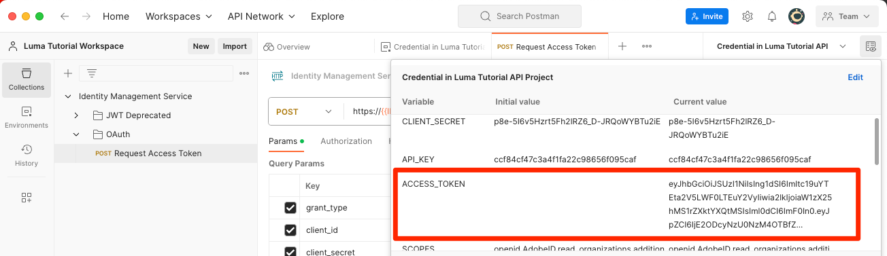

# Developer Console en [!DNL Postman] instellen

<!--30min-->

In deze les stelt u een project in in de Adobe Developer Console en downloadt u [!DNL Postman] -verzamelingen, zodat u de API&#39;s van het platform kunt gebruiken.

Om de API oefeningen in dit leerprogramma te voltooien, [ download app van Postman voor uw werkend systeem.](https://www.postman.com/downloads/) Hoewel het niet nodig is om Experience Platform-API&#39;s te gebruiken, maakt Postman API-workflows eenvoudiger en biedt Adobe Experience Platform tientallen Postman-verzamelingen om u te helpen API-aanroepen uit te voeren en te leren hoe ze werken. De rest van deze zelfstudie gaat uit van enige praktische kennis van Postman. Voor hulp, gelieve te verwijzen de [ documentatie van Postman ](https://learning.postman.com/).

Platform is in eerste instantie een API. Terwijl de interfaceopties ook voor alle belangrijke taken bestaan, zou u de Platform API op één of ander punt kunnen willen gebruiken. Bijvoorbeeld om gegevens in te voeren, om punten tussen zandbakken te bewegen, routinetaken te automatiseren of nieuwe eigenschappen van het Platform te gebruiken alvorens de gebruikersinterface is gebouwd.

**Architecten van Gegevens** en **Ingenieurs van Gegevens** kunnen Platform API buiten dit leerprogramma moeten gebruiken.

## Vereiste machtigingen

In [ vorm toestemmingen ](configure-permissions.md) les, u opstelling alle toegangscontroles die worden vereist om deze les te voltooien.

<!--
* Permission item Sandboxes > `Luma Tutorial`
* Developer-role access to the `Luma Tutorial Platform` product profile
-->

## Adobe Developer Console instellen

Adobe Developer Console is de ontwikkelaarsbestemming om tot Adobe APIs &amp; SDKs toegang te hebben, aan bijna gebeurtenissen in real time te luisteren, functies in Runtime in werking te stellen, of plugins of de toepassingen van App Builder te bouwen. U gebruikt deze voor toegang tot de Experience Platform-API. Voor meer details, zie de [ documentatie van Adobe Developer Console ](https://www.adobe.io/apis/experienceplatform/console/docs.html)

1. Maak op uw lokale computer een map met de naam `Luma Tutorial Assets` voor bestanden die in de zelfstudie worden gebruikt.

1. Open [ Adobe Developer Console ](https://console.adobe.io){target="_blank"} 

1. Meld u aan en bevestig dat u zich in de juiste organisatie bevindt

1. Selecteer **[!UICONTROL Create New Project]** in het menu [!UICONTROL Quick Start] .

   

1. Selecteer in het nieuwe project de knop **[!UICONTROL Edit Project]**
1. Wijzig **[!UICONTROL Project Title]** in `Luma Tutorial API Project` (voeg uw naam aan het eind toe, als meerdere personen van uw bedrijf deze zelfstudie volgen)
1. Selecteren **[!UICONTROL Save]**

   

1. Selecteren **[!UICONTROL Add API]**

   

1. De lijst filteren door **[!UICONTROL Adobe Experience Platform]** te selecteren

1. Selecteer **[!UICONTROL Experience Platform API]** in de lijst met beschikbare API&#39;s en selecteer **[!UICONTROL Next]** .

   

1. Selecteer **[!UICONTROL OAuth Server-to-Server]** als referentie en selecteer **[!UICONTROL Next]** .
   

1. Selecteer het productprofiel van `AEP-Default-All-Users` en selecteer **[!UICONTROL Save Configured API]**

   

1. Nu is uw Developer Console-project gemaakt!

1. Selecteer **[!UICONTROL Download for Postman]** in de sectie **[!UICONTROL Try it out]** van de pagina en selecteer **[!UICONTROL OAuth Server-to-Server]** om het [!DNL Postman] omgeving-json-bestand te downloaden. Sla `oauth_server_to_server.postman_environment.json` op in de map `Luma Tutorial Assets` .

   

## Systeembeheerder de API-referentie aan de rol toevoegen

Als u de API-referentie wilt gebruiken voor interactie met het Experience Platform, moet u een System Admin (Systeembeheer) de API-referenties toewijzen aan de rol die in de vorige les is gemaakt.  Als u geen Systeembeheerder bent, verzendt u deze:

1. The [!UICONTROL Name] of your API Credential (`Credential in Luma Tutorial API Project`)
1. De [!UICONTROL Technical Account Email] van uw referentie (dit helpt de systeembeheerder de referentie te vinden)

   ![[!UICONTROL Name] en [!UICONTROL Technical Account Email] van uw referentie ](assets/postman-credentialDetails.png)

Hier volgen de instructies voor de systeembeheerder:

1. Logboek in [ Adobe Experience Platform ](https://platform.adobe.com)
1. Selecteer **[!UICONTROL Permissions]** in de linkernavigatie die u naar het [!UICONTROL Roles] -scherm brengt.
1. De rol `Luma Tutorial Platform` openen
   
1. Selecteer de tab **[!UICONTROL API Credentials]**
1. Selecteren **[!UICONTROL Add API Credentials]**
    toe
1. Zoek de referentie van `Credential in Luma Tutorial API Project` en filtreer met de [!UICONTROL Technical Account Email] die door de tutorial participant is opgegeven als de lijst lang is
1. Selecteer de referentie
1. Selecteren **[!UICONTROL Save]**

    toe

## Postman instellen

>[!CAUTION]
>
>De Postman-interface wordt regelmatig bijgewerkt. De schermafbeeldingen in deze zelfstudie zijn gemaakt met Postman 10.15.1 voor Mac, maar de interfaceopties zijn mogelijk gewijzigd.

1. Downloaden en installeren [[!DNL Postman] ](https://www.postman.com/downloads/)
1. [!DNL Postman] openen en een werkruimte maken
   

1. Importeer het gedownloade JSON-omgevingsbestand, `oauth_server_to_server.postman_environment.json`
   
1. Selecteer in [!DNL Postman] de omgeving in de vervolgkeuzelijst

1. Selecteer het pictogram om de omgevingsvariabelen weer te geven:

   

### Sandbox-naam en Tenant-id toevoegen

De variabelen `SANDBOX_NAME` en `TENANT_ID` en `CONTAINER_ID` worden niet opgenomen in de Adobe Developer Console-export en worden dus handmatig toegevoegd:

1. In [!DNL Postman], open de **Variabelen van het Milieu**
1. Selecteer **uitgeven** verbinding aan het recht van de milieunaam
1. In **voeg nieuw veranderlijk gebied** toe, ga `SANDBOX_NAME` in
1. Voer in beide waardevelden `luma-tutorial` de naam in die we in de vorige les aan onze sandbox hebben gegeven. Als u een andere naam hebt gebruikt voor uw sandbox, bijvoorbeeld luma-tutorial-ignatiusjreilly, moet u die waarde gebruiken.
1. In **voeg nieuw veranderlijk gebied** toe, ga `TENANT_ID` in
1. De schakelaar aan uw Webbrowser en kijkt omhoog huurder identiteitskaart van uw bedrijf door naar de interface van het Experience Platform te gaan en het gedeelte van URL *na @ teken* te halen. Mijn huurder-id is bijvoorbeeld `techmarketingdemos` , maar die van u is anders:

   

1. Deze waarde kopiëren en terugkeren naar het scherm [!DNL Postman] Omgevingen beheren
1. Plak de id van de huurder in beide waardevelden
1. In **voeg nieuw veranderlijk gebied** toe, ga `CONTAINER_ID` in
1. Voer `global` in beide waardevelden in

   >[!NOTE]
   >
   >`CONTAINER_ID` is een veld waarvan de waarde tijdens de zelfstudie meerdere keren wordt gewijzigd. Wanneer `global` wordt gebruikt, communiceert de API met Adobe-geleverde elementen in uw account Platform. Wanneer `tenant` wordt gebruikt, communiceert de API met uw eigen aangepaste elementen.

1. Selecteer **sparen**

   

## API-aanroepen maken

### Een toegangstoken ophalen

Adobe biedt een uitgebreide set [!DNL Postman] -verzamelingen waarmee u de API van het Experience Platform kunt verkennen. Deze inzamelingen zijn in de [ Postman Steekproeven GitHub repo van Adobe Experience Platform ](https://github.com/adobe/experience-platform-postman-samples). U zou referentie deze repo aangezien u dit vele tijden door dit leerprogramma en later zult gebruiken aangezien u Experience Platform voor uw eigen bedrijf uitvoert.

De eerste verzameling werkt met de Adobe Identity Management Service (IMS)-API&#39;s. Het is een handige manier om een toegangstoken op te halen vanuit Postman.

Om het toegangstoken te produceren:

1. Download de [ inzameling van de Dienst APIs van Identity Management ](https://github.com/adobe/experience-platform-postman-samples/blob/master/apis/ims/Identity%20Management%20Service.postman_collection.json) aan uw `Luma Tutorial Assets` omslag
1. De verzameling importeren in [!DNL Postman]
1. Selecteer het verzoek **Auth: De Token van de Toegang van het verzoek** verzoek en selecteert **verzenden**
1. Er moet een reactie van het type `200 OK` met een toegangstoken in het antwoord worden opgenomen

   

1. Het toegangstoken zou automatisch als **ACCESS_TOKEN** milieuvariabele van uw [!DNL Postman] milieu moeten worden opgeslagen.

   

### Interactie met een platform-API

Nu maken een Platform API vraag om te bevestigen dat wij alles correct hebben gevormd.

Open de [ Experience Platform  [!DNL Postman]  inzamelingen in GitHub ](https://github.com/adobe/experience-platform-postman-samples/tree/master/apis/experience-platform). Deze pagina bevat veel verzamelingen voor verschillende platform-API&#39;s. Ik beveel ten stelligste aan dat er een bladwijzer wordt gemaakt.

Nu, maken onze eerste API vraag:

1. Download de [ inzameling van de Registratie API van het Schema ](https://raw.githubusercontent.com/adobe/experience-platform-postman-samples/master/apis/experience-platform/Schema%20Registry%20API.postman_collection.json) aan uw `Luma Tutorial Assets` omslag
1. Importeren in [!DNL Postman]
1. Open **de Registratie API van het Schema > Schema&#39;s > de schema&#39;s van de Lijst**
1. Bekijk de **Punten van Params** en **Kopballen** lusjes en neem nota hoe zij enkele milieuvariabelen omvatten die wij vroeger inging.
1. Merk op dat de **Kopballen > waardegebied** goedkeurt aan `application/vnd.adobe.xed-id+json` wordt geplaatst. De Registratie APIs van het Schema vereist één van deze [ gespecificeerde Accept kopbalwaarden ](https://experienceleague.adobe.com/docs/experience-platform/xdm/api/getting-started.html?lang=en#accept) die verschillende formaten in de reactie verstrekken.
1. Selecteer **verzenden** om uw eerste vraag van Platform API te maken!

Hopelijk hebt u een succesvolle `200 OK` reactie gekregen die een lijst van de beschikbare Adobe-Geleide schema&#39;s XDM in uw zandbak, zoals hieronder wordt afgebeeld.

Als uw vraag niet succesvol was, neem een ogenblik om het gebruiken van de details van de foutenreactie van de API vraag te zuiveren en de stappen hierboven te herzien. Als u geplakt wordt, gelieve om hulp in het [ Communautaire Forum ](https://experienceleaguecommunities.adobe.com/t5/adobe-experience-platform/ct-p/adobe-experience-platform-community) of gebruik de verbinding in de rechterkant van deze pagina aan &quot;Logboek een kwestie&quot;.

Met uw toestemmingen van het Platform, zandbak, en [!DNL Postman] opstelling, bent u klaar aan [ modelgegevens in schema&#39;s ](model-data-in-schemas.md)!
