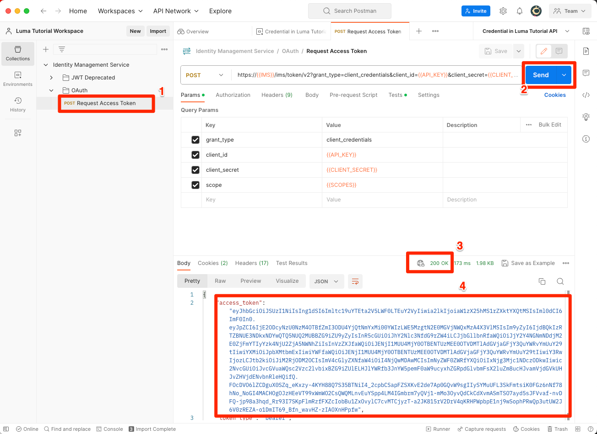

# Ontwikkelaarsconsole instellen en [!DNL Postman]

<!--30min-->

In deze les stelt u een project in in de Adobe Developer Console en downloadt u [!DNL Postman] verzamelingen, zodat u API&#39;s voor Platforms kunt gebruiken.

Om de API-oefeningen in deze zelfstudie te voltooien, [Download de Postman-app voor uw besturingssysteem.](https://www.postman.com/downloads/) Hoewel Postman niet vereist is voor het gebruik van Experience Platform-API&#39;s, maakt het API-workflows eenvoudiger en biedt Adobe Experience Platform tientallen Postman-verzamelingen om u te helpen API-aanroepen uit te voeren en te leren hoe ze werken. De rest van deze zelfstudie gaat uit van enige praktische kennis van Postman. Raadpleeg voor hulp de [Postman-documentatie](https://learning.postman.com/).

Platform is in de eerste plaats gebaseerd op de ingebouwde API. Hoewel er ook interfaceopties zijn voor alle belangrijke taken, kunt u de Platform-API op een bepaald moment gebruiken. U kunt bijvoorbeeld gegevens invoeren, items verplaatsen tussen sandboxen, routinetaken automatiseren of nieuwe functies voor Platforms gebruiken voordat de gebruikersinterface is gemaakt.

**Gegevensarchitecten** en **Gegevensengineers** buiten deze zelfstudie moet mogelijk Platform API worden gebruikt.

## Vereiste machtigingen

In de [Machtigingen configureren](configure-permissions.md) les, plaatst u opstelling alle toegangscontroles die worden vereist om deze les te voltooien.

<!--
* Permission item Sandboxes > `Luma Tutorial`
* Developer-role access to the `Luma Tutorial Platform` product profile
-->

## Adobe Developer-console instellen

Adobe Developer Console is de ontwikkelaarsbestemming om tot Adobe APIs &amp; SDKs toegang te hebben, aan gebeurtenissen in real time te luisteren, functies in runtime in werking te stellen, of stop-ins of App Builder apps te bouwen. U gebruikt deze voor toegang tot de Experience Platform-API. Zie voor meer informatie de [Adobe Developer Console-documentatie](https://www.adobe.io/apis/experienceplatform/console/docs.html)

1. Een map op uw lokale computer maken met de naam `Luma Tutorial Assets` voor bestanden die worden gebruikt in de zelfstudie.

1. Open de [Adobe Developer Console](https://console.adobe.io)

1. Meld u aan en bevestig dat u zich in de juiste organisatie bevindt

1. Selecteren **[!UICONTROL Nieuw project maken]** in [!UICONTROL Snel starten] -menu.

   

1. Selecteer in het nieuwe project de optie **[!UICONTROL Toevoegen aan project]** en selecteert u vervolgens **[!UICONTROL API]**

   

1. Filter de lijst door **[!UICONTROL Adobe Experience Platform]**

1. Selecteer in de lijst met beschikbare API&#39;s de optie **[!UICONTROL Experience Platform-API]** en selecteert u **[!UICONTROL Volgende]**.

   

1. Voor verificatie van externe systemen zoals [!DNL Postman]Wij hebben echter een publiek-privaat sleutelpaar nodig. Als u een nieuw sleutelpaar wilt genereren, selecteert u **[!UICONTROL Optie 1]**  en druk op **[!UICONTROL Keypair genereren]** knop

   

1. Wanneer de toetsen klaar zijn, wordt u mogelijk gevraagd om de toetsen naar uw lokale computer te downloaden. Sla de sleutels op die in het pakket zijn opgenomen `config.zip` naar de map `Luma Tutorial Assets`. We zullen ze in de volgende oefening nodig hebben.

1. Nadat de sleutel wordt geproduceerd, zal de openbare sleutel automatisch aan uw project zoals aangetoond in het het schermschot worden toegevoegd. Selecteer **[!UICONTROL Volgende]** knop.

   

1. Selecteer `Luma Tutorial Platform` productprofiel en selecteer de **[!UICONTROL Configureerde API opslaan]** knop

   

1. Nu is uw project voor de ontwikkelaarsconsole gemaakt!

1. In de **[!UICONTROL Uitproberen]** van de pagina selecteert u **[!UICONTROL Downloaden naar Postman]** en selecteer vervolgens **[!UICONTROL Serviceaccount (JWT)]** om de [!DNL Postman] milieu-json-bestand. Sla de `service.postman_environment.json` in uw `Luma Tutorial Assets` map.

   

   >[!NOTE]
   >
   >Systeembeheerders van uw organisatie kunnen het project zien als een &quot;API-referentie&quot; in het productprofiel in de Admin Console
   >
   >

U zou kunnen opgemerkt hebben dat het project een aantal, bijvoorbeeld, &quot;Project 12&quot;werd toegewezen:

1. Selecteer het projectnummer in de broodkruimel
1. Selecteer **[!UICONTROL Project bewerken]** knop
1. Wijzig de **[!UICONTROL Projecttitel]** tot `Luma Tutorial API Project` (voeg uw naam aan het eind toe, als de veelvoudige mensen van uw bedrijf dit leerprogramma nemen)
1. Selecteer **[!UICONTROL Opslaan]** knop

   

## Postman instellen

>[!CAUTION]
>
>De Postman-interface wordt regelmatig bijgewerkt. De schermafbeeldingen in deze zelfstudie zijn gemaakt met Postman 9.0.5 voor Mac, maar de interface-opties kunnen zijn gewijzigd.

1. Downloaden en installeren [[!DNL Postman]](https://www.postman.com/downloads/)
1. Openen [!DNL Postman] en het gedownloade JSON-omgevingsbestand importeren, `service.postman_environment.json`
   
1. In [!DNL Postman]selecteert u de omgeving in het vervolgkeuzemenu

   
1. Selecteer **oog** pictogram om de omgevingsvariabelen weer te geven:

   

### De naam van de omgeving bijwerken

Aangezien de geëxporteerde naam van de omgeving uit de Developer Console willekeurig wordt gegenereerd, geeft u deze een beschrijvendere naam, zodat u omgevingen later niet in verwarring brengt wanneer u aan uw echte Platform-implementatie begint te werken:

1. Zorg dat het scherm met omgevingsvariabelen geopend blijft en selecteer **Bewerken** rechtsboven
1. Werk de **Omgevingsnaam** tot `Luma Tutorial`
1. Verlaten **Omgevingen beheren** modaal open in geef wijze uit, aangezien wij het in de volgende stap verder zullen uitgeven

   

### De persoonlijke sleutel toevoegen

Nu is het tijd om de PRIVATE_KEY-waarde toe te voegen aan de Postman-omgeving

1. Het gedownloade object extraheren `config.zip` bestand dat tijdens de vorige exercitie is gegenereerd tijdens het maken van het Developer Console Project. Dit ZIP-bestand bevat twee bestanden:
   * `private.key`
   * `certificate_pub.crt`
1. Open de `private.key` in een teksteditor en kopieer de inhoud.
1. In Postman, op de **Omgevingen beheren** > **Bewerken** modal dat nog open is vanaf de laatste oefening, waarbij gekopieerde waarden vóór **PRIVATE_KEY** in de **Beginwaarde** en **Huidige waarde** kolommen.
1. Selecteren **Opslaan**

   

### JWT- en toegangstokens toevoegen

Adobe biedt een uitgebreide set [!DNL Postman] verzamelingen waarmee u de API van het Experience Platform kunt verkennen. Deze verzamelingen bevinden zich in de [Adobe Experience Platform Postman Samples GitHub repo](https://github.com/adobe/experience-platform-postman-samples). U zou referentie deze repo aangezien u dit vele tijden door dit leerprogramma en later zult gebruiken aangezien u Experience Platform voor uw eigen bedrijf uitvoert.

De eerste verzameling werkt met de Adobe Identity Management Service (IMS)-API&#39;s. Het is een handige manier om JWT_TOKEN en ACCESS_TOKEN vanuit Postman te vullen *bestemd voor niet-productiedoeleinden* zoals het voltooien van deze zelfstudie in uw sandbox. U kunt ook het JWT Token genereren in de Adobe Developer-console. Aangezien deze verzameling regelmatig verloopt, kunt u deze echter vernieuwen zonder dat u de Adobe Developer-console opnieuw hoeft te openen tijdens het voltooien van deze zelfstudie.

>[!WARNING]
>
>Zoals vermeld in het [Adobe Identity Management Service API&#39;s README](https://github.com/adobe/experience-platform-postman-samples/tree/master/apis/ims?lang=nl)zijn de gedenoteerde productiemethoden geschikt voor niet-productiedoeleinden. Bij Lokaal ondertekenen wordt een JavaScript-bibliotheek geladen van een host van een andere fabrikant en bij Extern ondertekenen wordt de persoonlijke sleutel naar een webservice verzonden die eigendom is van een Adobe. Hoewel Adobe deze persoonlijke sleutel niet opslaat, mogen productietoetsen nooit met iemand worden gedeeld.

De tokens genereren:

1. Download de [Verzameling van Token Generation voor ontwikkelaarsconsole-toegang](https://raw.githubusercontent.com/adobe/experience-platform-postman-samples/master/apis/ims/Identity%20Management%20Service.postman_collection.json) aan uw `Luma Tutorial Assets` map
1. De verzameling importeren in [!DNL Postman]
1. Selecteer de aanvraag **IMS: JWT Genereren + Auth via gebruikerstoken** en selecteert u **Verzenden**

   
1. De **JWT_TOKEN** en **ACCESS_TOKEN** automatisch invullen in de omgevingsvariabelen van [!DNL Postman].

   

### Sandbox-naam en Tenant-id toevoegen

De `SANDBOX_NAME` en `TENANT_ID` en `CONTAINER_ID` De variabelen worden niet opgenomen in de Adobe Developer Console-export en dus voegen we ze handmatig toe:

1. In [!DNL Postman], opent u de **Omgevingsvariabelen**
1. Selecteer **Bewerken** koppeling rechts van de naam van de omgeving
1. In de **Nieuw veld voor variabele toevoegen**, enter `SANDBOX_NAME`
1. Voer in beide waardevelden `luma-tutorial`, de naam die we in de vorige les aan onze sandbox gaven. Als u een andere naam hebt gebruikt voor uw sandbox, bijvoorbeeld luma-tutorial-ignatiusjreilly, moet u die waarde gebruiken.
1. In de **Nieuw veld voor variabele toevoegen**, enter `TENANT_ID`
1. Ga naar uw webbrowser en zoek de huurder-id van uw bedrijf op door naar de interface van het Experience Platform te gaan en het gedeelte van de URL te extraheren *na het @-teken*. Mijn huurder-id is bijvoorbeeld `techmarketingdemos` maar de uwe is anders :

   

1. Deze waarde kopiëren en terugkeren naar de [!DNL Postman] Het scherm Omgevingen beheren
1. Plak de id van de huurder in beide waardevelden
1. In de **Nieuw veld voor variabele toevoegen**, enter `CONTAINER_ID`
1. Enter `global` in beide waardevelden

   >[!NOTE]
   >
   >`CONTAINER_ID` is een veld waarvan de waarde tijdens de zelfstudie meerdere keren wordt gewijzigd. Wanneer `global` wordt gebruikt, communiceert API met Adobe-Geleverde elementen in uw Platform rekening. Wanneer `tenant` wordt gebruikt, communiceert de API met uw eigen aangepaste elementen.

1. Selecteren **Opslaan**

   

## Een Platform-API-aanroep maken

Nu maken een Platform API vraag om te bevestigen dat wij alles correct hebben gevormd.

Open de [Experience Platform [!DNL Postman] verzamelingen in GitHub](https://github.com/adobe/experience-platform-postman-samples/tree/master/apis/experience-platform). Deze pagina bevat veel verzamelingen voor verschillende Platform-API&#39;s. Ik beveel ten stelligste aan dat er een bladwijzer wordt gemaakt.

Nu, maken onze eerste API vraag:

1. Download de [Schema Registry API collectie](https://raw.githubusercontent.com/adobe/experience-platform-postman-samples/master/apis/experience-platform/Schema%20Registry%20API.postman_collection.json) aan uw `Luma Tutorial Assets` map
1. Importeren in [!DNL Postman]
1. Openen **Schema Registry API > Classes > List classes**
1. Kijk naar de **Params** en **Kopteksten** tabs en noteren hoe ze enkele omgevingsvariabelen bevatten die we eerder hebben ingevoerd.
1. De **Headers > Accepteren, waardeveld** is ingesteld op `application/vnd.adobe.xed-id+json`. De API&#39;s voor schemaregistratie vereisen een van deze [opgegeven headerwaarden accepteren](https://experienceleague.adobe.com/docs/experience-platform/xdm/api/getting-started.html?lang=en#accept) die verschillende formaten in de reactie verstrekken.
1. Selecteren **Verzenden** om uw eerste Platform API-aanroep te maken!

Hopelijk is het gelukt `200 OK` reactie met een lijst met de beschikbare standaard XDM-klassen in uw sandbox, zoals hieronder wordt weergegeven.

Als uw vraag niet succesvol was, neem een ogenblik om het gebruiken van de details van de foutenreactie van de API vraag te zuiveren en de stappen hierboven te herzien. Als u vast komt te zitten, vraagt u dan om hulp in de [Forum van de Gemeenschap](https://experienceleaguecommunities.adobe.com/t5/adobe-experience-platform/ct-p/adobe-experience-platform-community) U kunt ook de koppeling rechts van deze pagina gebruiken om een uitgave vast te leggen.

Met uw Platform toestemmingen, zandbak, en [!DNL Postman] instellen, kunt u [modelgegevens in schema&#39;s](model-data-in-schemas.md)!
