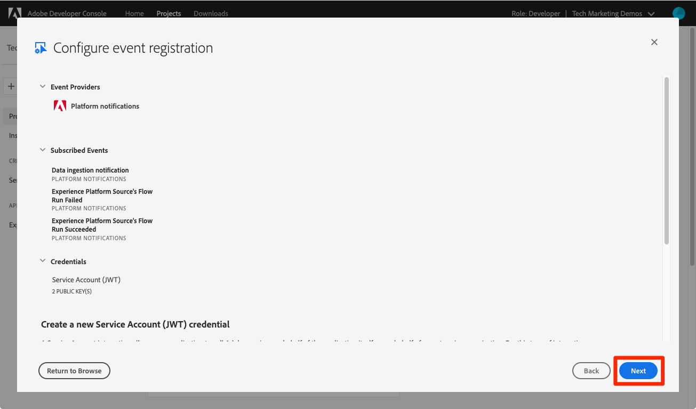

# Abonneren op gebeurtenissen voor gegevensinvoer

<!--25min-->

In deze les meldt u zich aan gebeurtenissen voor het opnemen van gegevens door een webhaak in te stellen met de Adobe Developer Console en een online hulpprogramma voor de ontwikkeling van webhaken. U zult deze gebeurtenissen gebruiken om de status van uw taken van de gegevensopname in de verdere lessen te controleren.

**de Ingenieurs van Gegevens** zullen aan de gebeurtenissen van de gegevensopname buiten dit leerprogramma willen intekenen.
**_de Architecten van Gegevens 0&rbrace; &lbrace;kunnen deze les_ overslaan en naar de [ partij ingesliples ](ingest-batch-data.md) gaan.**

## Vereiste machtigingen

In [ vorm de 1&rbrace; les van Toestemmingen &lbrace;, u opstelling alle toegangscontroles die worden vereist om deze les te voltooien, specifiek:](configure-permissions.md)

<!--* Developer-role access to the `Luma Tutorial Platform` product profile (for API)
-->

>[!IMPORTANT]
>
> Deze berichten die door de gebeurtenissen van de gegevensopname worden teweeggebracht zullen op _van toepassing zijn elk van uw zandbakken_, niet alleen uw `Luma Tutorial`. Mogelijk ziet u ook meldingen die afkomstig zijn van andere gebeurtenissen voor het invoeren van gegevens in uw account.

## Webhaak instellen

In deze oefening zullen we een webhaak maken met behulp van een online hulpprogramma met de naam webhaak.site (u kunt alle andere webhshontwikkelingsprogramma&#39;s die u liever gebruikt, gratis vervangen):

1. In een ander browser lusje, open de website [ https://webhook.site/](https://webhook.site/)
1. U krijgt een unieke URL toegewezen, die u als bladwijzer moet gebruiken, aangezien u er later in de lessen over gegevensinvoer op terugkeert:

   
1. Selecteer **uitgeven** knoop in de hoogste navigatie
1. Voer `$request.query.challenge$` in als de hoofdtekst van de reactie. De Adobe I/O Events berichten wij opstelling later in deze les sturen een uitdaging aan de webhaak, en vereist dat het in het reactielichaam wordt omvat.
1. Selecteer **sparen** knoop

    uit

## Instellen

1. In een ander browser lusje, open [ Adobe Developer Console ](https://console.adobe.io/)
1. Open uw `Luma Tutorial API Project`
1. Selecteer de knop **[!UICONTROL Add to Project]** en selecteer vervolgens **[!UICONTROL Event]**

    toe
1. De lijst filteren door **[!UICONTROL Experience Platform]** te selecteren
1. Selecteren **[!UICONTROL Platform notifications]**
1. Selecteer de knop **[!UICONTROL Next]**
    toe
1. Alle gebeurtenissen selecteren
1. Selecteer de knop **[!UICONTROL Next]**
   
1. Selecteer in het volgende scherm de knop **[!UICONTROL Next]** nogmaals om uw referenties te configureren
   
1. Als **[!UICONTROL Event registration name]** voert u `Platform notifications` in
1. Omlaag schuiven en selecteren om de sectie **[!UICONTROL Webhook]** te openen
1. Als **[!UICONTROL Webhook URL]**, kleef de waarde van het **Uw unieke URL** gebied van webhaak.site
1. Selecteer de knop **[!UICONTROL Save configured events]**
   
1. Wacht tot uw configuratie is opgeslagen en u ziet dat de gebeurtenis `Platform notifications` actief is met uw webhaakdetails en geen foutberichten
   
1. Ga terug naar het tabblad web.site en bekijk de eerste aanvraag naar de webhaak die het resultaat is van de validatie van uw Developer Console-configuratie:
   

Dat is het voor nu, zult u meer over deze berichten in de volgende lessen leren wanneer u gegevens opneemt.

## Aanvullende bronnen

* [ WebHaak.site ](https://webhook.site/)
* [ de kennisgevingsdocumentatie van Gegevens ](https://experienceleague.adobe.com/docs/experience-platform/ingestion/quality/subscribe-events.html?lang=nl-NL)
* [ Begonnen het worden met de documentatie van de Gebeurtenissen van Adobe I/O ](https://www.adobe.io/apis/experienceplatform/events/docs.html)

Ok, laten eindelijk beginnen [ het opnemen gegevens ](ingest-batch-data.md)!
