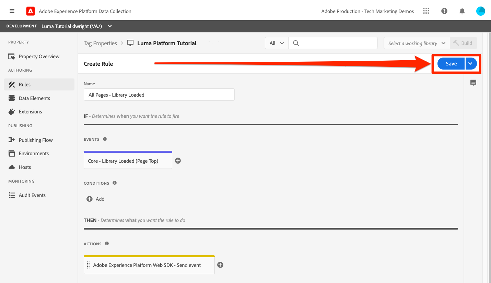
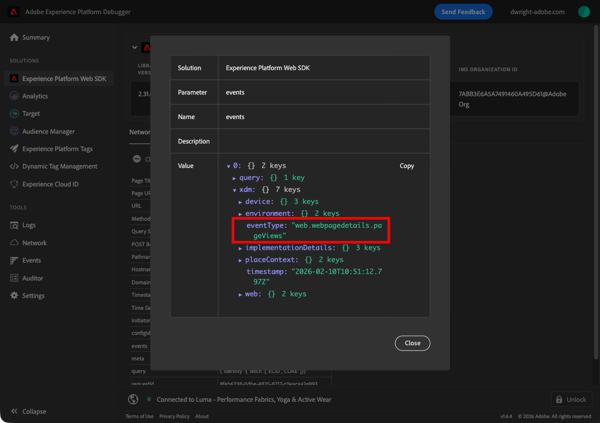
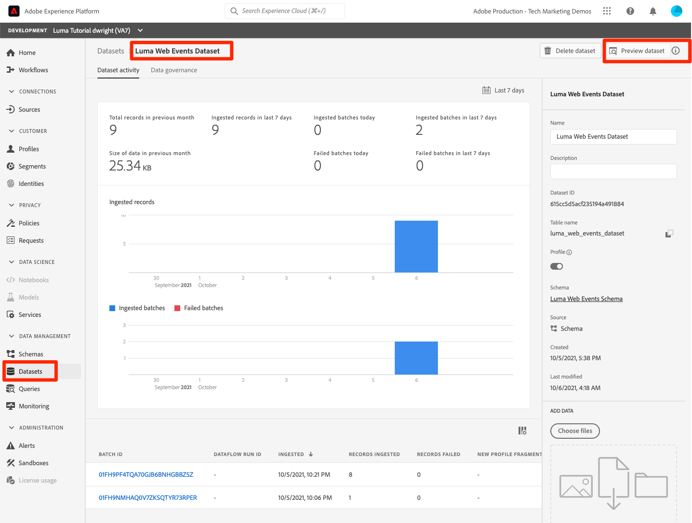
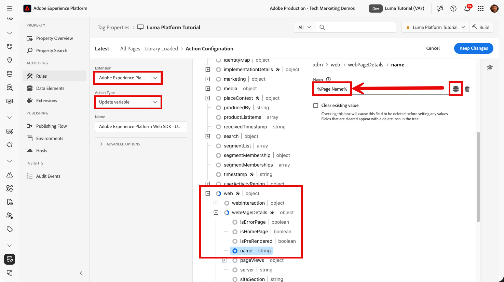
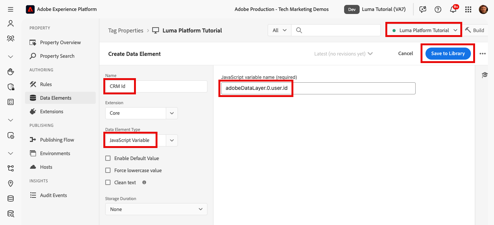
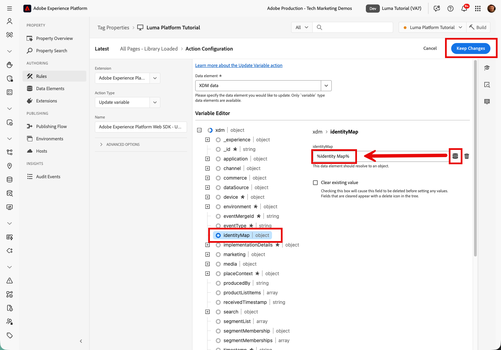

# De grootste streaminggegevens

<!--1hr-->

In deze les, zult u gegevens stromen gebruikend het Web SDK van Adobe Experience Platform.

>[!WARNING]
>
> De Luma-website die in deze zelfstudie wordt gebruikt, wordt naar verwachting vervangen in de week van 16 februari 2026. Het werk dat in het kader van deze zelfstudie wordt uitgevoerd, is mogelijk niet van toepassing op de nieuwe website.

Er zijn twee belangrijke taken voor het verzamelen van gegevens:

* Implementeer Web SDK op de Luma-website om klantgebeurtenissen te streamen naar Experience Platform Edge Network.

* Configureer een gegevensstroom waarmee Edge Network de gegevens doorstuurt naar onze `Luma Web Events Dataset` in Experience Platform.

**de Ingenieurs van Gegevens** zullen het stromen gegevens buiten dit leerprogramma moeten opnemen. Hoewel webontwikkelaars Web SDK doorgaans in een website implementeren, is het belangrijk om te weten hoe het proces werkt. Zelfs als u geen Webontwikkelaar bent, zou u deze basisimplementatie moeten kunnen voltooien.

Voordat u de oefeningen start, bekijkt u deze twee korte video&#39;s voor meer informatie over het streamen van gegevens en Web SDK:

>[!VIDEO](https://video.tv.adobe.com/v/28425?learn=on&enablevpops)

>[!VIDEO](https://video.tv.adobe.com/v/34141?learn=on&enablevpops)

>[!NOTE]
>
>Terwijl dit leerprogramma zich bij het stromen van opname van websites met Web SDK concentreert, kunt u gegevens ook stromen gebruikend [&#x200B; Mobiele SDK &#x200B;](https://experienceleague.adobe.com/nl/docs/platform-learn/implement-mobile-sdk/overview), [&#x200B; de Server API van Edge Network &#x200B;](https://experienceleague.adobe.com/nl/docs/platform-learn/data-collection/server-api/overview), en [&#x200B; HTTP API &#x200B;](https://experienceleague.adobe.com/nl/docs/experience-platform/sources/connectors/streaming/http).

## Vereiste machtigingen

In [&#x200B; vorm toestemmingen &#x200B;](configure-permissions.md) les, u opstelling alle toegangscontroles die worden vereist om deze les te voltooien.

## De gegevensstroom configureren

Eerst zullen wij de datastream vormen. Een gegevensstroom vertelt Experience Platform Edge Network waar te om de gegevens te verzenden na het ontvangen van het van de vraag van SDK van het Web. Wilt u de gegevens bijvoorbeeld naar Experience Platform, Adobe Analytics of Adobe Target verzenden?

Maak uw [!UICONTROL datastream] als volgt:

1. Zorg ervoor u nog in de ` Luma Tutorial` zandbak bent
1. Selecteren **[!UICONTROL Datastreams]** in de linkernavigatie
1. Selecteer de knop **[!UICONTROL New Datastream]** in de rechterbovenhoek

   

1. Voor **[!UICONTROL Name]**, ga `Luma Platform Tutorial` in (voeg uw naam aan het eind toe, als de veelvoudige mensen van uw bedrijf deze zelfstudie nemen)
1. Selecteer de knop **[!UICONTROL Save]**

   

Zodra de gegevens op de Edge aankomen, stuurt de [!UICONTROL Datastream] deze door naar de geconfigureerde [!UICONTROL Services] . Gegevens verzenden naar Experience Platform:

1. Selecteren **[!UICONTROL Add Service]**
    toe

1. Selecteren `Adobe Experience Platform`
1. Selecteer uw `Luma Web Events Dataset`
1. Selecteren **[!UICONTROL Save]**

   

Hoewel er een optie van de Dataset van het Profiel in de gegevensstroomconfiguratie is, zou dit niet moeten worden gebruikt om normale gegevens van het Individuele Profiel XDM naar Platform te verzenden. Deze instelling mag alleen worden gebruikt voor het verzenden van gegevens over toestemmingen, pushtoken en gebruikersactiviteiten.

Met de selectievakjes [!UICONTROL Offer Decisioning], [!UICONTROL Edge Segmentation], [!UICONTROL Personalization Destinations] en [!UICONTROL Adobe Journey Optimizer] kunt u gegevens activeren op de Edge, maar deze selectievakjes worden niet gebruikt in deze zelfstudie.

## Web SDK implementeren

### Een eigenschap toevoegen

Eerst moeten we een eigenschap tag maken (voorheen een eigenschap tag). Een eigenschap is een container voor alle JavaScript, regels en andere functies die zijn vereist voor het verzamelen van gegevens van een webpagina en het verzenden ervan naar verschillende locaties.

Een eigenschap maken:

1. Ga naar **[!UICONTROL Tags]** in de linkernavigatie
1. Selecteren **[!UICONTROL New Property]**
    toe
1. Als **[!UICONTROL Name]**, ga `Luma Platform Tutorial` in (voeg uw naam aan het eind toe, als de veelvoudige mensen van uw bedrijf deze zelfstudie nemen)
1. Als **[!UICONTROL Domains]** voert u `enablementadobe.com` in (zoals verderop wordt uitgelegd)
1. Selecteren **[!UICONTROL Save]**
   

### Extensies toevoegen aan de eigenschap

Nu u een bezit hebt kunt u het Web SDK toevoegen gebruikend een uitbreiding. Een extensie is een pakket met code waarmee functionaliteit wordt toegevoegd aan de eigenschap tag en de implementatie. De extensie toevoegen:

1. De eigenschap tag openen
1. Ga naar **[!UICONTROL Extensions]** in de linkernavigatie
1. Ga naar de tab **[!UICONTROL Catalog]**
1. Er zijn veel extensies beschikbaar voor tags. De catalogus filteren met de term `Web SDK`
1. Selecteer de extensie **[!UICONTROL Adobe Experience Platform Web SDK]** om het zijpaneel te openen
1. Selecteer de knop **[!UICONTROL Install]**
   
1. Er zijn verscheidene configuraties beschikbaar voor de uitbreiding van SDK van het Web, maar er slechts twee zullen wij voor dit leerprogramma vormen. Werk **[!UICONTROL Edge Domain]** aan `data.enablementadobe.com` bij. Met deze instelling kunt u cookies van eerste partijen instellen met uw Web SDK-implementatie, wat wordt aangemoedigd. Wanneer u Web SDK op uw eigen website implementeert, raden we u aan een CNAME te maken voor uw eigen gegevensverzamelingsdoeleinden, bijvoorbeeld `data.YOUR_DOMAIN.com`
1. Selecteer in de sectie **[!UICONTROL Datastreams]** voor de productieomgeving de `Luma Tutorial` sandbox en de `Luma Platform Tutorial` -gegevensstroom.
1. Bekijk de andere configuratieopties (maar wijzig deze niet!) en selecteer vervolgens **[!UICONTROL Save]**
   

Installeer de extensie Adobe Client Data Layer vanuit het scherm Extensies. Met deze extensie kunnen we de gegevenslaag lezen van de Luma-website:

Er zijn geen configuraties nodig in de extensie. Sla deze dus gewoon op in de bibliotheek.

## Een regel maken voor het verzenden van gegevens

Nu maken we een regel voor het verzenden van gegevens naar Platform. Een regel is een combinatie van gebeurtenissen, voorwaarden en handelingen die ervoor zorgen dat tags iets doen. Een regel maken:

1. Navigeren naar **[!UICONTROL Rules]**
1. Selecteer de knop **[!UICONTROL Create New Rule]**
   
1. Naam van de regel `adobeDataLayer event`
1. Selecteer onder **[!UICONTROL Events]** de knop **[!UICONTROL Add]**
    toe
1. Gebruik **[!UICONTROL Adobe Client Data Layer]** **[!UICONTROL Extension]** en selecteer **[!UICONTROL Data Pushed]** als **[!UICONTROL Event Type]**.
1. Selecteer **[!UICONTROL Listen to]**. **[!UICONTROL All Events]**
1. Selecteer **[!UICONTROL Keep Changes]** om terug te keren naar het hoofdregelscherm
    toe
1. Selecteer onder **[!UICONTROL Actions]** de knop **[!UICONTROL Add]**
1. Gebruik **[!UICONTROL Adobe Experience Platform Web SDK]** **[!UICONTROL Extension]** en selecteer **[!UICONTROL Send Event]** als **[!UICONTROL Action Type]**
1. Selecteer rechts in het vervolgkeuzemenu **[!UICONTROL Web Webpagedetails Page Views]** de optie **[!UICONTROL Type]** . Hiermee wordt het veld eventType van onze `Luma Web Events Schema` gevuld
1. Selecteer **[!UICONTROL Keep Changes]** om terug te keren naar het hoofdregelscherm
    toe
1. Selecteer **[!UICONTROL Save]** om de regel op te slaan\
   

## De regel in een bibliotheek publiceren

Vervolgens publiceren we de regel naar onze ontwikkelomgeving, zodat we kunnen controleren of deze werkt.

Een bibliotheek maken:

1. Ga naar **[!UICONTROL Publishing Flow]** in de linkernavigatie
1. Selecteren **[!UICONTROL Add Library]**
    toe
1. Voer bij **[!UICONTROL Name]** `Luma Platform Tutorial` in
1. Selecteer **[!UICONTROL Environment]** voor `Development`
1. Selecteer de knop **[!UICONTROL Add All Changed Resources]** . (Naast de extensie [!UICONTROL Adobe Experience Platform Web SDK] en de `adobeDataLayer event` -regel, wordt ook de extensie [!UICONTROL Core] toegevoegd die de basis-JavaScript bevat die door alle tags webeigenschappen is vereist.)
1. Selecteer de knop **[!UICONTROL Save & Build for Development]**
   

Het kan enkele minuten duren voordat de bibliotheek is gemaakt en wanneer deze is voltooid, wordt links van de naam van de bibliotheek een groene stip weergegeven:

Zoals u kunt zien op het scherm [!UICONTROL Publishing Flow] , is er veel meer aan het publicatieproces dat buiten het bereik van deze zelfstudie valt. We gaan gewoon één bibliotheek gebruiken in onze ontwikkelomgeving.

## De gegevens in de aanvraag valideren

### De Adobe Experience Platform Debugger toevoegen

De Experience Platform Debugger is een extensie die beschikbaar is voor Chrome en waarmee u de Adobe-technologie kunt bekijken die in uw webpagina&#39;s is geïmplementeerd. Download de versie voor uw voorkeursbrowser:

* [&#x200B; de uitbreiding van Chrome &#x200B;](https://chrome.google.com/webstore/detail/adobe-experience-platform/bfnnokhpnncpkdmbokanobigaccjkpob)

Als u Foutopsporing nog nooit eerder hebt gebruikt, kunt u deze overzichtsvideo van vijf minuten bekijken:

>[!VIDEO](https://video.tv.adobe.com/v/32156?learn=on&enablevpops)

### De Luma-website openen

Voor deze zelfstudie gebruiken we een openbaar gehoste versie van de Luma-demo-website. Laten we het openen en een bladwijzer maken:

1. In een nieuw browser lusje, open de [&#x200B; website van de Luma &#x200B;](https://newluma.enablementadobe.com).
1. Bladwijzer maken van de pagina voor gebruik in de rest van de zelfstudie

Daarom hebben we `enablementadobe.com` in het veld [!UICONTROL Domains] van de initiële configuratie met de eigenschap tag gebruikt en hebben we `data.enablementadobe.com` gebruikt als het domein van de eerste partij in de extensie [!UICONTROL Adobe Experience Platform Web SDK] . Zie je, ik had een plan!

### Foutopsporing in Experience Platform gebruiken om de tag-eigenschap toe te wijzen

De Experience Platform Debugger heeft een coole functie waarmee u een bestaande tag-eigenschap kunt vervangen door een andere. Dit is nuttig voor bevestiging en staat ons toe om vele implementatiestappen in dit leerprogramma over te slaan.

1. Zorg ervoor dat de Luminantiesite is geopend en selecteer het extensiepictogram van Experience Platform Debugger
1. Foutopsporing opent en toont sommige details van de hard-gecodeerde implementatie, die met dit leerprogramma niet verwant is (u kunt de plaats van de Luma na het openen van Debugger moeten opnieuw laden)
1. Bevestig dat Debugger &quot;**[!UICONTROL Connected to Luma]**&quot;zoals hieronder afgebeeld is en selecteer dan het &quot;**[!UICONTROL lock]**&quot;pictogram is om Debugger aan de plaats van de Luma te sluiten.
1. Selecteer de knop **[!UICONTROL Sign In]** rechtsboven om te verifiëren.
1. Ga nu naar **[!UICONTROL Experience Platform Tags]** in de linkernavigatie
1. Selecteer het tabblad Configuratie
1. Open rechts van waar de **[!UICONTROL Page Embed Codes]** wordt weergegeven het vervolgkeuzemenu **[!UICONTROL Actions]** en selecteer **[!UICONTROL Replace]**
   
1. Aangezien u voor authentiek wordt verklaard, zal Foutopsporing uw beschikbare markeringseigenschappen en milieu&#39;s trekken. Selecteer uw eigenschap `Luma Platform Tutorial`
1. Selecteer uw `Development` -omgeving
1. Selecteer de knop **[!UICONTROL Apply]**
   
1. De website van de Luma zal _met uw markeringsbezit_ nu opnieuw laden.
   
1. Ga naar **[!UICONTROL Summary]** in de linkernavigatie om de details van uw eigenschap [!UICONTROL tag] te bekijken
   
1. Ga nu naar **[!UICONTROL Experience Platform Web SDK]** in de linkernavigatie om de **[!UICONTROL Network Requests]** te zien
1. De rij **[!UICONTROL events]** selecteren

   

1. Opmerking: het gebeurtenistype `web.webpagedetails.pageView` dat we in de [!UICONTROL Send Event] -handeling hebben opgegeven, wordt weergegeven
   

1. De verzoekdetails zijn ook zichtbaar in de hulpmiddelen van de het Webontwikkelaar van browser **Netwerk** tabel. Open het en laad de pagina opnieuw. Filter voor vraag met `interact` om van de vraag de plaats te bepalen, het te selecteren, en dan in het **Kopballen** lusje, **gebied van de Payload van het Verzoek** te kijken.
   
1. Ga naar het **lusje van de Reactie** en neem nota hoe de ECID waarde in de reactie inbegrepen is. Kopieer deze waarde zoals u deze gebruikt om de profielgegevens in de volgende oefening te valideren.
   

## De gegevens valideren in Experience Platform

U kunt controleren of de gegevens in Platform landen door de batches met gegevens in de `Luma Web Events Dataset` te bekijken. (Ik weet dat het streaming data-opname heet, maar nu zeg ik dat het in batches aankomt! Het stroomt in real time aan Profiel, zodat kan het voor segmentatie en activering in real time worden gebruikt, maar wordt verzonden in partijen om de 15 minuten aan het gegevenspeer.)

De gegevens valideren:

1. Ga in de gebruikersinterface van het Platform naar **[!UICONTROL Datasets]** in de linkernavigatie
1. Open `Luma Web Events Dataset` en bevestig dat een partij is aangekomen. Herinner me, worden zij verzonden om de 15 minuten, zodat zou u op de partij kunnen moeten wachten om omhoog te verschijnen.
1. Selecteer de knop **[!UICONTROL Preview dataset]**
   
1. Let in de voorvertoningsmodus op hoe u verschillende velden van het schema aan de linkerkant kunt selecteren om een voorvertoning van die specifieke gegevenspunten weer te geven:
   

U kunt ook bevestigen dat het nieuwe profiel wordt weergegeven:

1. Ga in de gebruikersinterface van het Platform naar **[!UICONTROL Profiles]** in de linkernavigatie
1. Selecteer de naamruimte **[!UICONTROL ECID]** en zoek naar de ECID-waarde (kopieer deze uit de reactie). Het profiel heeft een eigen id, gescheiden van de ECID.
1. Selecteer de **[!UICONTROL Profile ID]** om het profiel te openen
   
1. Selecteer het tabblad **[!UICONTROL Events]** om de weergegeven pagina&#39;s weer te geven
   \
   <!---->

## Aangepaste gegevens aan de gebeurtenis toevoegen

Web SDK vult vele XDM gebieden automatisch in, maar u zult onvermijdelijk uw implementatie moeten aanpassen om extra gebieden van uw website te verzamelen. Dit raakt erg betrokken, maar hier zijn een paar eenvoudige voorbeelden.

### Een gegevenselement maken om XDM-gegevens op te slaan

1. Ga terug naar de eigenschap `Luma Platform Tutorial` tag
1. Open het vervolgkeuzemenu **[!UICONTROL Select a Working Library]** en selecteer de `Luma Platform Tutorial` -bibliotheek. Met deze instelling kunt u gemakkelijker aanvullende updates naar onze bibliotheek publiceren.
1. Ga nu naar **[!UICONTROL Data Elements]** in de linkernavigatie
1. Selecteer de knop **[!UICONTROL Create New Data Element]**

   

Op de pagina **[!UICONTROL Data Elements]** :

1. Als **[!UICONTROL Name]** voert u `XDM data` in
1. Als **[!UICONTROL Extension]** selecteert u `Adobe Experience Platform Web SDK`
1. Als **[!UICONTROL Data Element Type]** selecteert u `Variable`
1. Als **[!UICONTROL Sandbox]** selecteert u de `Luma Tutorial` -sandbox
1. Als de **[!UICONTROL Schema]** , selecteert u uw `Luma Web Events Schema`
1. Zorg ervoor dat `Luma Platform Tutorial` is geselecteerd als de werkbibliotheek
1. Selecteren **[!UICONTROL Save to Library]**
    toe

### Een gegevenselement voor een paginanaam maken

1. Een nieuw gegevenselement maken
1. Als **[!UICONTROL Name]** voert u `Page Name` in
1. Als **[!UICONTROL Data Element Type]** selecteert u `JavaScript Variable`
1. Als **[!UICONTROL JavaScript variable name]** voert u `adobeDataLayer.0.page.name` in
1. Als u de notatie van de waarden wilt standaardiseren, schakelt u de selectievakjes **[!UICONTROL Force lowercase value]** en **[!UICONTROL Clean text]** in
1. Selecteren **[!UICONTROL Save to Library]**
   

### De XDM-gegevens toevoegen aan de handeling Verzendgebeurtenis

Nu u gegevens hebt toegewezen aan XDM-velden, kunt u deze opnemen in de handeling Verzendgebeurtenis:

1. Naar het **[!UICONTROL Rules]** -scherm gaan
1. De regel `adobeDataLayer event` openen
1. De handeling `Adobe Experience Platform Web SDK - Send Event` openen
1. Als **[!UICONTROL XDM]** selecteert u het pictogram waarmee u het selectiemodel van het gegevenselement wilt openen en het gegevenselement `XDM data` wilt kiezen
1. Selecteren **[!UICONTROL Keep Changes]**
   

1. Voeg een nieuwe Actie aan uw regel toe
1. Selecteer de `Adobe Experience Platform Web SDK` **[!UICONTROL Extension]**
1. Selecteer de `Update Variable` **[!UICONTROL Action Type]**
1. Het gegevenselement `Page Name` vullen als `web.webPageDetails.name`
1. Selecteren **[!UICONTROL Keep Changes]**
   

1. De volgorde van de [!UICONTROL Actions] wijzigen, zodat [!UICONTROL Update variable] wordt gestart voor [!UICONTROL Send event]
1. Nu u `Luma Platform Tutorial` als werkbibliotheek hebt geselecteerd voor de laatste paar oefeningen, zijn uw recente wijzigingen direct opgeslagen in de bibliotheek. In plaats van onze wijzigingen te publiceren via het scherm Publishing Flow, kunt u gewoon het vervolgkeuzemenu openen en **[!UICONTROL Save to Library and Build]** selecteren
   

Hiermee maakt u een nieuwe tagbibliotheek met de drie wijzigingen die u zojuist hebt aangebracht.

### De XDM-gegevens valideren

U moet nu de startpagina Luma opnieuw kunnen laden, terwijl deze aan uw markeringseigenschap is toegewezen met de foutopsporing zoals u eerder hebt geleerd, en controleren of het veld Paginanaam in de aanvraag wordt ingevuld!

U kunt ook controleren of de gegevens van de paginanaam zijn ontvangen in Platform door een voorbeeld van de gegevensset en het profiel weer te geven.

## Extra identiteiten verzenden

Uw Web SDK-implementatie verzendt nu gebeurtenissen met de Experience Cloud-id (ECID) als primaire id. De ECID wordt automatisch gegenereerd door de Web SDK en is uniek per apparaat en browser. Eén klant kan meerdere ECID&#39;s hebben, afhankelijk van het apparaat en de browser die hij of zij gebruikt. Dus hoe kunnen we een uniforme weergave van deze klant krijgen en hun online activiteiten koppelen aan onze gegevens over CRM, Loyalty en offline aankoop? Dat doen we door tijdens hun sessie aanvullende identiteiten te verzamelen en de Identiteitsdienst toe te staan deze definitief te koppelen.

Als u zich herinnert, vermeldde ik dat wij ECID en identiteitskaart van CRM als identiteiten voor onze Webgegevens in de [&#x200B; Identiteiten van de Kaart &#x200B;](map-identities.md) les zouden gebruiken. Dus laten we de CRM-id verzamelen met de Web SDK!

### Gegevenselement toevoegen voor de CRM-id

Eerst slaan wij CRM identiteitskaart in een gegevenselement op:

1. Voeg een gegevenselement met de naam `CRM Id` toe aan de taginterface
1. Als **[!UICONTROL Data Element Type]** selecteert u **[!UICONTROL JavaScript Variable]**
1. Als **[!UICONTROL JavaScript variable name]** voert u `adobeDataLayer.0.user.id` in
1. Selecteer de knop **[!UICONTROL Save to Library]** (`Luma Platform Tutorial` moet nog steeds uw werkbibliotheek zijn)
    toe

### Voeg CRM-id toe aan het gegevenselement Identiteitskaart

Nu we de CRM-id-waarde hebben vastgelegd, moeten we deze koppelen aan een speciaal type gegevenselement, het gegevenselement [!UICONTROL Identity Map] genaamd:

1. Een gegevenselement met de naam `Identity Map` toevoegen
1. Als **[!UICONTROL Extension]** selecteert u **[!UICONTROL Adobe Experience Platform Web SDK]**
1. Als **[!UICONTROL Data Element Type]** selecteert u **[!UICONTROL Identity map]**
1. Selecteer of typ **[!UICONTROL Namespace]** als `Luma CRM Id` . Dit is de [!UICONTROL namespace] die we in een eerdere les hebben gemaakt.

1. Als **[!UICONTROL ID]** selecteert u het pictogram waarmee u het selectiemodel van het gegevenselement wilt openen en het gegevenselement `CRM Id` wilt kiezen
1. Als **[!UICONTROL Authenticated State]** selecteert u **[!UICONTROL Authenticated]**
1. **[!UICONTROL Primary]** controleren

   >[!TIP]
   >
   > Adobe raadt aan identiteiten die een persoon, zoals `Luma CRM Id` , vertegenwoordigen, als de [!UICONTROL primary] -identiteit te verzenden.
   >
   > Als het identiteitsoverzicht de persoon-id bevat (bijvoorbeeld `Luma CRM Id` ), wordt de persoon-id de [!UICONTROL primary] identity. Anders wordt `ECID` de [!UICONTROL primary] identiteit.

1. Selecteer de knop **[!UICONTROL Save to Library]** (`Luma Platform Tutorial` moet nog steeds uw werkbibliotheek zijn)
   

>[!NOTE]
>
>U kunt meerdere id&#39;s doorgeven met het gegevenstype [!UICONTROL Identity map] .

### Het gegevenselement Identiteitskaart toevoegen aan de XDM-variabele

Nu moeten wij de actie van de Variabele XDM in onze Regel bijwerken om de Kaart van de Identiteit te omvatten. Maak je geen zorgen, we zijn bijna klaar met deze les!

1. De regel `adobeDataLayer event` openen
1. De handeling `Update variable` openen
1. Selecteer het gegevenselement `Identity Map` in het XDM-veld van `identityMap` .
1. Selecteren **[!UICONTROL Keep Changes]**
    toe
1. Aangezien u `Luma Platform Tutorial` als werkbibliotheek voor de laatste paar oefeningen hebt geselecteerd, selecteert u **[!UICONTROL Save to Library and Build]**

   

<!--U1770721295408-->

### De identiteit valideren

Om te bevestigen dat CRM identiteitskaart nu door het Web SDK wordt verzonden:

1. Open de [&#x200B; website Luma &#x200B;](https://luma.enablementadobe.com/content/luma/us/en.html)
1. Wijs het aan uw markeringsbezit toe gebruikend Debugger, zoals in vroegere instructies
1. Selecteer de **Login** verbinding op het hoogste recht van de website van de Luma
1. Meld u aan met de aanmeldingsgegevens `test@test.com`/`test`
1. Zodra geverifieerd, inspecteert u de Experience Platform Web SDK-aanroep in Foutopsporing (**[!UICONTROL Adobe Experience Platform Web SDK]** > **[!UICONTROL Network Requests]** > **[!UICONTROL events]** van de meest recente aanvraag) en ziet u de `lumaCrmId` :
   
1. Zoek het gebruikersprofiel op met behulp van de ECID-naamruimte en -waarde. In het profiel, zult u CRM identiteitskaart en ook Loyalty identiteitskaart en de profieldetails zoals de naam en het telefoonaantal zien. Alle identiteiten en gegevens zijn samengevoegd tot één enkel, real-time klantenprofiel!
   

## Aanvullende bronnen

* [Adobe Experience Cloud implementeren met Web SDK](/help/tutorial-web-sdk/overview.md)
* [&#x200B; Streaming de documentatie van de Ingestie &#x200B;](https://experienceleague.adobe.com/docs/experience-platform/ingestion/streaming/overview.html?lang=nl)
* [&#x200B; Streaming Ingestie API verwijzing &#x200B;](https://developer.adobe.com/experience-platform-apis/references/streaming-ingestion/)

Geweldig werk! Dat was veel informatie over Web SDK en tags. Er is veel meer betrokken bij een volledige implementatie, maar dat zijn de basisbeginselen om u te helpen aan de slag te gaan en de resultaten in Platform te zien.

>[!NOTE]
>
>Nu u klaar bent met de les over streaming integratie, kunt u de sandbox [!UICONTROL Prod] uit het productprofiel van `Luma Tutorial Platform` verwijderen

De Ingenieurs van gegevens, als u van mening bent kunt vooruit aan de [&#x200B; looppas vraagles &#x200B;](run-queries.md) overslaan.

De Architecten van gegevens, kunt u zich op [&#x200B; bewegen verenigt beleid &#x200B;](create-merge-policies.md)!
