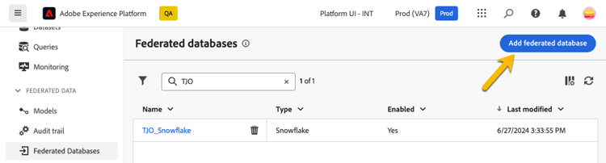
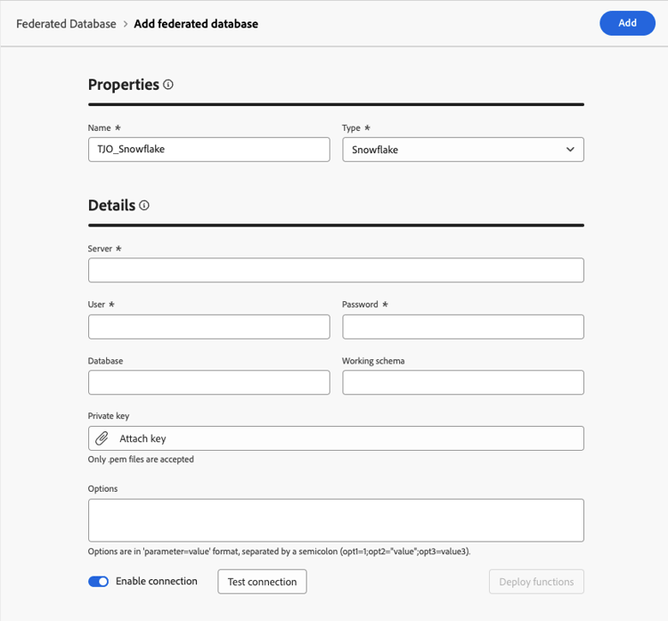
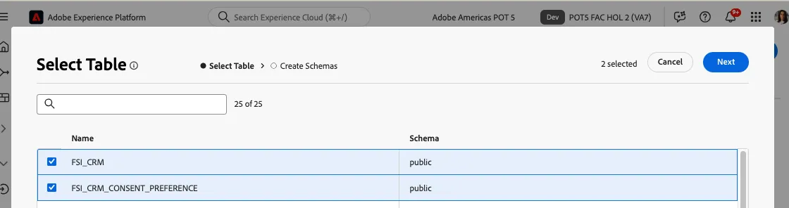

# Data Warehouse-verbinding

In deze les, vormen wij een verbinding tussen Adobe Experience Platform en uw onderneming Data Warehouse om Federated Audience Composition toe te laten. Dit staat u toe om gegevens van gesteunde pakhuizen zonder replicatie direct te vragen. Daarnaast maken we schema&#39;s en gegevensmodellen op basis van de Data Warehouse-tabellen.

Voor dit laboratorium, verbinden wij met een rekening van Snowflake. De Federatieve Samenstelling van de Publiek steunt een groeiende lijst van de verbindingen van het wolkenpakhuis. Zie de [ bijgewerkte lijst van integraties ](https://experienceleague.adobe.com/en/docs/federated-audience-composition/using/start/access-prerequisites){target="_blank"}.

## Stappen

1. Blader aan de **FEDERATED sectie van GEGEVENS** op het linkerspoor.
2. In de **Verdeelde verbinding van Gegevensbestanden**, klik op **voegt gefederaliseerde gegevensbestand** knoop toe.
3. Voeg een naam toe en selecteer **Snowflake**.
4. Vul de details in, klik op de **verbinding van de Test** knoop, en dan op **stelt functies** knoop op.

   

   

   

## Een schema maken

Voer de volgende stappen uit om schema&#39;s te maken in Federated Audience Composition:

1. In de **FEDERATED sectie van GEGEVENS**, klik **Modellen**.
2. Blader het **Schema** lusje en klik op **creeer Schema** knoop.
3. Selecteer uw brongegevensbestand in de lijst, en klik op **voeg lijsten** tabel toe.
4. Selecteer de volgende tabellen:
   - FSI_CRM
   - FSI_CRM_CONSENT_PREFERENCE

   

   

Nadat u de tabellen hebt geselecteerd, controleert u de kolommen van elke tabel en selecteert u de primaire sleutel. Voor deze oefening, selecteren wij **EMAIL** als primaire sleutel in beide lijsten.

## Gegevens voorvertonen in een schema

Om voorproef de gegevens in de lijst door uw schema wordt vertegenwoordigd, doorblader aan het **Gegevens** lusje dat.

Klik op **berekenen** verbinding om het totale aantal verslagen voor te vertonen.

## Een gegevensmodel maken

Met gegevensmodellen kunt u een koppeling maken tussen tabellen. De koppeling kan worden gemaakt tussen tabellen in dezelfde database, zoals tabellen in Snowflake, of tussen tabellen in verschillende databases, zoals een koppeling tussen een tabel in Snowflake en een tabel in Amazon Redshift.

Ga als volgt te werk om een gegevensmodel te maken in Federated Audience Composition:

1. In de **FEDERATED DATA** sectie, klik **Modellen** dan klikken **Model van Gegevens**.
2. Klik **creëren gegevensmodel** knoop.
3. Geef een naam op voor uw gegevensmodel.
4. Klik op **voeg schema&#39;s** toe en selecteer **FSI_CRM** en **FSI_CRM_CONSENT_PREFERENCE** schema&#39;s.
5. Creeer een verband tussen deze lijsten door op **te klikken creeer verbindingen**.

Kies bij het maken van een koppeling de toepasselijke kardinaliteit:

- **1-n**: Één voorkomen van de bronlijst kan verscheidene overeenkomstige voorkomen van de doellijst hebben, maar één voorkomen van de doellijst kan hoogstens één overeenkomstige voorkomen van de bronlijst hebben.
- **n-1**: Één voorkomen van de doellijst kan verscheidene overeenkomstige voorkomen van de bronlijst hebben, maar één voorkomen van de bronlijst kan hoogstens één overeenkomstige voorkomen van de doellijst hebben.
- **1-1**: Één voorkomen van de bronlijst kan hoogstens één overeenkomstige voorkomen van de doellijst hebben.

Hieronder ziet u een voorvertoning van de koppeling die voor de laboratoriumoefeningen is gemaakt. De verbinding laat toe om zich tussen CRM en toestemmingslijsten aan te sluiten, gebruikend de primaire sleutel van **E-MAIL** om toe te treden uit te voeren.

Nu, zijn wij bereid om [ tot stand te brengen en publiek ](audience-creation-exercise.md).
