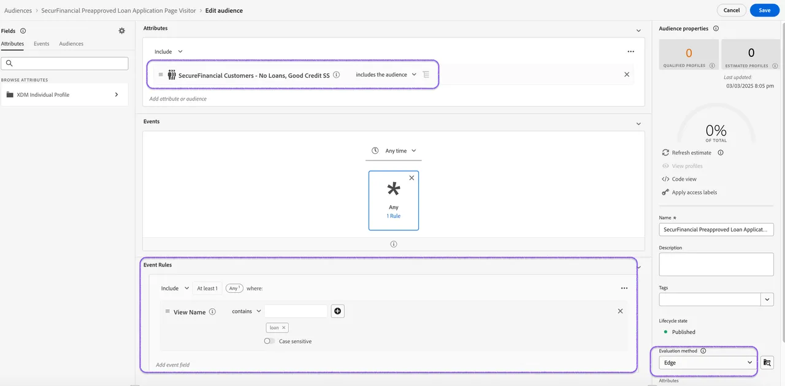

# Lever &#39;op het moment&#39; personalisatie met Edge Network

De Federatieve Samenstelling van het Publiek laat u toe om bestaand publiek in Adobe Experience Platform (AEP) te verrijken door samengestelde publieksgegevens te gebruiken die van het entrepot van ondernemingsgegevens zijn gefederaliseerd. Deze gegevens blijven niet behouden in Adobe Experience Platform.

In deze visuele exercitie gebruiken we een gefederaliseerd publiek dat wordt gevraagd naar de kredietscore en de leningsactiviteit om het gedragspubliek van webpaginagebezoekers van leningentoepassingen te verrijken.

Door dit publiek op de Edge te evalueren, richten we de vooraf goedgekeurde bezoekers van de pagina&#39;s voor de toepassing van leningen onmiddellijk opnieuw op met persoonlijke aanbiedingen op de site.

## Stappen

1. **sparen en Begin** uw gefedereerde publiekssamenstelling. Zodra de samenstelling is gelopen, zal het gefedereerde publiek in het publieksportaal verschijnen.
2. **bouwt een publieksregel** gebruikend profielattributen en ervaringsgebeurtenissen van de Dienst van het Profiel, die uw gefedereerd publiek opnemen.

Laten wij dit met a [ samenvatting van lessen en definitieve meta&#39;s ](conclusion.md) samenvatten!
