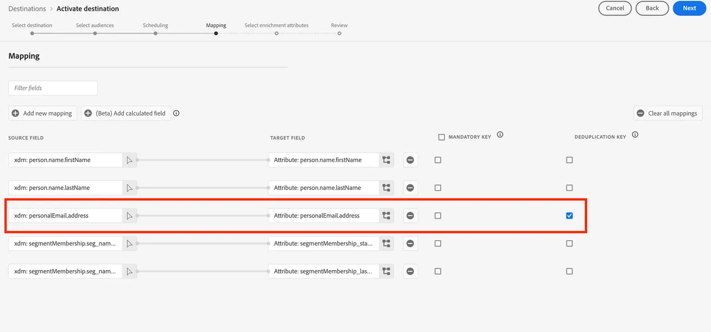
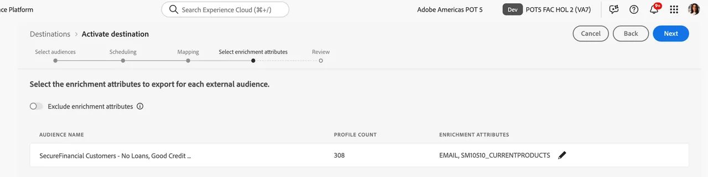

# Wijs een Federaal publiek aan een S3 bestemming aan hefboompublieksattributen voor verrijking toe

U kunt publieksattributen in uw gegevenspakhuis hefboomwerking om de ervaring van uw publiek in stroomafwaartse activeringswerkschema&#39;s te verrijken gebruikend de bestemmingen van RTCDP. Voor SecurFinancial, kunnen deze gefederaliseerde attributen worden gebruikt om de het verpersoonlijkingservaring van het klantenpubliek offline te verbeteren. Hieronder wordt het gefedereerde publiek toegewezen aan een vooraf geconfigureerde Amazon S3-bestemming.

## Stappen

1. Navigeer aan het **portaal van Doelen**.

2. Klik het **3 punt menu** knoop naast de pre-gevormde bestemming van Amazon S3, dan klik **actief Soorten publiek**.

   

3. Selecteer de **S3 bestemming**, dan klik **daarna**.

   

4. Selecteer het juiste publiek. In ons voorbeeld: **SecureFinancial Klanten - Geen Leningen, het Goede publiek van de Krediet**.

   

5. In **plannend** sectie, gebruik de standaardmontages en klik **daarna**.

6. In de **Afbeelding** stap, kies de deduplicatietoets. In ons voorbeeld, `xdm: personalEmail.address` is inbegrepen en geselecteerd als **De-duplicatie Sleutel**. Dan klik **daarna**:

   

7. In de afbeeldingsstap, uitgezochte verrijkingsattributen die op de afbeeldingen van het publieksgebied in de gefedereerde publiekssamenstelling worden gebaseerd. Klik het **potlood (geef uit)** pictogram om de pre-geselecteerde attributen te bekijken.

   

   

8. Herzie uw publiekstoewijzing en slag **Afwerking**.

### OVERZICHT

We hebben met succes een publiek gemaakt en het geactiveerd naar een S3-bestemming. Elke andere oplossing kan dit publiek oppakken en onmiddellijk gebruiken. Met de gebruikersvriendelijke interface kunnen marketingteams snel een publiek maken en activeren zonder onderliggende gegevens te verplaatsen. Klanten die deze aanpak volgen, zijn in ongeveer een maand LIVE gaan met hun eerste gebruiksgeval.

Nu zullen wij [&#x200B; een reis &#x200B;](build-journey-federated-audience.md) bouwen.
