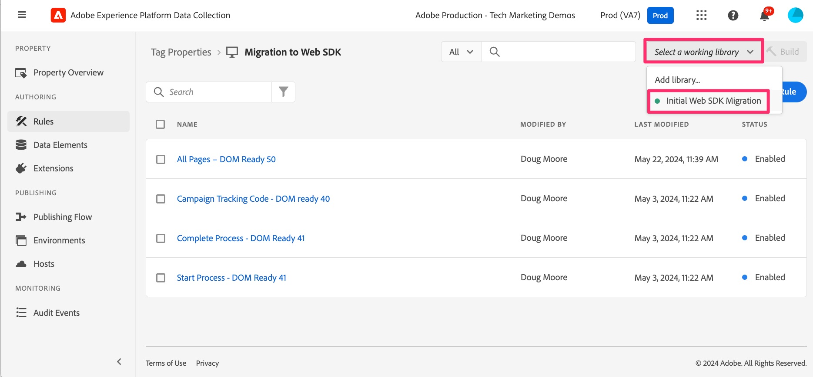

# De implementatiewijzigingen in de ontwikkelbibliotheek samenstellen

Leer hoe u wijzigingen bouwt die u in de ontwikkelingsbibliotheek in uw eigenschap tags hebt aangebracht, zodat u de resultaten kunt testen op uw ontwikkelingswebsite.

Aangezien u in dit leerprogramma gaat, of werkelijk wanneer dat u veranderingen in uw implementatie aanbrengt, zult u die veranderingen moeten bouwen/publiceren om hen op uw ontwikkeling, het opvoeren, of productiesites te zien. Ik weet zeker dat u dit al eerder hebt gedaan, omdat dit een migratiedocument is en geen eerste implementatiedocument. In feite, zult u dit vrij vaak willen doen, aangezien u elke functie uitvoert en het wilt uittesten en ervoor zorgen dat het correct werkt, die de juiste gegevens naar Analytics verzenden.

Daarom zullen er een paar herinneringen in deze zelfstudie zijn om uw veranderingen te bouwen of te publiceren. Plaats desgewenst een bladwijzer op deze pagina en maak geen deel uit van uw ontwikkelingsbibliotheek. Je kunt het op elk moment doen.

Dus, laten we bouwen wat we tot nu toe hebben gedaan. Overigens kunnen we soms &#39;build&#39; en &#39;publish&#39; uitwisselen in deze zelfstudie. Het belangrijkste is om te weten of u &quot;bouwt&quot;aan een ontwikkelings of het opvoeren bibliotheek, of als u &quot;publiceert&quot;aan de productiebibliotheek en het milieu, ongeacht welk woord wij gebruiken.

## Migratiewijzigingen aanbrengen in ontwikkeling in Experience Platform-tags

1. Terwijl in uw bezit in de markeringen van het Experience Platform, uitgezocht **het Publiceren Stroom** van de linkernavigatie, en voeg dan een nieuwe bibliotheek toe.

   

1. Noem de bibliotheek wat u wilt, bijvoorbeeld **Aanvankelijke Migratie van SDK van het Web**.
1. Selecteer het **milieu van de Ontwikkeling**.
1. Selecteer **toevoegen Alle Gewijzigde Middelen** om alle punten toe te voegen die u aan hebt gewerkt.

   

1. Opslaan en samenstellen tot ontwikkeling

   

1. Wanneer de build is voltooid, kunt u zien of de build is gelukt. Plaats de muisaanwijzer op de groene stip links van de nieuwe bibliotheek in de publicatiestroom. Als de bibliotheek groen is, is de publicatie voltooid en wordt u dat verteld.

   

### Een werkbibliotheek selecteren

Hier is een handige sneltoets als je door bewerkingen in tags gaat. In plaats van elke keer dat u een wijziging aanbrengt door de volledige publicatiestroom te gaan, kunt u een werkende bibliotheek kiezen en opslaan en bouwen met een klik op een knop. Doe het. U zult me later bedanken.

1. Van ongeveer overal in de markeringen UI, selecteer een het werk bibliotheek van het hoogste recht van UI, en kies één u wilt. Kies bij deze zelfstudie de optie Oorspronkelijke SDK-migratie op het web.

   

