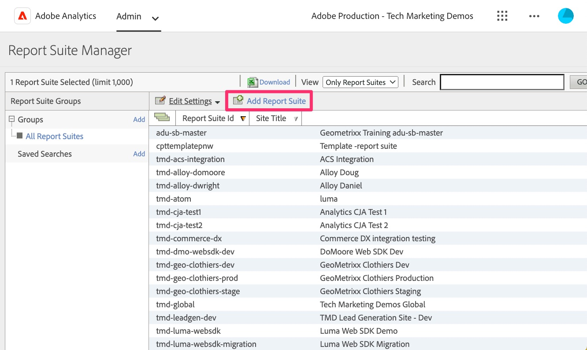

# Een validatierapportsuite maken

Maak een rapportsuite in Adobe Analytics die u kunt gebruiken om SDK-gegevens op het web te valideren wanneer u uw site(s) later migreert dan de oude implementatie.

Afhankelijk van de grootte en complexiteit van uw analytische implementatie kan het even duren om over te schakelen naar de Web SDK. Tijdens die tijd, zult u uw werk willen bevestigen, ervoor zorgen dat de gegevens in de rapporten van Adobe Analytics correct stromen. In plaats van dat gegeven in een rapportreeks naast productiegegevens, of zelfs met andere ontwikkelingsgegevens te duwen, is het een beste praktijk om een nieuwe, nieuwe rapportreeks tot stand te brengen die u voor deze migratie kunt gebruiken. In de volgende les zullen wij nieuwe &quot;gegevensstromen&quot;voor ontwikkeling, het opvoeren, en productie creëren en vormen. Als we dit doen, moeten we de rapportsuite-id voor de configuratie weten.

## Maak de nieuwe rapportsuite

1. Open Adobe Analytics en navigeer aan de **montages van de rapportreeks** in de Admin Console

   .

1. Selecteren **[!UICONTROL Add Report Suite]**

    toe

1. Vul het formulier in om een nieuwe rapportsuite te maken. Hoewel u kunt verkiezen om de nieuwe rapportreeks van een malplaatje, zelfs een leeg malplaatje tot stand te brengen, zal het waarschijnlijk beter voor u uitwerken om **te kiezen Dupliceert een Bestaande optie van de Reeks van het Rapport** en uw rapportreeks te kiezen die u aan SDK van het Web migreert. Op deze manier kunt u dezelfde namen en instellingen gebruiken als wanneer u de nieuwe gemigreerde gegevens test. Hierdoor kunt u gemakkelijker valideren terwijl u doorgaat. Vul alle vereiste velden in en sla uw nieuwe rapportenpakket voor migratieontwikkeling op.

   

1. Noteer de id van uw nieuwe rapportsuite, aangezien u deze nodig hebt in de volgende les terwijl u gegevensstromen instelt voor de implementatie van Web SDK. U kunt de titel van de site ook gebruiken in Analysis Workspace om de rapportsuite voor migratieontwikkeling te kiezen in uw analyseproject.

>[!TIP]
>
>Voor een videolooppas-door van het creëren van rapportsuites, zie [ Begrip en het creëren van rapportsuites ](https://experienceleague.adobe.com/nl/docs/analytics-learn/tutorials/intro-to-analytics/analytics-basics/understanding-and-creating-report-suites){target="_blank"} .

