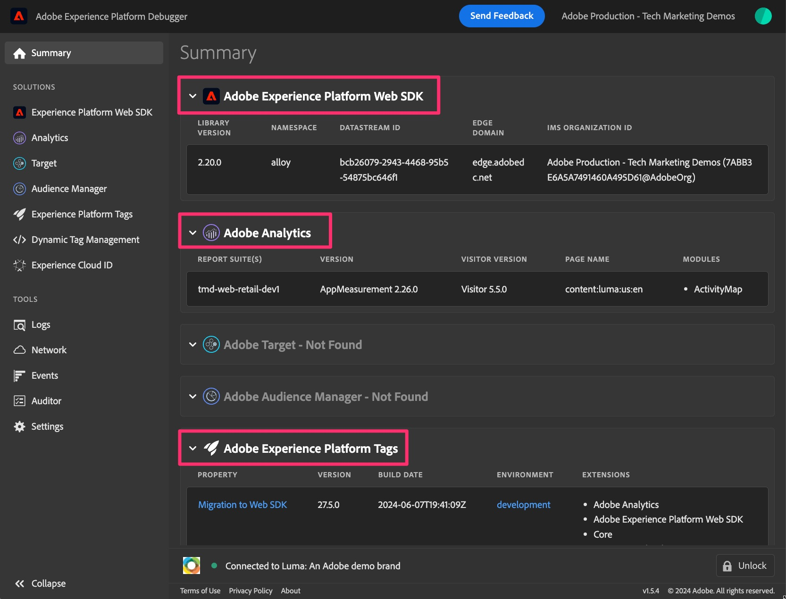

# Fouten opsporen en uw Web SDK-migratie valideren

In deze oefening, zult u leren hoe te om uw gegevens te zuiveren en te bevestigen aangezien u aan het Web SDK migreert. Wij willen twee verschillende validatieactiviteiten aanmoedigen die u kunnen helpen ervoor te zorgen dat alles correct loopt:

1. **activiteit #1 van de Bevestiging** stelt het Adobe Experience Platform Debugger in werking, dat een browser uitbreiding is, en staat u toe om langs de manier te controleren dat uw gegevens correct in Analytics worden verzonden. U wordt aangeraden deze activiteit vaak uit te voeren, aangezien u wijzigingen aanbrengt in de eigenschap tags en de wijzigingen publiceert naar een ontwikkelingsbibliotheek.
1. **activiteit #2 van de Bevestiging** gaat in Adobe Analytics, vestiging één of meerdere projecten om gegevens van het Web SDK (via uw pas gecreëerde reeks van het migratierapport) te ontvangen, en het verifiëren dat uw gegevens eigenlijk in de rapporten komen correct aangezien u rond uw plaats klikt, enz.

## Het Adobe Experience Platform Debugger

Dit foutopsporingsprogramma is een browserextensie en is beschikbaar in de Chrome Store. Er is a [&#x200B; videoleerprogramma &#x200B;](https://experienceleague.adobe.com/nl/docs/platform-learn/data-collection/debugger/overview) dat verklaart hoe te om debugger te downloaden en te gebruiken, en het wordt geadviseerd dat u eerst door dat gaat om het basisgebruik te kennen.

Als u de foutopsporing hebt uitgevoerd, kunt u deze gebruiken om ervoor te zorgen dat de gegevens van uw site en via de Edge Network correct stromen. Deze zelfstudie blijft bij vrij eenvoudig gebruik, maar gebruik de foutopsporing tot de volledige capaciteit om uw gegevens te controleren.

**Veronderstelling (altijd gevaarlijk, maar hopelijk fijn in dit geval):** Aangezien wij het markeringsbezit over aan het Web SDK in dit voorbeeld migreren, te hoeven wij geen nieuwe inbedcode op de plaats te zetten. Het zal er al zijn geweest. Nochtans, als u besluit u meer van een &quot;lift en verschuiving&quot;benadering op een volledig nieuwe markeringsbezit wilt doen, zult u nieuwe inbedcodes hebben om op uw ontwikkeling, het opvoeren, en productiemilieu&#39;s te zetten. Zo in het geval van deze zelfstudie, zolang wij de uitbreiding hebben van SDK van het Web geïnstalleerd en gevormd met regels die gegevens verzenden binnen, zullen wij de gegevens die in debugger verschijnen krijgen.

### Web SDK-gegevens weergeven in foutopsporing

Nu u uw standaardpaginalijn hebt gemigreerd (of als u om het even welke regels) en het aan een bibliotheek in de ontwikkelomgeving gepubliceerd, zou u uw plaats moeten kunnen in werking stellen en de gegevens zien die in debugger stromen.

Stappen voor het weergeven van uw gegevens:

1. De ontwikkelomgeving van uw site openen in de browser
1. Open debugger door op de browser uitbreiding van de uitbreidingsdienblad bij de bovenkant van uw browser venster te klikken

   

   >[!TIP]
   >
   >In de bodem juiste hoek van debugger is een &quot;Slot&quot;pictogram en een etiket, en aan de linkerzijde van het, kunt u zien welke pagina u zuivert. Klik op het vergrendelingspictogram op uw site, zodat de foutopsporing wordt vergrendeld in het venster van uw site. Als u anders in een ander browsertabblad/venster zou klikken, zou de foutopsporing op die site reageren. Tijdens de foutopsporing van uw site is het alleen maar eenvoudiger om ervoor te zorgen dat de foutopsporing altijd informatie voor uw site geeft.

1. Zorg ervoor u op de **Summiere** pagina van debugger (&quot;het pictogram van het Huis&quot;op de bovenkant linkerzijde) bent. **vernieuw uw plaats** in zijn browser venster. Als debugger de ingebedcode op uw plaats opneemt, en als u niet de code van de Analyse (zoals in deze zelfstudie) schrapte, zult u aanwijzingen zien dat er code voor zowel het Web SDK van Adobe Experience Platform als Adobe Analytics, evenals de Markeringen van Adobe Experience Platform was. Anderen worden grijs weergegeven.

   

1. Om de gegevens te zien die via het Web SDK worden toegevoegd, klik de **verbinding van SDK van het Web van 0&rbrace; Experience Platform &lbrace;in de linkerspoor**
1. Klik **Duidelijke gebeurtenissen** enkel om zich van om het even welke klappen te ontdoen die zijn gebeurd
1. Vernieuw uw site opnieuw en kom terug naar foutopsporing
1. Dan klik op het gegevensgebied naast **gebeurtenissen** in de lijst

   

1. Vouw in het veld Waarde de waarden 0, data, __adobe en analytics uit
1. U moet de variabelen zien die u instelt in de regel(s) die op die pagina worden geactiveerd, inclusief de standaard regel voor het laden van de pagina en eventuele speciale regels.

   

1. Voer deze stappen uit wanneer u iets in uw markeringsbezit hebt veranderd en de veranderingen in ontwikkeling hebt gepubliceerd, zodat u het effect van de veranderingen kunt zien u aan uw implementatie Analytics hebt aangebracht.

## Gegevens valideren in Analysis Workspace

De belangrijkste lijn van deze aanbeveling is om uw huidige analysegegevens die uit uw implementatie van Markeringen komen te nemen gebruikend de uitbreiding van Adobe Analytics, en het te vergelijken met de zelfde rapporten die nu door het Web SDK zullen worden gevuld.
Er zijn mogelijk meerdere manieren om deze vergelijkingen in te stellen, maar ik ga jullie twee voorbeelden geven van hoe dit te doen.

### Optie 1: de gegevens vergelijken met behulp van twee deelvensters in één project

1. Een nieuw project maken in Analysis Workspace en twee deelvensters toevoegen
1. Stel de rapportsuite in deelvenster 1 in op uw huidige Adobe Analytics-productierapportsuite
1. Stel de rapportsuite in deelvenster 2 in op uw nieuwe Web SDK-ontwikkelingsrapportsuite
1. Plaats hetzelfde rapport in beide deelvensters met een periode die alleen de volledige dagen omvat waarop gegevens naar beide rapportsuites zijn verzonden
1. De gegevens vergelijken

Dit zou ongeveer als dit kunnen kijken (het begrip dat er geen gegevens in deze lege demo rapportsuites zijn):

Zoals u kunt zien, is het rapport hetzelfde in beide deelvensters en is de kalender ook hetzelfde. Het verschil is de rapportsuite, zoals in de bovenstaande stappen wordt beschreven.
**Voordeel van deze optie:** u kunt één voor één met rapporten/afmetingen gaan en precies testen wat u wilt testen, aangezien u veranderingen in de implementatie aanbrengt.

### Optie 2: Vergelijk de gegevens met twee projecten

1. Een bestaand project openen dat gebruikmaakt van de huidige Adobe Analytics-extensiegegevens
1. Doe &quot;sparen als&quot;om een exemplaar van dat project te maken, noemend het aan iets als &quot;het project van de de migratiebevestiging van SDK van het Web&quot;
1. Wijzig de rapportsuite voor het gekopieerde project, zodat deze aanwijst naar uw Web SDK-ontwikkelingsrapportsuite
1. Open elk project in een verschillend venster, en grootte hen zodat u hen naast elkaar op uw monitor kunt zien
1. De gegevens vergelijken

Dit ziet er heel erg uit als de bovenstaande afbeelding, behalve dat elk deelvenster zich in een eigen project en in een ander venster bevindt.
**Voordeel van deze optie:** In dit geval moet u niet al uw rapporten opnieuw toevoegen en vormen, maar u moet zien hoe uw huidige rapporten gebruikend de nieuwe uitbreiding van SDK van het Web met minimale opstelling zullen kijken.

Het is mogelijk dat je beide wilt doen, wat ook een andere geweldige optie is.

>[!IMPORTANT]
>
>Nu u uw standaardregel voor het laden van pagina&#39;s hebt gevalideerd, kunt u verdergaan in de zelfstudie. Nochtans, vragen wij u vaak te testen/bevestigen, waarschijnlijk minstens telkens als dat u een regel verandert of andere significante veranderingen aanbrengt. Houd er rekening mee dat als u een probleem tegenkomt terwijl u verdergaat, u gelukkiger bent als u alleen maar ÉÉN ding hoeft te controleren in plaats van verschillende wijzigingen te testen die u hebt aangebracht sinds de laatste validatie.

Gelukkig valideren!
