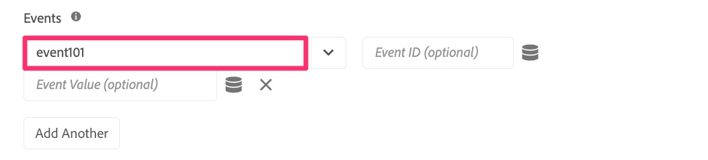
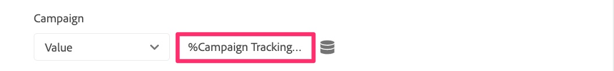
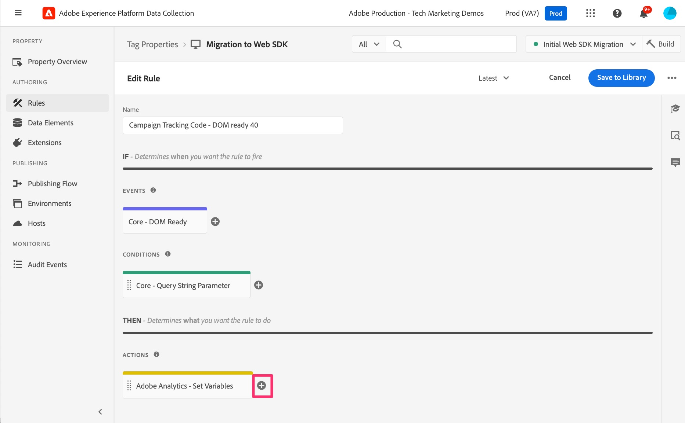

# Extra paginaregels migreren

In deze oefening zult u leren hoe te om extra op pagina-Gebaseerde regels aan de uitbreiding van SDK van het Web te migreren. U zult dit gelijkaardig aan de oefening vinden die u reeds deed toen het migreren van uw standaard de ladingsregel van de pagina aan Web SDK. De methoden zijn nog steeds van toepassing. Het grootste verschil is dat met deze regels, u geen Send actie van de Gebeurtenis zult toevoegen, omdat in de meeste gevallen, uw regel niet de Send actie van het Band van de uitbreiding van de Analyse bevat.

## Overzicht

Laten we een klein back-up maken en praten over analytische implementaties zoals ze zijn met de extensie Adobe Analytics-tags (ook wel &#39;AppMeasurement&#39;-implementatie genoemd, omdat dat de naam van het JavaScript-bestand is).

Ik veronderstel niet om precies te weten hoe u wordt uitgevoerd, maar in vele implementaties die Experience Platform markeringen gebruiken, zijn er om het even welk aantal regels die slechts voorwaardelijk in brand steken, die op iets op de pagina of in URL worden gebaseerd. Voorbeelden hiervan zijn:

* De resultatenregel van het onderzoek, slechts het vuren wanneer een interne onderzoek heeft uitgevoerd en de pagina van onderzoeksresultaten omhoog komt
* Regel voor landingspagina&#39;s campagne voeren, alleen vuren wanneer de URL een volgcode bevat
* Regels voor paginatype, alleen branden voor een pagina die een bepaald type pagina is, bijvoorbeeld pagina met productdetails, winkelwagenpagina enzovoort.
* Elke andere pagina die voorwaardelijk wordt geactiveerd

Het belangrijkste punt hier is dat elk van deze gebruiksgevallen slechts soms **&#x200B;**&#x200B;op een pagina in brand steken, en wij **ook** verwachten de standaardpaginalijn om te branden. Daarom willen wij niet een Send Beacon (uitbreiding van AA) of een Send Gebeurtenis (de uitbreiding van SDK van het Web) met om het even welk van deze regels omvatten, of anders zou het in twee klappen resulteren die binnen voor de zelfde paginading gaan.

Daarom bouwen deze regels het voorwerp op, maar zij verzenden niet de gegevens binnen. Wij zorgen enkel ervoor dat deze regels **vóór** de regel van de standaardpaginalading in brand steken, zodat nadat zij het voorwerp opbouwen, verzendt de Send actie van de Gebeurtenis Beacon/verzendt op de standaard de ladingsregel van de pagina alles binnen verzendt. Het is waarschijnlijk dat u dit allemaal weet en dat is hoe uw site is ingesteld. Maar als u nieuw bent aan uw eigen implementatie, of als u uw implementatie moet &quot;bevestigen&quot;om op deze methode te lijken, is deze oefening vooral nuttig voor u.

## Voorbeeld van migratie van voorwaardelijke regel

Hier is een voorbeeld van het migreren van een regel die voorwaardelijk brandt. Ik zal het bovenstaande voorbeeld van een campagnelandingspagina gebruiken. Zoals ik al zei, volgt dit hetzelfde patroon waarmee we al hebben gewerkt in onze standaardpaginalijn, maar het is nog makkelijker omdat we alleen variabelen instellen en geen resultaten afvuren.

1. Zoek de voorwaardelijke regel. In dit voorbeeld vinden we de regel van de code voor het bijhouden van campagnes en selecteren deze.

   

1. Wanneer de regel opent, kunnen wij zien dat er een voorwaarde op deze regel die op een parameter van het vraagkoord wordt gebaseerd is. We hoeven niets aan de voorwaarde te wijzigen, omdat we alleen de actie willen bijwerken/migreren, niet de gebeurtenis of de voorwaarde.
1. Klik in **Adobe Analytics - Reeks Veranderlijke** actie
1. Noteer alles wat in de handeling is ingesteld. In dit voorbeeld, merken wij op dat **event101** wordt geplaatst, evenals de **3&rbrace; variabele van de Campagne &lbrace;.**

   
   

1. Wij klikten binnen slechts om de nota te maken, en wij te hoeven om het even wat niet te veranderen, zodat kunnen wij nu eenvoudig **annuleren** klikken.
1. Creeer een nieuwe actie door op **plus pictogram** in de actiessectie te klikken

   

1. Vorm de nieuwe regel
   1. Selecteer **SDK van het Web van Adobe Experience Platform** van de drop-down Uitbreiding.
   1. Selecteer **Variabele van de Update** van het drop-down Type van Actie.
   1. In het rechterpaneel, selecteer het **voorwerp van Analytics** binnen het gegevensvoorwerp

      

1. Stel nu event101 en de campagnevariabele in op dezelfde waarden als in de bestaande actie.

   
   

1. Nu kunt u **veranderingen** houden en **sparen aan Bibliotheek**, en uw regel is gemigreerd aan Web SDK.

>[!IMPORTANT]
>
>Als de regel van de standaardpaginalading, verlieten wij de Veranderlijke **actie van de uitbreiding van de Analyse** Reeks Variabele in de regel zodat wij gegevens kunnen vergelijken aangezien wij onze migratie bevestigen. Vergeet niet later terug te komen en de actie van de extensie Analytics te verwijderen zoals u de definitieve opschoonbewerking uitvoert.
