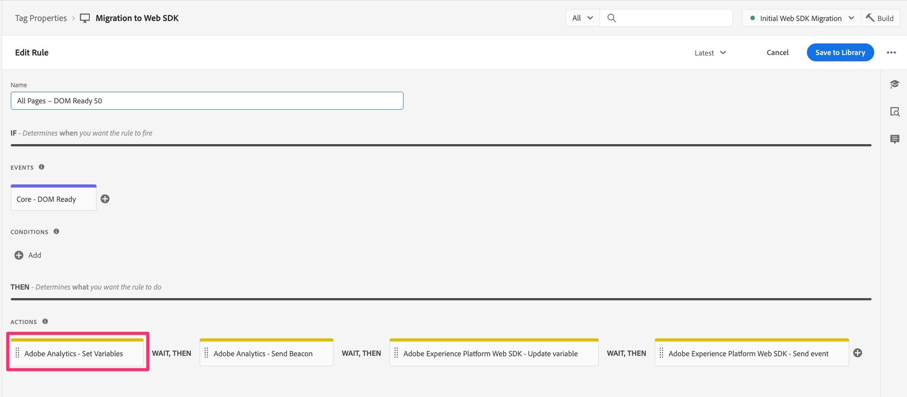
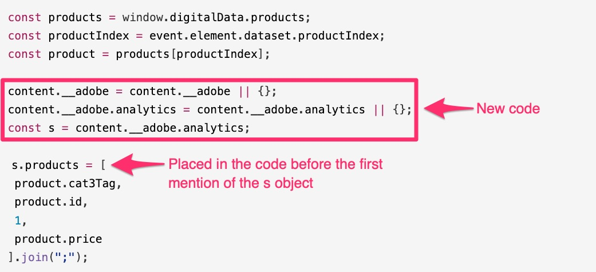
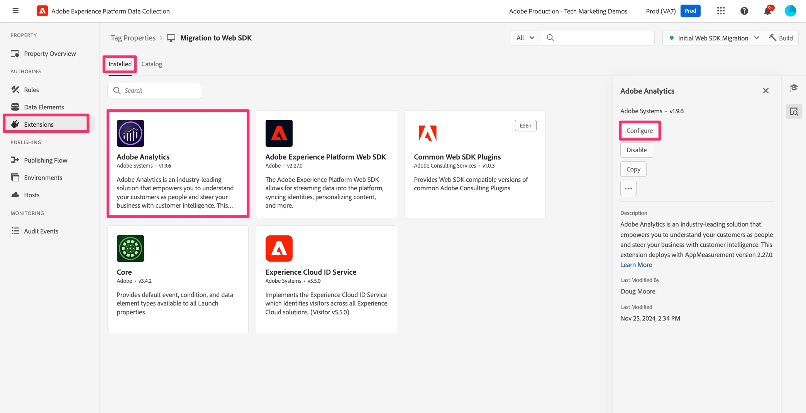
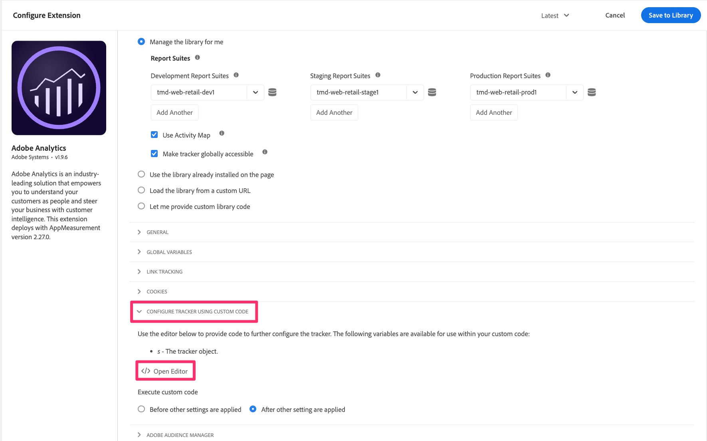
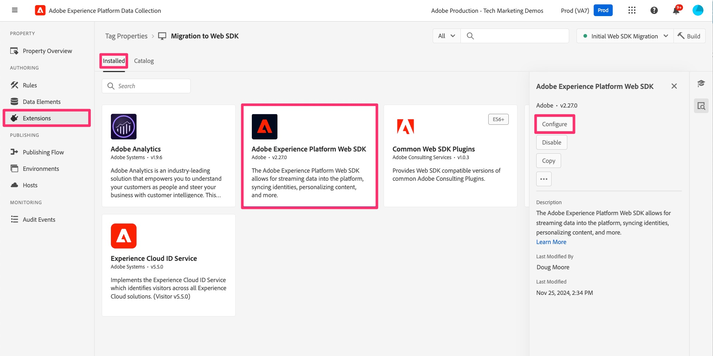
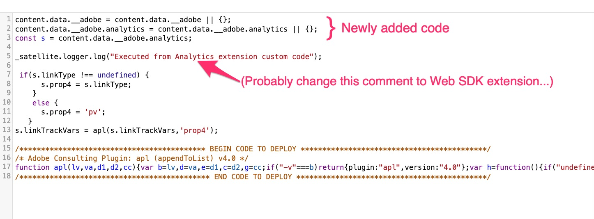

# Aangepaste code migreren naar Web SDK

In deze oefening, zult u leren hoe te om douanecode van de uitbreiding van Adobe Analytics aan de uitbreiding van SDK van het Web van Adobe Experience Platform in de Markeringen van het Experience Platform te migreren.

## De grote disclaimer

Ik weet zeker dat u niet verrast zult zijn dat ik iets dergelijks ga toevoegen aan een document dat u de beste/eenvoudigste/meest effectieve manier begint te vertellen om met code te werken. Er zijn duidelijk vele verschillende manieren dat de code kan worden geschreven, worden uitgegeven, en worden behandeld. In deze oefening ga ik u van een manier voorzien om code gemakkelijk te nemen die u in een bestaande regel hebt en het te kopiëren, een verandering toe te voegen, en het te laten werken voor de gemigreerde regel. Als je denkt aan een betere manier om het te doen, is dat fantastisch. Ik heet jullie niet alleen welkom om het te gebruiken, maar om het te delen met ons en met jullie collega&#39;s in de Experience League gemeenschap (vooral in de communitypost over deze zelfstudie). Hetzelfde geldt voor de onderste helft van de pagina, waarbij wordt gewerkt met plug-ins voor implementatie. Ik zal hier een manier voorstellen, en dan doe je wat goed voor je voelt. Oké, laten we de details bekijken.

>[!IMPORTANT]
>
>In de geest van de laatste paragraaf, is het ook belangrijk om aan te bevelen dat u deze kans tijdens uw migratie aan Web SDK aangrijpen om een goed blik op uw code te nemen en te zien of om het even welk van het zou moeten worden bijgewerkt of zelfs worden geschrapt. In de onderstaande paragrafen en stappen zult u zien hoe u uw code kunt migreren. Zelfs als het makkelijker is om deze allemaal in één klap te verplaatsen, zou ik het niet erg vinden om een lenteschoonmaak te doen, om zo te zeggen.

## Migratie van welke code?

De code die wij eerst in deze sectie zullen richten is de code die u in het venster van de &quot;Code van de Douane&quot;in om het even welke acties van Adobe Analytics kunt hebben, met inbegrip van de **Vastgestelde Veranderlijke** acties. Met andere woorden, open één van uw regels, en kijk neer in de actiesectie. Als u de actie &quot;Adobe Analytics - Variabelen instellen&quot; hebt, klikt u om deze te openen.



Vervolgens schuift u naar beneden aan de rechterkant en ziet u de knop Editor openen voor het venster Aangepaste code. Klik om te openen.


Als u daar code hebt, zal het moeten worden gemigreerd zodat het kan worden uitgevoerd en naar Adobe Analytics worden verzonden gebruikend het Web SDK.
Het belangrijkste idee hier is dat we het object &#39;s&#39; gaan omzetten in &#39;content&#39;.__adobe.analytics&quot;.

Wij zullen eenvoudig wat extra code vóór de eerste vraag aan het s voorwerp moeten toevoegen, zodat het door het Web SDK kan worden begrepen en worden behandeld. De plaats wij de onlangs veranderde code toevoegen is in het venster van de Code van de Douane van de &quot;Adobe Experience Platform Web SDK - de veranderlijke actie van de Update&quot;.

Zo, bijvoorbeeld, laten wij zeggen dat u het volgende codeblok in het venster van de douanecode hebt:

```javascript
const products = window.digitalData.products;
const productIndex = event.element.dataset.productIndex;
const product = products[productIndex];
s.products = [
product.cat3Tag,
product.id,
1,
product.price
].join(";");
```

De code die u moet omvatten is als volgt:

```javascript
content.__adobe = content.__adobe || {};
content.__adobe.analytics = content.__adobe.analytics || {};
const s = content.__adobe.analytics;
```

Ga daarom als volgt te werk om de aangepaste code te migreren:

1. Kopieer uw aangepaste code uit het venster in de actie Adobe Analytics-variabelen instellen
1. Sluit dat codevenster en sluit (annuleer uit) de actie.
1. Open het Web SDK - de veranderlijke actie van de Update door op het te klikken (of als u nog geen hebt, voeg toe).

   

1. Selecteer het analyseobject boven in het rechtervenster

   

1. Omlaag naar beneden schuiven en het venster Aangepaste code openen

   

1. Plak in de code die u hebt overgenomen uit het venster voor aangepaste code Analytics
1. Plaats nu de nieuwe coderegels in het midden van de bestaande code, zodat deze boven de eerste vermelding van het object s staan, zoals in het volgende voorbeeld:



U kunt de code nu opslaan in het venster Aangepaste code en de wijzigingen behouden in de actie Variabelen bijwerken. U zult ook de regel willen bewaren en de nieuwe veranderingen in de het werk bibliotheek publiceren.

## Hoe zit het met plug-ins?

Als u een &quot;appMeasurement&quot;implementatie van Adobe Analytics hebt, gebruikend de uitbreiding van Analytics in de Markeringen van het Experience Platform (vroeger genoemd &quot;Lanceer&quot;), dan is het waarschijnlijk dat u één of meerdere &quot;stop-ins&quot;van JavaScript gebruikt om variabelen te plaatsen of andere taken te doen. Als deze functies en de vraag van JavaScript in een codevenster binnen van een regel zijn, dan zou de informatie hierboven op deze pagina u moeten helpen de code over naar het Web SDK migreren.
Het is echter ook waarschijnlijker dat de insteekcode zich in het codevenster bevindt in de configuratie van de Adobe Analytics-extensie zelf. Om te controleren als u stop-ins en andere code hebt om te migreren, open de uitbreiding van Analytics door in de Inzameling en Markeringen van Gegevens te gaan, uw bezit te openen, en dan **Uitbreidingen** in de linkernavigatie te klikken.

1. Selecteer het **Geïnstalleerde** lusje naar de bovenkant van de pagina, en selecteer dan uw uitbreiding van Adobe Analytics.
1. Dan op de rechterkant van de pagina, klik **vormen**

   

1. Breid **uit vormt Beheer Gebruikend de sectie van de Code van de Douane**
1. Klik aan **Open Redacteur**

   

Op dit punt kunt u de code zien die u daar hebt, en hebt u mogelijk JavaScript &quot;plug-ins&quot;, dat wil zeggen codefragmenten die u helpen bij het ophalen van gewenste gegevens en het toewijzen ervan aan aangepaste afmetingen, enz.

Niet alles in dit codevenster kan als stop-ins in het waarste Adobe Analytics gevoel worden beschouwd. Dit is belangrijk om te begrijpen hoe u uw code kunt migreren.

### Aanbeveling voor het migreren van code uit het hoofdvenster van de code van de extensie

Nogmaals, niet alles in het codevenster is mogelijk een door Adobe Consulting gemaakte insteekmodule. Een deel van het kan code zijn die u hebt geschreven, of u dat nu een insteekmodule noemt of niet. We raden twee wijzigingen aan. Zij moeten een nieuwe uitbreiding gebruiken, en ook de rest van uw code kopiëren en in een nieuwe plaats kleven.

**eerst**, is er een uitbreiding beschikbaar in Markeringen genoemd **Gemeenschappelijke Insteekmodules van SDK van het Web**. Deze extensie is een subset van de totale lijst met plug-ins voor implementatie die in de documentatie van Adobe Analytics wordt vermeld. Door deze extensie in de eigenschap Tags te installeren, installeert u de code voor de opgenomen plug-ins. Dan, om deze stop-ins te gebruiken, vindt u hen wanneer het creëren van nieuwe **gegevenselementen**. Meer hierover op een moment.

**Tweede**, is er een codevenster in de configuratie van de uitbreiding van SDK van het Web waar u allen (of wat) van uw code kunt zetten, ALS u die code wilt recht lopen alvorens de gebeurtenissen worden verzonden naar Adobe Analytics. Stappen om dat codevenster te vinden zijn:

1. Ervan uitgaande dat u reeds de uitbreiding van SDK van het Web aan uw bezit hebt toegevoegd, navigeer aan **Uitbreidingen** en selecteer het **Geïnstalleerde** lusje
1. Selecteer de **uitbreiding van SDK van het Web van Adobe Experience Platform**, en open het door **te klikken vormt** op het juiste spoor.

   

1. De rol neer aan de **sectie van de Inzameling van Gegevens** en klikt om het codevenster voor **onBeforeEventSend** te openen.

   

Hier plakt u code die u wilt uitvoeren voordat de gebeurtenis vanuit Web SDK naar Analytics wordt verzonden. Dat is eigenlijk wat de functie doPlugins deed in uw oude analytische implementatie.

Het **goede nieuws** is dat dit **zou moeten in werking stellen** u verzendt gebeurtenis, zodat of dat op paginading of met een douaneverbinding gebeurt, zou deze code moeten lopen, uw variabelen plaatsen, enz.

#### Moet ik mijn code wijzigen?

Wel, ja en nee. Ja, u moet een paar kleine dingen veranderen, maar nee, u zult niet het grootste deel van uw code hoeven te veranderen zolang u deze kleine dingen verandert:

_&#x200B;**verandering van de Code 1:**&#x200B;_
Na (of vóór, uw keus) kleeft u uw &quot;stop-binnen&quot;code in het codevenster in de uitbreiding van SDK van het Web, **verwijdert** de &quot;doPlugin&quot;lijnen uit uw code. U hebt ze niet nodig en ze veroorzaken een fout omdat ze deel uitmaken van appMeturement.js, maar niet van de Web SDK-code.


_&#x200B;**verandering van de Code 2:**&#x200B;_
De andere verandering die u zult moeten doen is wat code toe te voegen zodat het voorwerp &quot;s&quot;wordt bepaald, zeer gelijkaardig aan wat hierboven met betrekking tot de code in regelacties wordt besproken. In dit geval, zullen wij de code enkel een beetje verschillend moeten bepalen, toevoegend een &quot;gegevens&quot;knoop die reeds in de regelactie, maar niet hier wordt bepaald.
Deze definitie moet boven aan het codevenster worden geplaatst. De code die binnen moet worden gekopieerd (wanneer het plaatsen van de code in de uitbreiding van SDK van het Web) is als volgt:

```javascript
content.data.__adobe = content.data.__adobe || {};
content.data.__adobe.analytics = content.data.__adobe.analytics || {};
const s = content.data.__adobe.analytics;
```

_&#x200B;**met beide codeveranderingen:**&#x200B;_
Hier is de code hierboven vermeld, maar met beide veranderingen wij net bespraken:



### Stappen voor het migreren van belangrijkste uitbreidingscode aan Web SDK

Zoals hierboven vermeld, is de aanbeveling tweeledig: om de nieuwe Gemeenschappelijke uitbreiding van de Insteekmodules van SDK van het Web te gebruiken en ook om uw code van de de uitbreidingsconfiguratie van de Analyse in de de uitbreidingsconfiguratie van SDK van het Web te kopiëren en te kleven. Met dit in mening, samen met de belangrijke nota bij de bovenkant van de pagina om uw code op te schonen, zijn hier de geadviseerde stappen op een hoog niveau:

1. Kopieer al uw code van het de configuratiecode venster van de uitbreiding van de Analyse en plak het in het onBeforeEventSend venster in de configuratie van de uitbreiding van SDK van het Web (hoewel wij over code zouden kunnen kopiëren die moet worden verwijderd of worden bijgewerkt, zullen wij een paar passen bij de code in het nieuwe venster maken).
1. Ga door uw code nu in de uitbreiding van SDK van het Web en zoek vraag aan stop-ins of functiedefinitie voor stop-ins die in de **Gemeenschappelijke Insteekmodules van SDK van het Web** uitbreiding worden bepaald. U kunt de lijst van stop-ins in het de gegevenselementdefinitievenster van SDK van het Web na het installeren van de pluginuitbreiding vinden. U kunt het in de [ documentatie voor die uitbreiding ](https://exchange.adobe.com/apps/ec/108520) ook vinden.
1. Voor elk van de stop-ins die u in het nieuwe Web SDK insteekmodules uitbreiding vindt, verwijder de uitbreiding en de vraag aan het uit uw code, en zorg ervoor dat u dan voor die verwijdering compenseert door een gegevenselement te creëren en dan dat gegevenselement in de aangewezen regel te roepen om variabelen, enz. te plaatsen.
1. Neem vervolgens een controle door de code om te zien of er aanroepen zijn naar functies die zijn gedefinieerd in het bestand appMeasurement.js. **Verandering 1 van de Code** hierboven is een voorbeeld van dit, en u kunt deze verwijdering van code doPlugins op dit ogenblik maken, als u niet reeds hebt. Voor andere instanties, zal dit het duidelijkst zijn wanneer u een vraag aan een functie hebt die nergens in uw code wordt bepaald. U kunt ook contact opnemen met de klantenondersteuning van de Adobe of met collega&#39;s in de community van Experiencen League om te controleren of dit het geval is met die code.
1. Doorloop vervolgens de code om eventuele oude code bij te werken of te verwijderen die niet meer van toepassing is op uw analysebehoeften, zoals boven aan deze pagina wordt aanbevolen.
1. Nu **Verandering van de Code 2** hierboven vermeld, toevoegend de extra lijnen zodat om het even welke verwijzingen naar het voorwerp van S geen fouten in uw code zullen veroorzaken.
1. Last but not least: test, test en test nog wat meer. Test daarna opnieuw. Zorg ervoor dat uw code de resultaten verstrekt die u zowel in debugger van het Experience Platform als in de rapporten in Adobe Analytics verwacht.

>[!NOTE]
>
>Twee laatste gedachten over de bovenstaande stappen.
>Eerst, kunt u denken dat het gemakkelijker zou zijn om alle stop-in code daar te verlaten in plaats van het te verwijderen en het nieuwe Gemeenschappelijke SDK Plugins uitbreiding van het Web te gebruiken. Dit is waar en fijn, maar door de uitbreiding te gebruiken krijgt u de voordelen om een UI te gebruiken, die een herbruikbaar gegevenselement, bepaalt en ook automatisch om het even welke codeupdates in de toekomst ontvangt. Het is waarschijnlijk de moeite waard om de omschakeling te maken.
>
>Ten tweede kunt u, wanneer u spreekt van &quot;de switch maken&quot;, ook besluiten ALLE aangepaste code bij te werken zodat deze helemaal niet naar het oude object &#39;s&#39; verwijst. Dit is een soort uitbreiding van stap 5 hierboven. Dat is natuurlijk volkomen aanvaardbaar en een goed idee. Deze migratiezelfstudie probeert u eenvoudig uw aangepaste code te migreren, voor het geval dat u er een ton van hebt en niet over de middelen beschikt om deze allemaal op dit moment bij te werken. U beslist.

We beëindigen deze les op de manier waarop we deze hebben gestart, met de erkenning dat er veel manieren zijn om code te schrijven. Dit document geeft u een aantal stappen die u moet volgen als u het op deze manier wilt doen. Het belangrijkste is dat je code werkt en je de resultaten geeft die je verwacht, dus voel je vrij om het op je manier te doen, en heb ik gezegd dat je moet testen?
