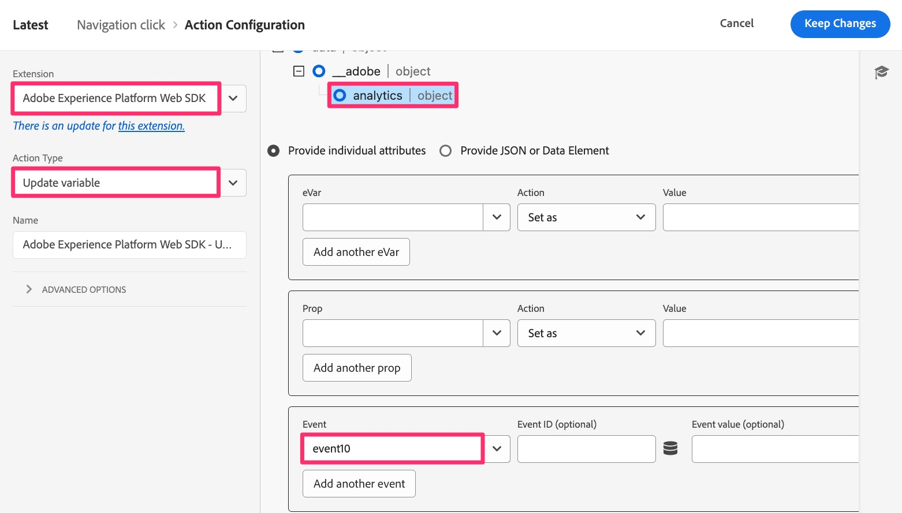

# Aangepaste koppelingsregels migreren

In deze oefening, zult u leren hoe te om regels te migreren die in douaneverbindingsklappen (in tegenstelling tot paginameningen verzenden).

## Overzicht

Wanneer u in een slag van de douaneverbinding gebruikend de uitbreiding van de Analyse, of de code van het AppMeasurement verzendt, wanneer u **verzendt verzendt Beacon** actie, kiest u ook als u een klap van de paginamening of een slag van de douaneverbinding gaat verzenden, en als u een slag van de douaneverbinding kiest, zal het u voor de **Naam van de Verbinding** en het **Type van Verbinding** voor die klap vragen. Als u geen andere veranderlijke gegevens behalve de verbindingsnaam en het type verzendt, te hoeven u geen extra actie te hebben die variabelen (steunen, eVars, en gebeurtenissen) plaatst.
Om deze reden, aangezien u regels migreert die de regels van de douaneverbinding zijn, zult u **één van twee** volgende scenario&#39;s in de regels hebben:

1. De bestaande regel zal een **Adobe Analytics - Vastgestelde Variabelen** actie bevatten die steunen, steunen, gebeurtenissen, enz. plaatst, en dan een **Adobe Analytics - verzendt actie Beacon** bevat die de slag aan een slag van de douaneverbinding (A.K.A. en s.tl ()) plaatst, de verbindingsnaam en het type plaatst, en in de gegevens verzendt.
   1. In dit geval, zal het waarschijnlijk ook een definitieve actie bevatten die **Adobe Analytics - Duidelijke Variabelen** eveneens wordt genoemd, om &quot;nul uit&quot;de waarde van de variabelen te &quot;verwijderen nadat het gegeven is verzonden naar de servers van de Adobe.
1. De bestaande regel zal slechts de **Adobe Analytics - verzend 1&rbrace; actie van het Baken bevatten die de slag aan een slag van de douaneverbinding plaatst, de verbindingsnaam en het type plaatst, en in de gegevens verzendt.**

### Een belangrijke wijziging

De reden dat dit van belang is wanneer u uw Adobe Analytics-implementatie overbrengt naar het web SDK is:
De instelling van de naam en het type van de koppeling, die vereist is om een aangepaste koppelingshit te zijn, bevindt zich NIET in de handeling &quot;Verzendbaken-equivalent&quot; (gebeurtenis Verzenden). In plaats daarvan vindt u de instelling van de naam en het type van de koppeling in de handeling &quot;Variabelen instellen-equivalent&quot; (variabele Bijwerken).
Het resultaat van dit is dat ongeacht of u scenario 1 of scenario 2 hierboven hebt, u met zowel een Update veranderlijke actie als ook een Send gebeurtenisactie zult moeten beëindigen.

Hier volgt een visuele weergave van dit verschil in implementaties.

## Migratiestappen

Open uw regel van de verbinding van de regel de verbindingsregel en identificeer als het op scenario 1 of scenario 2 van hierboven lijkt.
**als uw regel op scenario 1 lijkt:**

1. Open de actie Variabelen instellen en noteer alle variabelen (eigenschappen, gebeurtenissen, enz.) die in die actie worden ingesteld (gebeurtenis10 wordt bijvoorbeeld in de bovenstaande afbeelding ingesteld).
1. Open de actie Send Beacon, controleer of deze is ingesteld op het verzenden van een hit s.tl(). Schrijf de waarden van het Type van Verbinding en van de Naam van de Verbinding neer.
1. Klik in de sectie Acties van de aangepaste koppelingsregel op het plusteken om een andere regel toe te voegen.

    toe

1. De handeling configureren
   1. Plaats de **Uitbreiding** aan het Web SDK van Adobe Experience Platform
   1. Plaats het **Type van Actie** om variabele bij te werken
   1. Selecteer het **voorwerp van Analytics**
   1. Stel de eigenschappen, variabelen en gebeurtenissen van de handeling Variabelen instellen voor Analytics (in dit voorbeeld event10) in.

      

   1. In de zelfde regel, scrol neer aan het **Extra bezit** drop-down gebied, en voeg het **de naamgebied van de Verbinding** toe, plaatsend het aan de waarde u van uw Send regel van het Bebakken trok. In de onderstaande afbeelding stelt het voorbeeld de naam in op de tekenreekswaarde &quot;menu click&quot;.
   1. Voeg ook het **type van Verbinding** gebied van het zelfde drop-down toe, toevoegend &quot;o&quot;als waarde (het veronderstellen van uw verbindingstype in de Send actie van het Beken was &quot;Verbinding van de Douane&quot;). Hiermee wordt het koppelingstype &#39;other&#39; verzonden, dat overeenkomt met een aangepaste koppeling. Als uw verbindingstype een downloadverbinding was, dan kies &quot;d&quot;voor de waarde in dit nieuwe gebied van het verbindingstype, en als uw verbindingstype een uitgangsverbinding was, kies &quot;e&quot;voor de waarde op dit nieuwe gebied van het verbindingstype.

      

1. Onder de Extra eigenschappen, zult u een geëtiketteerde checkbox **Wissen bestaande waarde** zien. Als uw bestaande regel een **Adobe Analytics - Duidelijke actie van Variabelen** (zoals hierboven getoond in stap 3) heeft, moet u eenvoudig deze doos controleren, en u zult geen duidelijke variabelenactie voor het Web SDK moeten toevoegen.

   

1. Voeg een andere actie toe door op het plusteken te klikken.
1. De actie Verzenden configureren
   1. Plaats de **Uitbreiding** aan het Web SDK van Adobe Experience Platform
   1. Plaats het **Type van Actie** aan Verzonden gebeurtenis
   1. Klik het pictogram van het gegevenselement en kies het **gegevenselement 1&rbrace; van de Gegevens van de Mening van de 10&rbrace; Pagina Variabele**

   

1. **houd veranderingen**, **sparen aan Bibliotheek** en u kunt **bouwen** de bibliotheek van die zelfde pagina, aangezien wij reeds een werkende bibliotheek plaatsen.

## Een belangrijke migratieconclusie trekken

* In deze les hebt u geleerd hoe u aangepaste koppelingsregels kunt migreren.
* In [ migreer uw regel van de standaardpaginalading ](migrate-your-default-page-load-rule.md) oefening, leerde u hoe te regels migreren die zowel variabelen plaatsen als ook in een baken van Analytics verzenden.
* In [ migreer extra paginalijnen ](migrate-additional-page-rules.md) les, leerde u hoe te om uw regels te migreren die variabelen plaatsen maar geen baken in Adobe Analytics verzenden.

Zoals u zich kunt voorstellen, kunnen de zelfde methodes over vele verschillende regels worden gebruikt om uw uitbreiding van Analytics aan het Web SDK te migreren.
In de meeste gevallen, werkt u eenvoudig **de acties** in de regels bij. U wijzigt de gebeurtenis of de omstandigheden waarop deze wordt geactiveerd niet. U verandert slechts wat in de actiesectie gebeurt wanneer de regels in brand steken.
De meeste, zo niet alle, regels vallen onder deze categorieën. Als u een regel hebt die niet, overweeg het zelfde paradigma van het migreren van de actie, en niet wat de regel teweegbracht.
