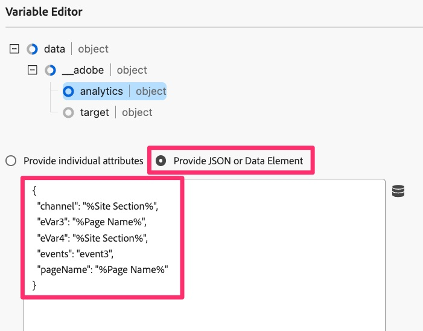

# De standaard laadregel voor pagina&#39;s migreren

In deze oefening, zult u leren hoe te om een regel van de standaardpaginalading in de Markeringen van Adobe Experience Cloud van de uitbreiding van de Analyse aan de uitbreiding van SDK van het Web te migreren.

## Overzicht

Laten we een klein beetje teruggaan. Het is waarschijnlijk dat u een regel in Markeringen hebt die op elke pagina wordt geactiveerd - die één of meerdere standaardvariabelen plaatst, en dan een baken, of een slag, aan Adobe Analytics brandt. Deze regel gebruikt momenteel &quot;acties&quot;in de uitbreiding van Adobe Analytics om deze dingen te doen. Aangezien wij onze implementatie aan Web SDK migreren, moeten wij om het even welke verwijzingen (zoals de acties) aan de uitbreiding van de Analyse kunnen verwijderen, en hen vervangen met acties die tot Web SDK behoren. In de onderstaande stappen gaan we uit van het bovenstaande, dat wil zeggen dat u een standaardregel voor het laden van pagina hebt die zowel variabelen instelt als een trackingbaken naar Analytics verzendt.

## De handeling Variabelen instellen migreren

In deze activiteit, zullen wij een actie van SDK van het Web tot stand brengen die het equivalent van de **Vastgestelde Variabelen** actie in de uitbreiding van Adobe Analytics is.

1. Ga in de gebruikersinterface voor gegevensverzameling en in de eigenschap naar het scherm **[!UICONTROL Rules]** door deze te selecteren in de linkernavigatie.
1. Selecteer de regel die uw **Analytics standaard ladingsregel** is. Als u niet weet welke regel uw standaard ladingsregel is, spreek met iemand die een kennis van de regels en wat in hen is. Opnieuw, zoeken wij een regel die op elke pagina loopt, sommige standaardvariabelen (b.v. paginanaam) plaatst, en dan een baken in Analytics verzendt. We zullen deze regel veranderen. Mijne naam is &quot;Alle pagina&#39;s - klaar voor DOM 50&quot;, maar u kunt alles een naam geven.

   

1. Om de huidige acties van de uitbreiding van Analytics aan de uitbreiding van SDK van het Web te migreren, moeten wij weten welke variabelen worden geplaatst. Daarom klik in **Adobe Analytics - reeks Variabelen** actie zodat u kunt zien welke variabelen (b.v. PageName, steunen, steunen, gebeurtenissen, enz.) worden geplaatst.

   
   1. U ziet welke variabelen in die regel worden ingesteld
       worden geplaatst

1. Bij de bovenkant van de pagina, verander het radioknoop in **verstrekken JSON** en u zult met een codemening van de variabelen worden voorgesteld die worden geplaatst. Deze codemening en de mening UI zijn onderling verwisselbaar, en wanneer u om het even wat in één UI plaatst, zal het ook in andere UI worden bijgewerkt.

   

1. Kopieer deze gegevens naar het klembord of sla deze op in een bestand dat u direct wilt gebruiken, omdat u in de volgende stappen die code gaat plakken in een nieuwe Web SDK-actie.
1. Annuleer uit de Vastgestelde actie van Variabelen van de Analyse zodat u terug op de regel bent.

   >[!IMPORTANT]
   >
   >U hebt opties in deze stap, waaronder de volgende:
   >1. In plaats van een nieuwe handeling toe te voegen, kunt u gewoon de bestaande handelingen wijzigen. Als u deze opslaat, worden alle gegevens direct naar de nieuwe Web SDK-rapportsuite gewist en worden deze niet meer weergegeven in de huidige analyserapportsuite.
   >1. U kunt een nieuwe handeling maken om de gegevens via Web SDK naar Analytics te verzenden, waarbij de handeling Analytics voorlopig op zijn plaats blijft. Dit zal u een kans geven om de gegevens in de nieuwe het rapportreeks van SDK van het Web met de huidige het rapportreeks van Analytics te vergelijken. **dit is die wij in dit leerprogramma zullen doen.** Houd er rekening mee dat deze methode leidt tot dubbele treffers wanneer u de gegevens vergelijkt, wat ook kosten met zich meebrengt voor de extra serveraanroepen, totdat u de acties van de oude extensie Analytics verwijdert. Natuurlijk zult u niet de acties van de uitbreiding van de Analyse voor altijd willen houden, maar eerder lang genoeg om te bevestigen dat de gegevens correct in de nieuwe het rapportreeks van de extensie van SDK van het Web stromen.

1. Klik **plus knoop** om een nieuwe actie van SDK van het Web toe te voegen.

    toe

1. Selecteer **SDK van het Web van Adobe Experience Platform** van de drop-down Uitbreiding.
1. Selecteer **Variabele van de Update** van het drop-down Type van Actie.
1. In het rechterpaneel, selecteer het **voorwerp van Analytics** binnen het gegevensvoorwerp
1. Zorg er ook voor dat het gegevenselement boven aan het rechterdeelvenster inderdaad het nieuwe gegevenselement van het type variabele is.

   

1. Nu verander het radioknoop in **verstrekt JSON of het Element van Gegevens** en kleeft de code die u in de vorige stap van Vastgestelde Variabelen in dit codevenster kopieerde. Vergeet niet dat wat we hier in de zelfstudie laten zien, slechts voorbeelden zijn. U kopieert en plakt uw eigen variabelen.

   
Dit JSON-kopieerprogramma is speciaal gemaakt om migratie gemakkelijker te maken. Ik weet zeker dat u kunt zien hoe eenvoudig dit is in plaats van uitgebreide notities van de oude actie te moeten maken en deze toe te passen op de nieuwe actie.

1. U kunt op elk gewenst moment het keuzerondje heen en weer schakelen om de waarden in de codeversie (hierboven weergegeven) of de gebruikersinterface van het zien van de kenmerken weer te geven. Selecteer **verstrekken individuele attributen** radioknoop om de bevolkte attributen te zien.

   ](assets/websdk-attributes-1.jpg) de attributen 1 van SDK van 0} Web

1. Wanneer u uw die variabelen kunt zien correct worden geplaatst, klik **Veranderingen houden/sparen.**

## De handeling Verzendbaken migreren

In deze activiteit, zullen wij tot een equivalent van SDK van het Web van Analytics &quot;verzenden Beacon&quot;actie leiden, genoemd **verzendt Gebeurtenis**.

1. Ga terug naar de standaardpaginalijn waar je net in zat.
1. In de actiessectie, klik **plus knoop** om een andere actie toe te voegen. Dit zal onze **zijn verzendt gebeurtenis** actie.

    toe

1. Om de actie te vormen, selecteer **van het Web SDK van 0} Adobe Experience Platform van de drop-down Uitbreiding.**
1. Selecteer **verzenden Gebeurtenis** van het Type van Actie.
1. In het rechtse paneel, selecteer het pictogram van het gegevenselement naast het **Voorwerp van Gegevens**.

   

1. Selecteer de Variabele van de Gegevens van de Mening van de Pagina (of wat u uw nieuw &quot;gegevens&quot;type gegevenselement) riep en klik dan **Uitgezochte** knoop.

   

1. Klik **houden Veranderingen/sparen**.
1. U zou nu alle vier acties (twee oude en twee nieuwe) in uw regel moeten zien

   

## Moet ik de acties van de extensie Analytics verwijderen?

Geweldige vraag. Het antwoord ligt in de vraag of u uw nieuwe acties al dan niet wilt valideren voordat u de oude acties verwijdert. Zoals ik hierboven vermeld, als u zowel de acties van Analytics als van het Web SDK verlaat die gegevens binnen (Send Beacon en verzendt Gebeurtenis) verzenden, zoals wij hebben gekozen om in dit leerprogramma te doen, dan zult u de zelfde gegevens hebben die in twee rapportreeksen (namelijk, de reeks van het productierapport van de uitbreiding van de Analytics en uw nieuwe reeks van het bevestigingsrapport van de uitbreiding van SDK van het Web) gaan. Dit resulteert in het verdubbelen van uw servervraag in Analytics, en er zijn kosten verbonden aan het. Dit is echter het aantal klanten dat ervoor kiest om dit te doen, zodat ze de nieuwe gegevens kunnen valideren voordat ze de oude gegevens uitschakelen. Aan het einde van deze zelfstudie leert u hoe u oude dingen kunt opschonen als u tevreden bent met de validatie. Als u dit nu wilt doen om serveraanroepen te kunnen opslaan zonder dat u zich zorgen hoeft te maken over validatie, kunt u het beste het einde van de zelfstudie bereiken of kunt u de acties van de extensie Analytics gewoon uit de regels verwijderen terwijl u doorgaat.
