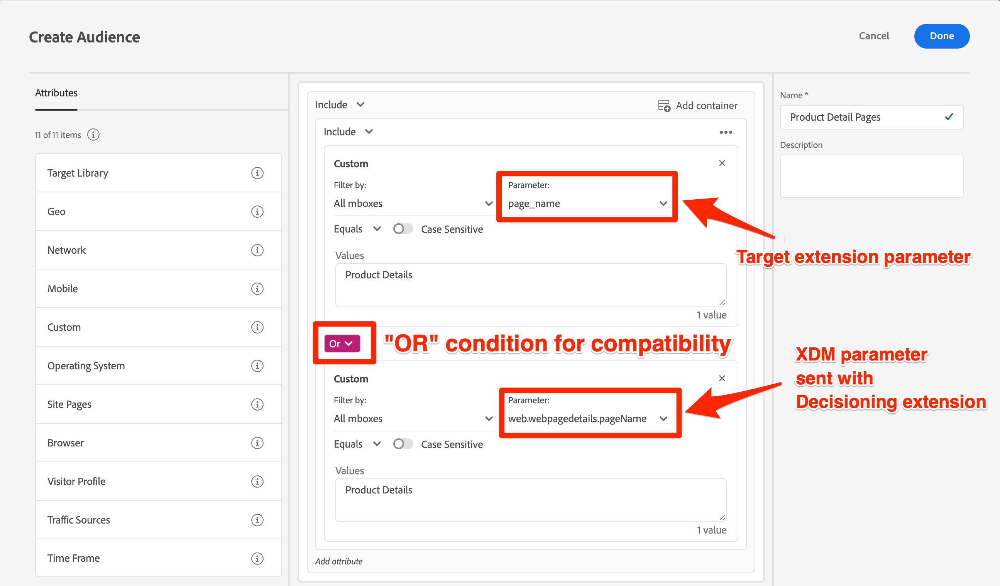

# Doelpubliek en profielscripts bijwerken voor het bepalen van compatibiliteit met mobiele extensies


Nadat u de technische updates voor de migratie van Target naar de Offer Decisioning- en Target-extensie hebt voltooid, moet u mogelijk een aantal van uw publiek-, profielscripts en activiteiten bijwerken om een vloeiende overgang te garanderen.

>[!INFO]
>
>Als u alle mbox-parameters naar het `data.__adobe.target` -object migreert, hoeft u het publiek, de profielscripts en de activiteiten niet bij te werken, zoals hieronder wordt weergegeven.


Als u mbox-parameters naar het `xdm` -object migreert voordat u de wijzigingen in de productie publiceert, moet u:

* Soorten publiek dat mbox-parameters gebruikt bijwerken
* Profielscripts bijwerken die mbox-parameters gebruiken
* Werk eventuele aanbiedingen en activiteiten bij met parametertoken-vervanging voor mbox (bijvoorbeeld `${mbox.parameter_name}`)

## Soorten publiek aanpassen

Als u mbox-parameters migreert naar het `xdm` -object, moeten doelgroepen die aangepaste mbox-parameters gebruiken, worden bijgewerkt om de nieuwe XDM-parameternamen te gebruiken. Een aangepaste parameter voor `page_name` wordt bijvoorbeeld waarschijnlijk toegewezen aan `web.webpagedetails.pageName` .

Eén methode om compatibiliteit met zowel de doelextensie als de Offer Decisioning- en doelextensie te garanderen, is het bijwerken van relevante doelgroepen zodat `OR` -voorwaarden worden gebruikt, zoals hieronder wordt getoond:

{zoomable="yes"}

## Profielscripts bewerken

Als u mbox-parameters migreert naar het `xdm` -object, moeten profielscripts worden bijgewerkt om te verwijzen naar de nieuwe XDM-parameternamen, vergelijkbaar met het publiek. Naast de verandering van de namen van de mbox parameter, is er geen verschil in de manier de manuscripten van het profiel tussen een Doel en een Beslissende implementatie werken.

U kunt er bijvoorbeeld voor zorgen dat de compatibiliteit het gebruik van `OR` -voorwaarden in uw profielscriptcode is.

Voorbeeldprofielscript:

```Javascript
if(mbox.param('pageName') == 'Product Details'){
  return true
}
```

Bijgewerkt profielscript voor compatibiliteit met Platform Web SDK:

```Javascript
if((mbox.param('pageName') == 'Product Details') || (mbox.param('web.webPageDetails.pageName') =='Product Details')){
  return true
}
```

Voor meer informatie en beste praktijken, verwijs naar de specifieke documentatie over [&#x200B; profielmanuscripten &#x200B;](https://experienceleague.adobe.com/nl/docs/target/using/audiences/visitor-profiles/profile-parameters).

## Parametertokens bijwerken voor dynamische inhoud

Als u mbox paramters aan het `xdm` voorwerp migreert, en als u om het even welke aanbiedingen, aanbevelingen ontwerpen, of activiteiten hebt die [&#x200B; dynamische inhoudsvervanging &#x200B;](https://experienceleague.adobe.com/nl/docs/target/using/experiences/offers/passing-profile-attributes-to-the-html-offer) gebruiken, kunnen zij dienovereenkomstig moeten worden bijgewerkt om van de nieuwe XDM parameternamen rekenschap te geven.

Afhankelijk van hoe u symbolische vervanging voor mbox parameters gebruikt, kunt u uw bestaande opstelling aan rekening voor zowel oude als nieuwe parameternamen kunnen verbeteren. In situaties waarin aangepaste JavaScript-code niet mogelijk is, zoals in JSON-aanbiedingen, moet u echter kopieën maken en updates uitvoeren nadat de migratie is voltooid en live op uw productiesite gaat.

Voorbeeld JSON-aanbieding:

```JSON
{
  "pageName" : "${mbox.page_name}",
  "layoutVariation" : "grid"
}
```

Voorbeeld-JSON-aanbieding met namen van XDM-objectparameters:

```JSON
{
  "pageName" : "${mbox.web.webPagedDetails.pageName}",
  "layoutVariation" : "grid"
}
```

Als u na de migratie aanpassingen wilt aanbrengen om rekening te houden met de nieuwe namen van XDM-box-parameters, moet u tijdens de migratiegebeurtenis alle betrokken activiteiten pauzeren om te voorkomen dat er weergavefouten optreden voor bezoekers.


Daarna, leer hoe te [&#x200B; de implementatie van het Doel &#x200B;](validate.md) bevestigen.

>[!NOTE]
>
>We helpen u graag succesvol te zijn met uw mobiele doelmigratie van de doelextensie naar de Offer Decisioning en de doelextensie. Als u in obstakels met uw migratie loopt of als er kritieke informatie ontbreekt in deze gids voelt, gelieve ons te vertellen door in [&#x200B; deze communautaire bespreking &#x200B;](https://experienceleaguecommunities.adobe.com/t5/adobe-experience-platform-data/tutorial-discussion-migrate-target-from-at-js-to-web-sdk/m-p/575587#M463) te posten.
