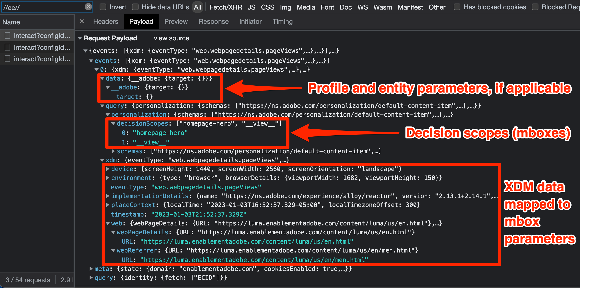

# Debug Target met Platform Web SDK

Het verifiëren van de activiteiten van het Doel en het zuiveren Web SDK om implementatie, inhoudslevering, of kwesties van de publiekskwalificatie problemen op te lossen. Deze pagina van de migratiegids verklaart de verschillen tussen het zuiveren met at.js en het Web SDK van het Platform.

De onderstaande tabel geeft een overzicht van functies en ondersteuning voor het testen en opsporen van fouten.

| Functie of gereedschap | at.js-ondersteuning | Platform Web SDK-ondersteuning |
| --- | --- | --- |
| Activiteit QA URLs | Ja | Ja |
| `mboxDisable` URL, parameter | Ja | Verwijs naar informatie hieronder aan [&#x200B; onbruikbaar maken Functionaliteit van het Doel &#x200B;](#disable-target-functionality) |
| `mboxDebug` URL, parameter | Ja | De parameter `alloy_debug` gebruiken voor vergelijkbare foutopsporingsgegevens |
| `mboxTrace` URL, parameter | Ja | De browserextensie van Experience Platform Debugger gebruiken |
| Adobe Experience Platform Debugger-extensie | Ja | Ja |
| `alloy_debug` URL, parameter | Niet van toepassing | Ja |
| Adobe Experience Platform Assurance | Niet van toepassing | Ja |

## Adobe Experience Platform Debugger browser extension

De Adobe Experience Platform Debugger-extensie voor Chrome en Firefox controleert uw webpagina&#39;s en helpt u bij het valideren van uw Adobe Experience Cloud-implementaties.

U kunt Foutopsporing van het Platform op om het even welke Web-pagina in werking stellen en de uitbreiding heeft toegang tot openbare gegevens. Als u toegang wilt krijgen tot niet-openbare gegevens met de extensie, zoals gegevens over het doelspoor, moet u zich via de koppeling **[!UICONTROL Sign in]** verifiëren bij Experience Cloud.

### Adobe Experience Platform Debugger ophalen en installeren

De Adobe Experience Platform Debugger kan worden geïnstalleerd in Google Chrome. Volg de onderstaande koppeling om de extensie te installeren:

- [&#x200B; Chrome &#x200B;](https://chrome.google.com/webstore/detail/adobe-experience-platform/bfnnokhpnncpkdmbokanobigaccjkpob)

Nadat u de Chrome-extensie of de Firefox-invoegtoepassing hebt geïnstalleerd, wordt een pictogram () toegevoegd aan de uitbreidingsbalk. Selecteer dit pictogram om de extensie te openen.

Verwijs naar de specifieke gids voor meer informatie over de [&#x200B; uitbreiding van Adobe Experience Platform Debugger &#x200B;](https://experienceleague.adobe.com/docs/experience-platform/debugger/home.html?lang=nl-NL) en hoe te om alle het Webtoepassingen van Adobe te zuiveren.

## Voorvertoning van doelactiviteiten weergeven met URL&#39;s met kwaliteitscontrole

Zowel at.js als het Web SDK van het Platform staan u toe om de activiteiten van het Doel te voorproef gebruikend doel QA URLs, en beide implementatiemethodes steunen de zelfde eigenschappen QA.

Doel-URL&#39;s voor kwaliteitscontrole die werken door at.js of Platform Web SDK op te dragen een specifieke cookie naar uw browser met de naam `at_qa_mode` te schrijven. Dit cookie wordt gebruikt om kwalificatie voor een bepaalde activiteit en ervaring af te dwingen.

>[!CAUTION]
>
>De functionaliteit van de doel-QA-modus wordt ondersteund door Platform Web SDK versie 2.13.0 of hoger. De doel-QA-modus wordt ingeschakeld op basis van de `xdm.web.webPageDetails.URL` -waarde die wordt doorgegeven in de `sendEvent` -aanroep. Eventuele wijzigingen in deze waarde, zoals het verlagen van alle tekens, kunnen ertoe leiden dat de modus Doel-QA niet goed werkt.

Verwijs naar de specifieke gids voor meer informatie over [&#x200B; activiteit QA van het Doel &#x200B;](https://experienceleague.adobe.com/docs/target/using/activities/activity-qa/activity-qa.html?lang=nl-NL).

## Implementatie van foutopsporing

De onderstaande tabel geeft een overzicht van de verschillen tussen de foutopsporingstactiek van at.js en Platform Web SDK:

| at.js, functie | Platform Web SDK equivalent |
| --- | --- |
| **Mbox onbruikbaar maakt** - maak Doel van het halen en het teruggeven onbruikbaar om te controleren als de pagina zonder de interactie van het Doel    pagina van de Lading met parameter URL wordt gebroken: `mboxDisable=true` | Geen direct equivalent. U kunt alle verzoeken van het Web SDK van het Platform met de ontwikkelaarshulpmiddelen van uw browser blokkeren. |
| **Mbox zuivert** - registreert elke actie at.js in de console van browser helpen het teruggeven problemen oplossen    pagina van de Lading met parameter URL: `mboxDebug=true` | **Uitrusting zuivert** - registreert gedetailleerde acties van SDK, met inbegrip van maar niet beperkt tot de verpersoonlijkingsacties van het Doel.   Laad pagina met URL parameter: `alloy_debug=true`    of voer `alloy("setDebug", { "enabled": true });` in uw ontwikkelaarsconsole uit |
| **Spoor van het Doel** - met een symbolisch van het mboxspoor dat in het Doel UI wordt geproduceerd, is een spoorvoorwerp met details die aan het besluitvormingsproces deelnamen beschikbaar onder `window.___target_trace` voorwerp.   Laad pagina met parameter URL: `mboxTrace=window&authorization={TOKEN}` | Gebruik de Adobe Experience Platform Debugger uitbreiding of Platform Assurance. |

>[!NOTE]
>
>Alle hierboven vermelde foutopsporingsfuncties van at.js zijn beschikbaar met verbeterde mogelijkheden in Adobe Experience Platform Debugger.

### Doelfunctionaliteit uitschakelen

Het Web SDK van het Platform heeft momenteel geen eigenschap om de reacties van het Doel selectief te onderdrukken. Nochtans, is het mogelijk om de verzoeken van het Web SDK van het Platform met de de ontwikkelaarshulpmiddelen van uw browser, diverse browser uitbreidingen, of derdetoepassingen te onderdrukken. Bijvoorbeeld om het Web SDK van het Platform met Google Chrome te blokkeren:

1. Klik met de rechtermuisknop ergens op de pagina en selecteer **Inspecteren**
1. Selecteer het **lusje van het Netwerk**
1. Filteren op de tekenreeks `//ee//` om alleen platformwebaanroepen van SDK weer te geven
1. De pagina opnieuw laden
1. Klik met de rechtermuisknop op een van de gefilterde netwerkverzoeken en selecteer **het aanvraagdomein van het Blok**
1. Laad de pagina opnieuw en merk op dat het netwerkverzoek wordt geblokkeerd
1. Wanneer u gebeëindigd het zuiveren bent, klik het geblokkeerde netwerkverzoek met de rechtermuisknop aan en selecteer **Unblock**, of sluit het paneel van Hulpmiddelen van de Ontwikkelaar

### Foutopsporingslogbestand weergeven

Foutopsporingsregistratie voor at.js met behulp van de URL-parameter `mboxDebug=true` geeft gedetailleerde informatie over elk verzoek, elke reactie en elke poging om de inhoud naar de pagina te renderen. Platform Web SDK heeft vergelijkbare foutopsporingslogboeken met de URL-parameter `alloy_debug=true` .

| Informatie geregistreerd | at.js (`mboxDebug=true`) | Platform Web SDK (`alloy_debug=true`) |
| --- | --- | --- |
| Logboekvoorvoegsel voor filteren | `AT:` | `[alloy]` |
| Gegevens verzoek laden pagina | Ja | Ja |
| Gegevens over een box- of bereikverzoek | Ja | Ja |
| Status aanvragen | Ja | Ja |
| Antwoorddetails | Ja | Ja |
| Status van weergave | Succes en fouten | Alleen fouten |
| Details renderen | Ja | Ja |

>[!NOTE]
>
>Zuiver logboeken voor at.js en het Web SDK van het Platform verstrekken gelijkaardig niveau van detail met de opmerkelijke uitzondering dat Web SDK slechts van het teruggeven van fouten wegens ongeldige selecteurs op de hoogte brengt. De logfunctie voor foutopsporing bevestigt momenteel niet dat rendering is gelukt.

### Doelsporen weergeven

De doelsporen verstrekken gedetailleerde informatie over activiteitenkwalificaties en het profiel van het Doel van de bezoeker. Aangezien de sporen van het Doel informatie bevatten die niet openbaar beschikbaar is, vereist het bekijken van hen een toestemmingstoken of het voor authentiek verklaren binnen het browser van Adobe Experience Platform Debugger uitbreidingsvenster.

| Doeltraceermethode | at.js | Platform Web SDK |
| --- | --- | --- |
| `mboxTrace` URL, parameter | Ja | Nee |
| Adobe Experience Platform Debugger browser extension | Ja | Ja |
| Adobe Experience Platform Assurance | Nee | Ja |

Ga als volgt te werk om Platform SDK Target sporen met de Adobe Experience Platform Debugger weer te geven:

1. Navigeer naar een pagina op uw site waarop Target is geïmplementeerd met Platform Web SDK
1. Open de extensie Adobe Experience Platform Debugger door het pictogram () in de navigatiebalk van uw browser te selecteren
1. De koppeling **[!UICONTROL Sign In]** selecteren
1. Verifiëren met uw Adobe Experience Cloud-aanmelding
1. Selecteer links het tabblad **[!UICONTROL Logs]**
1. Selecteer de tab **[!UICONTROL Edge]** bovenaan
1. Geef uw foutopsporingssessie desgewenst een naam en klik op de knop **[!UICONTROL Connect]** .
1. Laad de pagina opnieuw en het logboek zou met gedetailleerde informatie over de interacties van het randnetwerk moeten bevolken
1. Focus op de logitems die beginnen met &quot;Doelsporen&quot; in de beschrijving en selecteer **[!UICONTROL View]** om de gegevens van het doelspoor weer te geven

{zoomable="yes"} te bekijken

Nadat u **[!UICONTROL View]** hebt geselecteerd, wordt een bedekking weergegeven waarmee u de volgende informatie over de aanvraag kunt zien:

- Gelijktijdige activiteiten
- Niet-afgedekte activiteiten
- Gegevens aanvragen
- Momentopname profiel

Verwijs naar de specifieke gids over [&#x200B; het zuiveren de inhoudslevering van het Doel &#x200B;](https://experienceleague.adobe.com/docs/target/using/activities/troubleshoot-activities/content-trouble.html?lang=nl-NL) voor meer informatie over de sporen van het Doel.

### Problemen met Assurance oplossen

De informatie van het doel spoor is viewable in zowel de browser van Adobe Experience Platform Debugger uitbreiding als binnen de toepassing van Assurance (vroeger gekend als Project Griffon). Ga als volgt te werk om de doelsporen in Assurance weer te geven:

1. Open de Adobe Experience Platform Debugger browser extensie en verbind een externe foutopsporingssessie zoals hierboven beschreven
1. Selecteer de koppeling met uw sessienaam boven het foutopsporingslogbestand
1. Platform Assurance laadt en toont gedetailleerde logboekregistratie voor alle Adobe-toepassingen die in de gegevensstroom voor uw implementatie zijn geconfigureerd
1. Het logbestand filteren op `adobe.target`
1. Selecteer een logbestandvermelding met het type `com.adobe.target.trace`
1. Vouw de details van de lading uit en bekijk de informatie onder `context > targetTrace`

{zoomable="yes"} te bekijken

## Onderzoek netwerkverzoek en reactie

De vraag van de verzoeklading en de reactie van het Web SDK van het Platform `sendEvent` verschillen van at.js. Het overzicht hieronder zou u moeten helpen de structuur van het verzoek en de reactie begrijpen terwijl het onderzoeken van de netwerkvraag met de ontwikkelaarshulpmiddelen van uw browser.

### Payload voor inhoudsverzoek

{zoomable="yes"}

- Profiel, entiteit en andere niet-maboxparameters worden doorgegeven in de gebeurtenisarray onder `data.__adobe.target`
- Beslissingsbereiken bevinden zich in de gebeurtenisarray onder `query.personalization.decisionScopes`
- XDM-gegevens die aan mbox-parameters zijn toegewezen, bevinden zich in de gebeurtenissenarray onder `xdm`

### Inhoudsresponsinstantie

{zoomable="yes"}

- De Platform Web SDK geeft acties voor alle Adobe-toepassingen onder het `handle` -object
- De handeling `personalization:decisions` geeft een reactie van Target aan of biedt een beslissing
- Doelvoorstellingen worden weergegeven als een array, elk met een unieke propositie-id vooraf vastgelegd met `AT:`
- Het bereik en de activiteitdetails van de beslissing zijn te vinden in de reeks voorstellen
- De details van de aanbieding bevinden zich in de array `items` onder `data`
- Responstkens bevinden zich in de array `items` onder `meta` .

### Payload van Proposition-gebeurtenis

{zoomable="yes"}

- Doelspecifieke SDK-gebeurtenissen zijn `decisioning.propositionDisplay` voor een indruk of `decisioning.propositionInteract` voor een interactie, zoals een klik
- De details van de proposition-gebeurtenis bevinden zich in de gebeurtenisarray onder `xdm._experience.decisioning`
- De propositie-id van de weergave- of interactiegebeurtenis moet overeenkomen met de propositie-id van de inhoud die door Doel wordt geretourneerd

Gefeliciteerd, u hebt het einde van de zelfstudie bereikt! Veel succes bij het migreren van uw Adobe Target-implementatie naar Web SDK!

>[!NOTE]
>
>We helpen u graag succesvol te zijn met uw doelmigratie van at.js naar Web SDK. Als u in obstakels met uw migratie loopt of als er kritieke informatie ontbreekt in deze gids voelt, gelieve ons te vertellen door in [&#x200B; deze communautaire bespreking &#x200B;](https://experienceleaguecommunities.adobe.com/t5/adobe-experience-platform-data/tutorial-discussion-migrate-target-from-at-js-to-web-sdk/m-p/575587?profile.language=nl#M463) te posten.
